# 1. **SpringMVC简介**

## 1.1 **回顾MVC架构**

	MVC是一种架构模型，本身没有什么功能，只是让我们的项目结构更加合理，流程控制更加清晰，一般包含三个组件：
	
	**Model（模型）**：数据模型，用于提供要展示的数据。一般包含数据和行为（也就是业务），在JavaWEB中，数据和业务往往是分离开的。
	
	**View（视图）**：负责对模型数据进行展示，例如我们看到的网页。概念比较广泛，可以是：html、JSP、excel、Word、PDF、json、XML等
	
	**Controller（控制器）**：接收用户请求，委托给模型做处理，处理完毕返回数据，再交给视图做渲染，相当于调度员工作


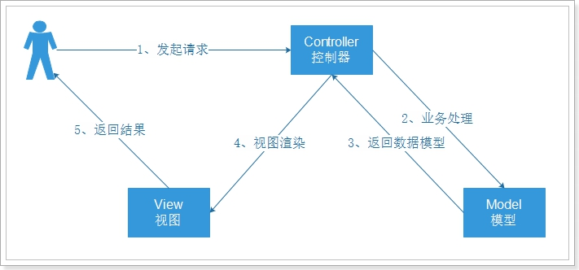 

 

 

## 1.2  什么是Spring MVC？

 

SpringMVC是Spring架构中的一部分：

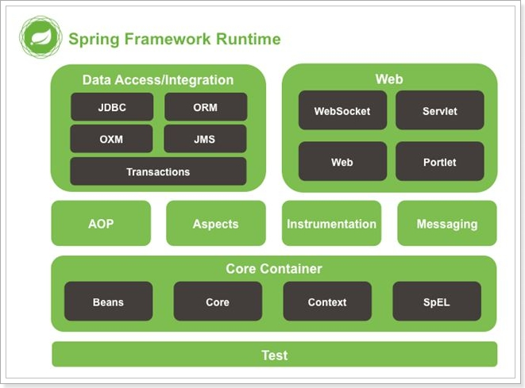 

 

 

Spring Web MVC是一种基于Java的，实现了Web MVC设计模式的轻量级Web框架，使用了MVC架构模式的思想，将web层进行职责解耦，采用了松散耦合可插拔组件结构，比其它MVC框架更具扩展性和灵活性。

可以让我们实现：

* 进行更简洁的Web层的开发；
* 天生与Spring框架集成（如IoC容器、AOP等）；
* 提供强大的约定大于配置的契约式编程支持；
* 支持灵活的URL到页面控制器的映射；

* 非常容易与其他视图技术集成，如Velocity、FreeMarker等等，因为模型数据不放在特定的API里，而是放在一个Model里（Map数据结构实现，因此很容易被其他框架使用）；

* 非常灵活的数据验证、格式化和数据绑定机制，能使用任何对象进行数据绑定，不必实现特定框架的API；

* 支持Restful风格。

  

  	SpringMVC在架构设计、扩展性、灵活性方面已经全面超越了Struts、WebWork等MVC框架，从原来的追赶着一跃成为MVC的领跑者！ 

## 1.3 SpringMVC的架构

 

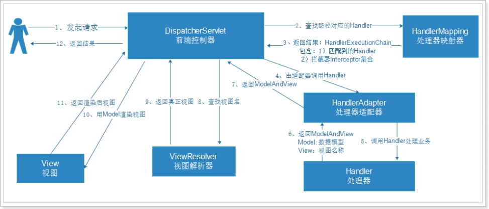 

 


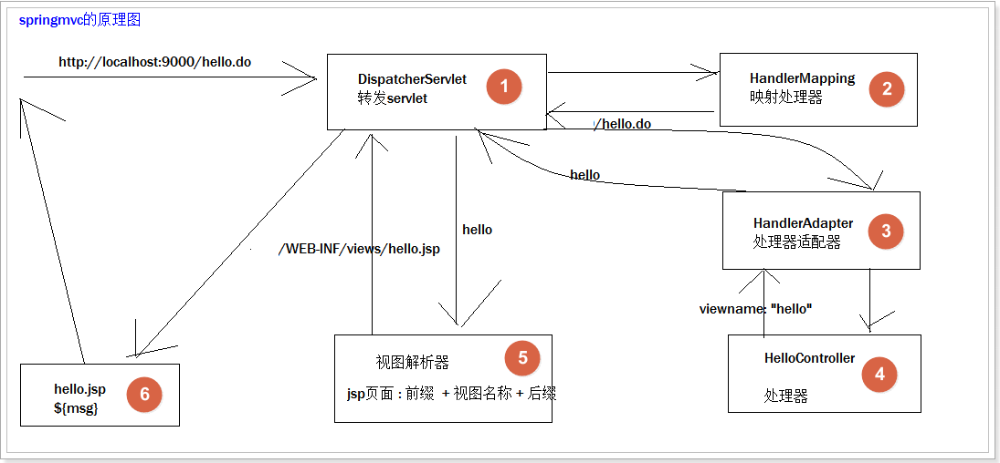

流程总结：

1. 用户发起请求到DispatcherServlet（前端控制器）

2. DispatcherServlet通过HandlerMapping（处理映射器）寻找用户要请求的Handler

3. HandlerMapping返回执行链，包含两部分内容：

   a) 处理器对象：Handler

   b) HandlerInterceptor（拦截器）的集合

4. 前端控制器通过HandlerAdapter（处理器适配器）对Handler进行适配包装

5.  调用包装后的Handler中的方法，处理业务

6.  处理业务完成，返回ModelAndView对象，包含两部分

    a) Model：模型数据

    b) View：视图名称，不是真正的视图

7.  DispatcherServlet获取处理得到的ModelAndView对象

8.  DispatcherServlet将视图名称交给ViewResolver（视图解析器），查找视图

9.  ViewResolver返回真正的视图对象给DispatcherServlet

10.  DispatcherServlet把Model（数据模型）交给视图对象进行渲染

11.  返回渲染后的视图

12.  将最终的视图返回用户，产生响应

# 2. **SpringMVC入门案例**

## 2.1 创建子工程 springmvc_quickstart

  

## 2.2 引入依赖

```xml
<dependencies>
    <!--spring mvc-->
    <dependency>
        <groupId>org.springframework</groupId>
        <artifactId>spring-webmvc</artifactId>
    </dependency>
    <!--日志-->
    <dependency>
        <groupId>org.slf4j</groupId>
        <artifactId>slf4j-log4j12</artifactId>
    </dependency>
    <!-- JSP相关 -->
    <dependency>
        <groupId>jstl</groupId>
        <artifactId>jstl</artifactId>
    </dependency>
    <dependency>
        <groupId>javax.servlet</groupId>
        <artifactId>servlet-api</artifactId>
        <scope>provided</scope>
    </dependency>
    <dependency>
        <groupId>javax.servlet</groupId>
        <artifactId>jsp-api</artifactId>
        <scope>provided</scope>
    </dependency>
</dependencies>
```

## 2.3 **配置Tomcat插件**

```xml
<build>
    <plugins>
        <!-- 配置Tomcat插件 -->
        <plugin>
            <groupId>org.apache.tomcat.maven</groupId>
            <artifactId>tomcat7-maven-plugin</artifactId>
            <version>2.2</version>
            <configuration>
                <path>/</path>
                <port>9000</port>
            </configuration>
        </plugin>
    </plugins>
</build>
```

**完整 pom.xml**

```xml
<?xml version="1.0" encoding="UTF-8"?>
<project xmlns="http://maven.apache.org/POM/4.0.0"
         xmlns:xsi="http://www.w3.org/2001/XMLSchema-instance"
         xsi:schemaLocation="http://maven.apache.org/POM/4.0.0 http://maven.apache.org/xsd/maven-4.0.0.xsd">
    <parent>
        <artifactId>itcast_parent</artifactId>
        <groupId>cn.itcast</groupId>
        <version>1.0-SNAPSHOT</version>
        <relativePath>../itcast_parent/pom.xml</relativePath>
    </parent>
    <modelVersion>4.0.0</modelVersion>

    <artifactId>mybatis_day01</artifactId>
    <!--当前项目是web项目-->
    <packaging>war</packaging>

    <dependencies>
        <!--日志-->
        <dependency>
            <groupId>org.slf4j</groupId>
            <artifactId>slf4j-log4j12</artifactId>
        </dependency>
        <!-- JSP相关 -->
        <dependency>
            <groupId>jstl</groupId>
            <artifactId>jstl</artifactId>
        </dependency>
        <dependency>
            <groupId>javax.servlet</groupId>
            <artifactId>servlet-api</artifactId>
            <scope>provided</scope>
        </dependency>
        <dependency>
            <groupId>javax.servlet</groupId>
            <artifactId>jsp-api</artifactId>
            <scope>provided</scope>
        </dependency>
        <!--spring mvc-->
        <dependency>
            <groupId>org.springframework</groupId>
            <artifactId>spring-webmvc</artifactId>
        </dependency>
    </dependencies>
    <build>
        <plugins>
            <!-- 配置Tomcat插件 -->
            <plugin>
                <groupId>org.apache.tomcat.maven</groupId>
                <artifactId>tomcat7-maven-plugin</artifactId>
                <version>2.2</version>
                <configuration>
                    <path>/</path>
                    <port>9000</port>
                </configuration>
            </plugin>
        </plugins>
    </build>
</project>
```


## 2.4 编写项目配置文件

### 2.4.1 web.xml，引入DispatcherServlet

```xml
	<servlet>

		<servlet-name>springmvc</servlet-name>

		<servlet-class>org.springframework.web.servlet.DispatcherServlet</servlet-class>

		<!-- 0：第一次被调用时创建； 1：Tomcat启动时就创建 -->

		<load-on-startup>1</load-on-startup>

	</servlet>

	<servlet-mapping>

		<servlet-name>springmvc</servlet-name>

		<!-- 

			/*		： 	匹配所有请求路径，不要用

			/		：	匹配除了.jsp以为的所有请求

			*.xxx	：	匹配以xxx为后缀的路径

		 -->

		<url-pattern>*.do</url-pattern>

	</servlet-mapping>
```

### 2.4.2  **SpringMVC配置文件**

#### 2.4.2.1 **创建SpringMVC配置文件**

SpringMVC有自己的配置文件，其实就是类似于Spring的applicationContext.xml的一个配置文件，配置SpringMVC需要使用到的bean，例如HandlerMapping，HandlerAdapter等

 

这个文件默认是去寻找：WEB-INF/{servletName}-servlet.xml

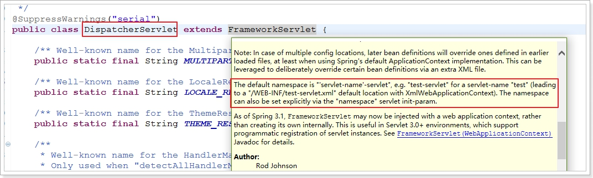 

 

我们在web.xml中定义的ServletName是：springmvc，因此默认去找配置文件是：WEB-INF/springmvc-servlet.xml

 

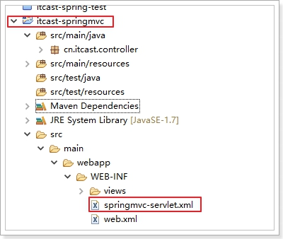 

 

需要配置：HandlerMapping、HandlerAdapter、Handler、viewResolver

 

#### 2.4.2.2 配置HandlerMapping

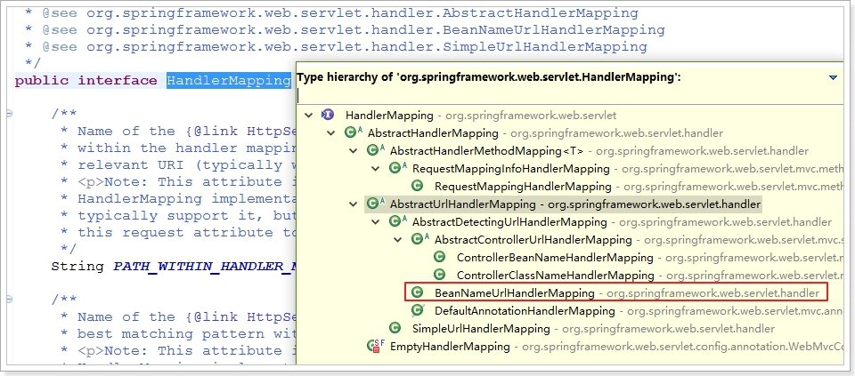 

 

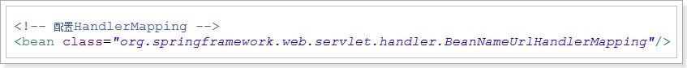 

 

#### 2.4.2.3  配置HandlerAdapter

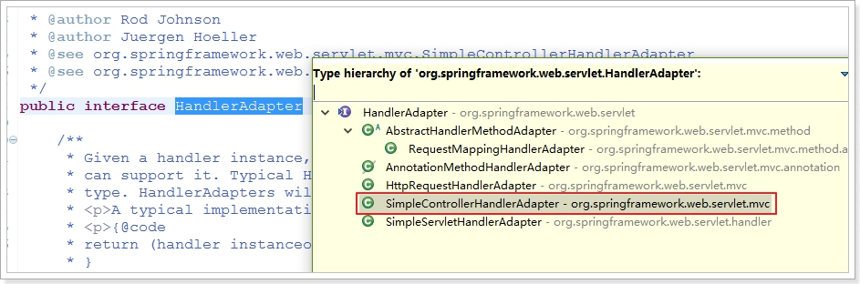 

 

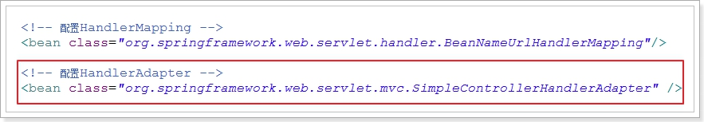 

 

#### 2.4.2.4  **配置Handler**

Handler，具体的处理器，在SpringMVC中，一般是叫做Controller（控制器），我们可以自定义类，实现Controller接口，就称为控制器了。

```java
/*

- 定义一个Handler处理器,必须实现Controller接口，声明自己是一个处理器类

 */

public class HelloHandler implements Controller{

	// 重写默认的请求处理方法

	@Override

	public ModelAndView handleRequest(HttpServletRequest request, HttpServletResponse response) throws Exception {

		// 创建一个模型和视图对象

		ModelAndView mv = new ModelAndView();

		// 设置视图名称

		mv.setViewName("hello");

		// 添加模型数据,在SpringMVC中，Model是一个类似Map结构的容器，以键值对形式存储数据

		mv.addObject("msg", "这是我的第一个SpringMVC程序");

		

		return mv;

	}

}

```


 

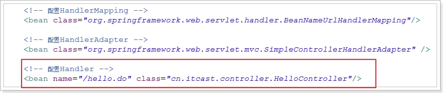 

 

这里的name属性就是将来要访问的路径，因为我们配置的是BeanNameURLHandlerMapping，会通过BeanName来映射路径

#### 2.4.2.5  配置视图解析器

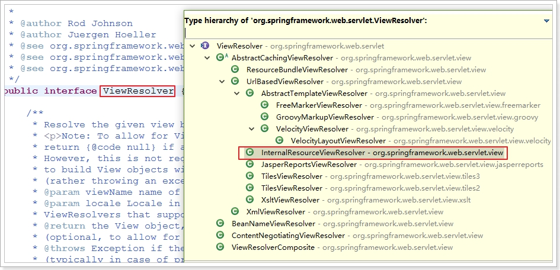 

我们这里选择使用内部资源视图解析器，就是指向项目内的文件，需要指定suffix和prefix，最终文件的路径就是：

 

	prefix + 视图名称 + suffix

 


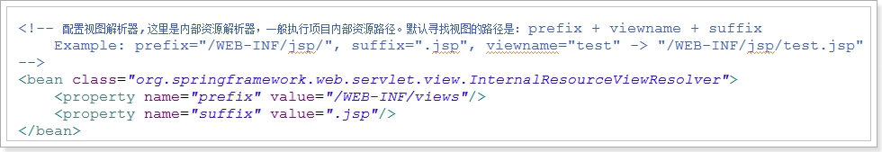 

 

#### 2.4.2.6  完整配置：

```xml
<?xml version="1.0" encoding="UTF-8"?>

<beans xmlns="http://www.springframework.org/schema/beans"

	xmlns:xsi="http://www.w3.org/2001/XMLSchema-instance" xmlns:p="http://www.springframework.org/schema/p"

	xmlns:context="http://www.springframework.org/schema/context"

	xmlns:mvc="http://www.springframework.org/schema/mvc"

	xsi:schemaLocation="http://www.springframework.org/schema/beans http://www.springframework.org/schema/beans/spring-beans.xsd

        http://www.springframework.org/schema/mvc http://www.springframework.org/schema/mvc/spring-mvc-4.0.xsd

        http://www.springframework.org/schema/context http://www.springframework.org/schema/context/spring-context.xsd">

 

	<!-- 配置HandlerMapping -->

	<bean class="org.springframework.web.servlet.handler.BeanNameUrlHandlerMapping"/>

	

	<!-- 配置HandlerAdapter -->

	<bean class="org.springframework.web.servlet.mvc.SimpleControllerHandlerAdapter" />

	

	<!-- 配置Handler,一般以Controller后缀，指向自定义的那个Controller-->

	<bean name="/hello.do" class="cn.itcast.controller.HelloController"/>

	

	<!-- 视图解析器，这里是用内部资源视图解析器，其实就是指向项目中的jsp文件

	Example: prefix="/WEB-INF/jsp/", suffix=".jsp", viewname="test" -> "/WEB-INF/jsp/test.jsp"  -->

	<bean class="org.springframework.web.servlet.view.InternalResourceViewResolver">

		<property name="prefix" value="/WEB-INF/views/"/>

		<property name="suffix" value=".jsp"/>

	</bean>

</beans>

```


 

### 2.4.3 **定义视图**

这里创建一个hello.jsp文件，符合上面的视图规则，所以要放到WEB-INF/views/下：

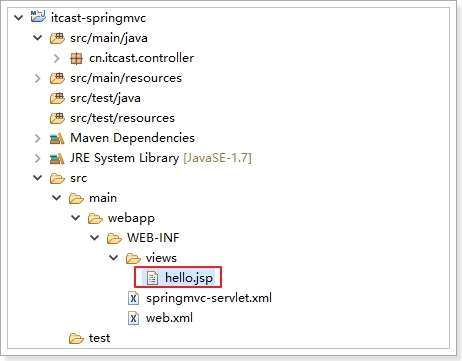 

```jsp
<%@ page language="java" contentType="text/html; charset=UTF-8"

    pageEncoding="UTF-8"%>

<!DOCTYPE html PUBLIC "-//W3C//DTD HTML 4.01 Transitional//EN" "http://www.w3.org/TR/html4/loose.dtd">

<html>

<head>

<meta http-equiv="Content-Type" content="text/html; charset=UTF-8">

<title>Insert title here</title>

</head>

<body>

	<!-- 可以用el表达式，直接获取模型中的数据 -->

	<font color="red" size="5">${msg }</font>

</body>

</html>

```

### 2.4.4 **测试**

启动Tomcat：

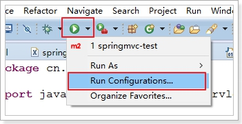 

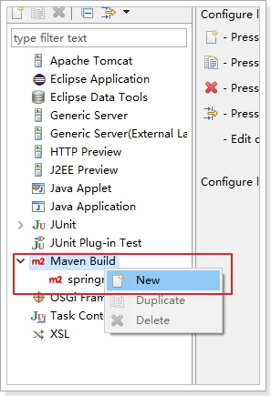 

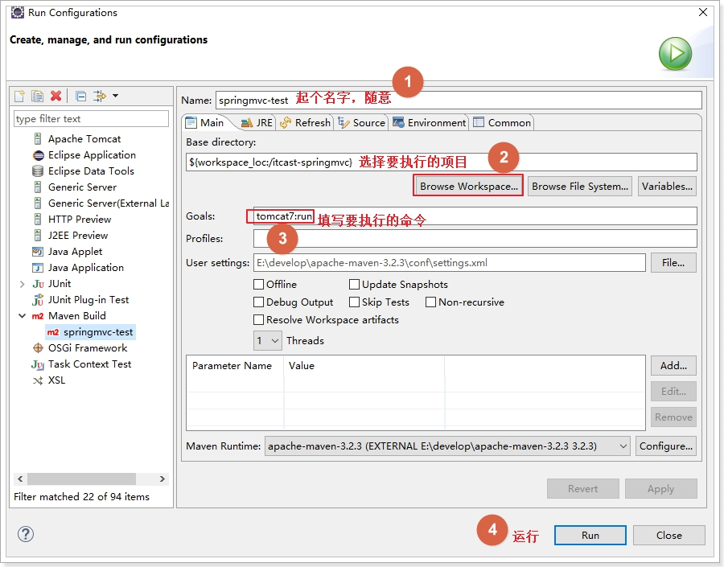 

报错：

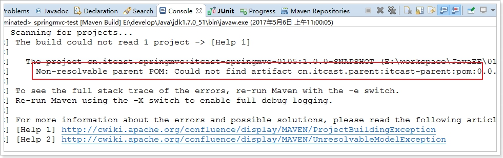 

 

原因是itcast-parent没有在仓库中出现。所以需要install

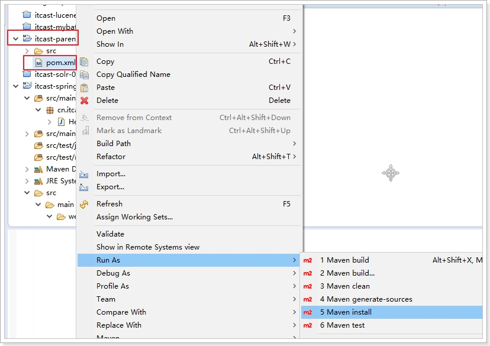 

 

访问页面：

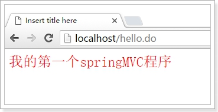 

 

## 2.5  执行流程分析

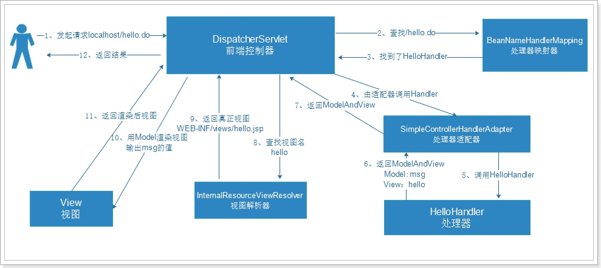 

 

执行流程：

1、 用户请求页面：<http://localhost/hello.do>

2、 DispatcherServlet分析请求，通过BeanNameUrlHandlerMapping来查找 /hello.do的Handler

3、 比对Handler的BeanName，找到一个HelloController返回

4、 DispatcherServlet把HelloAdapter交给HandlerAdapter装饰

5、 调用HelloController的处理逻辑

6、 获取返回的ModelAndView，包含两部分：

	a) Model，就是一个键为msg的内容
	
	b) View，这里是hello

7、 返回ModelAndView到DispatcherServlet

8、 DispatcherServlet把视图名”hello”交给InternalResourceViewResolver来解析视图

9、 根据我们定义的规则，找到了/WEB-INF/views/hello.jsp

10、 把Model交给hello.jsp渲染，取出了msg的内容，输出到html页面

11、 返回渲染形成的html页面

12、 把页面返回给用户

 

## 2.6 **SpringMVC默认配置**

我们尝试省略HandlerMapping和HandlerAdapter的配置：

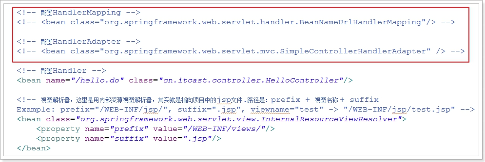 

重启Tomcat重试：发现依然没有问题

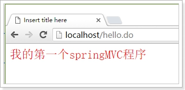 

 

为什么不用配置依然OK？

 

原来，在SpringMVC的jar包中，有一个默认配置文件：

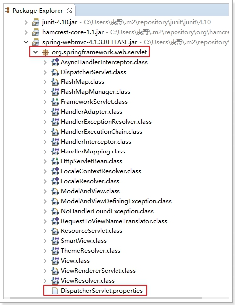 

 

DispatcherServlet创建时会去读取该配置文件：

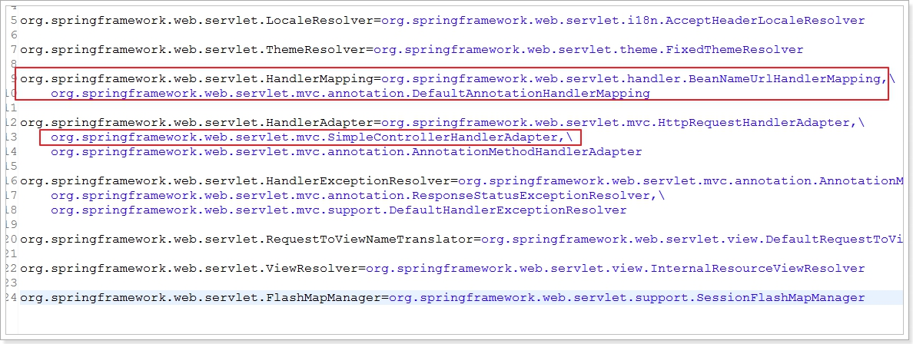 

 

里面默认已经定义了2个HandlerMapping和3个HandlerAdapter，其中就包含了我们刚才配置的，所以如果我们不写，系统也是会自动加载这些类的。

 

因此，一般我们只需要配置 Handler和视图解析器就够了

# 3. **SpringMVC注解案例**

入门案例中，我们自定义控制器类的方式并不好，存在以下问题：

1） 类必须实现Controller接口，不友好。

2） 每个类中只能有一个默认处理方法，只能处理一个用户请求。

3） 每个类需要在配置文件中进行配置，很麻烦。

 

在Spring2.5以后，就引入了注解方式的控制器定义方式，并且在Spring3.0以后引入了更多非常强大的注解帮我们进行参数注入。

 

## 3.1 创建注解控制器（Controller）

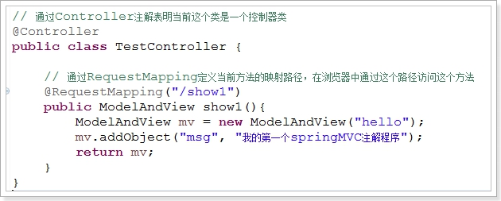 

这个Controller的访问路径就应该是：http://localhost/show1.do

 

## 3.2 配置包扫描

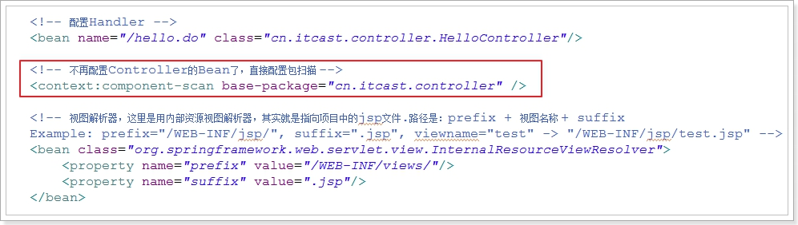 

 

需要注意的是：

	因为默认配置中，除了有BeanNameUrlHandlerMapping以为，还有注解的HandlerMapping：
	
	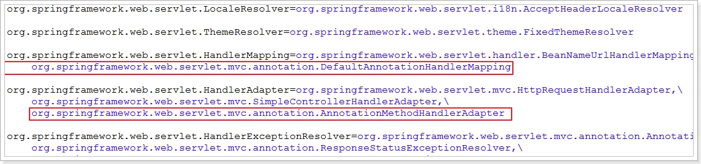

因此，我们不需要配置这些。

 

## 3.3 测试

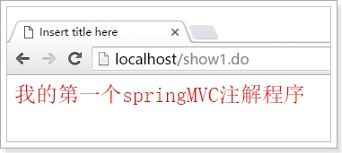 

## 3.4  默认配置的问题及推荐方案

我们使用SpringMVC默认配置没有问题，完全可以使用。但是呢，有一些小问题存在：

 

l 默认的HandlerMapping过时了，推荐我们使用RequestMappingHandlerMapping

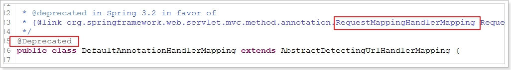 

 

l 默认的HandlerAdapter过时了，推荐使用RequestMappingHandlerAdapter

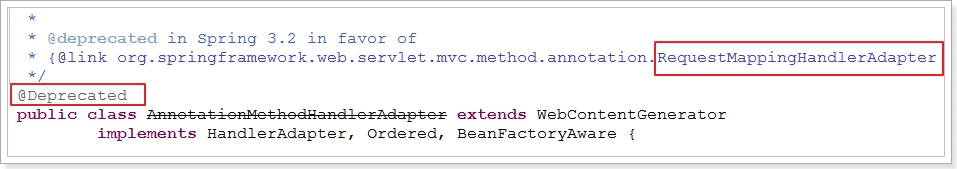 

 

所以，这里要玩注解方式，就不能使用默认配置，必须手动设置这两个推荐的HandlerMapping和HandlerAdapter

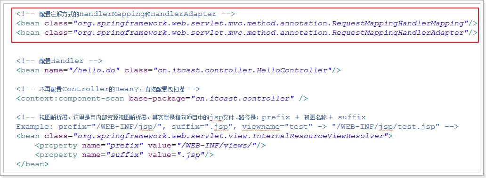 

 

## 3.5 注解驱动及原理

 

经过上面的修改，我们的配置又变的很麻烦了。

 

为了解决这个问题，其实在SpringMVC中，给我们提供了一种解决方案：只需要配置一个标签即可：

 

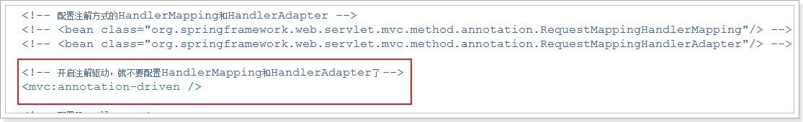 

 

为什么配置了这个就不要配置注解的HandlerMapping和HandlerAdapter了呢？

 

这个注解驱动，对应了SpringMVC中的一个类，我们查看它的介绍：

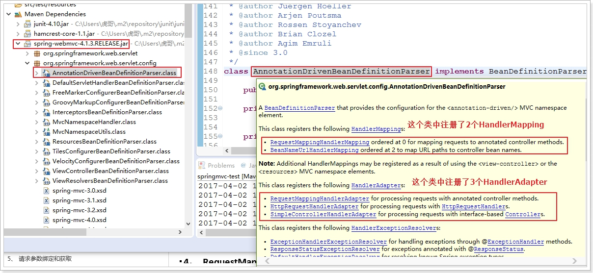 

 

 

因此，当我们配置了注解驱动开关，那么注解驱动的类被加载后，会自动加载这几个HandlerMapping和HandlerAdapter，所以我们不需要配置了。

注解驱动相当于是原来默认配置的升级版！

 

因此，玩注解驱动的最终配置方式就是：

1） 开启注解驱动

2） 开启扫描包

3） 配置内部资源解析器

```xml
<?xml version="1.0" encoding="UTF-8"?>

<beans xmlns="http://www.springframework.org/schema/beans"

	xmlns:xsi="http://www.w3.org/2001/XMLSchema-instance" xmlns:p="http://www.springframework.org/schema/p"

	xmlns:context="http://www.springframework.org/schema/context"

	xmlns:mvc="http://www.springframework.org/schema/mvc"

	xsi:schemaLocation="http://www.springframework.org/schema/beans http://www.springframework.org/schema/beans/spring-beans.xsd

        http://www.springframework.org/schema/mvc http://www.springframework.org/schema/mvc/spring-mvc-4.0.xsd

        http://www.springframework.org/schema/context http://www.springframework.org/schema/context/spring-context.xsd">

 

	<!-- 开启注解驱动，就不要配置HandlerMapping和HandlerAdapter了 -->

	<mvc:annotation-driven />

 

	<!-- 不再配置Controller的Bean了，直接配置包扫描 -->

	<context:component-scan base-package="cn.itcast.controller" />

	

	<!-- 视图解析器，这里是用内部资源视图解析器，其实就是指向项目中的jsp文件.路径是：prefix + 视图名称 + suffix

	Example: prefix="/WEB-INF/jsp/", suffix=".jsp", viewname="test" -> "/WEB-INF/jsp/test.jsp" -->

	<bean class="org.springframework.web.servlet.view.InternalResourceViewResolver">

		<property name="prefix" value="/WEB-INF/views/"/>

		<property name="suffix" value=".jsp"/>

	</bean>

 

</beans>
```

 

# 4. **RequestMapping请求映射方式**

## 4.1 标准映射

规则：

1） @RequestMapping可以设置在类上，也可以设置在方法上

2） 请求的映射规则是：类上的RequestMapping + 方法上的RequestMapping

3） 如果没有写 / ，SpringMVC会自动补全

4） 类上的RequestMapping可以省略，这时直接用方法的RequestMapping访问

5） 路径不可重复

 

例如：

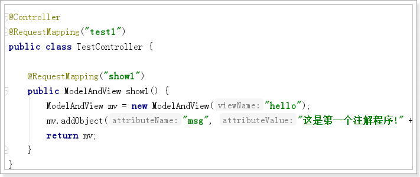 

	这个方法的访问路径就必须是：/test1/show1.do

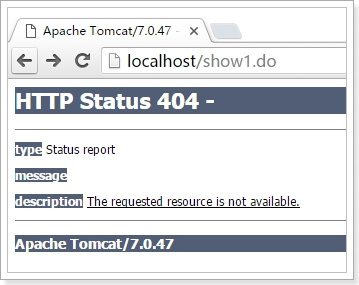​

 

## 4.2 Ant风格映射

Ant风格，其实就是通配符映射，有以下3种方式：

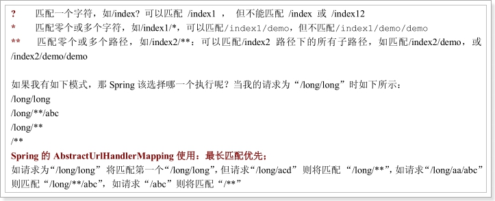 

 

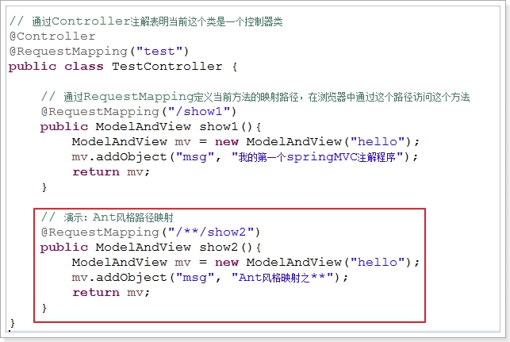 

以下路径都可以匹配到：

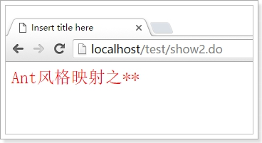 

 

 

## 4.3 占位符映射

例如：

@RequestMapping(value="/users/{userId}") ：

其中{xxx}占位符， 请求的 URL 可以是 “/users/123456”或“/users/abcd”，

通过@PathVariable 可以提取 URI 模板模式中的{xxx}中的xxx变量。

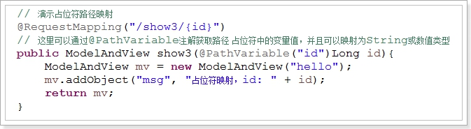 

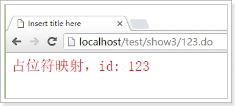 

 

但是，如果传递的参数格式不正确，会出现错误：

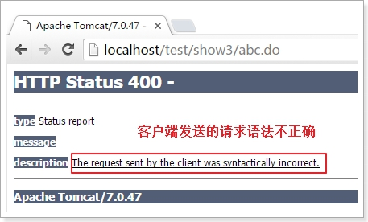 

 

 

## 4.4 请求方式限定

我们可以通过@RequestMapping注解中的 method属性来限定客户端的请求方式，method属性可以接收的是一个枚举数组：

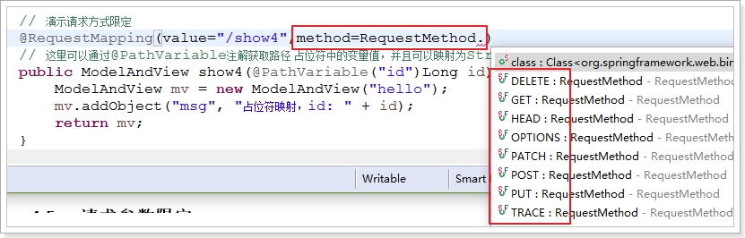 

 

例如：限定请求方式必须是POST

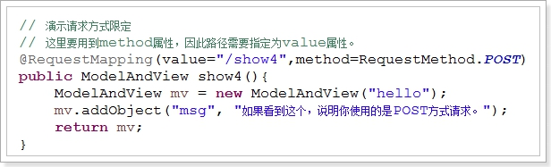 

 

如果使用GET请求，就会报错：

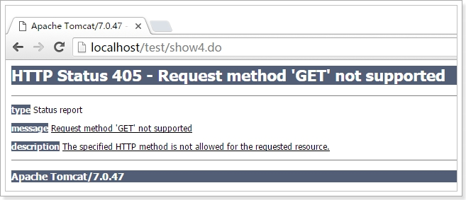 

 

我们用Advanced Client 来模拟POST请求：


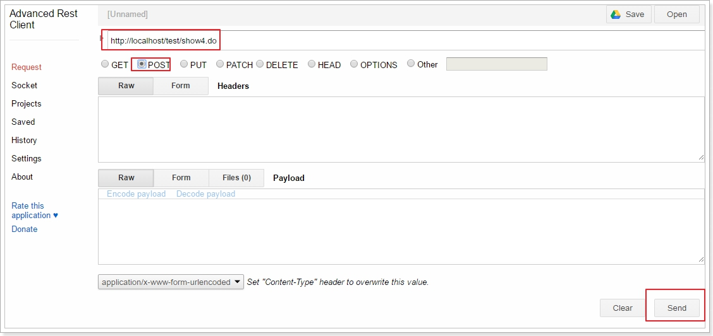 

 

请求成功：

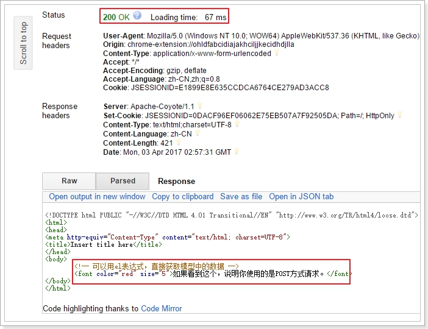 

 

 

当然，也可以同时指定多种请求方式，多种方式之间是或的关系：

 

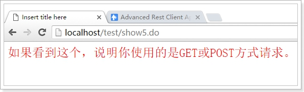 

 

## 4.5 请求参数限定

我们还可以通过@RequestMapping注解的params属性来对请求的参数进行限定：

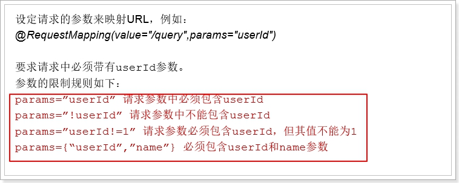 

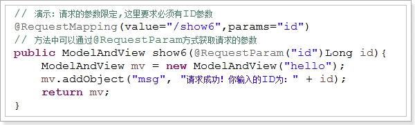 

 

如果请求时，没有传递id参数：

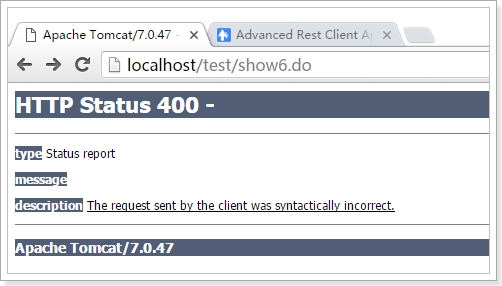 

 

正确的方式：

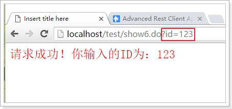 
