# 1 准备工作

## 1.1 导入静态资源和jsp页面

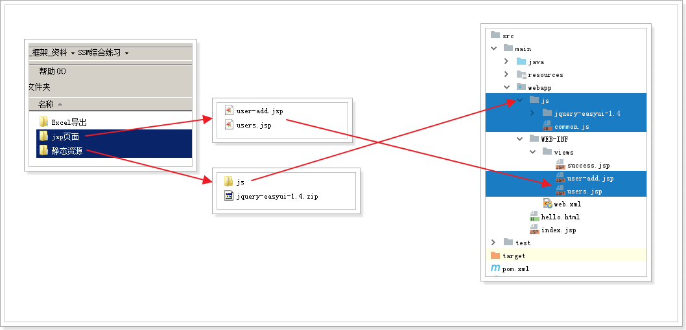

## 1.2 编写controller,实现简单的页面跳转

```java
package cn.itcast.controller;

import org.springframework.stereotype.Controller;
import org.springframework.web.bind.annotation.RequestMapping;

@Controller
@RequestMapping("user")
public class UserController {

    // 跳转到用户列表页
    @RequestMapping("users")
    public String toUserList() {
        return "users";
    }
}
```

## 1.3 启动tomcat,测试:

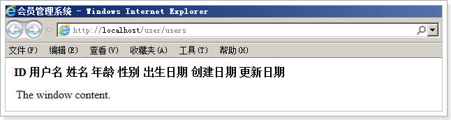

发现没有任何CSS样式，打开开发者工具，发现：

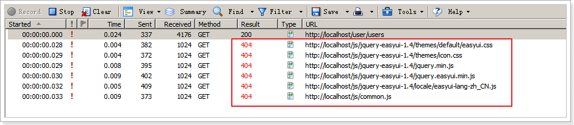

所有的静态资源都是404，什么原因呢？

## 1.4 解决静态资源404问题

回顾我们的SpringMVC前端控制器的配置：

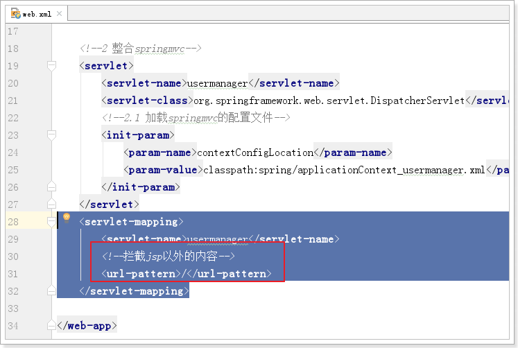

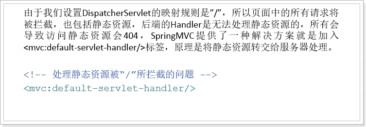

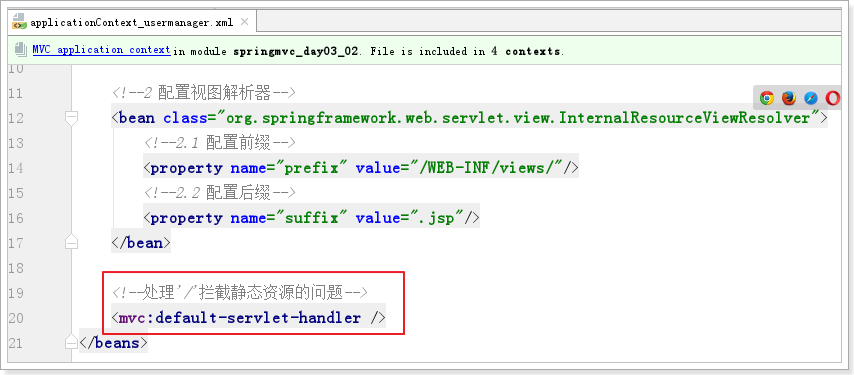 

添加配置，再次访问：

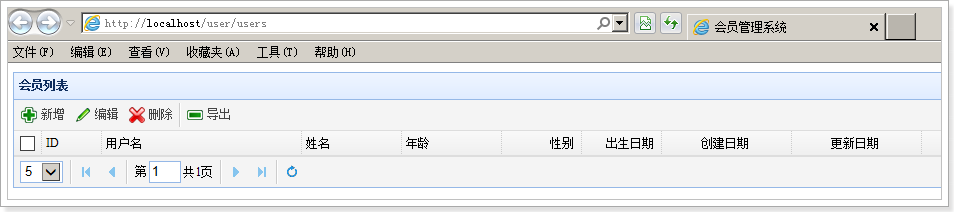


# 2 用户列表功能


## 2.1 问题

刚才的页面中，目前没有任何数据，原因是获取数据的功能我们还没有写：

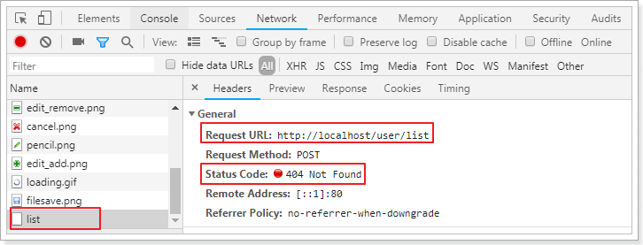

**解决:**

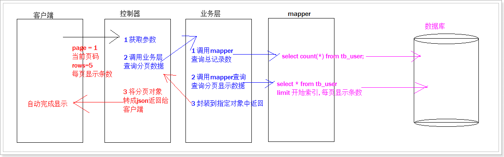


## 2.2 编写 controller

编写一个controller,需要搞清楚三件事:

1. 请求的映射路径(RequestMapping映射地址)
2. 响应结果(方法的返回值)
3. 请求参数(方法的参数列表)

### 2.2.1 请求的映射路径

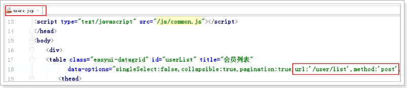 

### 2.2.2 响应结果(方法的返回值)

返回结果 是通过EasyUI的datagrid来获取数据:

datagird要求的数据格式是：

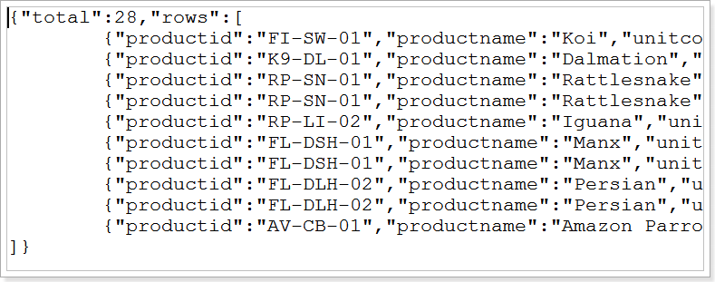 

	这是一个Json对象，包含total和rows属性。total是总条数信息，rows是数据信息，所以我们返回的应该是这样一个对象：

```java
package cn.itcast.pojo;

import java.util.List;

public class Pagebean<T> {
    private Long total;
    private List<T> rows;

    public Pagebean() {
    }

    public Pagebean(Long total, List<T> rows) {
        this.total = total;
        this.rows = rows;
    }

    public Long getTotal() {
        return total;
    }

    public void setTotal(Long total) {
        this.total = total;
    }

    public List<T> getRows() {
        return rows;
    }

    public void setRows(List<T> rows) {
        this.rows = rows;
    }

    @Override
    public String toString() {
        return "Pagebean{" +
                "total=" + total +
                ", rows=" + rows +
                '}';
    }
}
```

### 2.2.3 请求参数

	datagrid请求数据的时候，有两个参数：page (当前页数) 和rows(每页条数) 信息。也就是时候需要进行分页查询。我们需要接收这两个参数。

### 2.2.4 定义controller

```java
package cn.itcast.controller;

import cn.itcast.pojo.Pagebean;
import cn.itcast.service.UserService;
import org.springframework.beans.factory.annotation.Autowired;
import org.springframework.stereotype.Controller;
import org.springframework.web.bind.annotation.RequestMapping;
import org.springframework.web.bind.annotation.RequestParam;
import org.springframework.web.bind.annotation.ResponseBody;

@Controller
@RequestMapping("user")
public class UserController {

    @Autowired
    private UserService userService;

    // 跳转到用户列表页
    @RequestMapping("users")
    public String toUsersPage() {
       return "users";
    }

    // 分页显示
    @RequestMapping("list")
    @ResponseBody()
    public Pagebean queryPage(@RequestParam(value="page", defaultValue = "1") int pagenum,
                               @RequestParam(value="rows", defaultValue = "5") int numPerPage) {
        Pagebean pagebean = userService.queryPagebean(pagenum, numPerPage);
        return pagebean;
    }
}
```

### 2.2.5 测试

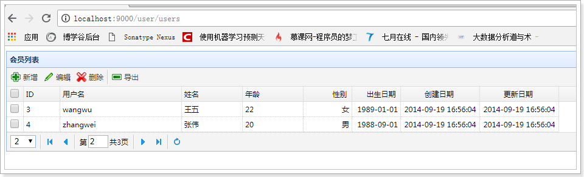 


## 2.3 编写业务层

### 2.3.1 编写业务类

```java
package cn.itcast.service;

import cn.itcast.mapper.UserMapper;
import cn.itcast.pojo.Pagebean;
import cn.itcast.pojo.User;
import org.springframework.beans.factory.annotation.Autowired;
import org.springframework.stereotype.Service;

import java.util.List;

@Service
public class UserService {

    @Autowired
    private UserMapper userMapper;

    // 查询分页显示的数据
    public Pagebean queryPagebean(int pageNum, int numPerPage) {
        // 1 调用mapper查询总记录数
        Long total = userMapper.queryTotal();
        // 2 调用mapper查询分页显示数据
        int start = (pageNum - 1) * numPerPage;
        List<User> userList = userMapper.queryPageData(start, numPerPage);
        // 3 将1和2 返回结果封装到pagebean中,返回
        Pagebean pagebean = new Pagebean(total, userList);
        return pagebean;
    }
}
```

### 2.3.2 测试

```java
package cn.itcast.service;

import cn.itcast.pojo.Pagebean;
import org.junit.Test;
import org.junit.runner.RunWith;
import org.springframework.beans.factory.annotation.Autowired;
import org.springframework.test.context.ContextConfiguration;
import org.springframework.test.context.junit4.SpringJUnit4ClassRunner;

@RunWith(SpringJUnit4ClassRunner.class)
@ContextConfiguration(locations = "classpath:spring/applicationContext_*.xml")
public class UserServiceTest {

    @Autowired
    UserService userService;

    @Test
    public void queryPagebean() throws Exception {
        Pagebean pagebean = userService.queryPagebean(2, 2);
        System.out.println(pagebean);
    }

}
```

## 2.4 编写mapper

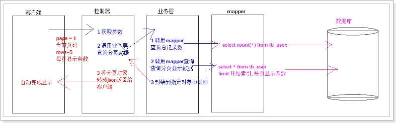

### 2.4.1 编写UserMapper.java

```java
package cn.itcast.mapper;

import cn.itcast.pojo.User;
import org.apache.ibatis.annotations.Param;

import java.util.List;

public interface UserMapper {

    // 查询总记录数
    public Long queryTotal();

    // 查询分页显示数据
    public List<User> queryPageData(@Param("start") int start, @Param("numPerPage") int numPerPage);
}

```

### 2.4.2 编写UserMapper.xml

```xml
<?xml version="1.0" encoding="UTF-8" ?>
<!DOCTYPE mapper
        PUBLIC "-//mybatis.org//DTD Mapper 3.0//EN"
        "http://mybatis.org/dtd/mybatis-3-mapper.dtd">
<mapper namespace="cn.itcast.mapper.UserMapper">
    <!--查询总记录数-->
    <select id="queryTotal" resultType="long">
        select count(*) from tb_user
    </select>

    <!--查询分页显示数据-->
    <select id="queryPageData" resultType="User">
        select * from tb_user
        limit #{start}, #{numPerPage}
    </select>
</mapper>
```

### 2.4.3 测试

```java
package cn.itcast.mapper;

import cn.itcast.pojo.User;
import org.junit.Test;
import org.junit.runner.RunWith;
import org.springframework.beans.factory.annotation.Autowired;
import org.springframework.test.context.ContextConfiguration;
import org.springframework.test.context.junit4.SpringJUnit4ClassRunner;

import java.util.List;

@RunWith(SpringJUnit4ClassRunner.class)
@ContextConfiguration(locations = "classpath:spring/applicationContext_dao.xml")
public class UserMapperTest {

    @Autowired
    private UserMapper userMapper;

    @Test
    public void queryTotal() throws Exception {
        Long total = userMapper.queryTotal();
        System.out.println(total);
    }

    @Test
    public void queryPageData() throws Exception {
        List<User> userList = userMapper.queryPageData(4, 2);
        for (User user : userList) {
            System.out.println("============================" + user);
        }
    }

}
```

# 3 mybatis分页插件

## 3.1 原有分页的问题及思考

* 思考：我们前面的分页实现存在怎样的问题？

  	1） 我们需要给每个SQL添加分页的逻辑，还要保留不分页的SQL，重复！

  	2） 不同数据库分页方式不同，写死后不利于以后的开发和维护！

  	3） 需要手动查询总条数信息

* 有没有更好的方案呢？

  	其实分页的逻辑基本是类似的：以MySQL举例，基本都是在原有SQL基础上加上limit start,rows

  	既然如此，我们完全可以使用mybatis的拦截器机制，在SQL执行前做一个拦截，然后对SQL语句加上limit 

  	这样所有需要分页的SQL就自动实现分页逻辑了！

* 拦截器实现分页的原理图：

  	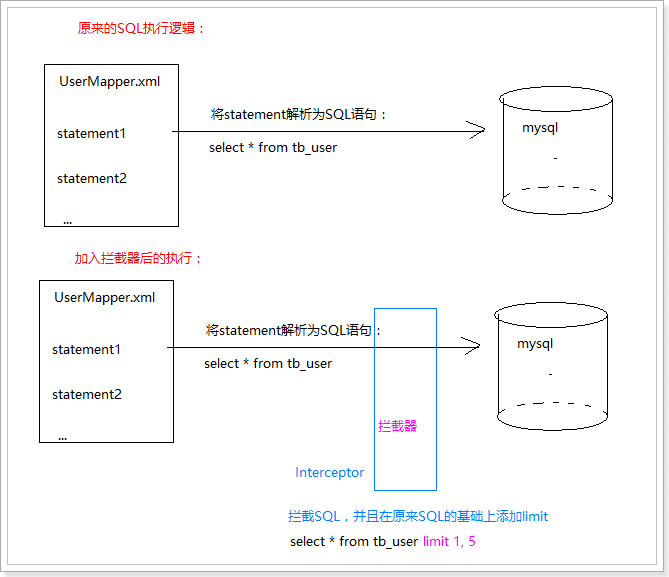


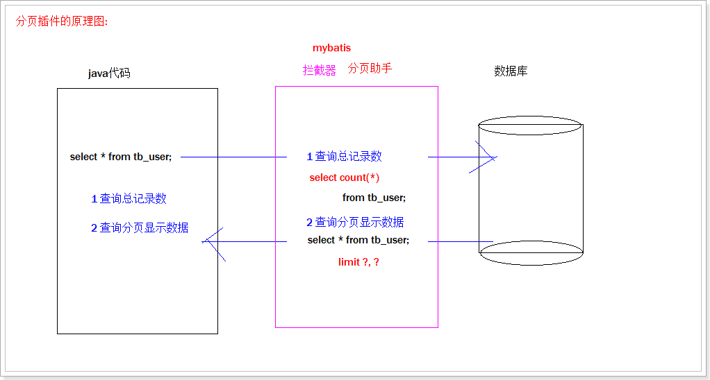


## 3.2 PageHelper分页插件

上面的逻辑已经有大神想到了，并且写出了开源的组件：

网址: https://github.com/pagehelper/Mybatis-PageHelper

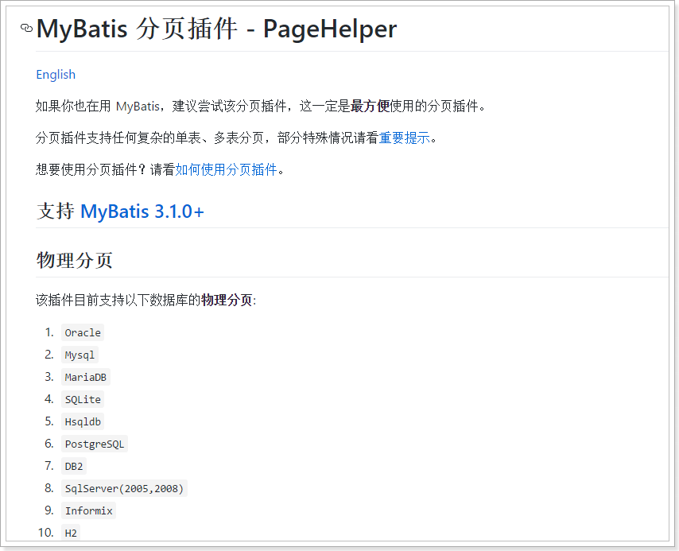

### 3.2.1 添加依赖

```xml
<!-- 分页助手 -->
<dependency>
    <groupId>com.github.pagehelper</groupId>
    <artifactId>pagehelper</artifactId>
    <version>3.7.5</version>
</dependency>
<dependency>
    <groupId>com.github.jsqlparser</groupId>
    <artifactId>jsqlparser</artifactId>
    <version>0.9.1</version>
</dependency>
```
### 3.2.2 在mybatis-config.xml中配置分页插件：

```xml
<plugins>
	<!-- 配置分页助手的插件 -->
	<plugin interceptor="com.github.pagehelper.PageHelper">
		<!-- 指定数据库方言 -->
		<property name="dialect" value="mysql"/>
		<!-- 设置为true时，查询结果中会查询出总条数信息 -->
		<property name="rowBoundsWithCount" value="true"/>
	</plugin>
</plugins>
```

### 3.2.3 添加新的mapper接口

```java
package cn.itcast.mapper;

import cn.itcast.pojo.User;

import java.util.List;

public interface UserMapper {

    // 查询所有用户集合
    public List<User> queryAll();
}

```

### 3.2.4 编写mapper.xml文件

```xml
<?xml version="1.0" encoding="UTF-8" ?>
<!DOCTYPE mapper
        PUBLIC "-//mybatis.org//DTD Mapper 3.0//EN"
        "http://mybatis.org/dtd/mybatis-3-mapper.dtd">
<mapper namespace="cn.itcast.mapper.UserMapper">
    <!--查询所有用户集合-->
    <select id="queryAll" resultType="User">
        select * from tb_user
    </select>
</mapper>
```

### 3.2.5 修改业务类

```java
package cn.itcast.service;

import cn.itcast.mapper.UserMapper;
import cn.itcast.pojo.Pagebean;
import cn.itcast.pojo.User;
import com.github.pagehelper.PageHelper;
import com.github.pagehelper.PageInfo;
import org.springframework.beans.factory.annotation.Autowired;
import org.springframework.stereotype.Service;

import java.util.List;

@Service
public class UserService {

    @Autowired
    private UserMapper userMapper;

    // 查询分页显示的数据
    public Pagebean queryPagebean(int pageNum, int numPerPage) {
        // 使用分页助手
        PageHelper.startPage(pageNum, numPerPage);
        // 调用mapper查询需要的数据
        List<User> userList = userMapper.queryAll(); // 分页显示的数据
        // 需要查询总记录数和分页显示数据
        PageInfo<User> pageInfo = new PageInfo<User>(userList);
        // 1 查询总记录数
        long total = pageInfo.getTotal();
        // 2 将总记录数和分页显示数据封装到pagebean中返回
        Pagebean pagebean = new Pagebean(total, userList);
        return pagebean;
    }
}

```

### 3.2.6 总结

**PageHelper做了两件事情：**

	1）自动查询了总条数信息
	
	2）自动的给我们SQL语句后面添加分页逻辑：limit ?,?

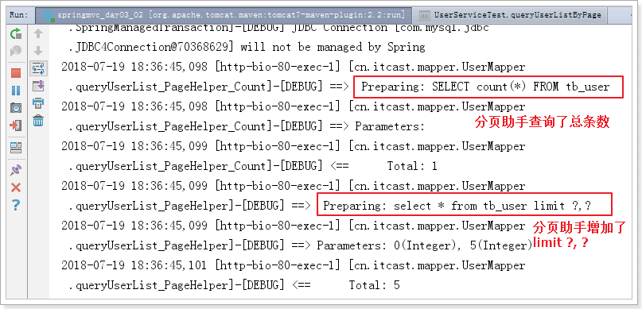

# 4 新增用户

## 4.1 通用的页面跳转

* 查看新增用户按钮

  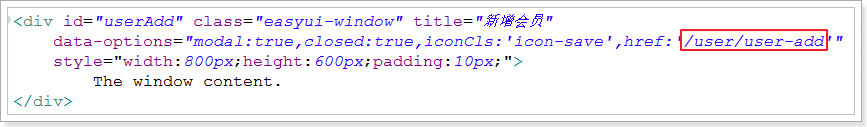

  需要跳转页面到user-add.jsp

* 我们写了两个页面跳转的逻辑：

  	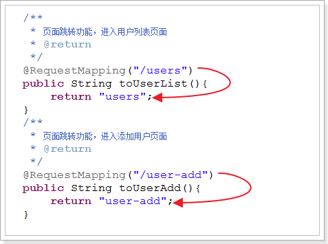 

可以发现，页面跳转的逻辑很简单，并且有很大的共性，就是用户输入的路径，与用户要跳转的页面一般是一样的！

既然如此，我们是否可以考虑把RequestMapping的映射路径中的值，作为返回的视图名称呢？

这时我们就可以想到一个东西：@PathVariable


* 通用的页面跳转：

  ```java
  @Controller
  @RequestMapping("page")
  public class PageController {
  
  	@RequestMapping("{pageName}")
  	// 通过PathVariable获取用户输入的路径，把路径直接作为视图名称返回。用户输入的必须是正确的视图名称
  	public String toPage(@PathVariable("pageName") String pageName){
  		return pageName;
  	}
  }
  ```


这样，我们访问首页就应该输入：http://localhost/page/users

最后的users 就被赋值给了 pageName ，然后作为视图名称，就能找到 WEB-INF/views/users.jsp了

 

然后新增用户的页面跳转也要改变：http://localhost/page/user-add

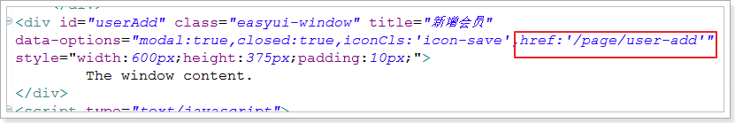

* 访问测试

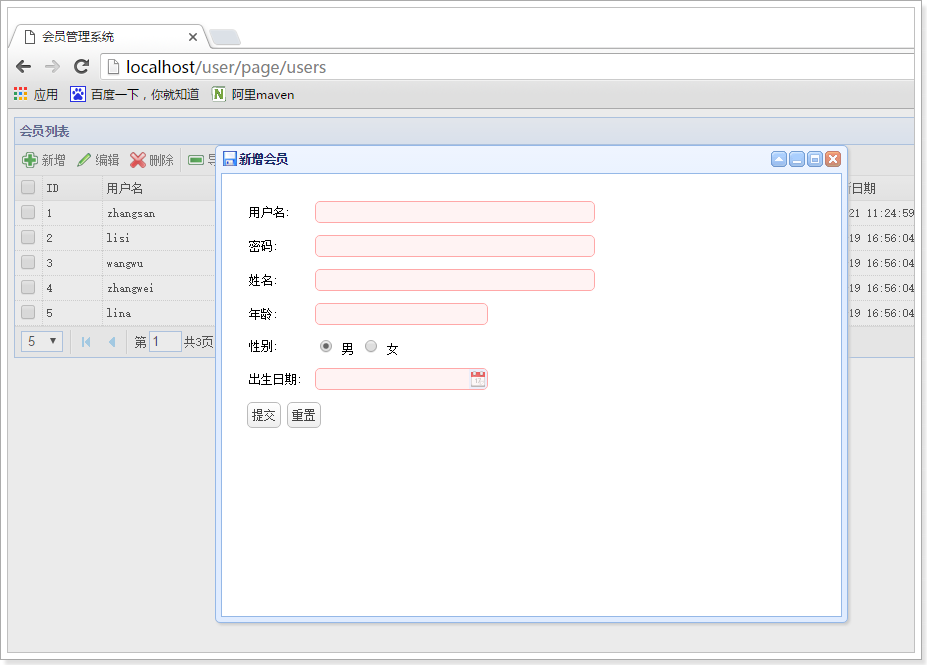

## 4.2 编写Controller

分析form表单的提交逻辑：

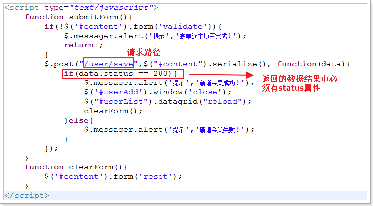

返回值：需要包含一个status属性，这里可以考虑用一个Map<String,Integer>，我们也可以自定义对象

```java
/**
 * 返回的通用页面结果
 */
public class PageResult {
	private Integer status;// 结果的状态码
	private Object data;// 结果的数据
	
	public PageResult() {
	}
	
	public PageResult(Integer status) {
		super();
		this.status = status;
	}

	public PageResult(Integer status, Object data) {
		super();
		this.status = status;
		this.data = data;
	}

	public Integer getStatus() {
		return status;
	}
	// 提供一个默认的成功状态方法
	public static PageResult ok(){
		return new PageResult(200);
	}
	// 提供一个默认的异常状态方法
	public static PageResult error(){
		return new PageResult(500);
	}
	
	public void setStatus(Integer status) {
		this.status = status;
	}

	public Object getData() {
		return data;
	}

	public void setData(Object data) {
		this.data = data;
	}
}
```

参数：用户的所有信息，这里用User对象>

 

## 4.3 编写UserService

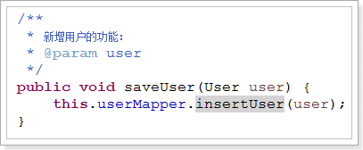 

## 4.4 编写UserMapper

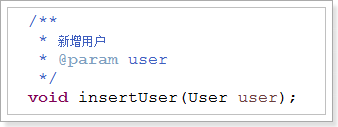 

## 4.5 编写sql

```sql
	<insert id="insertUser" parameterType="User" useGeneratedKeys="true" keyProperty="id" keyColumn="id">
		INSERT INTO tb_user (
			id,
			user_name,
			password,
			name,
			age,
			sex,
			birthday,
			created,
			updated
		)
		VALUES
		(
			NULL,
			#{userName},
			#{password},
			#{name},
			#{age},
			#{sex},
			#{birthday},
			NOW(),
			NOW()
		);
	</insert>
```

## 4.6 测试: 解决日期转换问题

提交请求后报错：

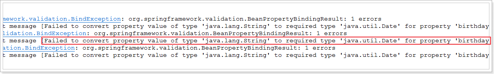

查看后发现是因为类型转换问题，我们在页面中的birthday字段获取的是字符串类型，而User中的是Date类型，怎么办？

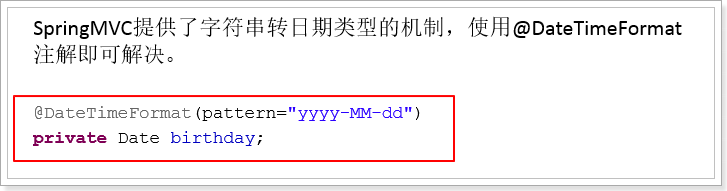 

修改User类

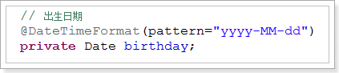 

再次测试:

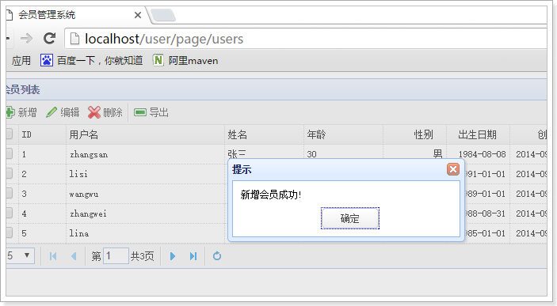

# 5 修改用户

##5.1 通用页面跳转

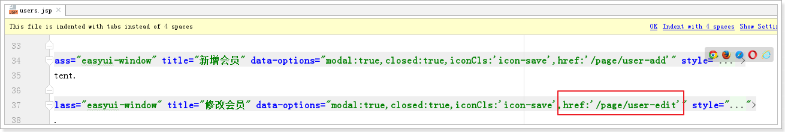

## 5.2 编写controller

```java
/**
 * 修改用户
 * @param user
 * @return
 */
@RequestMapping("edit")
@ResponseBody
public PageResult editUser(User user) {
    try {
        userService.editUser(user);
        return PageResult.ok();
    } catch(Exception e) {
        e.printStackTrace();
        return PageResult.error();
    }
}
```

## 5.3 编写 UserService

```java
/**
 * 修改用户
 */
public void editUser(User user) {
    userMapper.editUser(user);
}
```

## 5.4 编写 UserMapper

```java
/**
 * 修改用户
 */
public void editUser(User user);
```

## 5.5 编写sql

```xml
<!--修改用户-->
<update id="editUser">
    update tb_user
    set
        user_name=#{userName},
        password=#{password},
        name=#{name},
        age=#{age},
        sex=#{sex},
        birthday=#{birthday},
        updated=now()
    where id=#{id}
</update>
```

测试即可!

# 6 删除用户

## 6.1 编写Controller

* **查看删除的请求格式**


1）返回值：依然要求有一个status参数，所以可以定义一个Map<String,Integer>

2）参数：这里是ids，其实就是多个ID以”,”隔开的字符串。对应到Java中就是数组,或者集合

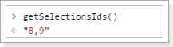 

所以，我们的Controller这样定义：

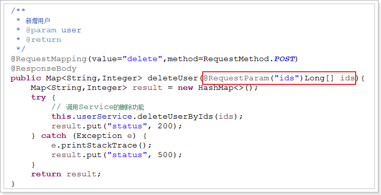

## 6.2 编写UserService

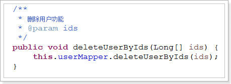

## 6.3 编写UserMapper

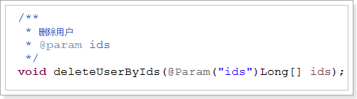

## 6.4 编写mapper.xml

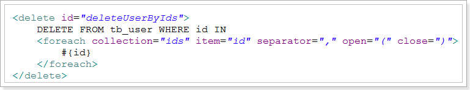

## 6.5 测试

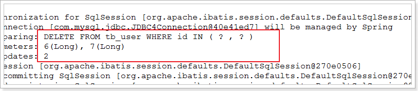


