[TOC]

# 1 Spring IoC容器快速入门案例 

ioc 控制反转, 原先是自己new,然后调用方法; 现在 让spring框架new, 然后调用方法; 我们将new对象的权利交给spring框架,把这个称之为控制反转.

## 1.1 导包

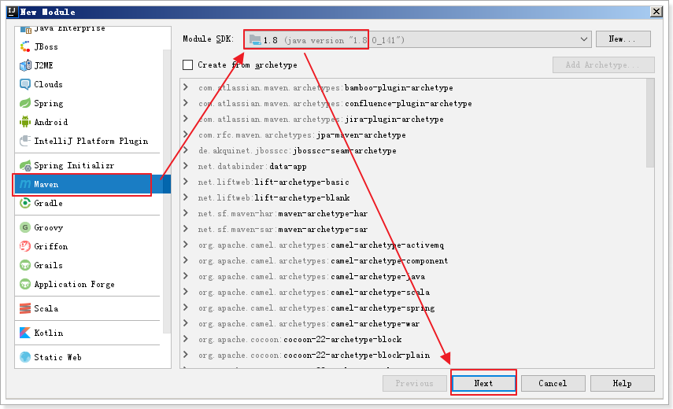

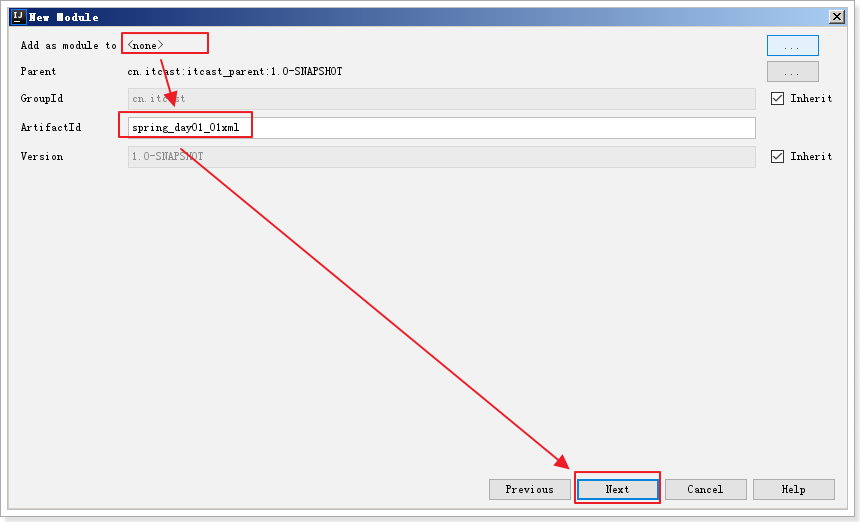

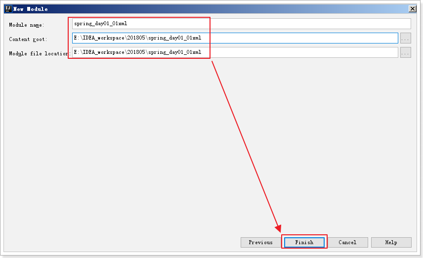


```xml
<?xml version="1.0" encoding="UTF-8"?>
<project xmlns="http://maven.apache.org/POM/4.0.0"
         xmlns:xsi="http://www.w3.org/2001/XMLSchema-instance"
         xsi:schemaLocation="http://maven.apache.org/POM/4.0.0 http://maven.apache.org/xsd/maven-4.0.0.xsd">
    <parent>
        <artifactId>itcast_parent</artifactId>
        <groupId>cn.itcast</groupId>
        <version>1.0-SNAPSHOT</version>
        <relativePath>../itcast_parent/pom.xml</relativePath>
    </parent>
    <modelVersion>4.0.0</modelVersion>

    <artifactId>spring_day01_01xml</artifactId>

    <dependencies>
        <dependency>
            <groupId>junit</groupId>
            <artifactId>junit</artifactId>
        </dependency>
        <dependency>
            <groupId>org.springframework</groupId>
            <artifactId>spring-context</artifactId>
        </dependency>
    </dependencies>

</project>
```

## 1.2 编写spring ioc 控制反转案例

### 1.2.1 什么是控制反转

IoC ：Inverse of control 控制反转 ，思想就是在项目中引入一个工厂容器，对项目中接口依赖对象的创建，实现项目中对于依赖对象解耦合。 

将程序中对象的创建权，交给工厂容器来管理

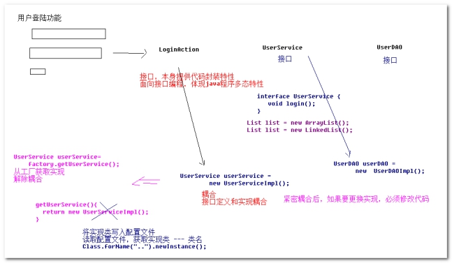

Spring其实就是一个工厂，出现为了解除程序中耦合，底层原理：工厂、配置文件、反射。程序不需要自己创建对象，获取spring工厂已经创建好的对象，对象创建权，反转到spring容器。

### 1.2.2 编写传统调用代码

```java
package cn.itcast.a_quickstart;

/**
 * 持久层接口
 */
public interface UserDao {
    public void findUsernameAndPassword();
}
```

```java
package cn.itcast.a_quickstart;

public class UserDaoImpl implements UserDao {
    @Override
    public void findUsernameAndPassword() {
        System.out.println("持久层 findUsernameAndPassword ... ...");
    }
}
```

```java
package cn.itcast.a_quickstart;

// 业务层
public interface UserService {
    /**
     * 登录业务
     */
    public void login();
}
```

```java
package cn.itcast.a_quickstart;

public class UserServiceImpl implements UserService {
    @Override
    public void login() {
        System.out.println("业务层 login ... ...");
        // 1 传统方式,在程序创建实现类对象,耦合
        UserDao userDao = new UserDaoImpl();
        userDao.findUsernameAndPassword();
    }
}
```

```java
package cn.itcast.a_quickstart;

import org.junit.Test;

public class SpringTest {

    @Test
    public void testLogin() {
        UserService userService = new UserServiceImpl();
        userService.login();
    }
}
```

### 1.2.3 使用spring实现控制反转


```xml
<?xml version="1.0" encoding="UTF-8"?>
<beans xmlns="http://www.springframework.org/schema/beans"
       xmlns:xsi="http://www.w3.org/2001/XMLSchema-instance"
       xsi:schemaLocation="http://www.springframework.org/schema/beans http://www.springframework.org/schema/beans/spring-beans.xsd">

    <!--配置bean标签,提供对象实现类型-->
    <!--id或name 是对象的唯一标识-->
    <!--class 配置对象的全路径-->
    <bean id="userDao" class="cn.itcast.a_quickstart.UserDaoImpl"/>
</beans>
```

读取配置文件的工厂对象

		ClassPathXmlApplicationContext 读取 src下配置文件 
	
		FileSystemXmlApplicationContext 读取 WEB-INF下配置文件 


修改业务层实现类代码, 从工厂获取dao对象

```java
package cn.itcast.a_quickstart;

import org.springframework.context.ApplicationContext;
import org.springframework.context.support.ClassPathXmlApplicationContext;

public class UserServiceImpl implements UserService {
    @Override
    public void login() {
        System.out.println("业务层 login ... ...");
        // 1 传统方式,在程序创建实现类对象,耦合
        // UserDao userDao = new UserDaoImpl();
        // 2 spring 工厂读取配置文件,获取userDao对象
        ApplicationContext applicationContext = new ClassPathXmlApplicationContext("applicationContext.xml");
        UserDao userDao = applicationContext.getBean("userDao", UserDao.class);
        userDao.findUsernameAndPassword();

    }
}
```

修改SpringTest代码, 从工厂获取service对象

```xml
<bean id="userService" class="cn.itcast.a_quickstart.UserServiceImpl"/>
```

```java
package cn.itcast.a_quickstart;

import org.junit.Test;
import org.springframework.context.ApplicationContext;
import org.springframework.context.support.ClassPathXmlApplicationContext;

public class SpringTest {

    @Test
    public void testLogin() {
        ApplicationContext applicationContext = new ClassPathXmlApplicationContext("applicationContext.xml");
        UserService userService = applicationContext.getBean("userService", UserService.class);
        userService.login();
    }
}
```

控制反转，就是将程序中原来 new 对象，交给spring创建，从spring工厂获取对象

### 1.2.4 理解IoC和DI的区别

什么事DI?

	DI Dependency Injection 依赖注入 

面试题：IoC和DI 有什么区别 ？

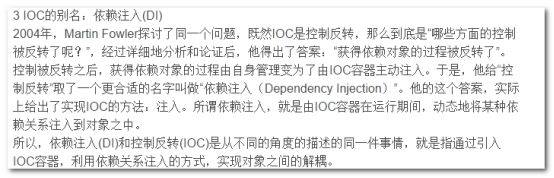

IoC容器在运行期间，可以动态将某种依赖关系注入到对象之中。

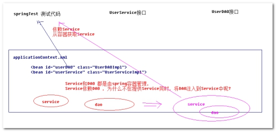

修改 UserServiceImpl代码

```java
package cn.itcast.a_quickstart;

public class UserServiceImpl implements UserService {
    // 需求在业务层提供接受dao的方法
    // 3 由spring提供service方法同时,将dao注入给service
    private UserDao userDao;

    public void setUserDao(UserDao userDao) {
        this.userDao = userDao;
    }

    @Override
    public void login() {
        System.out.println("业务层 login ... ...");
        // 1 传统方式,在程序创建实现类对象,耦合
        // UserDao userDao = new UserDaoImpl();
        // 2 spring 工厂读取配置文件,获取userDao对象
        //ApplicationContext applicationContext = new ClassPathXmlApplicationContext("applicationContext.xml");
        //UserDao userDao = applicationContext.getBean("userDao", UserDao.class);

        userDao.findUsernameAndPassword();
    }
}
```

修改applicationContext.xml 配置

```xml
<?xml version="1.0" encoding="UTF-8"?>
<beans xmlns="http://www.springframework.org/schema/beans"
       xmlns:xsi="http://www.w3.org/2001/XMLSchema-instance"
       xsi:schemaLocation="http://www.springframework.org/schema/beans http://www.springframework.org/schema/beans/spring-beans.xsd">

    <!--配置bean标签,提供对象实现类型-->
    <!--id或name 是对象的唯一标识-->
    <!--class 配置对象的全路径-->
    <bean id="userDao" class="cn.itcast.a_quickstart.UserDaoImpl"/>
    <bean id="userService" class="cn.itcast.a_quickstart.UserServiceImpl">
        <property name="userDao" ref="userDao"/>
    </bean>
</beans>
```

Spring提供程序被依赖对象的同时，同时完成向对象注入 其它被依赖对象 ！

## 1.3 Spring工厂超级接口 BeanFactory(了解)

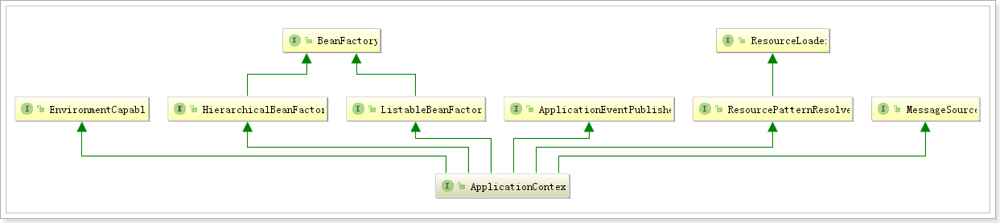

ApplicationContext 并不是spring工厂容器顶级接口 ------ 顶级接口 BeanFactory （Bean 对象工厂 ）

为什么不使用BeanFactory？ 

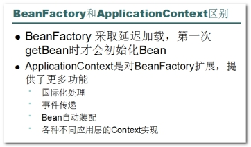

面试题：BeanFactory和FactoryBean的区别？ 

	BeanFactory 是管理很多对象一个工厂
	
	FactoryBean 是通过工厂模式创建的一个对象 

```java
public class UserServiceImpl implements UserService {

    public UserServiceImpl() {
        System.out.println("调用业务层的构造方法 ... ..");
    }
    ... ...
}
```

```java
@Test
public void testLogin2() {
    // 获取spring容器工厂, 从工厂获取service对象
    Resource resource = new ClassPathResource("applicationContext.xml");
    BeanFactory beanFactory = new XmlBeanFactory(resource);

    UserService userService = (UserService) beanFactory.getBean("userService");
    userService.login();
}
```

# 2 Spring IoC 容器配置(XML方式2遍)

## 2.1 实例化bean的三种方式

### 2.1.1 默认无参数构造器

```java
package cn.itcast.b_definition;

public class Bean1 {
}
```

```xml
<!--第一种方式: 无参数构造器-->
<bean id="bean1" class="cn.itcast.b_definition.Bean1"/>
```

```java
package cn.itcast.b_definition;

import org.junit.Test;
import org.springframework.context.ApplicationContext;
import org.springframework.context.support.ClassPathXmlApplicationContext;

public class SpringTest {
    @Test
    public void testDefinition() {
        ApplicationContext applicationContext = new ClassPathXmlApplicationContext("applicationContext.xml");
        // 获取bean
        Bean1 bean1 = applicationContext.getBean("bean1", Bean1.class);
        System.out.println(bean1);
    }
}
```

### 2.1.2 静态工厂方法

```java
package cn.itcast.b_definition;

/**
 * 静态工厂方法初始化
 */
public class Bean2 {
}
```

```java
package cn.itcast.b_definition;

// 工厂
public class Bean2Factory {
    // 静态方法
    public static Bean2 initBean2() {
        return new Bean2();
    }
}
```

```xml
<!--第二种方式: 静态工厂方法初始化-->
<bean id="bean2"
      class="cn.itcast.b_definition.Bean2Factory"
      factory-method="initBean2"/>
```

```java
@Test
public void testDefinition() {
    ApplicationContext applicationContext = new ClassPathXmlApplicationContext("applicationContext.xml");

    Bean2 bean2 = applicationContext.getBean("bean2", Bean2.class);
    System.out.println(bean2);
}
```

### 2.1.3 实例工厂方法实例化

```java
package cn.itcast.b_definition;

// 实例工厂方法 初始化
public class Bean3 {
}
```

```java
package cn.itcast.b_definition;

// 工厂
public class Bean3Factory {
    // 实例化
    public Bean3 createBean3() {
        return new Bean3();
    }
}
```

```xml
<!--第三种方式: -->
<bean id="bean3Factory" class="cn.itcast.b_definition.Bean3Factory"/>
<bean id="bean3" factory-bean="bean3Factory" factory-method="createBean3"/>
```

```java
package cn.itcast.b_definition;

import org.junit.Test;
import org.springframework.context.ApplicationContext;
import org.springframework.context.support.ClassPathXmlApplicationContext;

public class SpringTest {
    @Test
    public void testDefinition() {
        ApplicationContext applicationContext = new ClassPathXmlApplicationContext("applicationContext.xml");
        // 获取bean
        Bean3 bean3 = applicationContext.getBean("bean3", Bean3.class);
        System.out.println(bean3);
    }
}
```

### 2.1.4 补充知识点： FactoryBean 工厂Bean

Spring规范中提供FactoryBean 接口 

```java
package cn.itcast.b_definition;

import org.springframework.beans.factory.FactoryBean;

public class MyFactoryBean implements FactoryBean {
    @Override
    public Object getObject() throws Exception {
        return new Bean3();
    }

    @Override
    public Class<?> getObjectType() {
        return null;
    }

    @Override
    public boolean isSingleton() {
        return false;
    }
}
```


```xml
<!--第四种方式-->
<bean id="bean3_2" class="cn.itcast.b_definition.MyFactoryBean"/>
```


```java
@Test
public void testDefinition() {
    ApplicationContext applicationContext = new ClassPathXmlApplicationContext("applicationContext.xml");
    // 获取bean
    Bean3 bean3_2 = applicationContext.getBean("bean3_2", Bean3.class);
    System.out.println("3_2:::" + bean3_2);
}
```

## 2.2.  **Bean的作用域** 

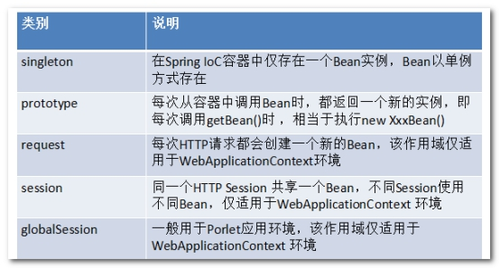 

重点记忆 

1. singleton 单实例（一个容器中只有一个实例， 默认作用域）
2. prototype 原型 多实例 （每次getBean都会返回 一个新的实例 ）

```java
package cn.itcast.spring.c_scope;

// 单例 
public class SingletonBean {
	public SingletonBean() {
		System.out.println("单实例Bean SingletonBean 初始化...");
	}
}
```


```java
package cn.itcast.spring.c_scope;

public class PrototypeBean {
    public PrototypeBean() {
        System.out.println("多实例bean PrototypeBean 初始化 ...");
    }
}
```

配置

```xml
	<!-- ========================================= c_scope bean的作用域 -->
	<!-- 如果不指定scope属性，默认就是单实例 -->
	<bean id="singletonBean" class="cn.itcast.spring.c_scope.SingletonBean" />
	<bean id="prototypeBean" class="cn.itcast.spring.c_scope.PrototypeBean" scope="prototype"/>
```

编写测试 

```java
package cn.itcast.spring.c_scope;

import org.junit.Test;
import org.springframework.context.ApplicationContext;
import org.springframework.context.support.ClassPathXmlApplicationContext;

public class SpringTest {
	@Test
	public void testScope() {
		ApplicationContext applicationContext = new ClassPathXmlApplicationContext(
				"applicationContext.xml");
		// 单例
		SingletonBean singletonBean1 = (SingletonBean) applicationContext
				.getBean("singletonBean");
		SingletonBean singletonBean2 = (SingletonBean) applicationContext
				.getBean("singletonBean");
		System.out.println(singletonBean1);
		System.out.println(singletonBean2);

		// 多例
		PrototypeBean prototypeBean1 = (PrototypeBean) applicationContext
				.getBean("prototypeBean");
		PrototypeBean prototypeBean2 = (PrototypeBean) applicationContext
				.getBean("prototypeBean");
		System.out.println(prototypeBean1);
		System.out.println(prototypeBean2);
	}
}
```


## 2.2 Bean的生命周期 

### 2.2.1 Bean的初始化和销毁

```java
package cn.itcast.spring.d_lifecycle;

// 接口
public interface LifeCycleBean {
	public void printinfo();
}

```

在配置<bean> 通过 init-method属性 和 destroy-method属性指定两个方法

```xml
	<!-- ==========================================d_lifecycle 生命周期 -->
	<bean id="lifecycleBean" 
		class="cn.itcast.spring.d_lifecycle.LifeCycleBeanImpl" 
		init-method="init" destroy-method="destroy" />
```

在配置<bean> 通过 init-method属性 和 destroy-method属性指定两个方法 

```java
package cn.itcast.spring.d_lifecycle;

// 生命周期 
public class LifeCycleBeanImpl implements LifeCycleBean {

	public LifeCycleBeanImpl() {
		System.out.println("LifeCycleBeanImpl 构造...");
	}

	// 无返回值 无参数 非静态
	public void init() {
		System.out.println("LifeCycleBeanImpl 初始化...");
	}

	public void destroy() {
		System.out.println("LifeCycleBeanImpl 销毁...");
	}

	@Override
	public void printinfo() {
		System.out.println("hello spring !");
	}

}
```

destroy 必须在工厂调用close方法时，才会执行 （Bean必须为单例 ）

```java
package cn.itcast.spring.d_lifecycle;

import org.junit.Test;
import org.springframework.context.support.ClassPathXmlApplicationContext;

public class SpringTest {
	@Test
	public void testScope() {
		ClassPathXmlApplicationContext applicationContext = new ClassPathXmlApplicationContext(
				"applicationContext.xml");
		LifeCycleBean lifeCycleBean = (LifeCycleBean) applicationContext
				.getBean("lifecycleBean");
		lifeCycleBean.printinfo();

		// 调用close
		applicationContext.close();
	}
}
```

## 2.3. 依赖注入属性配置 (重点)

### 2.3.1. 依赖注入三种方式 

方式一： 构造器参数注入
方式二： 属性setter方法注入
方式三： 接口注入 

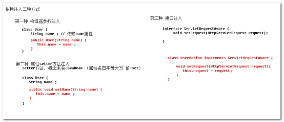,

Spring 在配置方面只支持 构造器参数注入和属性setter方法注入 
Spring 内部提供很多符合接口注入API （ApplicationContextAware ）

### 2.3.2. 构造器方法参数注入 

通过 <constructor-arg> 进行构造器参数注入 

```java
package cn.itcast.spring.e_di;

// 轿车， 构造器注入一些参数
public class Car {
	private String name;
	private double price;

	public Car(String name, double price) {
		this.name = name;
		this.price = price;
	}

	public String getName() {
		return name;
	}

	@Override
	public String toString() {
		return "Car [name=" + name + ", price=" + price + "]";
	}

}
```


配置

```xml
	<!-- =========================================== e_di 依赖注入 -->
	<!-- 构造器 注入 -->
	<bean id="car" class="cn.itcast.spring.e_di.Car">
		<!-- 通过constructor-arg 注入构造器参数 -->
		<!-- 
			index 参数索引，第一个参数 0
			name 参数名称
			type 参数类型
			value 注入简单类型值
			ref 注入复杂对象引用 
		 -->
		<constructor-arg index="0" value="保时捷"/>
		<constructor-arg index="1" value="500000"/>
	</bean>
```


测试

```java
package cn.itcast.e_di;

import org.springframework.context.ApplicationContext;
import org.springframework.context.support.ClassPathXmlApplicationContext;

public class SpringTest {
    public static void main(String[] args) {
        ApplicationContext ac = new ClassPathXmlApplicationContext("applicationContext.xml");
        Car car = ac.getBean("car", Car.class);
        System.out.println(car);
    }
}

```

 ### 2.3.3 属性setter方法注入

通过 <property>元素，实现属性setter方法注入 

```java
package cn.itcast.spring.e_di;

// 员工
public class Employee {
	private String name;
	private Car car;

	// setter方法，只需要提供属性 set方法
	public void setName(String name) {
		this.name = name;
	}

	public void setCar(Car car) {
		this.car = car;
	}

	@Override
	public String toString() {
		return "Employee [name=" + name + ", car=" + car + "]";
	}

}
```

配置

```xml
	<!-- 属性 setter方法注入 -->
	<bean id="employee" class="cn.itcast.spring.e_di.Employee">
		<!-- 通过 property 调用setter方法注入属性 -->
		<!-- 
			name 就是setter方法对于属性名 
			value 注入简单类型值
			ref 注入复杂对象引用 另一个Bean的id或者name
		 -->
		<property name="name" value="张三" />
		<property name="car" ref="car" />
	</bean>
```


### 2.3.4. p名称空间的使用 

Spring2.5 版本之后，为了简化属性setter依赖注入，提供虚拟名称空间 p ！
1、引入

```xml
<?xml version="1.0" encoding="UTF-8"?>
<beans xmlns="http://www.springframework.org/schema/beans"
       xmlns:p="http://www.springframework.org/schema/p"
       xmlns:xsi="http://www.w3.org/2001/XMLSchema-instance"
       xsi:schemaLocation="http://www.springframework.org/schema/beans http://www.springframework.org/schema/beans/spring-beans.xsd">
```


2、简化配置

```xml
	<!-- 属性 setter方法注入 -->
	<bean id="employee" class="cn.itcast.spring.e_di.Employee">
		<!-- 通过 property 调用setter方法注入属性 -->
		<!-- 
			name 就是setter方法对于属性名 
			value 注入简单类型值
			ref 注入复杂对象引用 另一个Bean的id或者name
		 -->
		<property name="name" value="张三" />
		<property name="car" ref="car" />
	</bean>
	
	<!-- 应用p名称空间案例 -->
	<!-- 将property 子元素 简化为 p:属性名 或者 p:属性名-ref 成为bean元素 属性  -->
	<bean id="employee2" 
		class="cn.itcast.spring.e_di.Employee" 
		p:name="李四" p:car-ref="car"/>
```

### 2.3.5 **集合类型属性注入** 

```java
package cn.itcast.spring.e_di;

import java.util.List;
import java.util.Map;
import java.util.Properties;
import java.util.Set;

// 集合类型属性注入
public class CollectionBean {
	private List<String> list;
	private Set<Integer> set;
	private Map<String, Integer> map;
	private Properties properties;

	public void setList(List<String> list) {
		this.list = list;
	}

	public void setSet(Set<Integer> set) {
		this.set = set;
	}

	public void setMap(Map<String, Integer> map) {
		this.map = map;
	}

	public void setProperties(Properties properties) {
		this.properties = properties;
	}

	@Override
	public String toString() {
		return "CollectionBean [list=" + list + ", set=" + set + ", map=" + map
				+ ", properties=" + properties + "]";
	}

}

```


```xml
<!-- 集合类型属性注入 -->
	<bean id="collectionBean" class="cn.itcast.spring.e_di.CollectionBean">
		<property name="list">
			<list>
				<!-- value注入简单类型值， ref注入复杂对象引用 -->
				<value>abc</value>
				<value>def</value>
			</list>
		</property>
		<property name="set">
			<set>
				<value>10</value>
				<value>20</value>
			</set>
		</property>
		<property name="map">
			<map>
				<entry key="aa" value="11"/>
				<entry key="bb" value="22"/>
			</map>
		</property>
		<property name="properties">
			<props>
				<prop key="qwe">111</prop>
				<prop key="asd">222</prop>
			</props>
		</property>
	</bean>
```

```java
    @Test
    public void demo4() {
        ApplicationContext ac = new ClassPathXmlApplicationContext("applicationContext.xml");
        CollectionBean collectionBean = ac.getBean("collectionBean", CollectionBean.class);
        System.out.println(collectionBean);
    }
```


# 3 Spring IoC 容器配置（注解方式(3遍) ）

## 3.1. 注解定义Bean对象 

### 3.1.1 第一步：在Bean class 添加 注解 

Spring2.5 提供 @Component  效果相当于  <bean> 元素

```java
package cn.itcast.spring.a_beandefinition;

// 业务层 登陆接口
public interface UserService {
	public void login();
}

```

```java
package cn.itcast.spring.a_beandefinition;

import javax.inject.Inject;
import javax.inject.Named;

import org.springframework.beans.factory.annotation.Value;
import org.springframework.stereotype.Service;

import cn.itcast.spring.b_di.UserDAO;

// 业务实现类
@Component("userService")
// 当注解只有一个value属性要写时，value= 可以省略
// <bean id="userService" class="全路径">
public class UserServiceImpl implements UserService {

	@Override
	public void login() {
		System.out.println("业务层 login ...");
	}

}

```

相当于 <bean id=”userService” class=”UserServiceImpl” >

### 3.1.2 第二步： 配置包扫描，通知spring 注解Bean 在哪个包下面 

使用 <context> 命名空间 

```xml
<?xml version="1.0" encoding="UTF-8"?>
<beans xmlns="http://www.springframework.org/schema/beans"
       xmlns:xsi="http://www.w3.org/2001/XMLSchema-instance"
       xmlns:context="http://www.springframework.org/schema/context"
       xsi:schemaLocation="
	http://www.springframework.org/schema/beans 
	http://www.springframework.org/schema/beans/spring-beans.xsd
	http://www.springframework.org/schema/context 
	http://www.springframework.org/schema/context/spring-context.xsd">
	<!-- 自动扫描 cn.itcast.spring包和其所有子包  -->
	<context:component-scan base-package="cn.itcast.spring" />
</beans>

```

### 3.1.3 测试

```java
package cn.itcast.spring.a_beandefinition;

import org.junit.Test;
import org.springframework.context.ApplicationContext;
import org.springframework.context.support.ClassPathXmlApplicationContext;

public class SpringTest {
	@Test
	public void testBeanDefinition() {
		ApplicationContext applicationContext = new ClassPathXmlApplicationContext(
				"applicationContext.xml");
		UserService userService = (UserService) applicationContext
				.getBean("userService");
		userService.login();
	}
}

```


* Spring 容器提供@Component 等效三个衍生注解 
  * @Repository 用于注册DAO（持久层 ）
  * @Service 用于注册 Service（业务层）
  * @Controller 用于注册 Action （表现层）


```java
package cn.itcast.spring.a_beandefinition;

import javax.inject.Inject;
import javax.inject.Named;

import org.springframework.beans.factory.annotation.Value;
import org.springframework.stereotype.Service;

import cn.itcast.spring.b_di.UserDAO;

// 业务实现类
// @Component("userService")
// 当注解只有一个value属性要写时，value= 可以省略
// <bean id="userService" >
@Service("userService")
public class UserServiceImpl implements UserService {

	@Override
	public void login() {
		System.out.println("业务层 login ...");
		userDAO.findByUsernameAndPassword();
	}

}
```

## 3.2.  **注解实现属性依赖注入** 

### 3.2.1 编写dao 实现查询功能

```java
package cn.itcast.spring.b_di;

// 持久层  
public interface UserDAO {
	public void findByUsernameAndPassword();
}
```


```java
package cn.itcast.spring.b_di;

import org.springframework.stereotype.Repository;

@Repository("userDAO")
public class UserDAOImpl implements UserDAO {

	@Override
	public void findByUsernameAndPassword() {
		System.out.println("持久层  findByUsernameAndPassword ...");
	}

}
```

改动 UserServiceImpl代码 ，注入一些属性 

注入属性的注解，可以加在属性定义上 或者 构造方法上 或者 setter方法上 ！

### 3.2.2.  **注入基本类型属性** 

简单类型属性注入，只有变量才有意义 ！

Spring3.0之后，通过@Value注解 结合 spEL 表达式实现 

```xml
	// 基本类型属性
	@Value("传智播客")
	private String company;
```

### 3.2.3 **注入复杂类型属性** 

#### Spring3.0提供@Value注解

```java
	// 复杂类型属性
	// 第一种 @Value 结合 spEL
	@Value("#{userDAO}")
	private UserDAO userDAO;
```

#### Spring2.0 提供@Autowired 注解 结合 @Qualifier 注解 

```java
	// 第二种 @Autowired 注解 结合 @Qualifier 注解
	// 如果单独使用@Autowired 默认按照类型注入
	// 使用 @Qualifier 按照名称注入
	@Autowired
	@Qualifier("userDAO")
	private UserDAO userDAO;
```

#### JSR-250规范 提供 @Resource 注解实现注入(了解) 

```java
	// 第三种 JSR-250提供@Resource 注解
	// 不写name属性，按照类型注入，写了name属性，按照名称注入
	@Resource(name = "userDAO")
	private UserDAO userDAO;
```

## 3.3 **其它注解的使用** 

### 3.3.1 初始化和销毁注解 

<bean> 通过 init-method 指定初始化方法 和 destroy-method 指定销毁方法
@PostConstruct 初始化方法
@PreDestroy 销毁方法

```java
package cn.itcast.spring.c_other;

import javax.annotation.PostConstruct;
import javax.annotation.PreDestroy;

import org.springframework.context.annotation.Scope;
import org.springframework.stereotype.Component;

@Component("lifecycleBean")
public class LifeCycleBean {
	public LifeCycleBean() {
		System.out.println("LifeCycleBean 构造...");
	}

	@PostConstruct
	// 初始化方法
	public void init() {
		System.out.println("LifeCycleBean 初始化...");
	}

	@PreDestroy
	// 销毁方法
	public void destroy() {
		System.out.println("LifeCycleBean 销毁...");
	}
}
```

执行销毁方法，必须bean是单例的，而且调用容器close方法！ 

```java
@Test
public void testLifeCycle() throws Exception {
	ApplicationContext applicationContext = new ClassPathXmlApplicationContext(
			"applicationContext.xml");
	LifeCycleBean lifeCycleBean1 = (LifeCycleBean) applicationContext
			.getBean("lifecycleBean");
	LifeCycleBean lifeCycleBean2 = (LifeCycleBean) applicationContext
			.getBean("lifecycleBean");
	System.out.println(lifeCycleBean1);
	System.out.println(lifeCycleBean2);

	// 通过反射 代码调用 close方法
	Method closeMethod = applicationContext.getClass().getMethod("close");
	closeMethod.invoke(applicationContext);
}
```
### 3.3.2. Bean的作用域注解 

<bean> 提供 scope属性，用于描述Bean的作用域 
Spring提供@Scope注解，描述Bean的作用域 

默认scope作用域 singleton !

```java
@Component("lifecycleBean")
@Scope("prototype")
// 多实例Bean
public class LifeCycleBean {...}
```


### 3.3.3 XML和注解混合配置 （spring2.0 年代） 了解

Spring2.5之前 ，没有@Component注解， 已经提供@Autowired注解 
可以用XML注册Bean， 用注解完成 依赖注入 
代码

```java
package cn.itcast.spring.c_other;

//xml注册Bean
public class ProductDAO {

	public void add() {
		System.out.println("product 数据层 add");
	}

}

```


```java
package cn.itcast.spring.c_other;

import org.springframework.beans.factory.annotation.Autowired;

// xml注册Bean
public class ProductService {
	@Autowired
	private ProductDAO productDAO;

	public void add() {
		System.out.println("product 业务层 add ");
		productDAO.add();
	}
}
```


```java
@Test
public void testProduct() {
	ApplicationContext applicationContext = new ClassPathXmlApplicationContext(
			"applicationContext-mixed.xml");
	ProductService productService = (ProductService) applicationContext
			.getBean("productService");
	productService.add();
}
```
配置 xml 完成Bean注册 

```xml
    <bean id="productDao" class="cn.itcast.spring.c_ther.ProductDao"/>
    <bean id="productService" class="cn.itcast.spring.c_ther.ProductService"/>
```

在xml配置，使@Autowired注解有效 

```xml
	<!-- 使自动注入注解生效  -->
	<context:annotation-config/>
```


使@Resource、@ PostConstruct、@ PreDestroy、@Autowired注解生效
<context:component-scan> 包含 <context:annotation-config> 功能 ！

# 4.  **在web开发中使用spring框架(3遍)** 

## 4.1.  **按照之前学习，编写在servlet中使用spring** 

新建 spring_day1_web项目，导入spring核心开发jar包 

```xml
<dependencies>
    <dependency>
        <groupId>org.springframework</groupId>
        <artifactId>spring-context</artifactId>
    </dependency>
    <dependency>
        <groupId>junit</groupId>
        <artifactId>junit</artifactId>
    </dependency>
    <dependency>
        <groupId>org.springframework</groupId>
        <artifactId>spring-web</artifactId>
        <version>4.1.3.RELEASE</version>
    </dependency>

    <!-- JSP相关 -->
    <dependency>
        <groupId>jstl</groupId>
        <artifactId>jstl</artifactId>
    </dependency>
    <dependency>
        <groupId>javax.servlet</groupId>
        <artifactId>servlet-api</artifactId>
        <scope>provided</scope>
    </dependency>
    <dependency>
        <groupId>javax.servlet</groupId>
        <artifactId>jsp-api</artifactId>
        <scope>provided</scope>
    </dependency>
</dependencies>
<build>
    <plugins>
        <plugin>
            <groupId>org.apache.tomcat.maven</groupId>
            <artifactId>tomcat7-maven-plugin</artifactId>
            <version>2.2</version>
            <configuration>
                <port>80</port>
                <path>/</path>
            </configuration>
        </plugin>
    </plugins>
</build>
```

表现层 从spring工厂获取对象

```java
package cn.itcast.web;

import cn.itcast.service.HelloService;
import org.springframework.context.ApplicationContext;
import org.springframework.context.support.ClassPathXmlApplicationContext;

import javax.servlet.ServletException;
import javax.servlet.http.HttpServlet;
import javax.servlet.http.HttpServletRequest;
import javax.servlet.http.HttpServletResponse;
import java.io.IOException;

public class HelloServlet extends HttpServlet {
    protected void doPost(HttpServletRequest request, HttpServletResponse response) throws ServletException, IOException {

    }

    protected void doGet(HttpServletRequest request, HttpServletResponse response) throws ServletException, IOException {
        ApplicationContext ac = new ClassPathXmlApplicationContext("applicationContext.xml");
        HelloService helloService = ac.getBean("helloService", HelloService.class);
        helloService.sayHello();
    }
}

```

业务层

```java
package cn.itcast.service;

public class HelloService {
    public void sayHello() {
        System.out.println("hello spring!");
    }
}

```

Spring负责业务对象创建

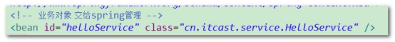 

 ```xml
<?xml version="1.0" encoding="UTF-8"?>
<beans xmlns="http://www.springframework.org/schema/beans"
       xmlns:xsi="http://www.w3.org/2001/XMLSchema-instance"
       xsi:schemaLocation="http://www.springframework.org/schema/beans http://www.springframework.org/schema/beans/spring-beans.xsd">
    <bean id="helloService" class="cn.itcast.service.HelloService"></bean>
</beans> 
 ```

问题： 每次访问Servlet，都将创建一个新的Spring容器 ！

解决思路：在项目运行过程中，只创建一个spring容器 

方式一： static 

方式二： ServletContextListener 监听ServletContext 对象创建和销毁，创建一个唯一 Spring工厂对象，放入ServletContext 中 

## 4.2.  **导入spring-web 开发jar包** 

导入 spring-web.jar 

```
<dependency>
    <groupId>org.springframework</groupId>
    <artifactId>spring-web</artifactId>
    <version>4.1.3.RELEASE</version>
</dependency>
```

在web.xml 配置监听器 ContextLoaderListener 

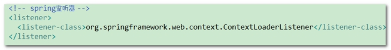 

```xml
    <!--spring监听器-->
    <listener>
        <listener-class>org.springframework.web.context.ContextLoaderListener</listener-class>
    </listener>
```

监听器 默认加载 WEB-INF/applicationContext.xml 


配置 自己applicationContext.xml位置 

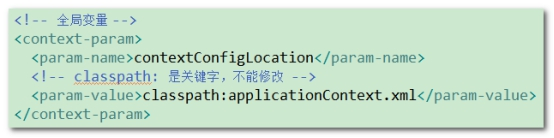 

```xml
    <!--全局变量-->
    <context-param>
        <param-name>contextConfigLocation</param-name>
        <!--classpath是关键字,不能修改-->
        <param-value>classpath:applicationContext.xml</param-value>
    </context-param>
```


在tomcat启动时，spring工厂进行创建 ！

 

修改HelloServlet代码，从ServletContext中获取spring容器 ！


方式一：

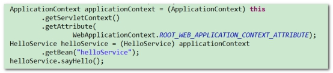 

```java
ApplicationContext ac = (ApplicationContext) this.getServletContext().getAttribute(WebApplicationContext.ROOT_WEB_APPLICATION_CONTEXT_ATTRIBUTE);
HelloService helloService = ac.getBean("helloService", HelloService.class);
helloService.sayHello();
```


方式二：

 

```java
// 方式二
ApplicationContext ac = WebApplicationContextUtils.getWebApplicationContext(this.getServletContext());
HelloService helloService = ac.getBean("helloService", HelloService.class);
helloService.sayHello();
```


```java
package cn.itcast.web;

import cn.itcast.service.HelloService;
import org.springframework.context.ApplicationContext;
import org.springframework.web.context.support.WebApplicationContextUtils;

import javax.servlet.ServletException;
import javax.servlet.http.HttpServlet;
import javax.servlet.http.HttpServletRequest;
import javax.servlet.http.HttpServletResponse;
import java.io.IOException;

public class HelloServlet extends HttpServlet {
    protected void doPost(HttpServletRequest request, HttpServletResponse response) throws ServletException, IOException {

    }

    protected void doGet(HttpServletRequest request, HttpServletResponse response) throws ServletException, IOException {
        // 方式一
        //ApplicationContext ac = (ApplicationContext) this.getServletContext().getAttribute(WebApplicationContext.ROOT_WEB_APPLICATION_CONTEXT_ATTRIBUTE);
        //HelloService helloService = ac.getBean("helloService", HelloService.class);
        //helloService.sayHello();

        // 方式二
        ApplicationContext ac = WebApplicationContextUtils.getWebApplicationContext(this.getServletContext());
        HelloService helloService = ac.getBean("helloService", HelloService.class);
        helloService.sayHello();
    }
}

```


# 5.  **Spring和Junit集成测试** 

第一步：在项目导入 spring-test的jar包

（项目引入junit 的jar包 ）

```xml
<dependency>
    <groupId>org.springframework</groupId>
    <artifactId>spring-test</artifactId>
    <version>4.1.3.RELEASE</version>
</dependency>
```


第二步： 使用 @RunWith注解 和 @ContextConfiguration 注解 集成测试 

初始化 spring容器 

第三步：注入需要测试对象，进行测试 

 

```java
package cn.itcast.service;

import org.junit.Test;
import org.junit.runner.RunWith;
import org.springframework.beans.factory.annotation.Autowired;
import org.springframework.test.context.ContextConfiguration;
import org.springframework.test.context.junit4.SpringJUnit4ClassRunner;

@RunWith(SpringJUnit4ClassRunner.class)
@ContextConfiguration(locations = "classpath:applicationContext.xml")
public class HelloServiceTest {

    @Autowired
    private HelloService helloService;

    @Test
    public void sayHello() throws Exception {
        helloService.sayHello();
    }

}
```

 

课后作业： 

1、IoC和DI的区别 ？ BeanFactory和FactoryBean区别？

2、实例化Bean三种方式

3、Bean作用域

4、Bean初始化和销毁 

5、构造器注入和setter注入 

6、p名称空间和spEL表达式

 

 