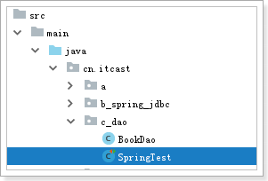
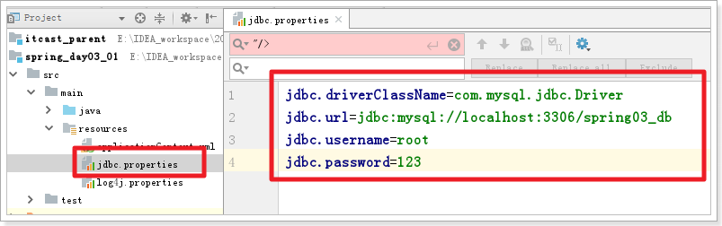

# 回顾

# 1 代理套路

1. 目标类
2. 增强类
3. 建立关系

# 2 how?

## 2.1 xml

## 2.2 注解

# 今日内容

# 1 spring jdbc 操作数据库

## 1.1 回顾 DBUtils

```
1. 连接池
2. 创建执行sql对象
3. 书写sql
4. 执行sql 获得结果 处理结果
```


```xml
<?xml version="1.0" encoding="UTF-8"?>
<project xmlns="http://maven.apache.org/POM/4.0.0"
         xmlns:xsi="http://www.w3.org/2001/XMLSchema-instance"
         xsi:schemaLocation="http://maven.apache.org/POM/4.0.0 http://maven.apache.org/xsd/maven-4.0.0.xsd">
    <parent>
        <artifactId>itcast_parent</artifactId>
        <groupId>cn.itcast.maven</groupId>
        <version>1.0-SNAPSHOT</version>
        <relativePath>../itcast_parent/pom.xml</relativePath>
    </parent>
    <modelVersion>4.0.0</modelVersion>

    <artifactId>spring_day03_01</artifactId>
    <packaging>jar</packaging>
    <dependencies>
        <!--mysql-->
        <dependency>
            <groupId>mysql</groupId>
            <artifactId>mysql-connector-java</artifactId>
        </dependency>
        <!--druid 连接池-->
        <dependency>
            <groupId>com.alibaba</groupId>
            <artifactId>druid</artifactId>
        </dependency>
        <!--dbutils-->
        <dependency>
            <groupId>commons-dbutils</groupId>
            <artifactId>commons-dbutils</artifactId>
        </dependency>
    </dependencies>

</project>
```


```java
package cn.itcast.a;

import com.alibaba.druid.pool.DruidDataSource;
import org.apache.commons.dbutils.QueryRunner;

import java.sql.SQLException;

public class DbutilsTest {
    public static void main(String[] args) throws SQLException {
        // 1 创建连接池
        DruidDataSource ds = new DruidDataSource();
        ds.setDriverClassName("com.mysql.jdbc.Driver");
        ds.setUrl("jdbc:mysql://localhost:3306/spring03_db");
        ds.setUsername("root");
        ds.setPassword("123");

        // 2 创建执行sql对象
        QueryRunner qr = new QueryRunner(ds);

        // 3 编写sql
        String sql = "create table book(id int primary key auto_increment, name varchar(50), price double)";

        // 4 执行sql
        qr.update(sql);
    }
}
```

## 1.2 spring 操作数据库

### 1.2.1 导包

```xml
<?xml version="1.0" encoding="UTF-8"?>
<project xmlns="http://maven.apache.org/POM/4.0.0"
         xmlns:xsi="http://www.w3.org/2001/XMLSchema-instance"
         xsi:schemaLocation="http://maven.apache.org/POM/4.0.0 http://maven.apache.org/xsd/maven-4.0.0.xsd">
    <parent>
        <artifactId>itcast_parent</artifactId>
        <groupId>cn.itcast.maven</groupId>
        <version>1.0-SNAPSHOT</version>
        <relativePath>../itcast_parent/pom.xml</relativePath>
    </parent>
    <modelVersion>4.0.0</modelVersion>

    <artifactId>spring_day03_01</artifactId>
    <packaging>jar</packaging>
    <dependencies>
        <!--mysql-->
        <dependency>
            <groupId>mysql</groupId>
            <artifactId>mysql-connector-java</artifactId>
        </dependency>
        <!--druid 连接池-->
        <dependency>
            <groupId>com.alibaba</groupId>
            <artifactId>druid</artifactId>
        </dependency>
        <!--dbutils-->
        <dependency>
            <groupId>commons-dbutils</groupId>
            <artifactId>commons-dbutils</artifactId>
        </dependency>

        <!--spring-context-->
        <dependency>
            <groupId>org.springframework</groupId>
            <artifactId>spring-context</artifactId>
        </dependency>
        <!--spring-jdbc-->
        <dependency>
            <groupId>org.springframework</groupId>
            <artifactId>spring-jdbc</artifactId>
        </dependency>
        <!--spring-aspect-->
        <dependency>
            <groupId>org.springframework</groupId>
            <artifactId>spring-aspects</artifactId>
        </dependency>
        <!--spring-test-->
        <dependency>
            <groupId>org.springframework</groupId>
            <artifactId>spring-test</artifactId>
        </dependency>

        <!--junit-->
        <dependency>
            <groupId>junit</groupId>
            <artifactId>junit</artifactId>
        </dependency>
        <!--日志-->
        <dependency>
            <groupId>org.slf4j</groupId>
            <artifactId>slf4j-log4j12</artifactId>
        </dependency>

    </dependencies>

</project>
```

### 1.2.2 快速入门

```java
package cn.itcast.b_spring_jdbc;

import org.junit.Test;
import org.springframework.jdbc.core.JdbcTemplate;
import org.springframework.jdbc.datasource.DriverManagerDataSource;

public class SpringJDBCTest {
    @Test
    public void demo01() {
        // 1 连接池
        DriverManagerDataSource ds = new DriverManagerDataSource();
        ds.setDriverClassName("com.mysql.jdbc.Driver");
        ds.setUrl("jdbc:mysql://localhost:3306/spring03_db");
        ds.setUsername("root");
        ds.setPassword("123");

        // 2 创建执行sql的对象
        JdbcTemplate jdbcTemplate = new JdbcTemplate(ds);

        // 3 编写sql
        String sql = "insert into book(id, name, price) values(null, ?, ?)";

        // 4 执行sql 获得结果 处理结果
        Object[] paramArr = {"天龙八部", 9.9};
        jdbcTemplate.update(sql, paramArr);
    }
}
```

### 1.2.3 将连接池和jdbcTemplate交给spring管理

 

```xml
<?xml version="1.0" encoding="UTF-8"?>
<beans xmlns="http://www.springframework.org/schema/beans"
       xmlns:xsi="http://www.w3.org/2001/XMLSchema-instance"
       xsi:schemaLocation="http://www.springframework.org/schema/beans http://www.springframework.org/schema/beans/spring-beans.xsd">
    <!--1. 配置连接池-->
    <bean id="ds" class="org.springframework.jdbc.datasource.DriverManagerDataSource">
        <property name="driverClassName" value="com.mysql.jdbc.Driver"/>
        <property name="url" value="jdbc:mysql://localhost:3306/spring03_db"/>
        <property name="username" value="root"/>
        <property name="password" value="123"/>
    </bean>

    <!--2 配置jdbcTemplate-->
    <bean id="jdbcTemplate" class="org.springframework.jdbc.core.JdbcTemplate">
        <property name="dataSource" ref="ds"/>
    </bean>
</beans>
```

测试

 

```java
package cn.itcast.b_spring_jdbc;

import org.junit.Test;
import org.junit.runner.RunWith;
import org.springframework.beans.factory.annotation.Autowired;
import org.springframework.jdbc.core.JdbcTemplate;
import org.springframework.test.context.ContextConfiguration;
import org.springframework.test.context.junit4.SpringJUnit4ClassRunner;

//  ApplicationContext ac = new ClassPathXmlApplicationContext("applicationContext.xml");
@RunWith(SpringJUnit4ClassRunner.class)
@ContextConfiguration(locations = "classpath:applicationContext.xml")
public class SpringTest {

    // JdbcTemplate jdbcTemplate = ac.getBean("jdbcTemplate", JdbcTemplate.class);
    @Autowired
    private JdbcTemplate jdbcTemplate;

    @Test
    public void demo01() {
        String sql = "insert into book(id, name, price) values(null, ?, ?)";
        Object[] paramArr = {"鹿鼎记", 9.9};
        jdbcTemplate.update(sql, paramArr);
    }

}
```

### 1.2.4 将增删改 封装到dao中

 

```java
package cn.itcast.c_dao;

import cn.itcast.pojo.Book;
import org.springframework.jdbc.core.JdbcTemplate;

public class BookDao {
    private JdbcTemplate jdbcTemplate;

    public void setJdbcTemplate(JdbcTemplate jdbcTemplate) {
        this.jdbcTemplate = jdbcTemplate;
    }

    // 添加一本书
    public void add(Book book) {
        String sql = "insert into book(id, name, price) values(null, ?, ?)";
        Object[] paramArr = {book.getName(), book.getPrice()};
        jdbcTemplate.update(sql, paramArr);
    }

    // 修改一本书
    public void edit(Book book) {
        String sql = "update book set name=?, price=? where id=?";
        Object[] paramArr = {book.getName(), book.getPrice(), book.getId()};
        jdbcTemplate.update(sql, paramArr);
    }

    // 根据编号删除书籍
    public void delById(int id) {
        String sql = "delete from book where id=?";
        jdbcTemplate.update(sql, id);
    }
}
```

将dao交给spring管理

 


```xml
<?xml version="1.0" encoding="UTF-8"?>
<beans xmlns="http://www.springframework.org/schema/beans"
       xmlns:xsi="http://www.w3.org/2001/XMLSchema-instance"
       xsi:schemaLocation="http://www.springframework.org/schema/beans http://www.springframework.org/schema/beans/spring-beans.xsd">
    <!--1. 配置连接池-->
    <bean id="ds" class="org.springframework.jdbc.datasource.DriverManagerDataSource">
        <property name="driverClassName" value="com.mysql.jdbc.Driver"/>
        <property name="url" value="jdbc:mysql://localhost:3306/spring03_db"/>
        <property name="username" value="root"/>
        <property name="password" value="123"/>
    </bean>

    <!--2 配置jdbcTemplate-->
    <bean id="jdbcTemplate" class="org.springframework.jdbc.core.JdbcTemplate">
        <property name="dataSource" ref="ds"/>
    </bean>

    <!--3 dao-->
    <bean id="bookDao" class="cn.itcast.c_dao.BookDao">
        <property name="jdbcTemplate" ref="jdbcTemplate"/>
    </bean>
</beans>
```

测试

 

```java
package cn.itcast.c_dao;

import cn.itcast.pojo.Book;
import org.junit.Test;
import org.junit.runner.RunWith;
import org.springframework.beans.factory.annotation.Autowired;
import org.springframework.test.context.ContextConfiguration;
import org.springframework.test.context.junit4.SpringJUnit4ClassRunner;

//  ApplicationContext ac = new ClassPathXmlApplicationContext("applicationContext.xml");
@RunWith(SpringJUnit4ClassRunner.class)
@ContextConfiguration(locations = "classpath:applicationContext.xml")
public class SpringTest {

    @Autowired
    private BookDao bookDao;

    @Test
    public void demo01() {
        Book book = new Book();
        book.setName("九阳神功");
        book.setPrice(8.8);
        bookDao.add(book);
    }

    @Test
    public void demo02() {
        Book book = new Book();
        book.setId(4);
        book.setName("九阴白骨爪");
        book.setPrice(7.7);
        bookDao.edit(book);
    }

    @Test
    public void demo03() {
        bookDao.delById(4);
    }

}
```

问题:  以后每次写dao 都需要 声明变量jdbcTemplate和setXX方法, 太麻烦了

### 1.2.5 省略配置jdbcTemplate

why?


how?

 

```java
package cn.itcast.c_dao;

import cn.itcast.pojo.Book;
import org.springframework.jdbc.core.support.JdbcDaoSupport;

public class BookDao extends JdbcDaoSupport {

    // 添加一本书
    public void add(Book book) {
        String sql = "insert into book(id, name, price) values(null, ?, ?)";
        Object[] paramArr = {book.getName(), book.getPrice()};
        getJdbcTemplate().update(sql, paramArr);
    }

    // 修改一本书
    public void edit(Book book) {
        String sql = "update book set name=?, price=? where id=?";
        Object[] paramArr = {book.getName(), book.getPrice(), book.getId()};
        getJdbcTemplate().update(sql, paramArr);
    }

    // 根据编号删除书籍
    public void delById(int id) {
        String sql = "delete from book where id=?";
        getJdbcTemplate().update(sql, id);
    }
}
```

 

```xml
<?xml version="1.0" encoding="UTF-8"?>
<beans xmlns="http://www.springframework.org/schema/beans"
       xmlns:xsi="http://www.w3.org/2001/XMLSchema-instance"
       xsi:schemaLocation="http://www.springframework.org/schema/beans http://www.springframework.org/schema/beans/spring-beans.xsd">
    <!--1. 配置连接池-->
    <bean id="ds" class="org.springframework.jdbc.datasource.DriverManagerDataSource">
        <property name="driverClassName" value="com.mysql.jdbc.Driver"/>
        <property name="url" value="jdbc:mysql://localhost:3306/spring03_db"/>
        <property name="username" value="root"/>
        <property name="password" value="123"/>
    </bean>

    <!--3 dao-->
    <bean id="bookDao" class="cn.itcast.c_dao.BookDao">
        <property name="dataSource" ref="ds"/>
    </bean>
</beans>
```

### 1.2.6 简单查询

```
需求1: 根据编号查询书名
需求2: 查询总记录数
```

 


### 1.2.7 复杂查询

```
需求1: 根据编号查询书籍
需求2: 查询所有书籍集合
```


### 1.2.8 将数据库信息提取到 外部的配置文件中




# 2 事务

目的: 将一组sql作为一个整体,要么全部成功,要么全部失败!

套路:

```
try{
    // 1 获取连接 开启事务
    // 2 执行一组sql语句
    // 3.1 如果一切正常 提交事务(生效)
}catch{
    // 3.2 如果出现异常 回滚事务(撤销)
}finally{
    // 4 释放资源
}

```

## 2.1 准备工作

```sql
CREATE TABLE account (

  id int(11) NOT NULL AUTO_INCREMENT,

  name varchar(20) NOT NULL,

  money double DEFAULT NULL,

  PRIMARY KEY (id)

);

INSERT INTO account VALUES ('1', 'aaa', 1000);

INSERT INTO account VALUES ('2', 'bbb', 1000);
```

导入jar包

## 2.2 dao层相关

 

```java
package cn.itcast.dao;

import org.springframework.jdbc.core.support.JdbcDaoSupport;

public class AccountDao extends JdbcDaoSupport {
    // 出账
    public void out(String outAccount, double money) {
        String sql = "update account set money=money-? where name=?";
        Object[] paramArr = {money, outAccount};
        getJdbcTemplate().update(sql, paramArr);
    }

    // 入账
    public void in(String inAccount, double money) {
        String sql = "update account set money=money+? where name=?";
        Object[] paramArr = {money, inAccount};
        getJdbcTemplate().update(sql, paramArr);
    }
}
```

将dao交给spring管理

 

```xml
<?xml version="1.0" encoding="UTF-8"?>
<beans xmlns="http://www.springframework.org/schema/beans"
       xmlns:xsi="http://www.w3.org/2001/XMLSchema-instance"
       xmlns:context="http://www.springframework.org/schema/context"
       xsi:schemaLocation="http://www.springframework.org/schema/beans http://www.springframework.org/schema/beans/spring-beans.xsd http://www.springframework.org/schema/context http://www.springframework.org/schema/context/spring-context.xsd">
    <!--1 关联jdbc.properties-->
    <context:property-placeholder location="classpath:jdbc.properties"/>

    <!--2 连接池-->
    <bean id="ds" class="com.alibaba.druid.pool.DruidDataSource">
        <property name="driverClassName" value="${jdbc.driverClassName}"/>
        <property name="url" value="${jdbc.url}"/>
        <property name="username" value="${jdbc.username}"/>
        <property name="password" value="${jdbc.password}"/>
    </bean>

    <!--3 dao-->
    <bean id="accountDao" class="cn.itcast.dao.AccountDao">
        <property name="dataSource" ref="ds"/>
    </bean>
</beans>
```

测试

 

```java
package cn.itcast.dao;

import org.junit.Test;
import org.junit.runner.RunWith;
import org.springframework.beans.factory.annotation.Autowired;
import org.springframework.test.context.ContextConfiguration;
import org.springframework.test.context.junit4.SpringJUnit4ClassRunner;

@RunWith(SpringJUnit4ClassRunner.class)
@ContextConfiguration(locations = "classpath:applicationContext.xml")
public class AccountDaoTest {

    @Autowired
    AccountDao accountDao;

    @Test
    public void out() throws Exception {
        accountDao.out("aaa", 300);
    }

    @Test
    public void in() throws Exception {
        accountDao.in("bbb", 300);
    }

}
```

## 2.3 service层相关

 

```java
package cn.itcast.service;

import cn.itcast.dao.AccountDao;

public class AccountService {

    private AccountDao accountDao;

    public void setAccountDao(AccountDao accountDao) {
        this.accountDao = accountDao;
    }

    // 转账
    public void transfer(String outAccount, String inAccount, double money) {
        // 出账
        accountDao.out(outAccount, money);

        // 入账
        accountDao.in(inAccount, money);
    }
}
```


## 2.4 在xml中管理事务


```xml
<?xml version="1.0" encoding="UTF-8"?>
<beans xmlns="http://www.springframework.org/schema/beans"
       xmlns:xsi="http://www.w3.org/2001/XMLSchema-instance"
       xmlns:context="http://www.springframework.org/schema/context" xmlns:tx="http://www.springframework.org/schema/tx"
       xmlns:aop="http://www.springframework.org/schema/aop"
       xsi:schemaLocation="http://www.springframework.org/schema/beans http://www.springframework.org/schema/beans/spring-beans.xsd http://www.springframework.org/schema/context http://www.springframework.org/schema/context/spring-context.xsd http://www.springframework.org/schema/tx http://www.springframework.org/schema/tx/spring-tx.xsd http://www.springframework.org/schema/aop http://www.springframework.org/schema/aop/spring-aop.xsd">
    <!--1 关联jdbc.properties-->
    <context:property-placeholder location="classpath:jdbc.properties"/>

    <!--2 连接池-->
    <bean id="ds" class="com.alibaba.druid.pool.DruidDataSource">
        <property name="driverClassName" value="${jdbc.driverClassName}"/>
        <property name="url" value="${jdbc.url}"/>
        <property name="username" value="${jdbc.username}"/>
        <property name="password" value="${jdbc.password}"/>
    </bean>

    <!--3 dao-->
    <bean id="accountDao" class="cn.itcast.dao.AccountDao">
        <property name="dataSource" ref="ds"/>
    </bean>

    <!--4 service 目标类-->
    <bean id="accountService" class="cn.itcast.service.AccountService">
        <property name="accountDao" ref="accountDao"/>
    </bean>
    
    <!--5 增强类-->
    <bean id="transactionManager" class="org.springframework.jdbc.datasource.DataSourceTransactionManager">
        <property name="dataSource" ref="ds"/>
    </bean>
    <tx:advice id="txAdvice" transaction-manager="transactionManager">
        <tx:attributes>
            <!--配置拦截的方法-->
            <tx:method name="transfer"/>
        </tx:attributes>
    </tx:advice>
    
    <!--6 建立目标类和增强类的关系-->
    <aop:config proxy-target-class="false">
        <aop:advisor advice-ref="txAdvice" pointcut="bean(*Service)"/>
    </aop:config>
</beans>
```

测试代码同上

## 2.5 注解版的管理事务


# 3 spring和mybatis的整合(重点重点重点)

## 3.1 导包 pom.xml

```xml
<?xml version="1.0" encoding="UTF-8"?>
<project xmlns="http://maven.apache.org/POM/4.0.0"
         xmlns:xsi="http://www.w3.org/2001/XMLSchema-instance"
         xsi:schemaLocation="http://maven.apache.org/POM/4.0.0 http://maven.apache.org/xsd/maven-4.0.0.xsd">
    <parent>
        <artifactId>itcast_parent</artifactId>
        <groupId>cn.itcast.maven</groupId>
        <version>1.0-SNAPSHOT</version>
        <relativePath>../itcast_parent/pom.xml</relativePath>
    </parent>
    <modelVersion>4.0.0</modelVersion>

    <artifactId>spring_day03_03_mybatis_spring</artifactId>
    <packaging>jar</packaging>
    <dependencies>
        <!--mysql-->
        <dependency>
            <groupId>mysql</groupId>
            <artifactId>mysql-connector-java</artifactId>
        </dependency>
        <!--druid 连接池-->
        <dependency>
            <groupId>com.alibaba</groupId>
            <artifactId>druid</artifactId>
        </dependency>
        <!--dbutils-->
        <dependency>
            <groupId>commons-dbutils</groupId>
            <artifactId>commons-dbutils</artifactId>
        </dependency>

        <!--spring-context-->
        <dependency>
            <groupId>org.springframework</groupId>
            <artifactId>spring-context</artifactId>
        </dependency>
        <!--spring-jdbc-->
        <dependency>
            <groupId>org.springframework</groupId>
            <artifactId>spring-jdbc</artifactId>
        </dependency>
        <!--spring-aspect-->
        <dependency>
            <groupId>org.springframework</groupId>
            <artifactId>spring-aspects</artifactId>
        </dependency>
        <!--spring-test-->
        <dependency>
            <groupId>org.springframework</groupId>
            <artifactId>spring-test</artifactId>
        </dependency>

        <!--junit-->
        <dependency>
            <groupId>junit</groupId>
            <artifactId>junit</artifactId>
        </dependency>
        <!--日志-->
        <dependency>
            <groupId>org.slf4j</groupId>
            <artifactId>slf4j-log4j12</artifactId>
        </dependency>

        <!--mybatis-->
        <dependency>
            <groupId>org.mybatis</groupId>
            <artifactId>mybatis</artifactId>
        </dependency>
        <dependency>
            <groupId>org.mybatis</groupId>
            <artifactId>mybatis-spring</artifactId>
        </dependency>

    </dependencies>


</project>
```


## 3.2 mapper接口

 

```java
package cn.itcast.mapper;

import org.apache.ibatis.annotations.Param;

public interface AccountMapper {
    // 出账
    public void out(@Param("name") String outAccount,
                     @Param("money") double money);

    // 入账
    public void in(@Param("name") String inAccount,
                    @Param("money") double money);
}
```

## 3.3 mapper配置文件

 

```xml
<?xml version="1.0" encoding="UTF-8" ?>
<!DOCTYPE mapper
        PUBLIC "-//mybatis.org//DTD Mapper 3.0//EN"
        "http://mybatis.org/dtd/mybatis-3-mapper.dtd">
<mapper namespace="cn.itcast.mapper.AccountMapper">
    <!--出账-->
    <update id="out">
        update account
        set money=money - #{money}
        where name=#{name}
    </update>

    <!--入账-->
    <update id="in">
        update account
        set money=money + #{money}
        where name=#{name}
    </update>
</mapper>
```

## 3.4 mybatis的配置文件(不能省略)

 

```xml
<?xml version="1.0" encoding="UTF-8" ?>
<!DOCTYPE configuration
        PUBLIC "-//mybatis.org//DTD Config 3.0//EN"
        "http://mybatis.org/dtd/mybatis-3-config.dtd">
<configuration>

</configuration>
```

## 3.5 spring和mybatis整合

 

```xml
<?xml version="1.0" encoding="UTF-8"?>
<beans xmlns="http://www.springframework.org/schema/beans"
       xmlns:xsi="http://www.w3.org/2001/XMLSchema-instance"
       xmlns:context="http://www.springframework.org/schema/context"
       xsi:schemaLocation="http://www.springframework.org/schema/beans http://www.springframework.org/schema/beans/spring-beans.xsd http://www.springframework.org/schema/context http://www.springframework.org/schema/context/spring-context.xsd">
    <!--1 关联 jdbc.properties-->
    <context:property-placeholder location="classpath:jdbc.properties"/>

    <!--2 连接池-->
    <bean id="ds" class="com.alibaba.druid.pool.DruidDataSource">
        <property name="driverClassName" value="${jdbc.driverClassName}"/>
        <property name="url" value="${jdbc.url}"/>
        <property name="username" value="${jdbc.username}"/>
        <property name="password" value="${jdbc.password}"/>
    </bean>

    <!--3 sqlSessionFactory-->
    <bean id="sqlSessionFactory" class="org.mybatis.spring.SqlSessionFactoryBean">
        <!--3.1 连接池-->
        <property name="dataSource" ref="ds"/>
        <!--3.2 mybatis核心配置文件-->
        <property name="configLocation" value="classpath:mybatis/mybatis-config.xml"/>
        <!--3.3 mapper文件-->
        <property name="mapperLocations" value="classpath:mybatis/mapper/AccountMapper.xml"/>
        <!--3.4 给pojo包下类起别名-->
        <property name="typeAliasesPackage" value="cn.itcast.pojo"/>
    </bean>

    <!--4 生成mapper的实现类-->
    <bean class="org.mybatis.spring.mapper.MapperScannerConfigurer">
        <property name="basePackage" value="cn.itcast.mapper"/>
    </bean>
</beans>
```

## 3.6 测试

 

```java
package cn.itcast.mapper;

import org.junit.Test;
import org.junit.runner.RunWith;
import org.springframework.beans.factory.annotation.Autowired;
import org.springframework.test.context.ContextConfiguration;
import org.springframework.test.context.junit4.SpringJUnit4ClassRunner;

@RunWith(SpringJUnit4ClassRunner.class)
@ContextConfiguration(locations = "classpath:spring/applicationContext_dao.xml")
public class AccountMapperTest {

    @Autowired
    private AccountMapper accountMapper;

    @Test
    public void out() throws Exception {
        accountMapper.out("aaa", 100);
    }

    @Test
    public void in() throws Exception {
        accountMapper.in("bbb", 100);
    }

}
```

## 3.7 spring控制事务

 

```java
package cn.itcast.service;

import cn.itcast.mapper.AccountMapper;
import org.springframework.beans.factory.annotation.Autowired;
import org.springframework.stereotype.Service;
import org.springframework.transaction.annotation.Transactional;

@Service
public class AccountService {

    @Autowired
    private AccountMapper accountMapper;

    // 转账
    @Transactional
    public void transfer(String outAccount, String inAccount, double money) {
        // 出账
        accountMapper.out(outAccount, money);

        // int j = 1/0;

        // 入账
        accountMapper.in(inAccount, money);
    }
}
```

将业务类交给spring管理

 

```xml
<?xml version="1.0" encoding="UTF-8"?>
<beans xmlns="http://www.springframework.org/schema/beans"
       xmlns:xsi="http://www.w3.org/2001/XMLSchema-instance"
       xmlns:context="http://www.springframework.org/schema/context" xmlns:tx="http://www.springframework.org/schema/tx"
       xsi:schemaLocation="http://www.springframework.org/schema/beans http://www.springframework.org/schema/beans/spring-beans.xsd http://www.springframework.org/schema/context http://www.springframework.org/schema/context/spring-context.xsd http://www.springframework.org/schema/tx http://www.springframework.org/schema/tx/spring-tx.xsd">
    <!--扫描包: 扫描业务包下注解,将指定的类交给spring管理-->
    <context:component-scan base-package="cn.itcast.service"/>

    <!--通知spring框架识别跟事务相关的注解-->
    <bean id="transactionManager" class="org.springframework.jdbc.datasource.DataSourceTransactionManager">
        <property name="dataSource" ref="ds"/>
    </bean>
    <tx:annotation-driven transaction-manager="transactionManager"/>
</beans>
```

测试

 

```java
package cn.itcast.service;

import org.junit.Test;
import org.junit.runner.RunWith;
import org.springframework.beans.factory.annotation.Autowired;
import org.springframework.test.context.ContextConfiguration;
import org.springframework.test.context.junit4.SpringJUnit4ClassRunner;

@RunWith(SpringJUnit4ClassRunner.class)
@ContextConfiguration(locations = "classpath:spring/applicationContext_*.xml")
public class AccountServiceTest {

    @Autowired
    private AccountService accountService;

    @Test
    public void transfer() throws Exception {
        accountService.transfer("aaa", "bbb", 300);
    }

}
```

