# 1 Maven概述

why?

	擅长管理大型项目
	自动管理你需要的jar包
	自动进行下载我们需要的jar包。

## 1.1 maven的概念

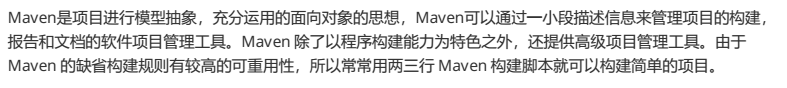

## 1.2 Maven的作用

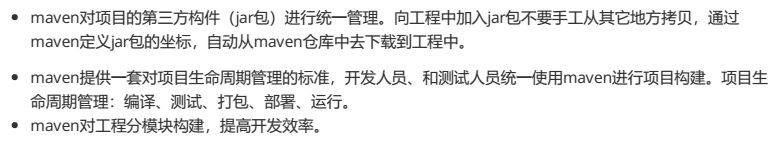

## 1.3 Maven的概念模型

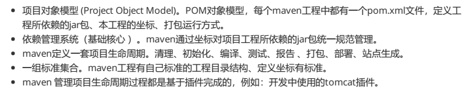

jar		java rar		java工程的压缩包

war		web rar		web工程的压缩包

## 1.4 Maven的仓库

### 1.4.1 分类

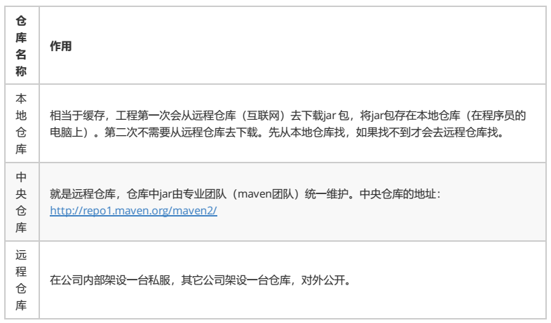

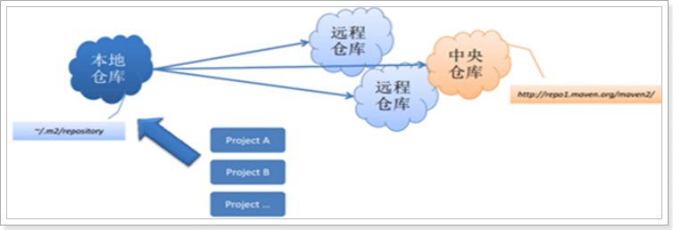

### 1.4.2 仓库中存放的内容

- Maven自身运行所需要的插件
- 第三方框架(spring/mybatis/springmvc)和工具类的jar包
- 我们自己开发的maven项目安装后的jar包

## 1.5 maven的坐标

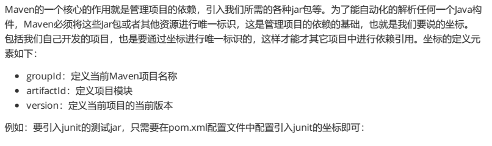

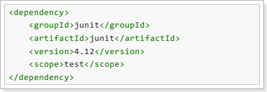

 

# 2 maven的安装(软件)

## 2.1 下载maven

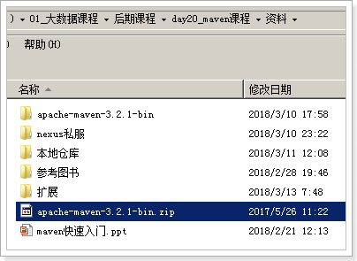 

## 2.2 安装maven

将maven压缩包解压, 复制到**没有中文没有空格的目录下**,即安装完毕

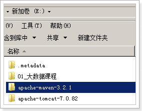 

## 2.3 maven的目录介绍

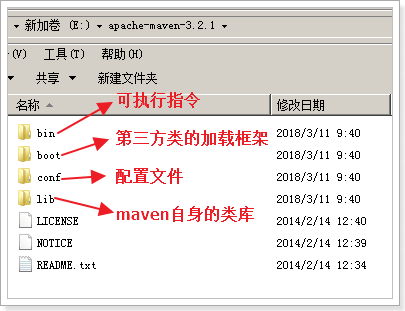 

## 2.4 配置环境变量

```
MAVEN_HOME=E:\apache-maven-3.2.1
Path=%MAVEN_HOME%\bin;... ...
```

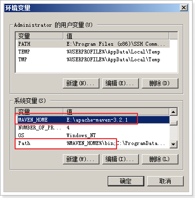 

## 2.5 配置本地仓库

```
1、找到Maven解压目录\conf\settings.xml 
2、在setting.xml 文件中找到 localRepository 标签 
3、将 <localRepository>/path/to/local/repo</localRepository>从注释中取出 
4、将标签体内容修改为自定义的Maven仓库目录
```


### 2.5.1 将/资料/本地仓库/xxx.zip 解压 

复制 E盘根目录下

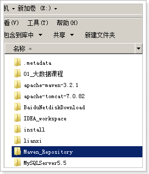 

### 2.5.2 配置本地仓库

在maven的安装目录中 apache-maven-3.2.1/conf/settings.xml 配置本地仓库:

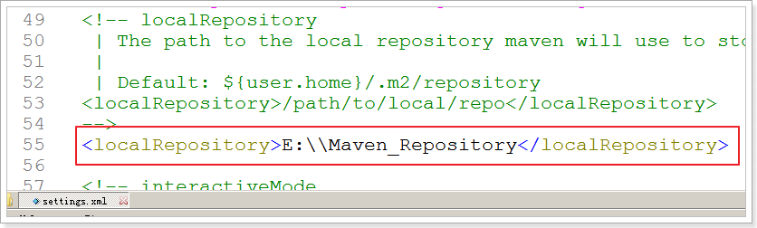

```xml
<settings xmlns="http://maven.apache.org/SETTINGS/1.0.0" 
          xmlns:xsi="http://www.w3.org/2001/XMLSchema-instance" 
          xsi:schemaLocation="http://maven.apache.org/SETTINGS/1.0.0 http://maven.apache.org/xsd/settings-1.0.0.xsd">
  <localRepository>E:\\Maven_Repository</localRepository>
```

### 2.5.3 配置阿里云远程仓库 (扩展)

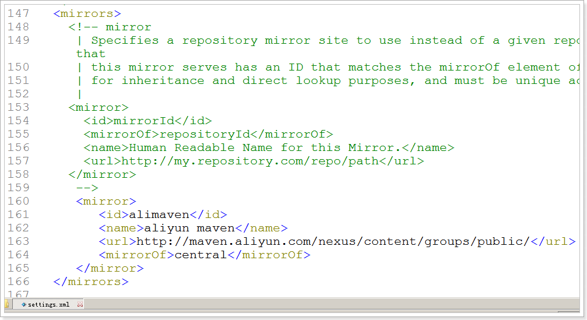

```xml
	 <mirror>
		<id>alimaven</id>
		<name>aliyun maven</name>
		<url>http://maven.aliyun.com/nexus/content/groups/public/</url>
		<mirrorOf>central</mirrorOf>        
	 </mirror>
```

## 2.6 测试maven安装成功

打开cmd本地控制台, 输入 mvn -version

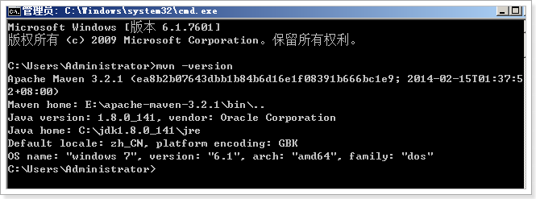 

# 3 IDEA整合本地Maven

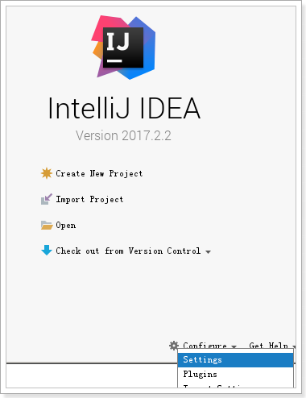 

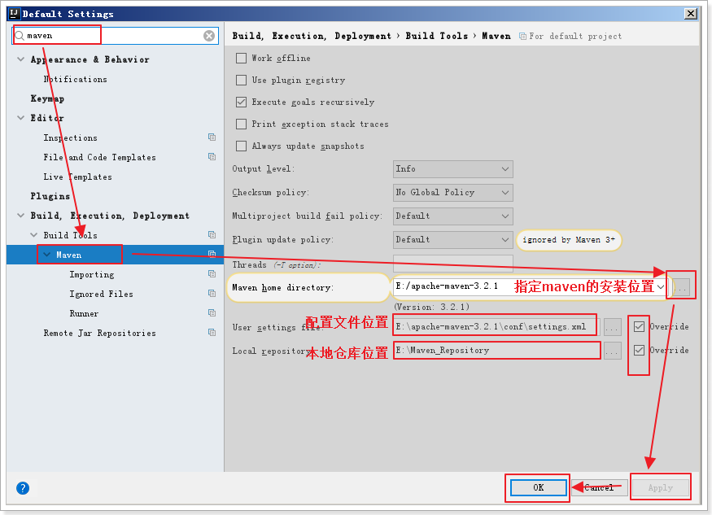 

# 4 idea创建maven工程(重点重点重点)

## 4.0 创建空的工程

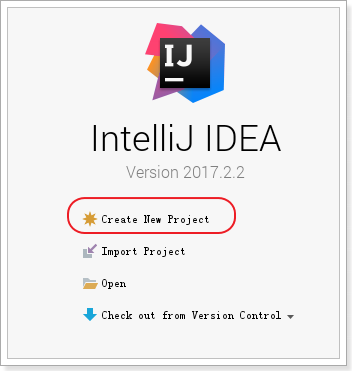 

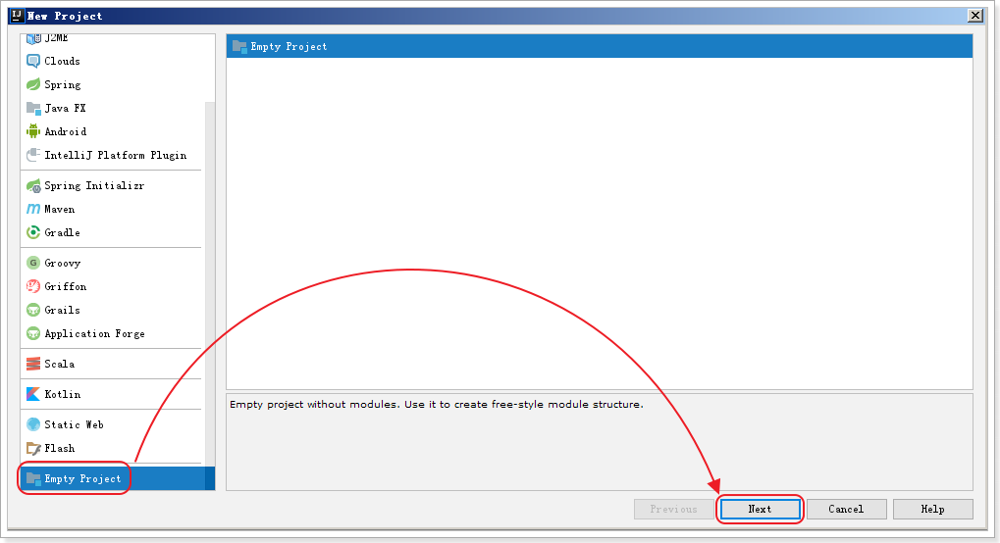 

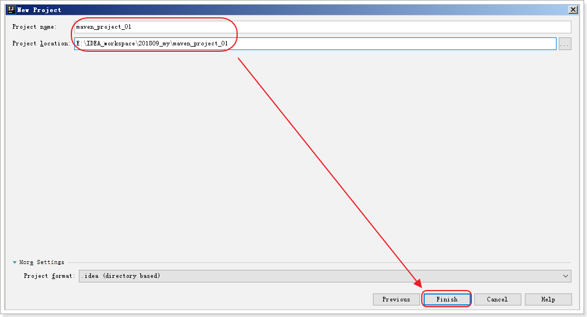 

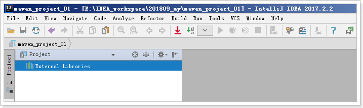 

## 4.1 创建跳过骨架的java项目(重点重点重点)

### 4.1.1 how

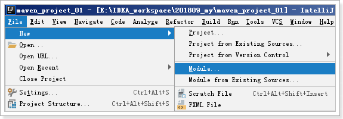 

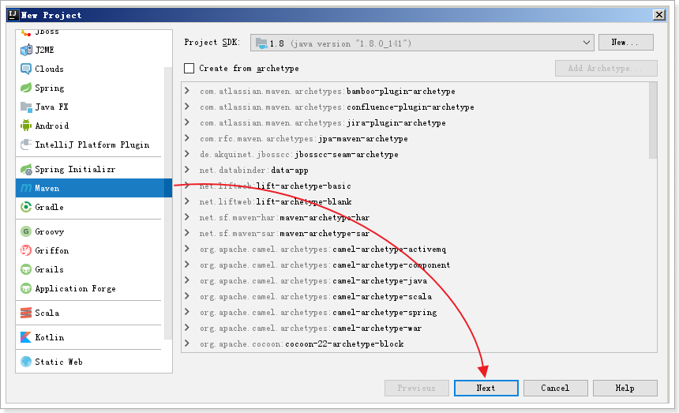

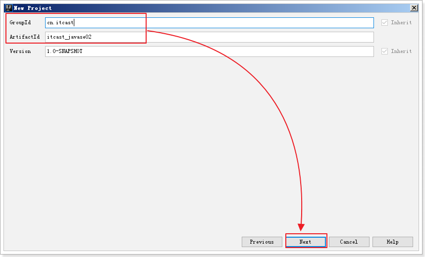

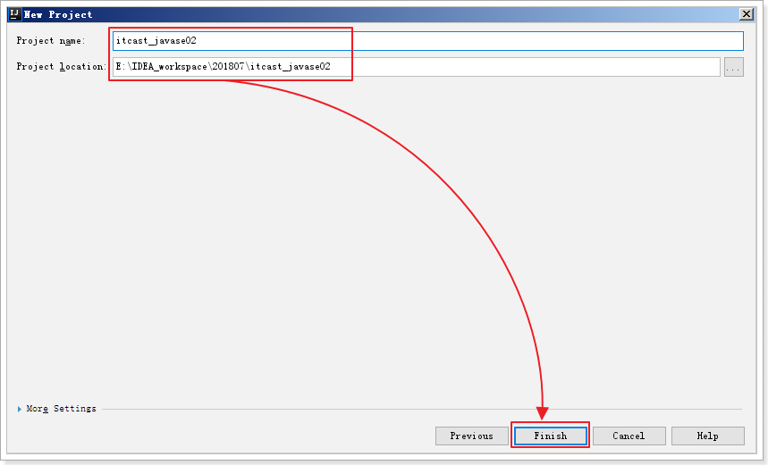

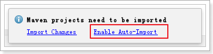 

标准的java项目骨架:

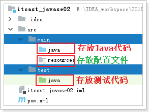 

### 4.1.2 创建java代码

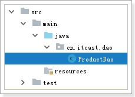 

```java
package cn.itcast.dao;

public class ProductDao {

    public void add() {
        System.out.println("--------------------1 ProductDao.add()... ...");
    }

    public void del() {
        System.out.println("--------------------2 ProductDao.del()... ...");
    }

    public void edit() {
        System.out.println("--------------------3 ProductDao.edit().... ...");
    }

    public void query() {
        System.out.println("--------------------4 ProductDao.query()... ...");
    }
}
```

### 4.1.3 生成测试代码

正式上线前, 每个方法都必须经过测试, 目前我们能够想到的就是main方法. 

因为一个类只有一个main方法, 一个类可能有上千个方法, 那得需要多少个方法, 所以 迫切需要更高效方法, junit测试登场了.

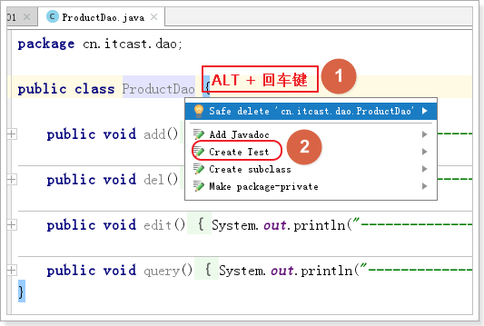 

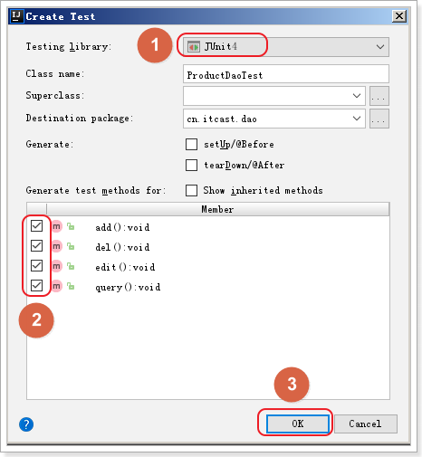 

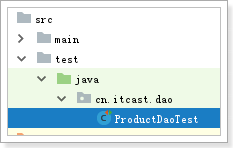 

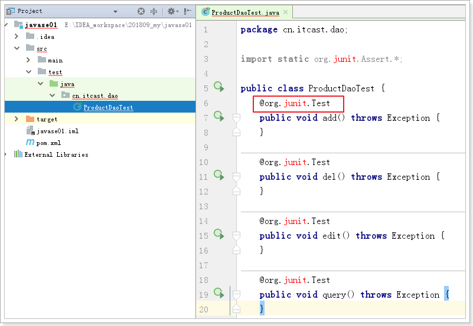 

为什么junit报红? 因为缺少junit包, 导入缺少的junit包即可.

### 4.1.4 导入依赖

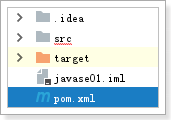 

```xml
<?xml version="1.0" encoding="UTF-8"?>
<project xmlns="http://maven.apache.org/POM/4.0.0"
         xmlns:xsi="http://www.w3.org/2001/XMLSchema-instance"
         xsi:schemaLocation="http://maven.apache.org/POM/4.0.0 http://maven.apache.org/xsd/maven-4.0.0.xsd">
    <modelVersion>4.0.0</modelVersion>

    <groupId>cn.itcast.maven</groupId>
    <artifactId>javase01</artifactId>
    <version>1.0-SNAPSHOT</version>
    <packaging>jar</packaging>

    <dependencies>
        <!--导入junit包-->
        <dependency>
            <groupId>junit</groupId>
            <artifactId>junit</artifactId>
            <version>4.12</version>
        </dependency>
    </dependencies>
</project>
```

报红解决:

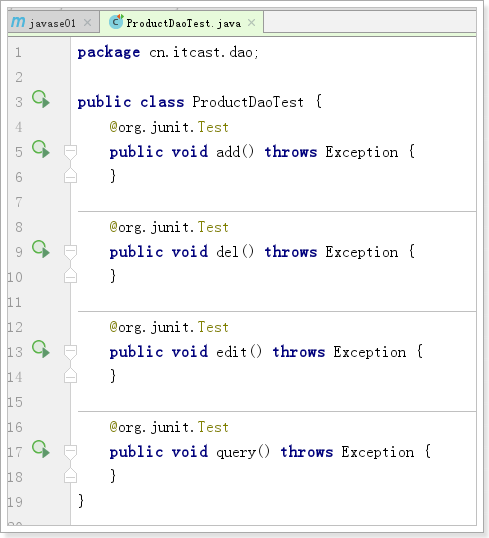 

### 4.1.5 一个一个测试

完成测试代码:

```java
package cn.itcast.dao;

public class ProductDaoTest {
    @org.junit.Test
    public void add() throws Exception {
        ProductDao productDao = new ProductDao();
        productDao.add();
    }

    @org.junit.Test
    public void del() throws Exception {
        ProductDao productDao = new ProductDao();
        productDao.del();
    }

    @org.junit.Test
    public void edit() throws Exception {
        ProductDao productDao = new ProductDao();
        productDao.edit();
    }

    @org.junit.Test
    public void query() throws Exception {
        ProductDao productDao = new ProductDao();
        productDao.query();
    }
}
```

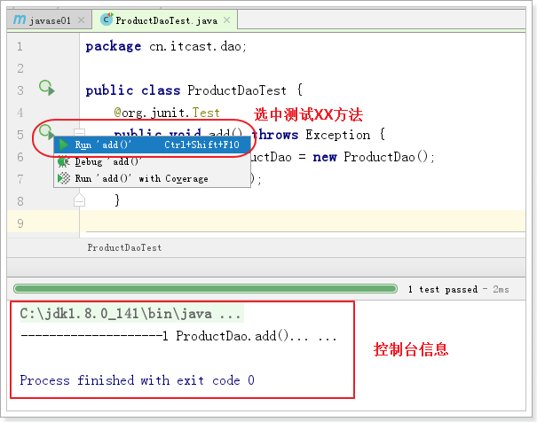  

### 4.1.6 测试所有

一个一个测试,太累了, 给大家介绍一个简单的.

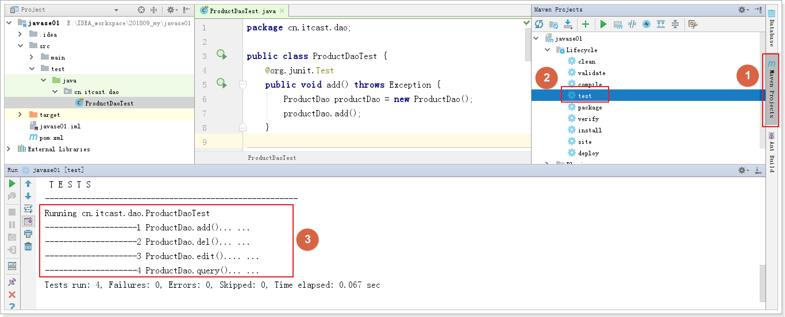  

## 4.2 创建有骨架 java工程(了解)

### 4.2.1 how?

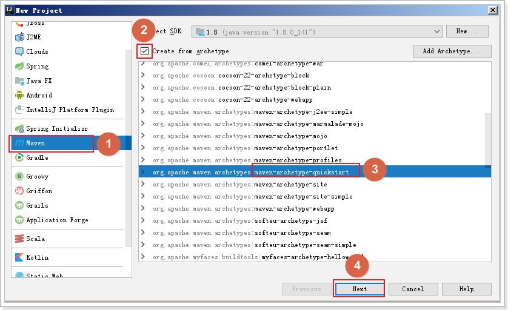

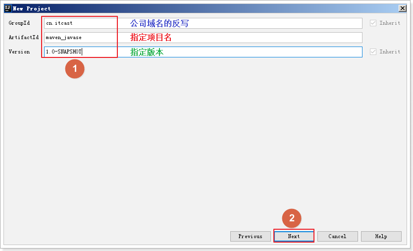

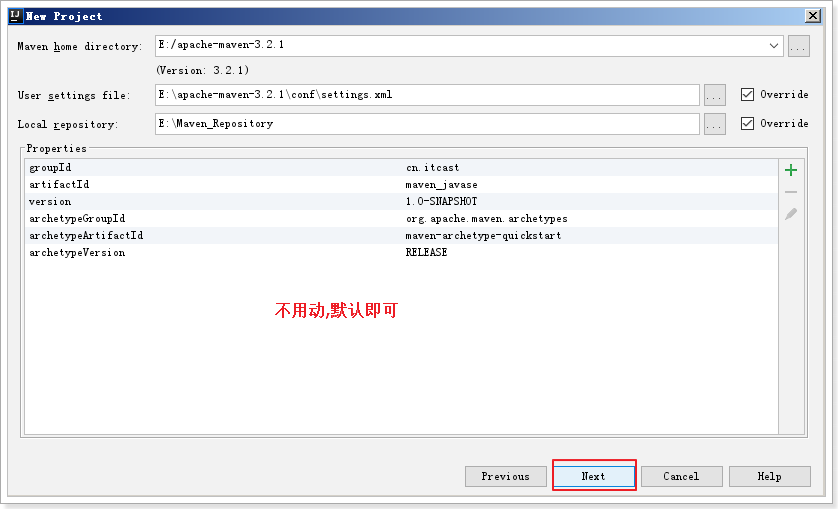

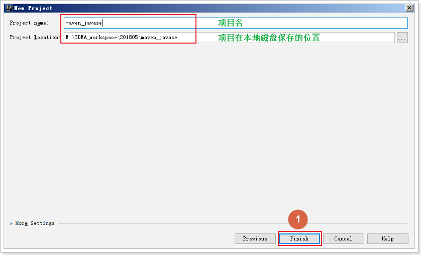

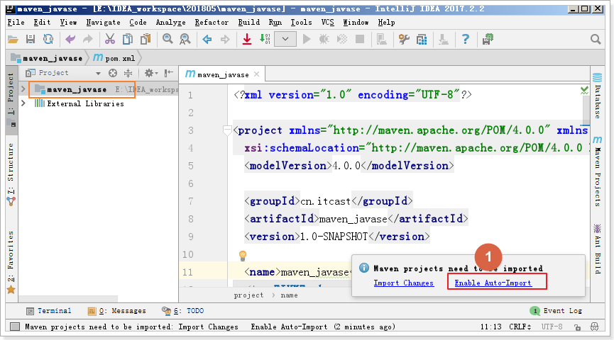

### 4.2.2 java工程目录结构

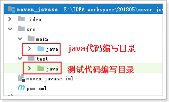 

### 4.2.3 编写 Hello World!

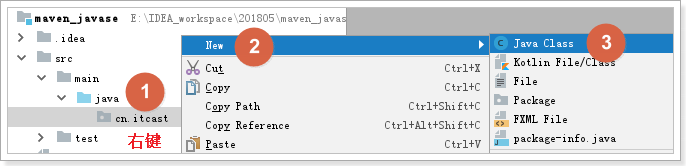 

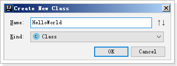 

```java
package cn.itcast;

public class HelloWorld {
    public static void main(String[] args) {
        System.out.println("Hello World!");
    }
}
```

总结: 因为创建有骨架的java工程会产生很多多余的配置, 所以实际开发中一般不用.

## 4.3 创建有骨架的web工程(了解)

### 4.3.1 how?

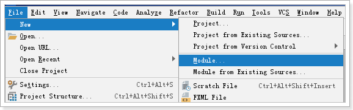 

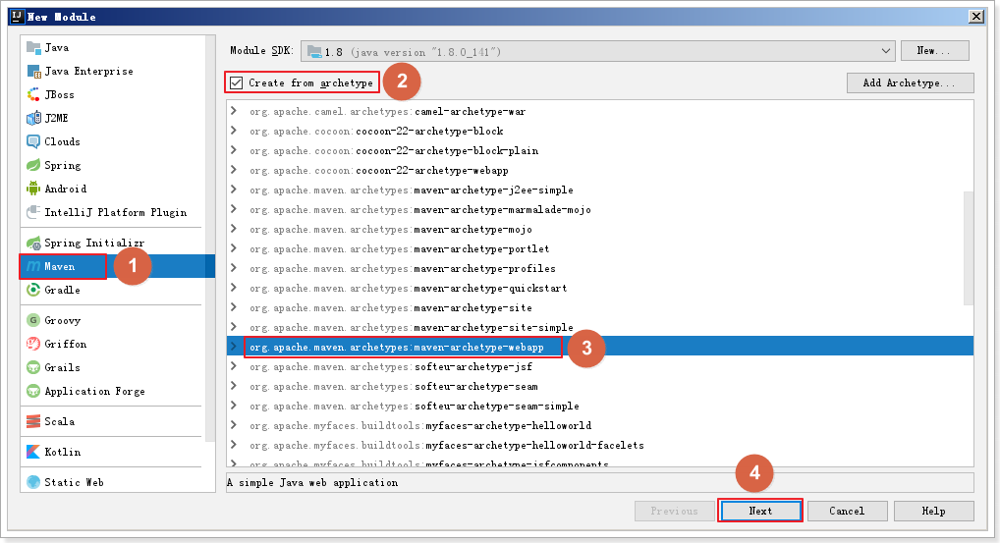 

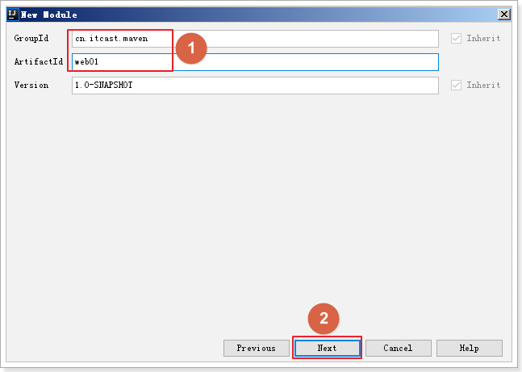 

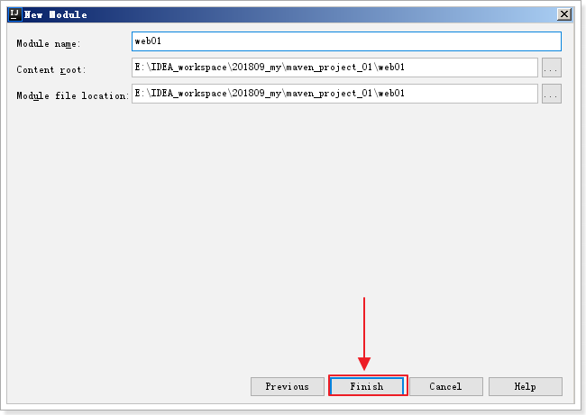 

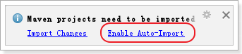 

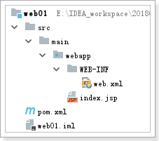 

### 4.3.2 标准web工程目录结构

 

经过对比发现如下问题:

### 4.3.3 缺少java目录

 

 

 

更改java目录属性

 

 

### 4.3.4 缺少resources目录

 

 

 

 

### 4.3.5 缺少test.java目录

#### 4.3.5.1 新建test目录

 

 

 

#### 4.3.5.2 新建test.java目录

 

 

 

 

```
总结: 使用骨架创建的web项目 在开发时不常用!
	理由1: 在pom.xml增加不必要的配置
	理由2: 完整的web工程缺的东西太多!
```

## 4.4 创建跳过骨架的web工程(重点重点重点)

### 4.4.1 how?

 

 

 

复制webapp目录到项目2中

修改pom.xml 增加打包方式为war包

 

### 4.4.2 配置tomcat插件

因为 web项目最终跑在web服务器中, 所以需要配置 web服务器(tomcat只是其中一个)

pom.xml

```xml
<?xml version="1.0" encoding="UTF-8"?>
<project xmlns="http://maven.apache.org/POM/4.0.0"
         xmlns:xsi="http://www.w3.org/2001/XMLSchema-instance"
         xsi:schemaLocation="http://maven.apache.org/POM/4.0.0 http://maven.apache.org/xsd/maven-4.0.0.xsd">
    <modelVersion>4.0.0</modelVersion>

    <groupId>cn.itcast.maven</groupId>
    <artifactId>web02</artifactId>
    <version>1.0-SNAPSHOT</version>
    <!--
        java工程: jar 含义是 java rar
        web工程: war 含义是 web rar
    -->
    <packaging>war</packaging>
    <!--配置插件-->
    <build>
        <plugins>
            <!-- 配置Tomcat插件 -->
            <plugin>
                <groupId>org.apache.tomcat.maven</groupId>
                <artifactId>tomcat7-maven-plugin</artifactId>
                <version>2.2</version>
                <configuration>
                    <!--配置端口号-->
                    <port>80</port>
                    <!--配置项目路径-->
                    <path>/web02</path>
                </configuration>
            </plugin>
        </plugins>
    </build>
</project>
```

#### 4.4.2.1 启动tomcat

 

 

测试:

 

#### 4.4.2.2 简化启动tomcat

 

 

 

 

### 4.4.3 创建servlet

 

 

 

在web.xml中注册和映射浏览器访问servlet的路径:

 

### 4.4.3.1 servlet因为缺少servlet.jar包报错

 

解决: 在pom.xml增加servlet依赖

 

经过观察,servlet不再报错

 

#### 4.4.3.2 一启动Tomcat 访问就报错

 


原因:

​	因为我们导入的jar包和tomcat服务器携带的jar包冲突了, 所以才会报错.

解决:

​	设置自定义导入jar包的范围, 只在编译和测试有效. 这样就不会在运行时 导致jar运行冲突了.

how?​	 

测试:

 

 

# 4 maven的常用指令


## 4.1 clean命令


## 4.2 compile命令


## 4.3 test命令

测试命令: 执行 src/test/java 下junit的测试用例

* **在src/test/java下创建测试类DemoTest**


控制台测试结果如下:


## 4.4 package命令

mvn package, 打包项目


打包后的项目会在target目录下找到


## 4.5 install命令

mvn install, 打包后将其安装在本地仓库


安装完毕后,可以在本地仓库中找到 对应的项目


# 5 依赖管理

## 5.1 maven插件


### 5.1.1 jdk编译版本的插件

pom.xml

```xml
<?xml version="1.0" encoding="UTF-8"?>
<project xmlns="http://maven.apache.org/POM/4.0.0"
         xmlns:xsi="http://www.w3.org/2001/XMLSchema-instance"
         xsi:schemaLocation="http://maven.apache.org/POM/4.0.0 http://maven.apache.org/xsd/maven-4.0.0.xsd">
    <modelVersion>4.0.0</modelVersion>

    <groupId>cn.itcast</groupId>
    <artifactId>maven_javaweb02</artifactId>
    <version>1.0-SNAPSHOT</version>

    <build>
        <plugins>
            <!-- java编译插件 -->
            <plugin>
                <groupId>org.apache.maven.plugins</groupId>
                <artifactId>maven-compiler-plugin</artifactId>
                <version>3.2</version>
                <configuration>
                    <source>1.8</source>
                    <target>1.8</target>
                    <encoding>UTF-8</encoding>
                </configuration>
            </plugin>
        </plugins>
    </build>

</project>

```

 


### 5.1.2 tomcat7服务端的插件

* **配置tomcat插件**

```xml
<!-- 配置Tomcat插件 -->
<plugin>
	<groupId>org.apache.tomcat.maven</groupId>
	<artifactId>tomcat7-maven-plugin</artifactId>
	<version>2.2</version>
	<configuration>
	    <path>/aaa</path>
	    <port>8888</port>
	</configuration>
</plugin>
```

* **运行tomcat插件**

 

* **tomcat 插件注意问题**

  Maven的中央仓库中只有tomcat7.X版本

  如果想使用tomcat8.X版本, 

     	1. 需要从第三方仓库查找
     	2. 或者使用idea集成外部的tomcat插件

## 5.2 导入依赖

### 5.2.1 导入junit依赖

* **导入junit坐标**

```xml
<dependencies>
    <dependency>
        <groupId>junit</groupId>
        <artifactId>junit</artifactId>
        <version>4.12</version>
    </dependency>
</dependencies>
```

 

* **进行单元测试**

```java
import org.junit.Test;

public class DemoTest {
    @Test
    public void demo1() {
        System.out.println("敢于亮剑,绝不后退!");
    }
}

```


### 5.2.2 导入servlet的依赖

* **创建servlet, 但是发现报错,原因是没有导入servlet的坐标依赖**


* **导入servlet的坐标依赖**

```xml
<dependency>
    <groupId>javax.servlet</groupId>
    <artifactId>servlet-api</artifactId>
    <version>2.5</version>
</dependency>
```

* **原有的servlet报错恢复正常**


## 5.3 依赖范围


# 6 maven案例: 完成用户列表显示功能

## 6.0 需求分析


## 6.1 准备数据

```sql
create database day20_db;

use day20_db;

create table user(
	id int primary key auto_increment,
	name varchar(50),
	age int
);

insert into user(id, name, age) values(null, '张三', 13);
insert into user(id, name, age) values(null, '李四', 14);
insert into user(id, name, age) values(null, '王五', 15);
```


## 6.2 创建跳过骨架的web项目


复制webapp目录到src/main目录

 


## 6.3 准备工作

### 6.3.1 导入所需的api和jar包

* mysql驱动
* c3p0连接池
* DbUtils框架
* Servlet
* jstl
* jsp-api
* tomcat插件
* 1.8 jdk插件

### 6.3.2 maven坐标

```xml
<?xml version="1.0" encoding="UTF-8"?>
<project xmlns="http://maven.apache.org/POM/4.0.0"
         xmlns:xsi="http://www.w3.org/2001/XMLSchema-instance"
         xsi:schemaLocation="http://maven.apache.org/POM/4.0.0 http://maven.apache.org/xsd/maven-4.0.0.xsd">
    <modelVersion>4.0.0</modelVersion>

    <groupId>cn.itcast</groupId>
    <artifactId>maven_web03</artifactId>
    <version>1.0-SNAPSHOT</version>
    <!--表名当前是web项目-->
    <packaging>war</packaging>

    <dependencies>
        <!--jsp-->
        <dependency>
            <groupId>javax.servlet</groupId>
            <artifactId>servlet-api</artifactId>
            <version>2.5</version>
            <scope>provided</scope>
        </dependency>
        <dependency>
            <groupId>javax.servlet</groupId>
            <artifactId>jsp-api</artifactId>
            <version>2.0</version>
            <scope>provided</scope>
        </dependency>
        <dependency>
            <groupId>jstl</groupId>
            <artifactId>jstl</artifactId>
            <version>1.2</version>
        </dependency>
        <!-- msyql , c3p0, dbutils-->
        <dependency>
            <groupId>mysql</groupId>
            <artifactId>mysql-connector-java</artifactId>
            <version>5.1.32</version>
        </dependency>
        <dependency>
            <groupId>c3p0</groupId>
            <artifactId>c3p0</artifactId>
            <version>0.9.1.2</version>
        </dependency>
        <dependency>
            <groupId>commons-dbutils</groupId>
            <artifactId>commons-dbutils</artifactId>
            <version>1.6</version>
        </dependency>
    </dependencies>
    <!--引入tomcat插件-->
    <build>
        <plugins>
            <!-- java编译插件 -->
            <plugin>
                <groupId>org.apache.maven.plugins</groupId>
                <artifactId>maven-compiler-plugin</artifactId>
                <version>3.2</version>
                <configuration>
                    <source>1.8</source>
                    <target>1.8</target>
                    <encoding>UTF-8</encoding>
                </configuration>
            </plugin>
            <!--tomcat-->
            <plugin>
                <groupId>org.apache.tomcat.maven</groupId>
                <artifactId>tomcat7-maven-plugin</artifactId>
                <version>2.2</version>
                <configuration>
                    <path>/web03</path>
                    <port>8888</port>
                </configuration>
            </plugin>
        </plugins>
    </build>


</project>
```

### 6.3.3 搭建包结构

 

 

 

 

### 6.3.4 复制和创建需要的文件

 

## 6.4 how

### 6.4.1 入口页面 index.jsp

```jsp
<%@ page contentType="text/html;charset=UTF-8" language="java" isELIgnored="false" %>
<html>
<body>
<h2>Hello World!</h2>
${pageContext.request.contextPath}
<h3><a href="${pageContext.request.contextPath}/UserFindListServlet">跳转到 用户列表页面</a></h3>
</body>
</html>
```

### 6.4.2 web层

 

```java
package cn.itcast.web;

import cn.itcast.domain.User;
import cn.itcast.service.UserService;
import cn.itcast.service.impl.UserServiceImpl;

import java.io.IOException;
import java.util.List;

public class UserFindListServlet extends javax.servlet.http.HttpServlet {
    protected void doPost(javax.servlet.http.HttpServletRequest request, javax.servlet.http.HttpServletResponse response) throws javax.servlet.ServletException, IOException {
        // 1 调用业务层 查询用户集合
        UserService userService = new UserServiceImpl();
        List<User> userList = userService.findList();

        // 2 将用户集合转发给用户列表页
        request.setAttribute("userList", userList);
        request.getRequestDispatcher("/user_list.jsp").forward(request, response);
    }

    protected void doGet(javax.servlet.http.HttpServletRequest request, javax.servlet.http.HttpServletResponse response) throws javax.servlet.ServletException, IOException {
        doPost(request, response);
    }
}
```

web.xml

```xml
<!DOCTYPE web-app PUBLIC
 "-//Sun Microsystems, Inc.//DTD Web Application 2.3//EN"
 "http://java.sun.com/dtd/web-app_2_3.dtd" >

<web-app>
  <display-name>Archetype Created Web Application</display-name>
    <servlet>
        <servlet-name>UserFindListServlet</servlet-name>
        <servlet-class>cn.itcast.web.UserFindListServlet</servlet-class>
    </servlet>
    <servlet-mapping>
        <servlet-name>UserFindListServlet</servlet-name>
        <url-pattern>/UserFindListServlet</url-pattern>
    </servlet-mapping>
</web-app>
```

### 6.4.3 业务层

 

```java
package cn.itcast.service;

import cn.itcast.domain.User;

import java.util.List;

public interface UserService {
    public List<User> findList();
}
```


```java
package cn.itcast.service.impl;

import cn.itcast.dao.UserDao;
import cn.itcast.dao.impl.UserDaoImpl;
import cn.itcast.domain.User;
import cn.itcast.service.UserService;

import java.sql.SQLException;
import java.util.List;

public class UserServiceImpl implements UserService {
    public List<User> findList() {
        // 调用dao 查询用户集合
        UserDao userDao  = new UserDaoImpl();
        List<User> userList = null;
        try {
            userList = userDao.findUserList();
        } catch (SQLException e) {
            e.printStackTrace();
        }
        return userList;
    }
}
```

### 6.4.4 数据层

 

```java
package cn.itcast.dao;

import cn.itcast.domain.User;

import java.sql.SQLException;
import java.util.List;

public interface UserDao {
    public List<User> findUserList() throws SQLException;
}
```

```java
package cn.itcast.dao.impl;

import cn.itcast.dao.UserDao;
import cn.itcast.domain.User;
import cn.itcast.utils.JDBCUtils;
import org.apache.commons.dbutils.QueryRunner;
import org.apache.commons.dbutils.handlers.BeanListHandler;

import java.sql.SQLException;
import java.util.List;

public class UserDaoImpl implements UserDao {
    public List<User> findUserList() throws SQLException {
        QueryRunner queryRunner = new QueryRunner(JDBCUtils.getDataSource());
        String sql = "select * from user";
        List<User> userList = queryRunner.query(sql, new BeanListHandler<User>(User.class));
        return userList;
    }
}
```

### 6.4.5 列表显示页面 user_list.jsp

 

```jsp
<%@ taglib prefix="c" uri="http://java.sun.com/jsp/jstl/core" %>
<%@ page contentType="text/html;charset=UTF-8" language="java" isELIgnored="false" %>
<html>
<head>
    <title>Title</title>
</head>
<body>
        <table border="1px" cellspacing="0px" cellpadding="10px" width="50%" align="center">
            <tr>
                <td>序号</td>
                <td>姓名</td>
                <td>年龄</td>
            </tr>
            <c:forEach items="${userList}" var="user" varStatus="vs">
                <tr>
                    <td>${vs.count}</td>
                    <td>${user.name}</td>
                    <td>${user.age}</td>
                </tr>
            </c:forEach>
        </table>
</body>
</html>
```

idea的常用快捷键

```
ctrl + y		删除当前行
ctrl + d		复制当前行
ctrl + alt + L		格式化代码
alt + shift + 向下箭头	将行向下移动
alt + shift + 向上箭头	将行向上移动
Ctrl+Shift+Enter	将输入的if、for、函数等等补上{}或者;使代码语句完整
shift + 回车		在当前行下方插入新行
ctrl + alt + 回车	在当前行上方插入新行
shift + f6		重命名
ctrl + o		添加未实现的方法
ctrl + alt + shift + c	拷贝类的全路径
ctrl + alt + v		起变量名
alt + 回车		处理异常
ctrl + alt + m		提取方法
ctrl + shift + u	大小写切换
ctrl + n		搜索类
ctrl + shift + n	搜索文件

	itar		循环遍历数组
	itli		循环遍历集合
	iten		遍历枚举
	iter		增强for循环

ctrl + alt + b		实现方法
ctrl + h		查看继承和实现关系
ctrl + r		替换
ctrl + shift + f	根据关键字查询
ctrl + h		查看当前类的实现类

debug调试
	F7	下一步,会到方法内部
	F8	下一步,不会到方法内部
	F9	调到下一个断点


```


# 7 常见问题汇总

	1 tomcat插件重复启动：导致端口占用
	2 index.html放到WEB-INF下面，导致访问不到这个html页面
	3 名称不叫index.html，结果直接输入localhost:8080，访问不到这个页面
	4 关联了jre，需要使用JDK
	5 需要使用我给的仓库


