# 1 分析

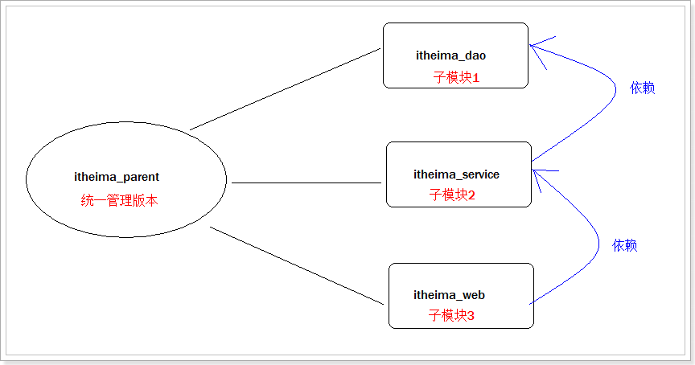 

# 2 创建空的工程作为保存项目的空间

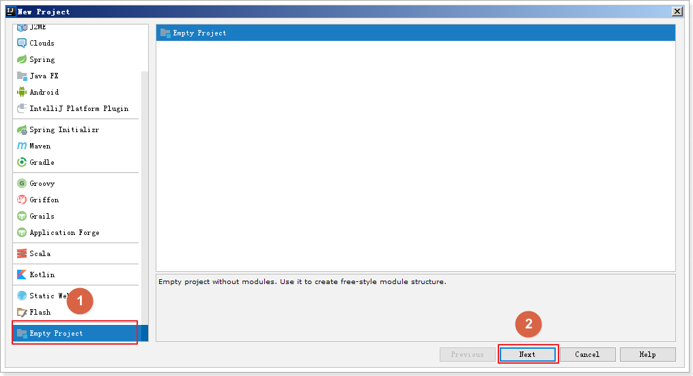 

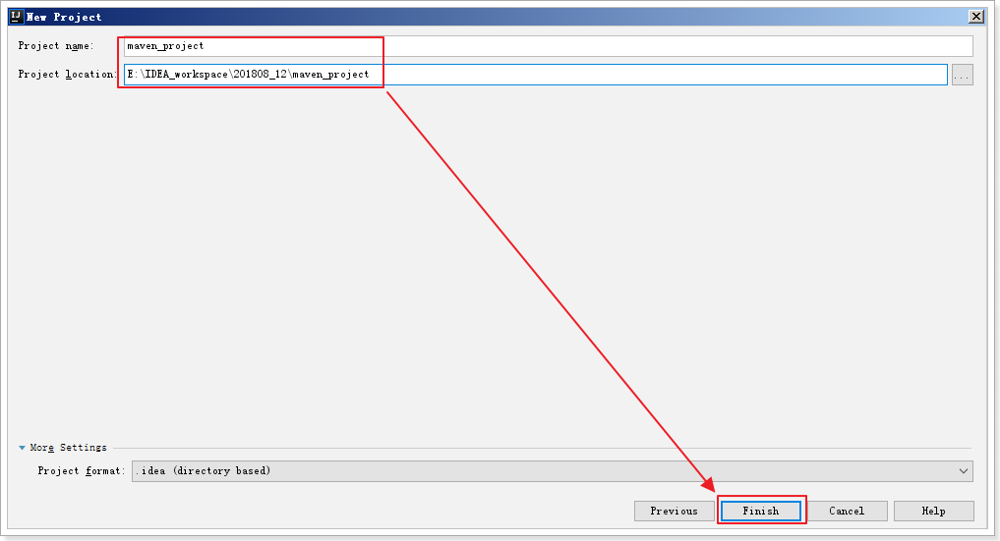 

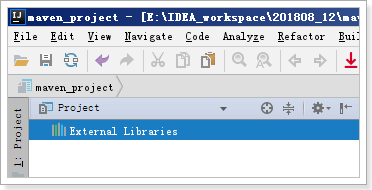 

# 3 父工程

File -> New -> Module ...

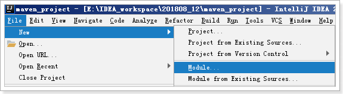 

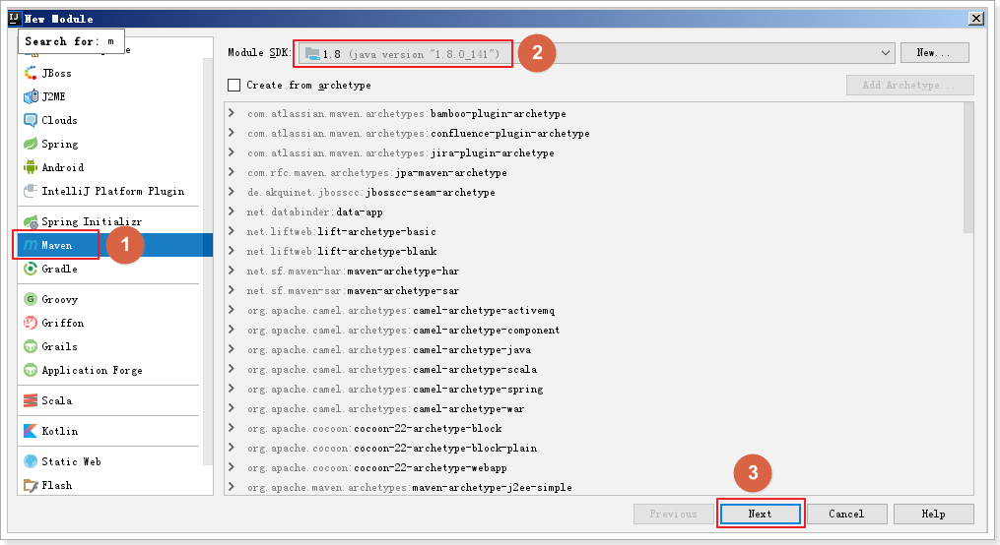 

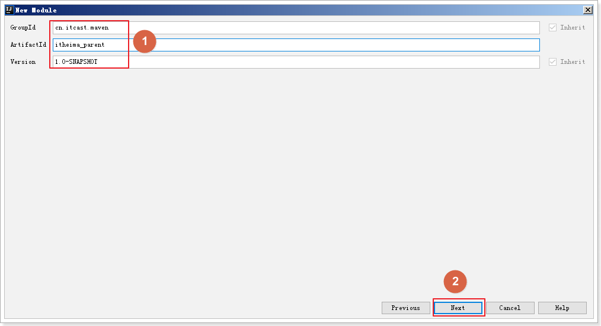 

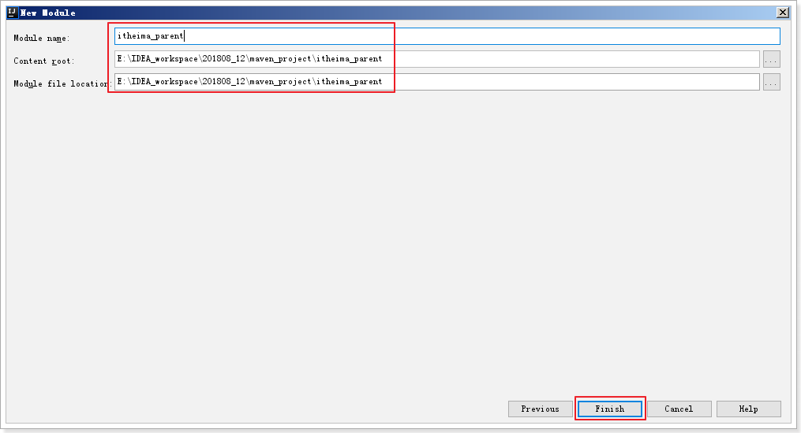 

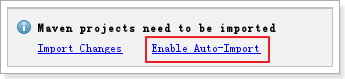 

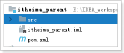 

## 3.1 删除src目录

因为这个项目的唯一作用是用来管理版本的, 所以删掉没有用的src目录

删除完成,如下图

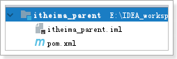 

## 3.2 修改pom.xml管理版本 

```xml
<?xml version="1.0" encoding="UTF-8"?>
<project xmlns="http://maven.apache.org/POM/4.0.0"
         xmlns:xsi="http://www.w3.org/2001/XMLSchema-instance"
         xsi:schemaLocation="http://maven.apache.org/POM/4.0.0 http://maven.apache.org/xsd/maven-4.0.0.xsd">
    <modelVersion>4.0.0</modelVersion>

    <groupId>cn.itcast.maven</groupId>
    <artifactId>itheima_parent</artifactId>
    <version>1.0-SNAPSHOT</version>

    <!--pom表示这是一个被继承的模块-->
    <packaging>pom</packaging>

    <!-- 集中定义依赖版本号 -->
    <properties>
        <junit.version>4.10</junit.version>
        <spring.version>4.1.3.RELEASE</spring.version>
        <mybatis.version>3.2.8</mybatis.version>
        <mybatis.spring.version>1.2.2</mybatis.spring.version>
        <mybatis.paginator.version>1.2.15</mybatis.paginator.version>
        <mysql.version>5.1.32</mysql.version>
        <slf4j.version>1.6.4</slf4j.version>
        <jackson.version>2.4.2</jackson.version>
        <druid.version>1.0.9</druid.version>
        <httpclient.version>4.3.5</httpclient.version>
        <jstl.version>1.2</jstl.version>
        <servlet-api.version>2.5</servlet-api.version>
        <jsp-api.version>2.0</jsp-api.version>
        <joda-time.version>2.5</joda-time.version>
        <commons-lang3.version>3.3.2</commons-lang3.version>
        <commons-io.version>1.3.2</commons-io.version>
    </properties>

    <dependencyManagement>
        <dependencies>
            <!-- 单元测试 -->
            <dependency>
                <groupId>junit</groupId>
                <artifactId>junit</artifactId>
                <version>${junit.version}</version>
            </dependency>

            <!-- Spring -->
            <dependency>
                <groupId>org.springframework</groupId>
                <artifactId>spring-context</artifactId>
                <version>${spring.version}</version>
            </dependency>
            <dependency>
                <groupId>org.springframework</groupId>
                <artifactId>spring-beans</artifactId>
                <version>${spring.version}</version>
            </dependency>
            <dependency>
                <groupId>org.springframework</groupId>
                <artifactId>spring-webmvc</artifactId>
                <version>${spring.version}</version>
            </dependency>
            <dependency>
                <groupId>org.springframework</groupId>
                <artifactId>spring-jdbc</artifactId>
                <version>${spring.version}</version>
            </dependency>
            <dependency>
                <groupId>org.springframework</groupId>
                <artifactId>spring-aspects</artifactId>
                <version>${spring.version}</version>
            </dependency>
            <dependency>
                <groupId>org.springframework</groupId>
                <artifactId>spring-test</artifactId>
                <version>${spring.version}</version>
            </dependency>

            <!-- Mybatis -->
            <dependency>
                <groupId>org.mybatis</groupId>
                <artifactId>mybatis</artifactId>
                <version>${mybatis.version}</version>
            </dependency>
            <dependency>
                <groupId>org.mybatis</groupId>
                <artifactId>mybatis-spring</artifactId>
                <version>${mybatis.spring.version}</version>
            </dependency>

            <dependency>
                <groupId>com.github.pagehelper</groupId>
                <artifactId>pagehelper</artifactId>
                <version>3.7.5</version>
            </dependency>
            <dependency>
                <groupId>com.github.jsqlparser</groupId>
                <artifactId>jsqlparser</artifactId>
                <version>0.9.1</version>
            </dependency>

            <dependency>
                <groupId>com.github.abel533</groupId>
                <artifactId>mapper</artifactId>
                <version>2.3.4</version>
            </dependency>

            <!-- MySql -->
            <dependency>
                <groupId>mysql</groupId>
                <artifactId>mysql-connector-java</artifactId>
                <version>${mysql.version}</version>
            </dependency>

            <dependency>
                <groupId>org.slf4j</groupId>
                <artifactId>slf4j-log4j12</artifactId>
                <version>${slf4j.version}</version>
            </dependency>

            <!-- Jackson Json处理工具包 -->
            <dependency>
                <groupId>com.fasterxml.jackson.core</groupId>
                <artifactId>jackson-databind</artifactId>
                <version>${jackson.version}</version>
            </dependency>

            <!-- 连接池 -->
            <dependency>
                <groupId>com.jolbox</groupId>
                <artifactId>bonecp-spring</artifactId>
                <version>0.8.0.RELEASE</version>
            </dependency>
            <!-- https://mvnrepository.com/artifact/com.alibaba/druid -->
            <dependency>
                <groupId>com.alibaba</groupId>
                <artifactId>druid</artifactId>
                <version>1.1.10</version>
            </dependency>
            <!--C3P0连接池-->
            <dependency>
                <groupId>c3p0</groupId>
                <artifactId>c3p0</artifactId>
                <version>0.9.1.2</version>
            </dependency>

            <!--Dbutils 简化JDBC-->
            <dependency>
                <groupId>junit</groupId>
                <artifactId>junit</artifactId>
                <version>4.12</version>
            </dependency>
            <!--mysql-->
            <dependency>
                <groupId>mysql</groupId>
                <artifactId>mysql-connector-java</artifactId>
                <version>5.0.8</version>
            </dependency>
            <!--c3p0-->
            <dependency>
                <groupId>c3p0</groupId>
                <artifactId>c3p0</artifactId>
                <version>0.9.1.2</version>
            </dependency>
            <!--dbutils-->
            <dependency>
                <groupId>commons-dbutils</groupId>
                <artifactId>commons-dbutils</artifactId>
                <version>1.6</version>
            </dependency>
            <!-- httpclient -->
            <dependency>
                <groupId>org.apache.httpcomponents</groupId>
                <artifactId>httpclient</artifactId>
                <version>${httpclient.version}</version>
            </dependency>

            <!-- JSP相关 -->
            <dependency>
                <groupId>jstl</groupId>
                <artifactId>jstl</artifactId>
                <version>${jstl.version}</version>
            </dependency>
            <dependency>
                <groupId>javax.servlet</groupId>
                <artifactId>servlet-api</artifactId>
                <version>${servlet-api.version}</version>
                <scope>provided</scope>
            </dependency>
            <dependency>
                <groupId>javax.servlet</groupId>
                <artifactId>jsp-api</artifactId>
                <version>${jsp-api.version}</version>
                <scope>provided</scope>
            </dependency>

            <!-- 时间操作组件 -->
            <dependency>
                <groupId>joda-time</groupId>
                <artifactId>joda-time</artifactId>
                <version>${joda-time.version}</version>
            </dependency>

            <!-- Apache工具组件 -->
            <dependency>
                <groupId>org.apache.commons</groupId>
                <artifactId>commons-lang3</artifactId>
                <version>${commons-lang3.version}</version>
            </dependency>
            <dependency>
                <groupId>org.apache.commons</groupId>
                <artifactId>commons-io</artifactId>
                <version>${commons-io.version}</version>
            </dependency>

        </dependencies>
    </dependencyManagement>

    <build>
        <finalName>${project.artifactId}</finalName>
        <plugins>
            <!-- 资源文件拷贝插件 -->
            <plugin>
                <groupId>org.apache.maven.plugins</groupId>
                <artifactId>maven-resources-plugin</artifactId>
                <version>2.7</version>
                <configuration>
                    <encoding>UTF-8</encoding>
                </configuration>
            </plugin>
            <!-- java编译插件 -->
            <plugin>
                <groupId>org.apache.maven.plugins</groupId>
                <artifactId>maven-compiler-plugin</artifactId>
                <version>3.2</version>
                <configuration>
                    <source>1.7</source>
                    <target>1.7</target>
                    <encoding>UTF-8</encoding>
                </configuration>
            </plugin>
        </plugins>
        <pluginManagement>
            <plugins>
                <!-- 配置Tomcat插件 -->
                <plugin>
                    <groupId>org.apache.tomcat.maven</groupId>
                    <artifactId>tomcat7-maven-plugin</artifactId>
                    <version>2.2</version>
                </plugin>
            </plugins>
        </pluginManagement>
    </build>
</project>
```

# 4 数据层子模块

## 4.1 准备数据库数据

```sql
create database maven_db;

use maven_db;

create table account(
	name varchar(50),
	money double
);

insert into account(name, money) values('aaa', 1000);
insert into account(name, money) values('bbb', 1000);
```

## 4.2 创建子模块

### 4.2.1 how?

父工程右键 -> New -> Module

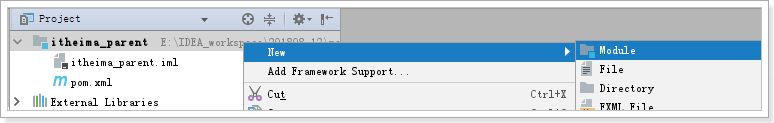 

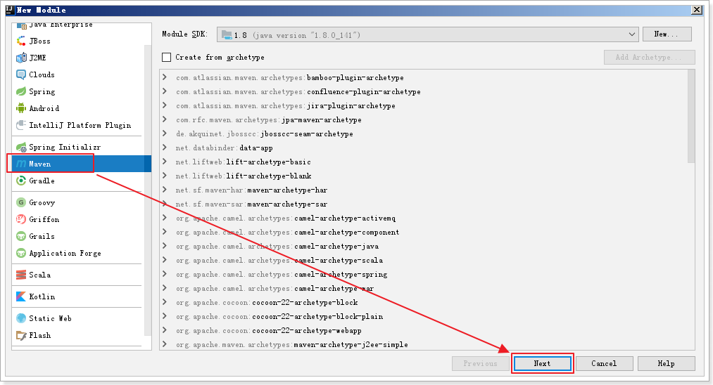

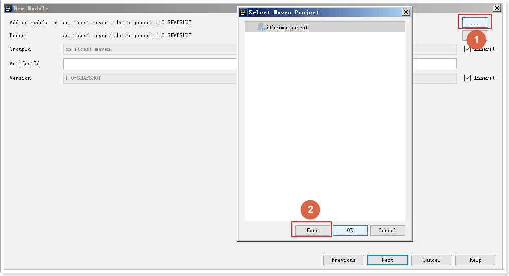 

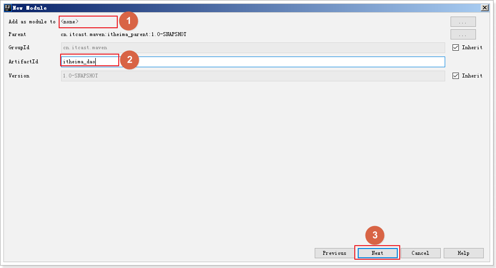 

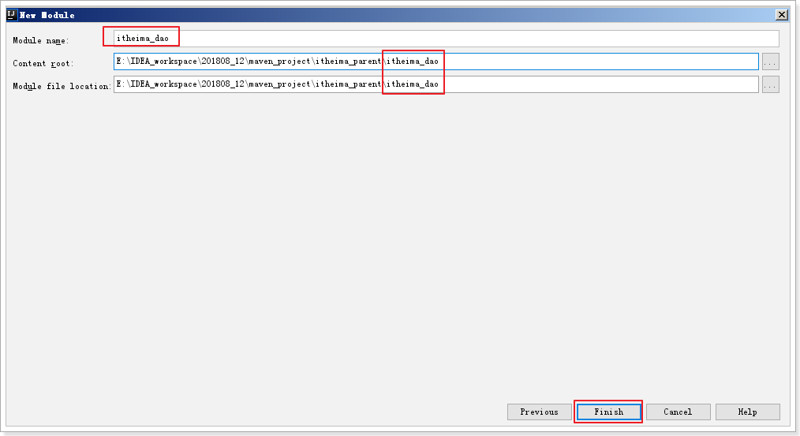 

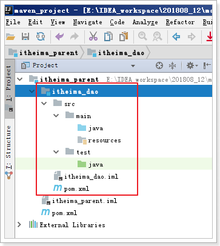   

### 4.2.2 pom.xml

因为需要测试,导入 junit包

因为需要操作数据库, 导入 mysql, 连接池, DBUtils包

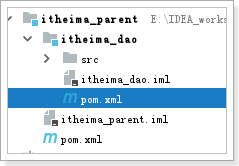 

```xml
<?xml version="1.0" encoding="UTF-8"?>
<project xmlns="http://maven.apache.org/POM/4.0.0"
         xmlns:xsi="http://www.w3.org/2001/XMLSchema-instance"
         xsi:schemaLocation="http://maven.apache.org/POM/4.0.0 http://maven.apache.org/xsd/maven-4.0.0.xsd">
    <parent>
        <artifactId>itheima_parent</artifactId>
        <groupId>cn.itcast.maven</groupId>
        <version>1.0-SNAPSHOT</version>
    </parent>
    <modelVersion>4.0.0</modelVersion>

    <artifactId>itheima_dao</artifactId>
    <!--指定当前是java工程-->
    <packaging>jar</packaging>

    <dependencies>
        <dependency>
            <groupId>junit</groupId>
            <artifactId>junit</artifactId>
        </dependency>
        <!--mysql-->
        <dependency>
            <groupId>mysql</groupId>
            <artifactId>mysql-connector-java</artifactId>
        </dependency>
        <!--c3p0-->
        <dependency>
            <groupId>c3p0</groupId>
            <artifactId>c3p0</artifactId>
        </dependency>
        <!--dbutils-->
        <dependency>
            <groupId>commons-dbutils</groupId>
            <artifactId>commons-dbutils</artifactId>
        </dependency>
    </dependencies>

</project>
```

### 4.2.3 引入配置文件和工具类

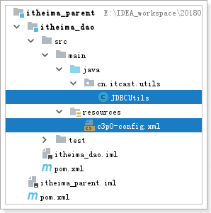 

c3p0-config.xml

```xml
<?xml version="1.0" encoding="UTF-8"?>
<c3p0-config>

  <default-config>
    <property name="driverClass">com.mysql.jdbc.Driver</property>
    <property name="jdbcUrl">jdbc:mysql://localhost:3306/maven_db</property>
    <property name="user">root</property>
    <property name="password">123</property>
  </default-config>

</c3p0-config>
```

JDBCUtils

```java
package cn.itcast.utils;

import com.mchange.v2.c3p0.ComboPooledDataSource;

import javax.sql.DataSource;
import java.sql.Connection;
import java.sql.SQLException;

public class JDBCUtils {
	static ComboPooledDataSource cpds = new ComboPooledDataSource();

	// 获取连接
	public static Connection getConnection() throws SQLException{
		return cpds.getConnection();
	}
	
	// 获取连接池
	public static DataSource getDataSource() throws SQLException{
		return cpds;
	}
}
```

### 4.2.3 操作数据库源码

```java
package cn.itcast.dao;

import cn.itcast.utils.JDBCUtils;
import org.apache.commons.dbutils.QueryRunner;

import java.sql.Connection;
import java.sql.SQLException;

public class AccountDao {
    // 出账
    public void out(Connection conn, String outAccount, double money) throws SQLException {
        QueryRunner queryRunner = new QueryRunner(JDBCUtils.getDataSource());
        String sql = "update account set money=money-? where name=?";
        queryRunner.update(conn, sql, money, outAccount);
    }

    // 入账
    public void in(Connection conn, String inAccount, double money) throws SQLException {
        QueryRunner queryRunner = new QueryRunner(JDBCUtils.getDataSource());
        String sql = "update account set money=money+? where name=?";
        queryRunner.update(conn, sql, money, inAccount);
    }
}
```

## 4.3 测试

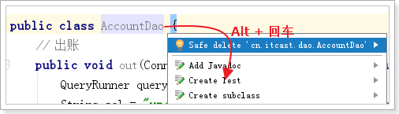 

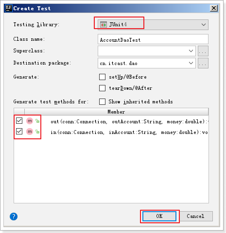 

 ```java
package cn.itcast.dao;

import cn.itcast.utils.JDBCUtils;
import org.junit.Test;

public class AccountDaoTest {

    @Test
    public void out() throws Exception {
        AccountDao accountDao = new AccountDao();
        accountDao.out(JDBCUtils.getConnection(),"aaa", 200);
    }

    @Test
    public void in() throws Exception {
        AccountDao accountDao = new AccountDao();
        accountDao.in(JDBCUtils.getConnection(), "bbb", 200);
    }

}
 ```

# 5 业务层工程

## 5.1 创建子模块

### 5.1.1 how?

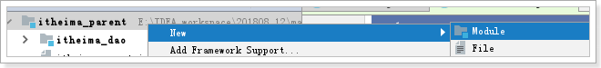 

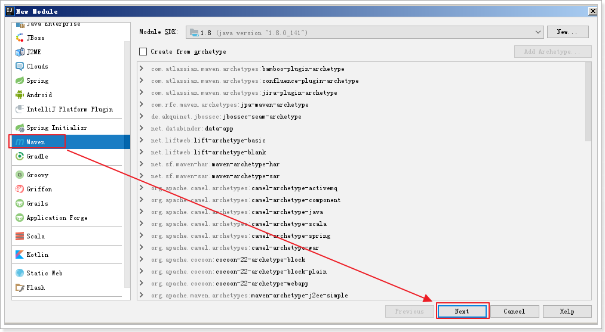 

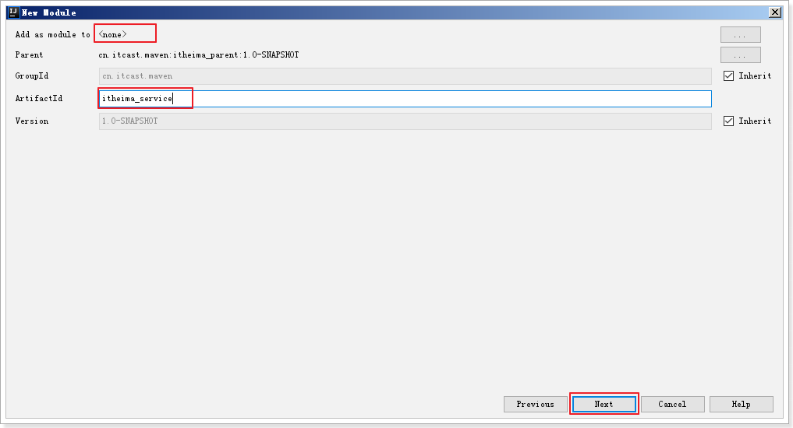 

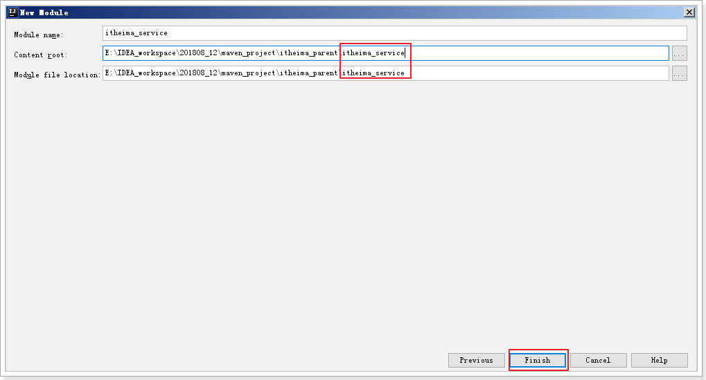 

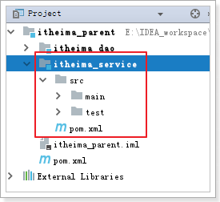 

### 5.1.2 pom.xml

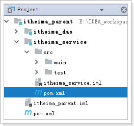 

```xml
<?xml version="1.0" encoding="UTF-8"?>
<project xmlns="http://maven.apache.org/POM/4.0.0"
         xmlns:xsi="http://www.w3.org/2001/XMLSchema-instance"
         xsi:schemaLocation="http://maven.apache.org/POM/4.0.0 http://maven.apache.org/xsd/maven-4.0.0.xsd">
    <parent>
        <artifactId>itheima_parent</artifactId>
        <groupId>cn.itcast.maven</groupId>
        <version>1.0-SNAPSHOT</version>
    </parent>
    <modelVersion>4.0.0</modelVersion>

    <artifactId>itheima_service</artifactId>
    <!--指定当前是java工程-->
    <packaging>jar</packaging>

    <dependencies>

        <!--当前项目依赖 itheima_dao模块-->
        <dependency>
            <groupId>cn.itcast.maven</groupId>
            <artifactId>itheima_dao</artifactId>
            <version>1.0-SNAPSHOT</version>
        </dependency>

    </dependencies>


</project>
```

## 5.2 测试

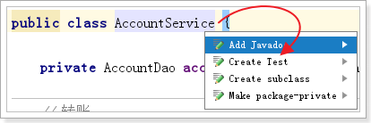 

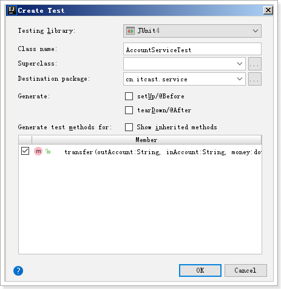 

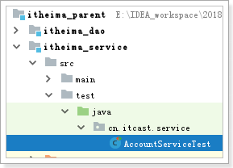 

```java
package cn.itcast.service;

import org.junit.Test;

public class AccountServiceTest {
    @Test
    public void transfer() throws Exception {
        AccountService accountService = new AccountService();
        accountService.transfer("aaa", "bbb", 200);
    }

}
```

执行ok就可以了!

# 6 web层工程

## 6.1 创建子模块

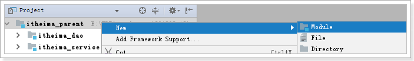 

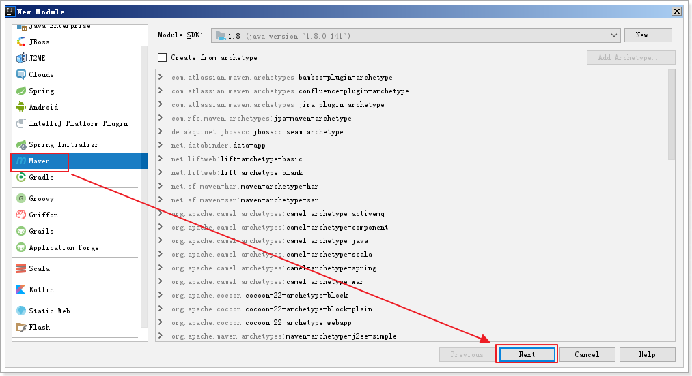 

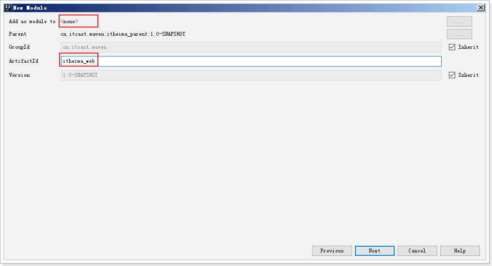 

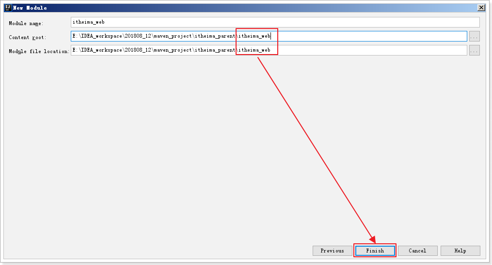 

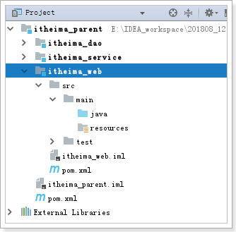 

## 6.2 补充webapp

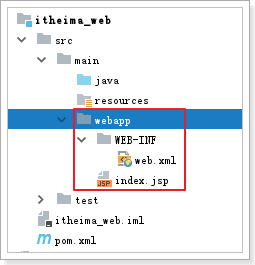 

## 6.3 引入tomcat插件

### 6.3.1 pom.xml 

```xml
<?xml version="1.0" encoding="UTF-8"?>
<project xmlns="http://maven.apache.org/POM/4.0.0"
         xmlns:xsi="http://www.w3.org/2001/XMLSchema-instance"
         xsi:schemaLocation="http://maven.apache.org/POM/4.0.0 http://maven.apache.org/xsd/maven-4.0.0.xsd">
    <parent>
        <artifactId>itheima_parent</artifactId>
        <groupId>cn.itcast.maven</groupId>
        <version>1.0-SNAPSHOT</version>
    </parent>
    <modelVersion>4.0.0</modelVersion>

    <artifactId>itheima_web</artifactId>
    <!--web工程-->
    <packaging>war</packaging>

    <build>
        <plugins>
            <!-- 配置Tomcat插件 -->
            <plugin>
                <groupId>org.apache.tomcat.maven</groupId>
                <artifactId>tomcat7-maven-plugin</artifactId>
                <version>2.2</version>
                <configuration>
                    <!--配置项目路径-->
                    <path>/</path>
                    <!--配置端口号-->
                    <port>80</port>
                </configuration>
            </plugin>
        </plugins>
    </build>

</project>
```

### 6.3.2 测试

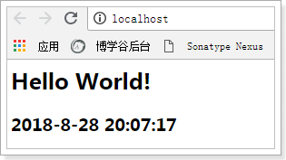 

## 6.4 测试Servlet

### 6.4.1 pom.xml

```xml
    <dependencies>
        <!--servlet, jsp, jstl-->
        <dependency>
            <groupId>jstl</groupId>
            <artifactId>jstl</artifactId>
        </dependency>
        <dependency>
            <groupId>javax.servlet</groupId>
            <artifactId>servlet-api</artifactId>
            <scope>provided</scope>
        </dependency>
        <dependency>
            <groupId>javax.servlet</groupId>
            <artifactId>jsp-api</artifactId>
            <scope>provided</scope>
        </dependency>
    </dependencies>
```

### 6.4.2 编写servlet

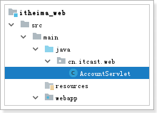 

```java
package cn.itcast.web;

import cn.itcast.service.AccountService;

import javax.servlet.ServletException;
import javax.servlet.http.HttpServlet;
import javax.servlet.http.HttpServletRequest;
import javax.servlet.http.HttpServletResponse;
import java.io.IOException;

public class AccountServlet extends HttpServlet {
    protected void doPost(HttpServletRequest request, HttpServletResponse response) throws ServletException, IOException {
		response.setContentType("text/html;charset=utf-8");
         response.getWriter().print("<h1>访问 AccountServlet</h1>" + new Date().toLocaleString());
    }

    protected void doGet(HttpServletRequest request, HttpServletResponse response) throws ServletException, IOException {
        doPost(request, response);
    }
}

```

web.xml

```xml
<!DOCTYPE web-app PUBLIC
 "-//Sun Microsystems, Inc.//DTD Web Application 2.3//EN"
 "http://java.sun.com/dtd/web-app_2_3.dtd" >

<web-app>
  <display-name>Archetype Created Web Application</display-name>
    <servlet>
        <servlet-name>AccountServlet</servlet-name>
        <servlet-class>cn.itcast.web.AccountServlet</servlet-class>
    </servlet>
    <servlet-mapping>
        <servlet-name>AccountServlet</servlet-name>
        <url-pattern>/AccountServlet</url-pattern>
    </servlet-mapping>
</web-app>
```

### 6.4.3 测试

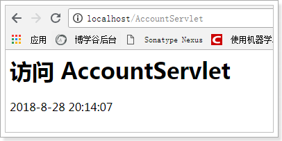 

## 6.5 调用业务模块

### 6.5.1 pom.xml 配置加载依赖业务模块项目

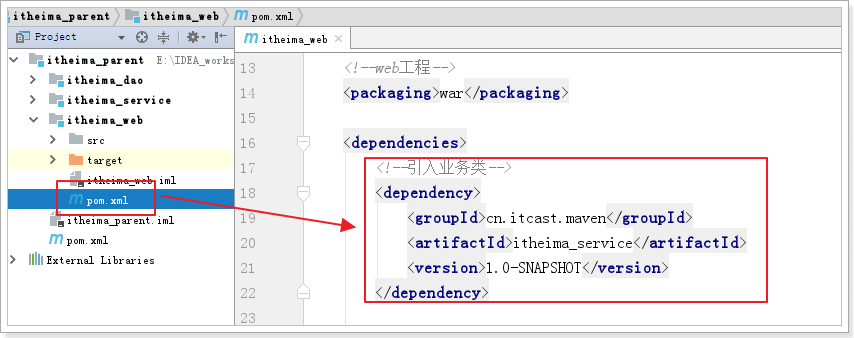

```xml
        <!--引入业务类-->
        <dependency>
            <groupId>cn.itcast.maven</groupId>
            <artifactId>itheima_service</artifactId>
            <version>1.0-SNAPSHOT</version>
        </dependency>
```

### 6.5.2 修改servlet代码

```java
package cn.itcast.web;

import cn.itcast.service.AccountService;

import javax.servlet.ServletException;
import javax.servlet.http.HttpServlet;
import javax.servlet.http.HttpServletRequest;
import javax.servlet.http.HttpServletResponse;
import java.io.IOException;

public class AccountServlet extends HttpServlet {
    protected void doPost(HttpServletRequest request, HttpServletResponse response) throws ServletException, IOException {

        String out = request.getParameter("out");
        String in = request.getParameter("in");
        double money = Double.parseDouble(request.getParameter("money"));

        AccountService accountService = new AccountService();
        accountService.transfer(out, in, money);

        response.setContentType("text/html;charset=utf-8");
        response.getWriter().print("<h1>转账成功!</h1>");
    }

    protected void doGet(HttpServletRequest request, HttpServletResponse response) throws ServletException, IOException {
        doPost(request, response);
    }
}
```

### 6.5.3 启动tomcat

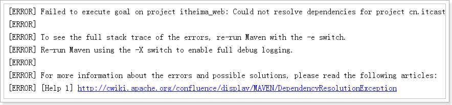

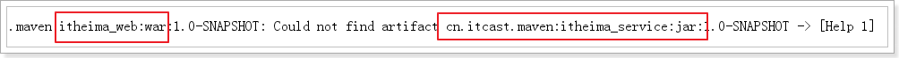

```
原因: web子模块项目 找不到 依赖的 service子模块项目
```

```
解决办法: 将 itheima_parent项目, itheima_dao项目, itheima_service项目 依次安装到 本地仓库中
```

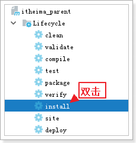 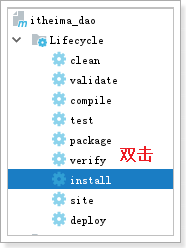  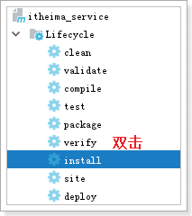 

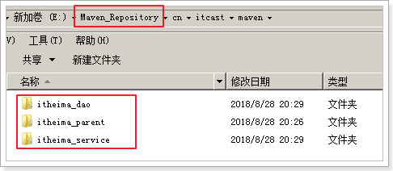 

再次启动tomcat:

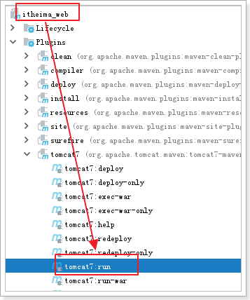 

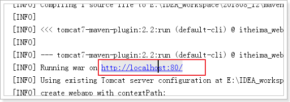 

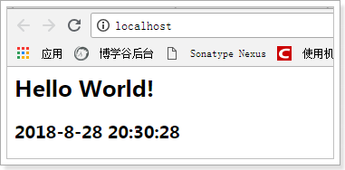 

### 6.5.4 测试调用业务层模块

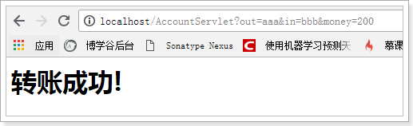 

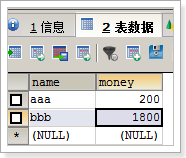 

## 6.6 增加debug调试

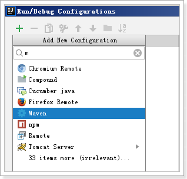 

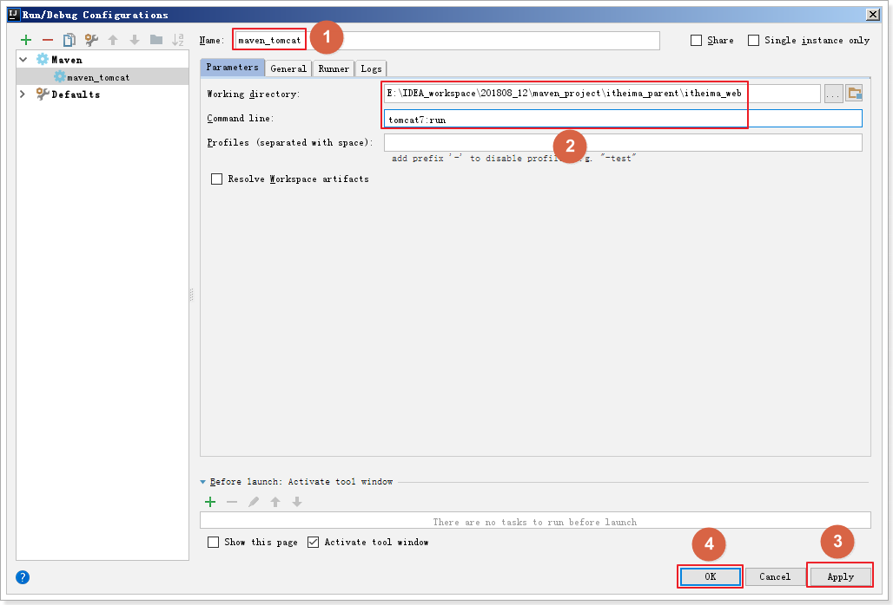 

点击小虫子就可以debug启动了

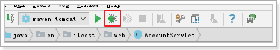 

先打断点就可以测试了!

F8 下一步

F9 跳转到下一个断点


