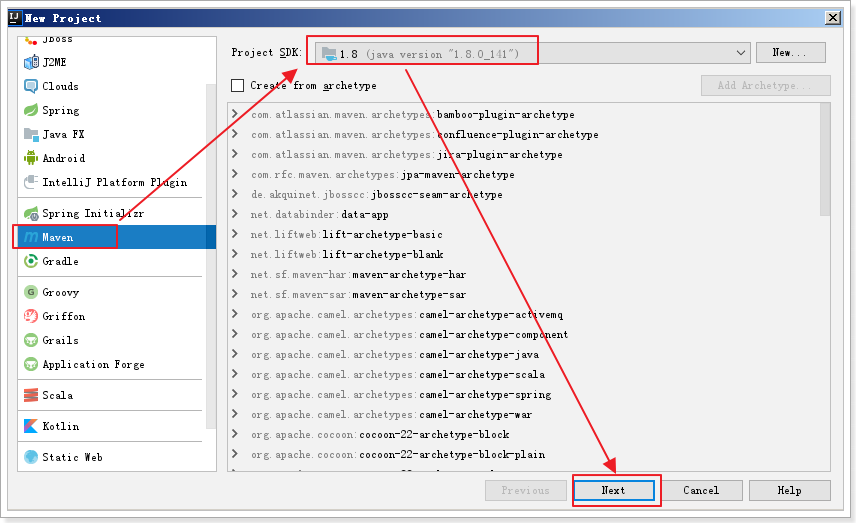
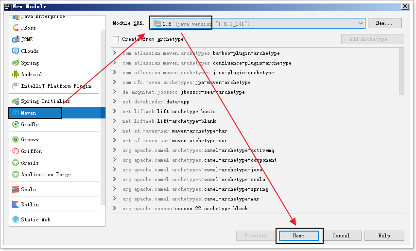
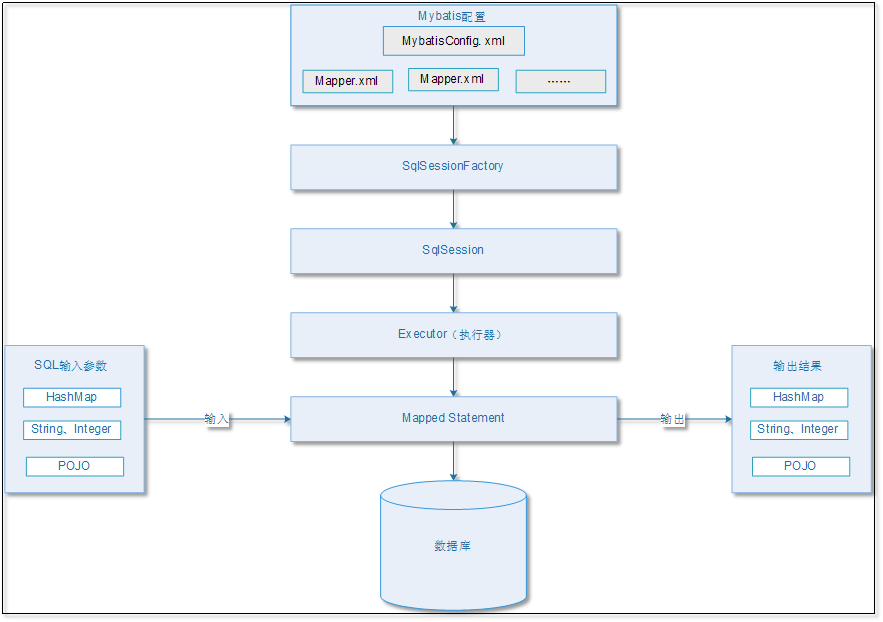
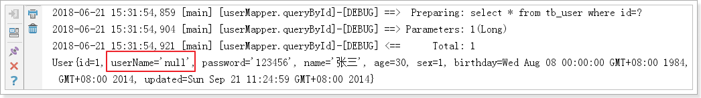
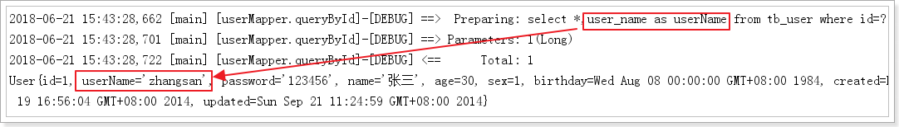
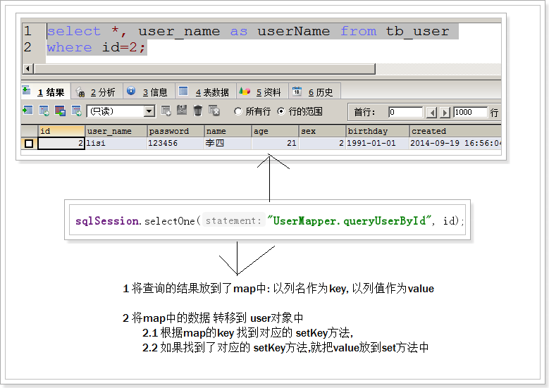
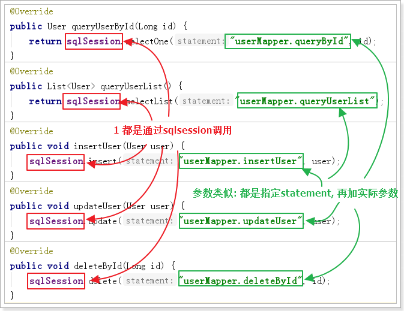
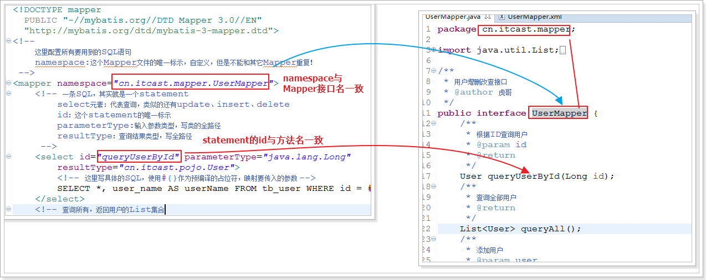
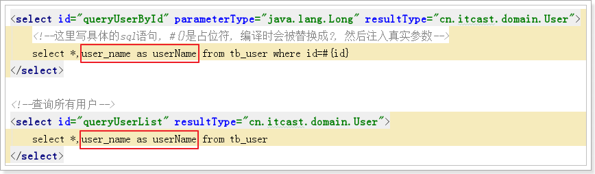
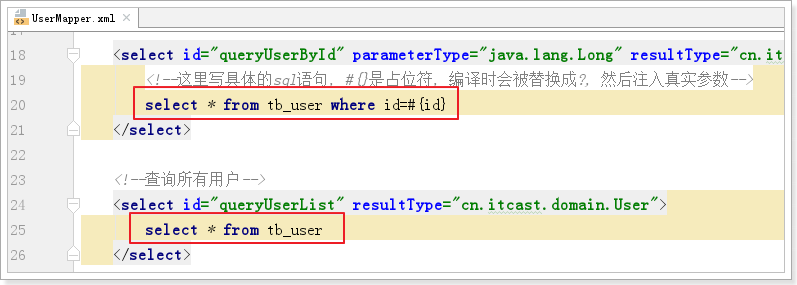

[TOC]

# 1. 回顾JDBC代码

## 1.1 准备数据


## 1.2 创建父工程项目☆☆☆




```xml
	<!-- 集中定义依赖版本号 -->
	<properties>
		<junit.version>4.10</junit.version>
		<spring.version>4.1.3.RELEASE</spring.version>
		<mybatis.version>3.2.8</mybatis.version>
		<mybatis.spring.version>1.2.2</mybatis.spring.version>
		<mybatis.paginator.version>1.2.15</mybatis.paginator.version>
		<mysql.version>5.1.39</mysql.version>
		<slf4j.version>1.6.4</slf4j.version>
		<jackson.version>2.4.2</jackson.version>
		<druid.version>1.0.9</druid.version>
		<httpclient.version>4.3.5</httpclient.version>
		<jstl.version>1.2</jstl.version>
		<servlet-api.version>2.5</servlet-api.version>
		<jsp-api.version>2.0</jsp-api.version>
		<joda-time.version>2.5</joda-time.version>
		<commons-lang3.version>3.3.2</commons-lang3.version>
		<commons-io.version>1.3.2</commons-io.version>
	</properties>

	<dependencyManagement>
		<dependencies>
			<!-- 单元测试 -->
			<dependency>
				<groupId>junit</groupId>
				<artifactId>junit</artifactId>
				<version>${junit.version}</version>
				<scope>test</scope>
			</dependency>

			<!-- Spring -->
			<dependency>
				<groupId>org.springframework</groupId>
				<artifactId>spring-context</artifactId>
				<version>${spring.version}</version>
			</dependency>
			<dependency>
				<groupId>org.springframework</groupId>
				<artifactId>spring-beans</artifactId>
				<version>${spring.version}</version>
			</dependency>
			<dependency>
				<groupId>org.springframework</groupId>
				<artifactId>spring-webmvc</artifactId>
				<version>${spring.version}</version>
			</dependency>
			<dependency>
				<groupId>org.springframework</groupId>
				<artifactId>spring-jdbc</artifactId>
				<version>${spring.version}</version>
			</dependency>
			<dependency>
				<groupId>org.springframework</groupId>
				<artifactId>spring-aspects</artifactId>
				<version>${spring.version}</version>
			</dependency>

			<!-- Mybatis -->
			<dependency>
				<groupId>org.mybatis</groupId>
				<artifactId>mybatis</artifactId>
				<version>${mybatis.version}</version>
			</dependency>
			<dependency>
				<groupId>org.mybatis</groupId>
				<artifactId>mybatis-spring</artifactId>
				<version>${mybatis.spring.version}</version>
			</dependency>

			<dependency>
				<groupId>com.github.pagehelper</groupId>
				<artifactId>pagehelper</artifactId>
				<version>3.7.5</version>
			</dependency>
			<dependency>
				<groupId>com.github.jsqlparser</groupId>
				<artifactId>jsqlparser</artifactId>
				<version>0.9.1</version>
			</dependency>

			<dependency>
				<groupId>com.github.abel533</groupId>
				<artifactId>mapper</artifactId>
				<version>2.3.4</version>
			</dependency>

			<!-- MySql -->
			<dependency>
				<groupId>mysql</groupId>
				<artifactId>mysql-connector-java</artifactId>
				<version>${mysql.version}</version>
			</dependency>

			<dependency>
				<groupId>org.slf4j</groupId>
				<artifactId>slf4j-log4j12</artifactId>
				<version>${slf4j.version}</version>
			</dependency>

			<!-- Jackson Json处理工具包 -->
			<dependency>
				<groupId>com.fasterxml.jackson.core</groupId>
				<artifactId>jackson-databind</artifactId>
				<version>${jackson.version}</version>
			</dependency>

			<!-- 连接池 -->
			<dependency>
				<groupId>com.jolbox</groupId>
				<artifactId>bonecp-spring</artifactId>
				<version>0.8.0.RELEASE</version>
			</dependency>

			<!-- httpclient -->
			<dependency>
				<groupId>org.apache.httpcomponents</groupId>
				<artifactId>httpclient</artifactId>
				<version>${httpclient.version}</version>
			</dependency>

			<!-- JSP相关 -->
			<dependency>
				<groupId>jstl</groupId>
				<artifactId>jstl</artifactId>
				<version>${jstl.version}</version>
			</dependency>
			<dependency>
				<groupId>javax.servlet</groupId>
				<artifactId>servlet-api</artifactId>
				<version>${servlet-api.version}</version>
				<scope>provided</scope>
			</dependency>
			<dependency>
				<groupId>javax.servlet</groupId>
				<artifactId>jsp-api</artifactId>
				<version>${jsp-api.version}</version>
				<scope>provided</scope>
			</dependency>

			<!-- 时间操作组件 -->
			<dependency>
				<groupId>joda-time</groupId>
				<artifactId>joda-time</artifactId>
				<version>${joda-time.version}</version>
			</dependency>

			<!-- Apache工具组件 -->
			<dependency>
				<groupId>org.apache.commons</groupId>
				<artifactId>commons-lang3</artifactId>
				<version>${commons-lang3.version}</version>
			</dependency>
			<dependency>
				<groupId>org.apache.commons</groupId>
				<artifactId>commons-io</artifactId>
				<version>${commons-io.version}</version>
			</dependency>

		</dependencies>
	</dependencyManagement>

	<build>
		<finalName>${project.artifactId}</finalName>
		<plugins>
			<!-- 资源文件拷贝插件 -->
			<plugin>
				<groupId>org.apache.maven.plugins</groupId>
				<artifactId>maven-resources-plugin</artifactId>
				<version>2.7</version>
				<configuration>
					<encoding>UTF-8</encoding>
				</configuration>
			</plugin>
			<!-- java编译插件 -->
			<plugin>
				<groupId>org.apache.maven.plugins</groupId>
				<artifactId>maven-compiler-plugin</artifactId>
				<version>3.2</version>
				<configuration>
					<source>1.7</source>
					<target>1.7</target>
					<encoding>UTF-8</encoding>
				</configuration>
			</plugin>
		</plugins>
		<pluginManagement>
			<plugins>
				<!-- 配置Tomcat插件 -->
				<plugin>
					<groupId>org.apache.tomcat.maven</groupId>
					<artifactId>tomcat7-maven-plugin</artifactId>
					<version>2.2</version>
				</plugin>
			</plugins>
		</pluginManagement>
	</build>
```


## 1.3 创建子工程项目(java项目)☆☆☆





## 1.4 子工程导入依赖

```xml
<?xml version="1.0" encoding="UTF-8"?>

<project xmlns="http://maven.apache.org/POM/4.0.0" xmlns:xsi="http://www.w3.org/2001/XMLSchema-instance"
         xsi:schemaLocation="http://maven.apache.org/POM/4.0.0 http://maven.apache.org/xsd/maven-4.0.0.xsd">
    <parent>
        <artifactId>itcast_parent</artifactId>
        <groupId>cn.itcast.parent</groupId>
        <version>1.0-SNAPSHOT</version>
        <relativePath>../itcast_parent/pom.xml</relativePath>
    </parent>
    <modelVersion>4.0.0</modelVersion>
    <artifactId>mybatis_day01</artifactId>
    <name>mybatis_day01</name>

    <dependencies>
        <dependency>
            <groupId>junit</groupId>
            <artifactId>junit</artifactId>
        </dependency>
        <dependency>
            <groupId>mysql</groupId>
            <artifactId>mysql-connector-java</artifactId>
        </dependency>
    </dependencies>

</project>
```


## 1.5 回顾JDBC核心代码

```java
package cn.itcast.a_jdbc;

import java.sql.*;

public class JDBC_Test {
    public static void main(String[] args) {

        Connection conn = null;
        PreparedStatement pstmt = null;
        ResultSet rs = null;

        try {

            String driverClass = "com.mysql.jdbc.Driver";
            String url = "jdbc:mysql://localhost:3306/mybatis_db";
            String username = "root";
            String password = "123";
            // 1 注册驱动
            Class.forName(driverClass);
            // 2 获得连接
            conn = DriverManager.getConnection(url, username, password);
            // 3 获得执行sql的对象
            String sql = "select * from tb_user;";
            pstmt = conn.prepareStatement(sql);
            // 4 执行sql 获得结果
            rs = pstmt.executeQuery();
            // 5 处理结果
            while (rs.next()) {
                long id = rs.getLong("id");
                String name = rs.getString("name");
                Date birthday = rs.getDate("birthday");
                System.out.println(id + "=====" + name + "=====" + birthday);
            }
        } catch (Exception e) {
            e.printStackTrace();
        } finally {
            // 6 释放资源
            try {
                if (rs != null) {
                    rs.close();
                }
            } catch (SQLException e) {
                e.printStackTrace();
            }

            try {
                if (pstmt != null) {
                    pstmt.close();
                }
            } catch (SQLException e) {
                e.printStackTrace();
            }

            try {
                if (conn != null) {
                    conn.close();
                }
            } catch (SQLException e) {
                e.printStackTrace();
            }
        }

    }
}

```


## 1.6 问题分析

JDBC操作数据库的流程：

	A：准备数据库连接参数
	
	B：连接数据库
	
	C：编译SQL
	
	D：设置SQL参数
	
	E：执行SQL获取结果
	
	F：遍历结果集，封装数据到JavaBean
	
	G：关闭资源


步骤中出现的问题：

1、准备连接参数

	问题：将参数硬编码到了程序中，不方便维护和开发
	
	解决：将参数写到外部配置文件，然后通过读取配置文件来获取连接参数

2、连接数据库

	问题：频繁连接
	
	解决：连接池

3、编译Sql语句获取statement

	问题：Sql语句硬编码到了程序中，业务变更，Sql优化，都需要重新编译
	
	解决：把Sql语句也放置到外部配置文件，程序加载配置文件，获取Sql

4、设置Sql参数

	问题：以前手动写Sql，手动设置参数，现在动态获取Sql，必须动态设置参数
	
		1）需要自动判断参数类型
	
		2）需要自动判断参数的位置
	
	解决：目前没有好的解决方案，待定。。

5、执行statement，获取结果集

6、解析结果集，封装数据

	问题：遍历解析结果集非常麻烦
	
		1）需要自己判断结果字段类型
	
		2）需要自己明确结果的字段名称
	
		3）需要自己把结果封装到JavaBean
	
		4）如果有多行，需要逐行解析，封装为List
	
	解决：
	
		利用反射实现自动数据封装。但是代码复杂

7、释放资源

	问题：频繁关闭连接
	
	解决：连接池

# 2 MyBatis概述

## 2.1 简介


## 2.2 官网

官网：http://www.mybatis.org/mybatis-3

中文官方文档：http://www.mybatis.org/mybatis-3/zh/index.html


## 2.3 特点

Mybatis：

1） 支持自定义SQL、存储过程、及高级映射

2） 实现自动对SQL的参数设置

3） 实现自动对结果集进行解析和封装

4） 通过XML或者注解进行配置和映射

5） 实现Java对象与数据库表的映射转换

	

可以发现，MyBatis是对JDBC进行了简单的封装，帮助用户进行SQL参数的自动化映射，以及结果集与Java对象的映射。与Hibernate相比，更加配置简单、灵活、执行效率高。但是正因为此，所以没有实现完全自动化，需要手写SQL，这是优点也是缺点。

 

因此，对性能要求较高的电商类项目，一般会使用MyBatis，而对与业务逻辑复杂，对执行效率要求不高的传统行业，一般会使用Hibernate

## 2.4 架构☆☆☆



MyBatis架构总结：

1. MyBatis有两类配置文件：

   	a) mybatis-condig.xml，是MyBatis的全局配置文件，包含全局配置信息，如数据库连接参数、插件等。整个框架中只需要一个即可。

   	b) xxxMapper.xml，是映射文件，里面配置要执行的SQL语句，每个SQL对应一个Statement，可以有多个Mapper.xml文件

2. 首先会通过SqlSessionFactoryBuilder来加载配置文件，生成一个SqlSessionFactory

   	a) 会加载mybatis-config.xml和mapper.xml

   	b) 加载mapper.xml的时候，顺便会对Sql进行编译，形成statement

3. 通过SqlSessionFactory建立连接，获取SqlSession对象

4. MyBatis获取要执行的statement，进行自动参数设置

5. SqlSession底层会通过Executor（执行器）来执行编译好的Statement，获取结果

6. SQL的输入参数类型：

   	a) POJO，普通Java对象

   	b) HashMap，其实是POJO的Map形式， 键值对就是对象字段名和值z``

   	c) 各种基本数据类型

7. 查询结果的输出形式

   	a) POJO，普通Java对象

   	b) HashMap，其实是POJO的Map形式， 键值对就是对象字段名和值

   	c) 各种基本数据类型

# 3 快速入门 ☆☆☆☆

## 3.1 增加导入依赖

   ```xml
   <?xml version="1.0" encoding="UTF-8"?>
   
   <project xmlns="http://maven.apache.org/POM/4.0.0" xmlns:xsi="http://www.w3.org/2001/XMLSchema-instance"
            xsi:schemaLocation="http://maven.apache.org/POM/4.0.0 http://maven.apache.org/xsd/maven-4.0.0.xsd">
       <parent>
           <artifactId>itcast_parent</artifactId>
           <groupId>cn.itcast.parent</groupId>
           <version>1.0-SNAPSHOT</version>
           <relativePath>../itcast_parent/pom.xml</relativePath>
       </parent>
       <modelVersion>4.0.0</modelVersion>
       <artifactId>mybatis_day01</artifactId>
   
       <dependencies>
           <!-- 单元测试 -->
           <dependency>
               <groupId>junit</groupId>
               <artifactId>junit</artifactId>
           </dependency>
   
           <!-- MySql -->
           <dependency>
               <groupId>mysql</groupId>
               <artifactId>mysql-connector-java</artifactId>
           </dependency>
   
           <!--日志-->
           <dependency>
               <groupId>org.slf4j</groupId>
               <artifactId>slf4j-log4j12</artifactId>
           </dependency>
   
           <!--mybatis-->
           <dependency>
               <groupId>org.mybatis</groupId>
               <artifactId>mybatis</artifactId>
           </dependency>
       </dependencies>
   </project>
   ```

## 3.2 添加日志配置文件

将日志文件添加 添加main/resources目录

```properties
log4j.rootLogger=DEBUG,A1
log4j.logger.com.taotao = DEBUG
log4j.logger.org.mybatis = DEBUG

log4j.appender.A1=org.apache.log4j.ConsoleAppender
log4j.appender.A1.layout=org.apache.log4j.PatternLayout
log4j.appender.A1.layout.ConversionPattern=%-d{yyyy-MM-dd HH:mm:ss,SSS} [%t] [%c]-[%p] %m%n
```

## 3.3 添加jdbc.properties


```properties
jdbc.driverClassName=com.mysql.jdbc.Driver
jdbc.url=jdbc:mysql://127.0.0.1:3306/mybatis_db?useUnicode=true&characterEncoding=utf8&autoReconnect=true&allowMultiQueries=true
jdbc.username=root
jdbc.password=123
```

## 3.4 编写mybatis全局配置文件


```xml
<?xml version="1.0" encoding="UTF-8" ?>
<!DOCTYPE configuration
        PUBLIC "-//mybatis.org//DTD Config 3.0//EN"
        "http://mybatis.org/dtd/mybatis-3-config.dtd">
<configuration>
    <!--加载外部属性-->
    <properties resource="jdbc.properties"/>

    <!--运行环境可以配置多个, default指定默认使用哪个-->
    <environments default="development">
        <!--配置环境, id是这个环境的唯一标识-->
        <environment id="development">
            <transactionManager type="JDBC"/>
            <dataSource type="POOLED">
                <property name="driver" value="${jdbc.driverClassName}"/>
                <property name="url" value="${jdbc.url}"/>
                <property name="username" value="${jdbc.username}"/>
                <property name="password" value="${jdbc.password}"/>
            </dataSource>
        </environment>
    </environments>

    <!--3 指定所有的mapper文件-->
    <mappers>
        <mapper resource="UserMapper.xml"/>
    </mappers>
</configuration>
```

## 3.5 编写映射文件 XxxMpper.xml


```xml
<?xml version="1.0" encoding="UTF-8" ?>
<!DOCTYPE mapper
        PUBLIC "-//mybatis.org//DTD Mapper 3.0//EN"
        "http://mybatis.org/dtd/mybatis-3-mapper.dtd">
<!--
    定义所有用到的sql语句 和 映射关系
    namespace : 当前这个配置文件的唯一标识, 自定义, 但是不能和其他配置文件namespace重复
-->
<mapper namespace="userMapper">
    <!--
        定义一条sql语句, 其实就是一个 statement
            select 代表是查询语句, 与其类似的还有 insert, update, delete等
            id : 这条sql语句的唯一标识,自定义,但是不能和其他sql语句重复
            parameterType:  sql语句需要的参数类型, 需要写 类的全路径
            resultType: sql语句返回的结果类型
    -->

    <select id="queryById"  parameterType="java.lang.Long" resultType="cn.itcast.domain.User">
        <!--这里写具体的sql语句, #{}是占位符, 编译时会被替换成?, 然后注入真实参数-->
        select *, user_name as userName from tb_user where id=#{id}
    </select>
</mapper>
```

## 3.6 编写测试代码


```java
package cn.itcast.b_mybatis_start;

import cn.itcast.domain.User;
import org.apache.ibatis.io.Resources;
import org.apache.ibatis.session.SqlSession;
import org.apache.ibatis.session.SqlSessionFactory;
import org.apache.ibatis.session.SqlSessionFactoryBuilder;

import java.io.InputStream;

public class Hello {
    public static void main(String[] args) throws Exception {
        // 指定全局文件的路径
        String resource = "mybatis-config.xml";
        // 获取输入流,关联全局配置文件
        InputStream inputStream = Resources.getResourceAsStream(resource);
        // 构建SqlSessionFactory
        SqlSessionFactory sqlSessionFactory = new SqlSessionFactoryBuilder().build(inputStream);
        // 获取SqlSession
        SqlSession sqlSession = sqlSessionFactory.openSession();
        // 执行statement, 需要指定两个参数:
        // 1 确定哪个sql语句: mapper文件的namespace + sql语句的id
        // 2 sql语句需要的参数
        User user = sqlSession.selectOne("userMapper.queryById", 1L);
        System.out.println(user);
    }
}

```

## 3.7 测试结果

```
2018-06-21 15:31:54,859 [main] [userMapper.queryById]-[DEBUG] ==>  Preparing: select * from tb_user where id=? 
2018-06-21 15:31:54,904 [main] [userMapper.queryById]-[DEBUG] ==> Parameters: 1(Long)
2018-06-21 15:31:54,921 [main] [userMapper.queryById]-[DEBUG] <==      Total: 1
User{id=1, userName='null', password='123456', name='张三', age=30, sex=1, birthday=Wed Aug 08 00:00:00 GMT+08:00 1984, created=Fri Sep 19 16:56:04 GMT+08:00 2014, updated=Sun Sep 21 11:24:59 GMT+08:00 2014}
```

## 3.8 入门程序执行流程图


流程总结：

1. 编写配置文件（全局配置文件mybatis-config.xml和所有的mapper.xml映射文件）

   a) 简单来说：就是准备JDBC连接参数以及要用到的Sql语句

2. 加载配置，创建SqlSessionFactory

   a) 这里获取连接参数，获取Sql，对Sql进行预编译，形成statement

3. 通过SqlSessionFactory创建SqlSession

   a) 这里就是调用了连接参数，连接数据库，形成会话

4. 通过SqlSession执行statement，实现CRUD

   a) 给前面编译好的statement设置Sql参数，然后执行

5. 通过SqlSession提交事务

6. 通过SqlSession关闭会话

## 3.9 问题: userName为null的问题



原因: User对象的属性userName 和 tb_user表 的字段 user_name不一致


解决方案1:


结果



思考: 虽然这种方案可以解决,但是比较麻烦,不方便后期维护.

更好的方案后面讲解.




# 4 完成增删改查


## 4.1 定义接口


```java
package cn.itcast.dao;

import cn.itcast.domain.User;

import java.util.List;

public interface UserDao {
    /**
     * 根据编号 查询用户
     */
    public User queryUserById(Long id);

    /**
     * 查询所有用户
     */
    public List<User> queryUserList();

    /**
     * 添加用户
     */
    public void insertUser(User user);

    /**
     * 修改用户
     */
    public void updateUser(User user);

    /**
     * 根据编号 删除客户
     */
    public void deleteById(Long id);
}

```

## 4.2 编写SQL到mapper文件中


```xml
<?xml version="1.0" encoding="UTF-8" ?>
<!DOCTYPE mapper
        PUBLIC "-//mybatis.org//DTD Mapper 3.0//EN"
        "http://mybatis.org/dtd/mybatis-3-mapper.dtd">
<!--
    定义所有用到的sql语句 和 映射关系
    namespace : 当前这个配置文件的唯一标识, 自定义, 但是不能和其他配置文件namespace重复
-->
<mapper namespace="userMapper">
    <!--
        定义一条sql语句, 其实就是一个 statement
            select 代表是查询语句, 与其类似的还有 insert, update, delete等
            id : 这条sql语句的唯一标识,自定义,但是不能和其他sql语句重复
            parameterType:  sql语句需要的参数类型, 需要写 类的全路径
            resultType: sql语句返回的结果类型
    -->

    <select id="queryById" parameterType="java.lang.Long" resultType="cn.itcast.domain.User">
        <!--这里写具体的sql语句, #{}是占位符, 编译时会被替换成?, 然后注入真实参数-->
        select *,user_name as userName from tb_user where id=#{id}
    </select>

    <!--查询所有用户-->
    <select id="queryUserList" resultType="cn.itcast.domain.User">
        select *,user_name as userName from tb_user
    </select>

    <!--添加用户-->
    <insert id="insertUser" parameterType="cn.itcast.domain.User">
        insert into tb_user
        (
            id,
            user_name,
            password,
            name,
            age,
            sex,
            birthday,
            created,
            updated
         )
        values (
            null,
            #{userName},
            #{password},
            #{name},
            #{age},
            #{sex},
            #{birthday},
            now(),
            now()
        )
    </insert>

    <!--修改用户-->
    <update id="updateUser" parameterType="cn.itcast.domain.User">
        update tb_user
            set
                user_name = #{userName},
                password = #{password},
                name = #{name},
                age = #{age},
                sex = #{sex},
                birthday = #{birthday},
                updated = now()
        where id = #{id}
    </update>

    <!--删除用户-->
    <delete id="deleteById" parameterType="java.lang.Long">
        delete from tb_user
        where id = #{id}
    </delete>
</mapper>
```

## 4.3 接口实现类


```java
package cn.itcast.dao;

import cn.itcast.domain.User;
import org.apache.ibatis.session.SqlSession;

import java.util.List;

public class UserDaoImpl implements UserDao {
    private SqlSession sqlSession;

    public UserDaoImpl(SqlSession sqlSession) {
        this.sqlSession = sqlSession;
    }

    @Override
    public User queryUserById(Long id) {
        return sqlSession.selectOne("userMapper.queryById", id);
    }

    @Override
    public List<User> queryUserList() {
        return sqlSession.selectList("userMapper.queryUserList");
    }

    @Override
    public void insertUser(User user) {
        sqlSession.insert("userMapper.insertUser", user);
    }

    @Override
    public void updateUser(User user) {
        sqlSession.update("userMapper.updateUser", user);
    }

    @Override
    public void deleteById(Long id) {
        sqlSession.delete("userMapper.deleteById", id);
    }
}

```

## 4.4 使用生成测试类

打开 UserDao文件, 按快捷键 ctrl + shift + t 生成 测试用例


```java
package cn.itcast.dao;

import cn.itcast.domain.User;
import org.apache.ibatis.io.Resources;
import org.apache.ibatis.session.SqlSession;
import org.apache.ibatis.session.SqlSessionFactory;
import org.apache.ibatis.session.SqlSessionFactoryBuilder;
import org.junit.Before;
import org.junit.Test;

import java.io.InputStream;
import java.text.SimpleDateFormat;
import java.util.Date;
import java.util.List;

public class UserDaoTest {

    private UserDao userDao;

    @Before
    public void setUp() throws Exception {
        String resource = "mybatis-config.xml";
        InputStream inputStream = Resources.getResourceAsStream(resource);
        SqlSessionFactory sqlSessionFactory = new SqlSessionFactoryBuilder().build(inputStream);
        SqlSession sqlSession = sqlSessionFactory.openSession(true);
        userDao = new UserDaoImpl(sqlSession);
    }

    @Test
    public void queryUserById() throws Exception {
        User user = userDao.queryUserById(1L);
        System.out.println(user);
    }

    @Test
    public void queryUserList() throws Exception {
        List<User> userList = userDao.queryUserList();
        for (User user : userList) {
            System.out.println(user);
        }
    }

    @Test
    public void insertUser() throws Exception {
        User user = new User();
        user.setUserName("yangmi");
        user.setPassword("123");
        user.setName("柳岩");
        user.setAge(80);
        user.setSex(1);
        Date birthday = new SimpleDateFormat("yyyy-MM-dd").parse("2000-8-8");
        user.setBirthday(birthday);

        userDao.insertUser(user);
    }

    @Test
    public void updateUser() throws Exception {
        // 先查
        User user = userDao.queryUserById(9L);
        // 后改
        user.setUserName("yangmi");
        user.setName("杨幂");
        user.setAge(250);
        userDao.updateUser(user);
    }

    @Test
    public void deleteById() throws Exception {
        userDao.deleteById(9L);
    }

}
```


# 5 动态代理实现dao接口☆☆☆☆☆

## 5.1 CRUD代码分析

规律: 参数结构相似,  参数1指定对应的statement, 参数2 实际需要参数值



## 5.2 思路分析

思考一下：

1）是否可以通过动态代理，代理UserDAO接口，然后动态生成内部的增删改查代码呢？

	应该是可以的，因为代码有很多相似之处，都是调用SqlSession的增删改查方法，然后 调用 对应的 statement ，传递对应的Sql参数。
	
	模式虽然类似，但是我们有新的问题：

 


2）想要让Mybatis帮我们动态生成DAO代码，有以下问题需要解决？

	A：如何确定要调用SqlSession的哪个方法？ 
	
		每一个DAO中的方法，最终一定对应Mapper.xml中的一个statement，而每个statement中定义的Sql语句，就可以知道应该是增、删、改、查中的哪一个。
	
		所以要确定应该调用SqlSession的哪个方法，就要先确定DAO的方法对应mapper.xml中的哪个statement
	
	B：如何确定要调用哪个statement？
	
		要确定statement，就必须通过两个参数：mapper.xml文件的namespace + 这个statement的ID
	
		而我们知道，这两个值都是用户自定义的，可以是任意值。如果是这样，我们是无法确定的！

 


		但是，注意观察的同学可能发现了，我们刚才定义namespace和ID并不是任意的：
	
			namespace恰好就叫UserMapper，与UserDAO接口相关
	
			statement的id恰好与每一个方法的名称一致。
	
		其实呢，在Mybatis中，也是采用类似的约定来做的，mybatis对于Mapper.xml文件的定义有以下约定：

**约定namespace必须与DAO接口的全名称一致**

**约定statement的ID必须和接口中的方法名称一致**

这样以来，Mybatis的底层，只要拿到我们定义的接口，以及接口的方法名称，必然能确定到对应的statement，从而知道我们应该调用哪个SqlSession方法，知道返回值类型是什么，知道参数类型是什么，从而帮我们动态生成DAO的实现代码！  


## 5.3 mybatis动态代理实现dao接口

### 5.3.1 规则

	要想动态代理实现dao接口的方法, 关键在于找到对应的statement. 如果想快速找到对应的statment, 就需要遵守如下约定:

 1.  每一个dao接口 都有一个对应的 XxxMapper.xml映射文件(必须)

 2.  mapper.xml文件的namespace必须是接口的全名称(必须)

 3.  mapper.xml文件的每个statement的id必须是 dao接口的方法名(必须)

 4. statement中定义的resultType必须和方法定义的返回值类型一致(必须)

 5. 在MyBatis中, 一般dao接口命名规则为 XxxMapper.java, 不是 XxxxDao.java(虽然这不是必须的, 但是后面的约定会用到,请大家提前规范起来)

如果遵守以上约定,  myBatis很对就可以实现动态代理

### 5.3.2 编写Mapper接口(代替dao接口)


```java
package cn.itcast.mapper;

import cn.itcast.domain.User;

import java.util.List;

public interface UserMapper {
    /**
     * 根据编号 查询用户
     */
    public User queryUserById(Long id);

    /**
     * 查询所有用户
     */
    public List<User> queryUserList();

    /**
     * 添加用户
     */
    public void insertUser(User user);

    /**
     * 修改用户
     */
    public void updateUser(User user);

    /**
     * 根据编号 删除客户
     */
    public void deleteById(Long id);
}

```


### 5.3.3 修改 UserMapper.xml文件

1. xml文件的namespace必须是 mapper接口的全路径
2. 每个statement的id 必须 mapper接口的方法名保持一致



```xml
<?xml version="1.0" encoding="UTF-8" ?>
<!DOCTYPE mapper
        PUBLIC "-//mybatis.org//DTD Mapper 3.0//EN"
        "http://mybatis.org/dtd/mybatis-3-mapper.dtd">
<!--
    定义所有用到的sql语句 和 映射关系
    namespace : 当前这个配置文件的唯一标识, 自定义, 但是不能和其他配置文件namespace重复
-->
<mapper namespace="cn.itcast.mapper.UserMapper">
    <!--
        定义一条sql语句, 其实就是一个 statement
            select 代表是查询语句, 与其类似的还有 insert, update, delete等
            id : 这条sql语句的唯一标识,自定义,但是不能和其他sql语句重复
            parameterType:  sql语句需要的参数类型, 需要写 类的全路径
            resultType: sql语句返回的结果类型
    -->

    <select id="queryUserById" parameterType="java.lang.Long" resultType="cn.itcast.domain.User">
        <!--这里写具体的sql语句, #{}是占位符, 编译时会被替换成?, 然后注入真实参数-->
        select *,user_name as userName from tb_user where id=#{id}
    </select>

    <!--查询所有用户-->
    <select id="queryUserList" resultType="cn.itcast.domain.User">
        select *,user_name as userName from tb_user
    </select>

    <!--添加用户-->
    <insert id="insertUser" parameterType="cn.itcast.domain.User">
        insert into tb_user
        (
            id,
            user_name,
            password,
            name,
            age,
            sex,
            birthday,
            created,
            updated
         )
        values (
            null,
            #{userName},
            #{password},
            #{name},
            #{age},
            #{sex},
            #{birthday},
            now(),
            now()
        )
    </insert>

    <!--修改用户-->
    <update id="updateUser" parameterType="cn.itcast.domain.User">
        update tb_user
            set
                user_name = #{userName},
                password = #{password},
                name = #{name},
                age = #{age},
                sex = #{sex},
                birthday = #{birthday},
                updated = now()
        where id = #{id}
    </update>

    <!--删除用户-->
    <delete id="deleteById" parameterType="java.lang.Long">
        delete from tb_user
        where id = #{id}
    </delete>
</mapper>
```

### 5.3.4 测试 


```java
package cn.itcast.mapper;

import cn.itcast.domain.User;
import org.apache.ibatis.io.Resources;
import org.apache.ibatis.session.SqlSession;
import org.apache.ibatis.session.SqlSessionFactory;
import org.apache.ibatis.session.SqlSessionFactoryBuilder;
import org.junit.Before;
import org.junit.Test;

import java.io.InputStream;
import java.util.List;

public class UserMapperTest {

    private UserMapper userMapper;

    @Before
    public void setUp() throws Exception {
        String resource = "mybatis-config.xml";
        InputStream in = Resources.getResourceAsStream(resource);
        SqlSessionFactory sqlSessionFactory = new SqlSessionFactoryBuilder().build(in);
        SqlSession sqlSession = sqlSessionFactory.openSession(true);
        userMapper = sqlSession.getMapper(UserMapper.class);
    }

    @Test
    public void queryUserById() throws Exception {
        User user = userMapper.queryUserById(1L);
        System.out.println(user);
    }

    @Test
    public void queryUserList() throws Exception {
        List<User> userList = userMapper.queryUserList();
        for (User user : userList) {
            System.out.println(user);
        }
    }

}
```

### 5.3.5 总结

MyBatis动态代理生成dao的步骤:

1. 编写数据管理的接口 XxxMapper.java
2. 编写接口对应的配置文件 XxxxMapper.xml
   * namespace必须 和 dao接口的全路径保持一致
   * statement的id必须 和 dao接口的方法名保持一致
   * statement的resultType类型 必须 和方法返回值类型保持一致
3. 通过 sqlSession.getMapper(类的字节码对象) 获取代理之后的Mapper实现类对象

# 6 mybatis-config.xml 全文配置文件详解


**注意: 配置文件中的标签的顺序非常重要. 必须严格按照上述顺序!** 

## 6.1 properties 属性

作用:指定外部配置文件的位置


## 6.2 配置 settings

### 6.2.1 全局设置概述

调整 settings 中的设置是非常关键的，它们会改变 MyBatis 的运行时行为。 

| 设置参数                 | 描述                                                         | 有效值        | 默认值 |
| ------------------------ | ------------------------------------------------------------ | ------------- | ------ |
| cacheEnabled             | 该配置影响的所有映射器中配置的缓存的全局开关。               | true \| false | true   |
| lazyLoadingEnabled       | 延迟加载的全局开关。当开启时，所有关联对象都会延迟加载。特定关联关系中可通过设置`fetchType`属性来覆盖该项的开关状态。 | true \| false | false  |
| aggressiveLazyLoading    | 当启用时，带有延迟加载属性的对象的加载与否完全取决于对任意延迟属性的调用；反之，每种属性将会按需加载。 | true \| false | true   |
| mapUnderscoreToCamelCase | 是否开启自动驼峰命名规则（camel case）映射，即从经典数据库列名 A_COLUMN 到经典 Java 属性名 aColumn 的类似映射。 | true \| false | False  |

前三个跟缓存相关明天讲解, 明天再讲解.

queryUserById


user_name	userName

### 6.2.2 设置是否开启自动驼峰命名规则映射

#### 6.2.2.1 什么是驼峰命名规则?

	骆驼式命名法就是当变量名或函数名是由一个或多个单词连结在一起，而构成的唯一识别字时**，第一个单词以小写字母开始；第二个单词的首字母大写或每一个单词的首字母都采用大写字母，**例如：myFirstName、myLastName，这样的变量名看上去就像骆驼峰一样此起彼伏，故得名。 

 #### 6.2.2.2 为什么要开启自动驼峰命名规则映射?

因为 User对象的属性userName 和 tb_user表 的字段 user_name不一致, 所以导致 用户名的为null


	因为 使用别名解决 User类的属性 userName 和 tb_user表的 列名 user_name不一致比较麻烦, 如果多个字段都不一致, 都是使用别名, 维护困难, 开发困难, 所以 可以考虑 开启自动驼峰命名规则映射.



#### 6.2.2.3 怎么解决? 开启自动驼峰命名规则映射





解决属性名和列名不一致:

    1. 使用别名可以解决
    2. 开启驼峰标识也可以解决


## 6.3 typeAliases 类型别名

### 6.3.1 why

类型别名是为 Java 类型命名的一个短的名字。它只和 XML 配置有关，存在的意义仅在于用来减少类完全限定名的冗余。 

### 6.3.2 how

mybatis-config.xml

``` xml
    <typeAliases>
        <!--起别名-->
        <typeAlias type="cn.itcast.domain.User" alias="User"/>
    </typeAliases>
```


UserMapper.xml 可已经 cn.itcast.domain.User 替换成 User, 如下

```xml
    <select id="queryUserById" parameterType="java.lang.Long" resultType="User">
        select * from tb_user where id=#{id}
    </select>

    <select id="queryUserList" resultType="User">
        select * from tb_user
    </select>
```


问题: 如果有很多javabean,这样起别名太麻烦了?

解决方案: 指定包, 这样会将每个类的名称作为别名,如下

mybatis-config.xml

```xml
    <typeAliases>
        <!--起别名-->
        <!--<typeAlias type="cn.itcast.domain.User" alias="User"/>-->

        <!--指定包-->
        <package name="cn.itcast.domain"/>
    </typeAliases>
```


已经为普通的 Java 类型内建了许多相应的类型别名。它们都是大小写不敏感的，需要注意的是由于重载原始类型的名称所做的特殊处理。

| 别名       | 映射的类型 |
| ---------- | ---------- |
| _byte      | byte       |
| _long      | long       |
| _short     | short      |
| _int       | int        |
| _integer   | int        |
| _double    | double     |
| _float     | float      |
| _boolean   | boolean    |
| string     | String     |
| byte       | Byte       |
| long       | Long       |
| short      | Short      |
| int        | Integer    |
| integer    | Integer    |
| double     | Double     |
| float      | Float      |
| boolean    | Boolean    |
| date       | Date       |
| decimal    | BigDecimal |
| bigdecimal | BigDecimal |
| object     | Object     |
| map        | Map        |
| hashmap    | HashMap    |
| list       | List       |
| arraylist  | ArrayList  |
| collection | Collection |
| iterator   | Iterator   |

## 6.4 environments(了解)

概述: 可以配置多个环境

```xml
  <environments default="test">
        <environment id="development">
            <transactionManager type="JDBC"/>
            <dataSource type="POOLED">
                <property name="driver" value="${jdbc.driverClassName}"/>
                <property name="url" value="${jdbc.url}"/>
                <property name="username" value="${jdbc.username}"/>
                <property name="password" value="${jdbc.password}"/>
            </dataSource>
        </environment>

        <environment id="test">
            <transactionManager type="JDBC"/>
            <dataSource type="POOLED">
                <property name="driver" value="${jdbc.driverClassName}"/>
                <property name="url" value="${jdbc.url}"/>
                <property name="username" value="${jdbc.username}"/>
                <property name="password" value="${jdbc.password}"/>
            </dataSource>
        </environment>
    </environments>
```

因为 进行框架整合时,会交给spring, 所以 作为了解就可以了

## 6.5 映射器（mappers）☆☆☆☆☆

### 6.5.1 方式一  使用项目资源路径

```xml
    <!--关联映射文件-->
    <mappers>
        <!--方式一: 在resource目录下查找-->
        <mapper resource="mapper/UserMapper.xml"/>
    </mappers>
```

缺点:  如果有多个mapper文件, 需要一个一个指定? 

简化思路: 能够通过类的全路径来指定?

### 6.5.2 方式二: 通过类的全路径来指定


```xml
<!--关联映射文件-->
<mappers>
    <!--方式二: 通过类的全路径名称-->
    <mapper class="cn.itcast.d_mapper.UserMapper"/>
</mappers>
```

**要求: 1. 目录名和包名一致; 2. 文件名和接口名一致.**

-------

**问题1：如果有多个Mapper，需要一个个加载！**

**问题2：Mapper.xml文件名 与 Java文件名一致，不好。**

### 6.5.3 方式三: 配置扫描包 ☆☆☆☆☆ 


```xml
<!--关联映射文件-->
<mappers>
    <!--方式三: 扫描包-->
    <package name="cn.itcast.d_mapper"/>
</mappers>
```

**要求: 1. 目录名和包名一致; 2. 文件名和接口名一致.**


