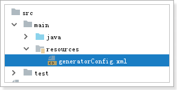
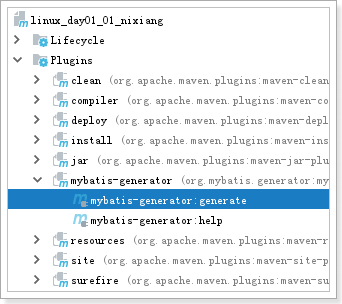
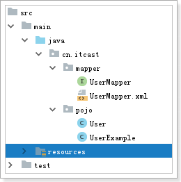
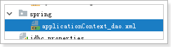
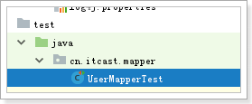

# 1 逆向工程

## 1.1 怎么生成

pom.xml

```xml
<?xml version="1.0" encoding="UTF-8"?>
<project xmlns="http://maven.apache.org/POM/4.0.0"
         xmlns:xsi="http://www.w3.org/2001/XMLSchema-instance"
         xsi:schemaLocation="http://maven.apache.org/POM/4.0.0 http://maven.apache.org/xsd/maven-4.0.0.xsd">
    <parent>
        <artifactId>itcast_parent</artifactId>
        <groupId>cn.itcast.maven</groupId>
        <version>1.0-SNAPSHOT</version>
        <relativePath>../itcast_parent/pom.xml</relativePath>
    </parent>
    <modelVersion>4.0.0</modelVersion>

    <artifactId>linux_day01_01_nixiang</artifactId>

    <build>
        <plugins>
            <plugin>
                <groupId>org.mybatis.generator</groupId>
                <artifactId>mybatis-generator-maven-plugin</artifactId>
                <version>1.3.5</version>
                <configuration>
                    <verbose>true</verbose>
                    <overwrite>true</overwrite>
                </configuration>
            </plugin>
        </plugins>
    </build>

    <dependencies>
        <dependency>
            <groupId>mysql</groupId>
            <artifactId>mysql-connector-java</artifactId>
            <version>5.1.34</version>
        </dependency>
    </dependencies>
</project>
```


 

```xml
<?xml version="1.0" encoding="UTF-8"?>
<!DOCTYPE generatorConfiguration
        PUBLIC "-//mybatis.org//DTD MyBatis Generator Configuration 1.0//EN"
        "http://mybatis.org/dtd/mybatis-generator-config_1_0.dtd">

<generatorConfiguration>
    <!--mysql 连接数据库jar 这里选择自己本地位置-->
    <classPathEntry location="E:/Maven_Repository/mysql/mysql-connector-java/5.1.34/mysql-connector-java-5.1.34.jar" />

    <context id="testTables" targetRuntime="MyBatis3">
        <commentGenerator>
            <!-- 是否去除自动生成的注释 true：是 ： false:否 -->
            <property name="suppressAllComments" value="true" />
        </commentGenerator>
        <!--数据库连接的信息：驱动类、连接地址、用户名、密码 -->
        <jdbcConnection driverClass="com.mysql.jdbc.Driver"
                        connectionURL="jdbc:mysql://localhost:3306/springmvc03_db"
                        userId="root"
                        password="123">
        </jdbcConnection>

        <!-- 默认false，把JDBC DECIMAL 和 NUMERIC 类型解析为 Integer，为 true时把JDBC DECIMAL 和
           NUMERIC 类型解析为java.math.BigDecimal -->
        <javaTypeResolver>
            <property name="forceBigDecimals" value="false" />
        </javaTypeResolver>

        <!-- targetProject:生成PO类的位置 -->
        <javaModelGenerator targetPackage="cn.itcast.pojo"
                            targetProject="src/main/java">
            <!-- enableSubPackages:是否让schema作为包的后缀 -->
            <property name="enableSubPackages" value="false" />
            <!-- 从数据库返回的值被清理前后的空格 -->
            <property name="trimStrings" value="true" />
        </javaModelGenerator>
        <!-- targetProject:mapper映射文件生成的位置
           如果maven工程只是单独的一个工程，targetProject="src/main/java"
           若果maven工程是分模块的工程，targetProject="所属模块的名称"，例如：
           targetProject="ecps-manager-mapper"，下同-->
        <sqlMapGenerator targetPackage="cn.itcast.mapper"
                         targetProject="src/main/java">
            <!-- enableSubPackages:是否让schema作为包的后缀 -->
            <property name="enableSubPackages" value="false" />
        </sqlMapGenerator>

        <!-- targetPackage：mapper接口生成的位置 -->
        <javaClientGenerator type="XMLMAPPER"
                             targetPackage="cn.itcast.mapper"
                             targetProject="src/main/java">
            <!-- enableSubPackages:是否让schema作为包的后缀 -->
            <property name="enableSubPackages" value="false" />
        </javaClientGenerator>

        <!-- 指定数据库表 -->
        <table schema="" tableName="tb_user" domainObjectName="User"
               enableCountByExample="false" enableUpdateByExample="false"
               enableDeleteByExample="false" enableSelectByExample="true"
               selectByExampleQueryId="false">
        </table>
    </context>
</generatorConfiguration>
```

 

 

## 1.2 怎么使用

 

### 1.2.1 导包

```xml
<?xml version="1.0" encoding="UTF-8"?>
<project xmlns="http://maven.apache.org/POM/4.0.0"
         xmlns:xsi="http://www.w3.org/2001/XMLSchema-instance"
         xsi:schemaLocation="http://maven.apache.org/POM/4.0.0 http://maven.apache.org/xsd/maven-4.0.0.xsd">
    <parent>
        <artifactId>itcast_parent</artifactId>
        <groupId>cn.itcast.maven</groupId>
        <version>1.0-SNAPSHOT</version>
        <relativePath>../itcast_parent/pom.xml</relativePath>
    </parent>
    <modelVersion>4.0.0</modelVersion>

    <artifactId>linux_day01_02</artifactId>
    <packaging>jar</packaging>
    <dependencies>
        <!-- 单元测试 -->
        <dependency>
            <groupId>junit</groupId>
            <artifactId>junit</artifactId>
        </dependency>

        <!-- Spring -->
        <dependency>
            <groupId>org.springframework</groupId>
            <artifactId>spring-webmvc</artifactId>
        </dependency>
        <dependency>
            <groupId>org.springframework</groupId>
            <artifactId>spring-jdbc</artifactId>
        </dependency>
        <dependency>
            <groupId>org.springframework</groupId>
            <artifactId>spring-aspects</artifactId>
        </dependency>
        <dependency>
            <groupId>org.springframework</groupId>
            <artifactId>spring-test</artifactId>
        </dependency>

        <!-- Mybatis -->
        <dependency>
            <groupId>org.mybatis</groupId>
            <artifactId>mybatis</artifactId>
        </dependency>
        <dependency>
            <groupId>org.mybatis</groupId>
            <artifactId>mybatis-spring</artifactId>
        </dependency>

        <!-- MySql -->
        <dependency>
            <groupId>mysql</groupId>
            <artifactId>mysql-connector-java</artifactId>
        </dependency>

        <dependency>
            <groupId>org.slf4j</groupId>
            <artifactId>slf4j-log4j12</artifactId>
        </dependency>

        <dependency>
            <groupId>com.alibaba</groupId>
            <artifactId>druid</artifactId>
        </dependency>


    </dependencies>

</project>
```

### 1.2.2 spring的配置文件

 

```xml
<?xml version="1.0" encoding="UTF-8"?>
<beans xmlns="http://www.springframework.org/schema/beans"
       xmlns:xsi="http://www.w3.org/2001/XMLSchema-instance"
       xmlns:context="http://www.springframework.org/schema/context"
       xsi:schemaLocation="http://www.springframework.org/schema/beans http://www.springframework.org/schema/beans/spring-beans.xsd http://www.springframework.org/schema/context http://www.springframework.org/schema/context/spring-context.xsd">
    <!--1 关联jdbc.properties-->
    <context:property-placeholder location="classpath:jdbc.properties"/>
    <!--2 连接池-->
    <bean id="ds" class="com.alibaba.druid.pool.DruidDataSource">
        <property name="driverClassName" value="${jdbc.driverClassName}"/>
        <property name="url" value="${jdbc.url}"/>
        <property name="username" value="${jdbc.username}"/>
        <property name="password" value="${jdbc.password}"/>
    </bean>
    <!--3 sqlsessionFactory-->
    <bean id="sqlSessionFactory" class="org.mybatis.spring.SqlSessionFactoryBean">
        <property name="dataSource" ref="ds"/>
        <property name="configLocation" value="classpath:mybatis/mybatis-config.xml"/>
        <property name="mapperLocations" value="classpath:mybatis/mapper/*Mapper.xml"/>
        <property name="typeAliasesPackage" value="cn.itcast.pojo"/>
    </bean>
    <!--4 将mapper接口实现类交给spring管理-->
    <bean class="org.mybatis.spring.mapper.MapperScannerConfigurer">
        <property name="basePackage" value="cn.itcast.mapper"/>
    </bean>
</beans>
```

### 1.2.3 测试

 

```java
package cn.itcast.mapper;

import cn.itcast.pojo.User;
import cn.itcast.pojo.UserExample;
import org.junit.Test;
import org.junit.runner.RunWith;
import org.springframework.beans.factory.annotation.Autowired;
import org.springframework.test.context.ContextConfiguration;
import org.springframework.test.context.junit4.SpringJUnit4ClassRunner;

import java.util.List;

@RunWith(SpringJUnit4ClassRunner.class)
@ContextConfiguration(locations = "classpath:spring/applicationContext_dao.xml")
public class UserMapperTest {

    @Autowired
    private UserMapper userMapper;

    @Test
    public void selectByPrimaryKey() throws Exception {
        User user = userMapper.selectByPrimaryKey(1L);
        System.out.println(user);
    }

    @Test
    public void selectByExample() throws Exception {
        // 需求: 查询所有的用户信息
        UserExample example = new UserExample();
        List<User> users = userMapper.selectByExample(example);
        for (User user : users) {
            System.out.println("============================================");
            System.out.println(user);
        }
    }

    @Test
    public void selectByExample02() throws Exception {
        // 需求: 查询姓李的用户 且 age=28
        UserExample example = new UserExample();

        UserExample.Criteria criteria = example.createCriteria();
        criteria.andNameLike("%李%");
        criteria.andAgeEqualTo(28);

        List<User> users = userMapper.selectByExample(example);
        for (User user : users) {
            System.out.println("============================================");
            System.out.println(user);
        }
    }

    @Test
    public void deleteByPrimaryKey() throws Exception {
        userMapper.deleteByPrimaryKey(7L);
    }

    @Test
    public void insert() throws Exception {
        User user = new User();
        user.setUserName("yangguo");
        userMapper.insert(user);
    }

    @Test
    public void insertSelective() throws Exception {
        User user = new User();
        user.setUserName("xiaolongnv");
        userMapper.insertSelective(user);
    }

    @Test
    public void updateByPrimaryKey() throws Exception {
        // 先查
        User user = userMapper.selectByPrimaryKey(8L);
        user.setName("杨过");
        user.setAge(1000);

        System.out.println("================================================================");
        // 后改
        userMapper.updateByPrimaryKey(user);
    }

    @Test
    public void updateByPrimaryKeySelective() throws Exception {
        User user = new User();
        user.setId(9L);
        user.setName("小龙女");

        userMapper.updateByPrimaryKeySelective(user);
    }

}
```

