[TOC]


# 1 网络原理

## 1.1 桥接原理

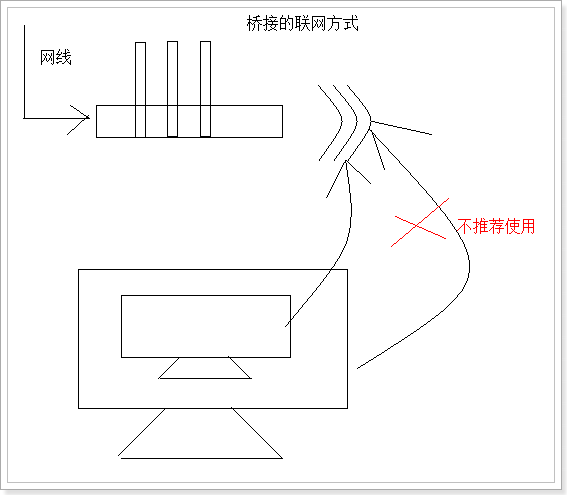 

因为 虚拟机的linux系统的ip地址是固定的, 更换路由器后导致无法使用, 所以 不推荐使用 

## 1.2 NAT原理

如果宿主电脑可以上网, 内部的虚拟机也可以上网就好了

NAT原理本质上就是 虚拟机实现了交换机的功能, linux系统的IP地址就不会随宿主电脑的ip地址更改而更改

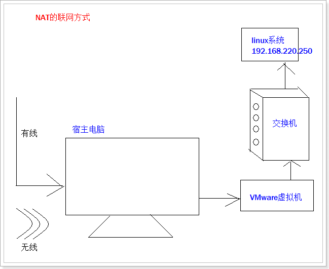 

推荐使用这种方式

# 2 怎么使linux上网

## 2.1 确保所有关于VMWare的服务都开启

计算机 --> 右键 '管理'

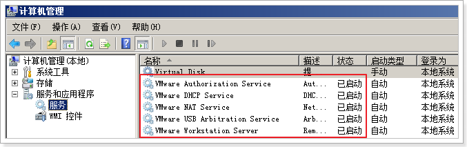 

## 2.2 确保VMnet8 已经启动

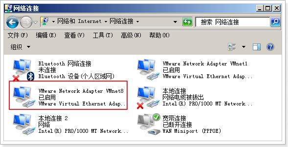 

## 2.3 设置VMware软件交换机的ip地址

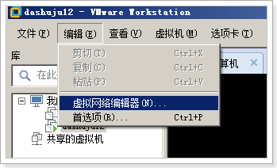 

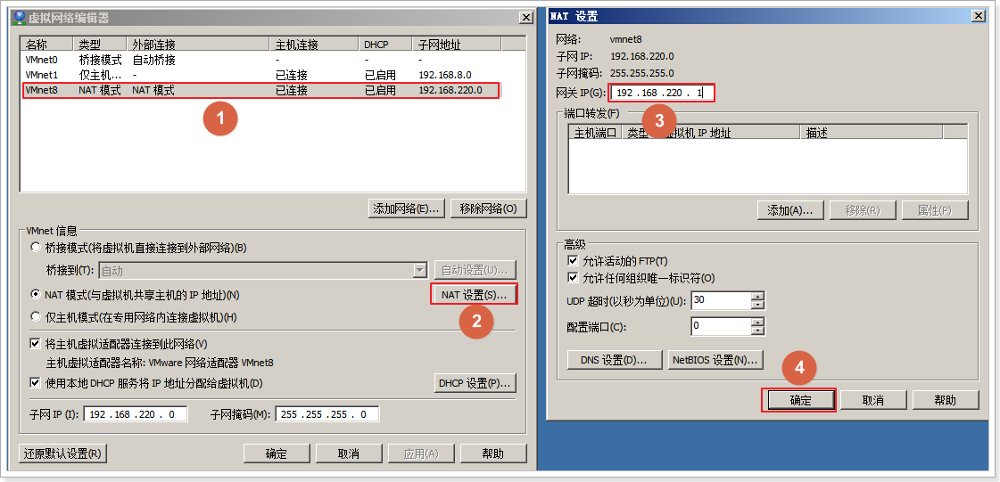

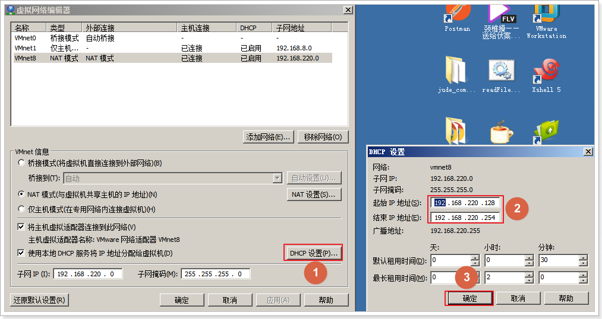

再次确认

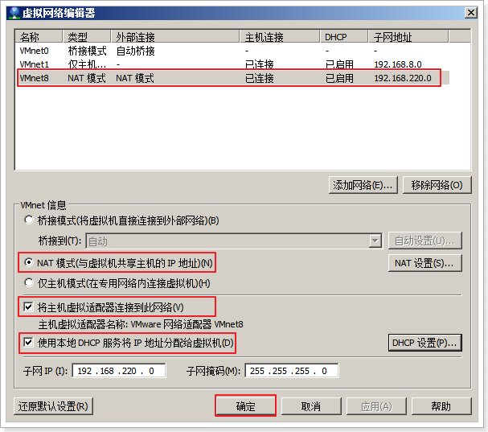 

## 2.4 设置VMnet8的ip地址

网关: 192.168.220.1

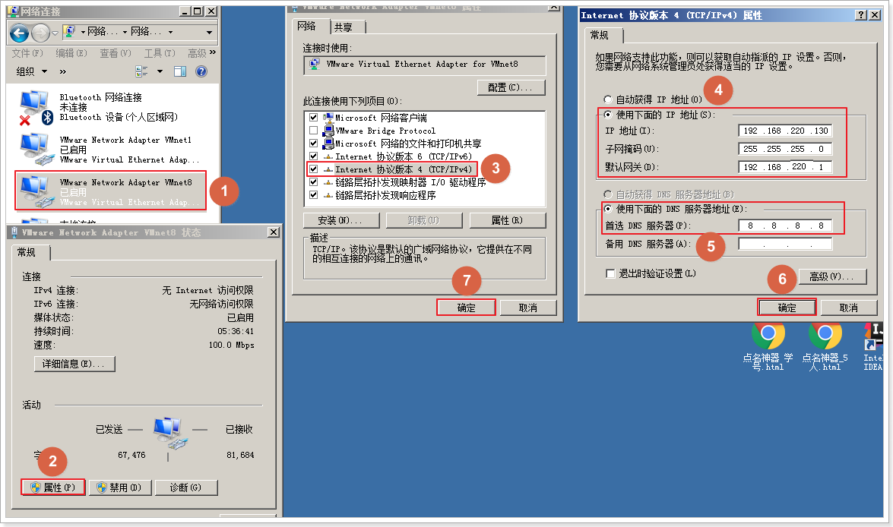

## 2.5 更改linux系统的ip地址

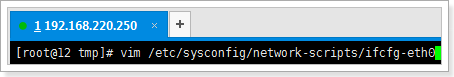 

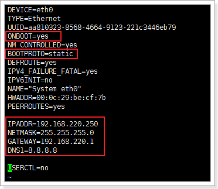 

```
vim /etc/sysconfig/network-scripts/ifcfg-eth0
```


```
DEVICE=eth0
TYPE=Ethernet
UUID=aa810323-8568-4664-9123-221c3446eb79
ONBOOT=yes
NM_CONTROLLED=yes
BOOTPROTO=none
DEFROUTE=yes
IPV4_FAILURE_FATAL=yes
IPV6INIT=no
NAME="System eth0"
HWADDR=00:0c:29:be:cf:7b
PEERROUTES=yes

IPADDR=192.168.220.250
NETMASK=255.255.255.0
GATEWAY=192.168.220.1
DNS1=8.8.8.8

USERCTL=no
```

改完后保存

## 2.6 重启网卡服务

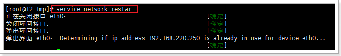 

## 2.7 测试

```
[root@my01 tmp]# wget http://pic1.win4000.com/pic/e/08/c2e2466031.jpg
```

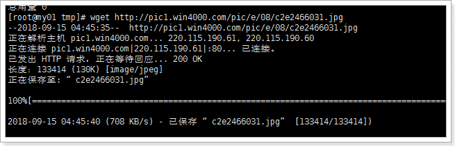 


# 3 防火墙

## 3.1 查看防火墙规则

查看防火墙状态

```
service iptables status
```

修改防火墙规则

```
vim /etc/sysconfig/iptables
```

放开某个端口号不被防火墙拦截,适用于部署tomcat,nginx等之类的软件：

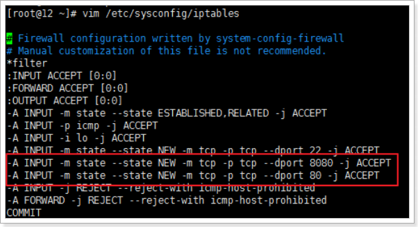 

设置完成后,需要重启防火墙.

重启防火墙

```
service iptables restart
```

## 3.2 关闭防火墙服务

```
service iptables stop
```

## 3.3 禁止防火墙关机自启动

```
chkconfig iptables off
```

查看自启动状态

```
chkconfig iptables --list
```

```
# 0 - 停机
# 1 - 单用户模式 
# 2 - 多用户，没有NFS 
# 3 - 完全多用户模式(标准的运行级) 
# 4 - 没有用到 
# 5 - X11(xwindow) 
# 6 - 重新启动 
```

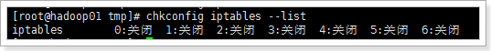 

注意: 在实际工作,大数据集群一般都是放置在内网当中,通过跳板机连接外网.**

**所以一般都是直接关闭防火墙即可, 但是在实际工作中,跳板机(web服务器)关闭防火墙要谨慎,避免服务器感染病毒**

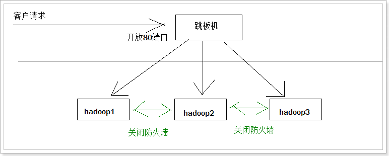


服务的套路:

```
service xxx	start		开启
service xxx	stop		停止
service xxx	restart		重启
service xxx	status		状态
```


# 4 复制linux系统

因为重新安装虚拟太慢了, 所以直接复制虚拟机

## 4.1 复制虚拟机

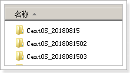 

## 4.2 开启复制之后的虚拟机

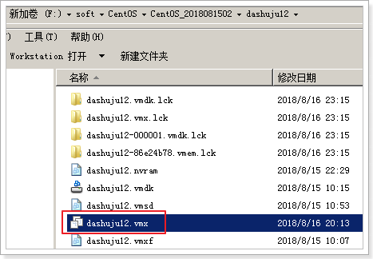 

注意：点击.vmx结尾的文件，就可以挂载上了

重命名

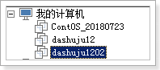 


## 4.3 更改新增linux的mac地址


## 4.4 更改新增linux系统的网卡

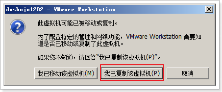 

```
vim /etc/udev/rules.d/70-persistent-net.rules
```

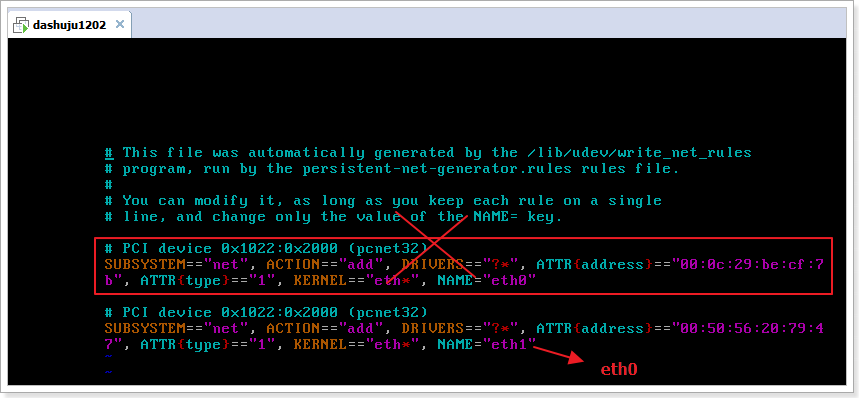

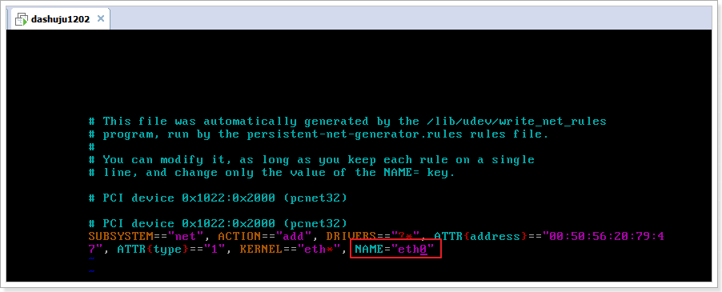

## 4.5 更改新增linux系统的网络设置

```
vim /etc/sysconfig/network-scripts/ifcfg-eth0
```

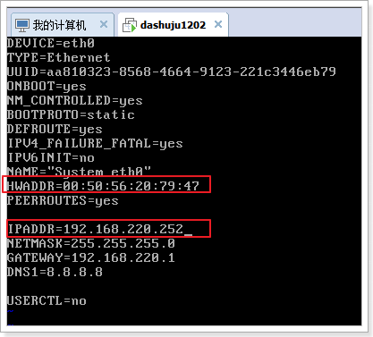 

使用 reboot指令重启系统, 再次验证

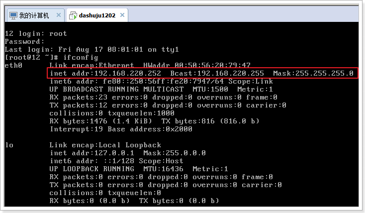


# 5 时钟同步(重点重点重点)

## 5.1 原理

内网的所有服务器都和时钟服务器进行同步时间

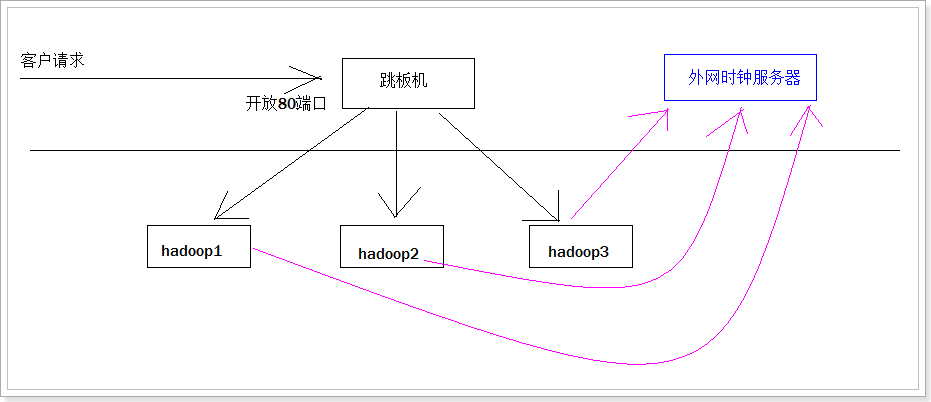

## 5.2 如何同步

1. 查看本机当前时间

```
date
```

2. 设置本机当前时间

```
date -s "2018-08-17 20:08:09"
```

3. 通过命名和时钟服务器同步时间:

   网络计时协议（NTP） : net time protocal

```
ntpdate us.pool.ntp.org
```

4. 编辑定时任务

   e edit 编辑

```
crontab -e 
```

4.1 定时任务内容如下

```
*/1 * * * * /usr/sbin/ntpdate us.pool.ntp.org; 
```

每隔1分钟执行指令一次

 

[](https://www.cnblogs.com/xingzc/p/5969777.html)

# 6 主机名

## 6.1 更改主机名

```
vim /etc/sysconfig/network
```

### 6.1.1 内容

```
HOSTNAME=hadoop1
```

同理 更改每台linux的主机名

HOSTNAME=hadoop1

HOSTNAME=hadoop2

HOSTNAME=hadoop3

**注意: 必须重启系统才可以生效**

## 6.2 更改三台机器的主机名与ip地址的映射

```
vim  /etc/hosts
```

### 6.2.2 内容

```
192.168.220.250 hadoop1
192.168.220.251 hadoop2
192.168.220.252 hadoop3
```

## 6.3 三台虚拟机关闭selinux

```
vim /etc/selinux/config
```

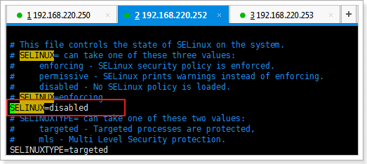 

```
SELINUX=disabled
```

关机重启才会生效.

# 7 SSH免密码登录

## 7.1 what?

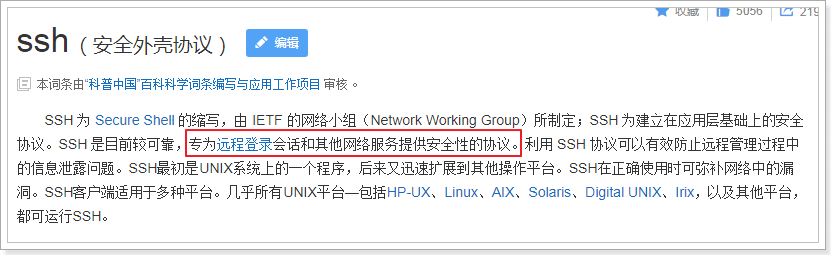

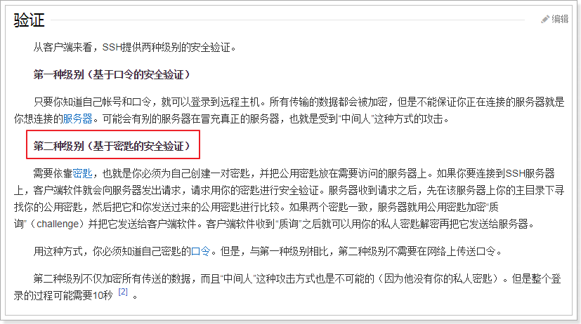


## 7.2 远程访问方式一

```
[root@hadoop1 ~]# ssh hadoop2
root@hadoop2's password: 
Last login: Fri Aug 17 17:15:00 2018 from hadoop1
[root@hadoop2 ~]# ifconfig
eth0      Link encap:Ethernet  HWaddr 00:50:56:20:79:47  
          inet addr:192.168.220.252  Bcast:192.168.220.255  Mask:255.255.255.0
          inet6 addr: fe80::250:56ff:fe20:7947/64 Scope:Link
          UP BROADCAST RUNNING MULTICAST  MTU:1500  Metric:1
          RX packets:839 errors:0 dropped:0 overruns:0 frame:0
          TX packets:580 errors:0 dropped:0 overruns:0 carrier:0
          collisions:0 txqueuelen:1000 
          RX bytes:77419 (75.6 KiB)  TX bytes:55550 (54.2 KiB)
          Interrupt:19 Base address:0x2000 

lo        Link encap:Local Loopback  
          inet addr:127.0.0.1  Mask:255.0.0.0
          inet6 addr: ::1/128 Scope:Host
          UP LOOPBACK RUNNING  MTU:16436  Metric:1
          RX packets:114 errors:0 dropped:0 overruns:0 frame:0
          TX packets:114 errors:0 dropped:0 overruns:0 carrier:0
          collisions:0 txqueuelen:0 
          RX bytes:6026 (5.8 KiB)  TX bytes:6026 (5.8 KiB)

[root@hadoop2 ~]# exit
logout
Connection to hadoop2 closed.
```

**缺点: 每次都需要输入密码**


## 7.2 远程访问方式二:免密码

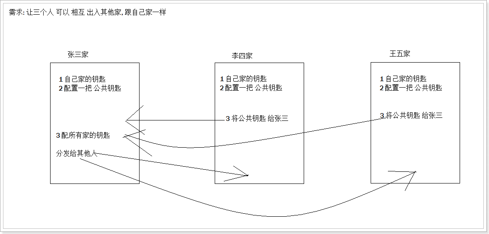

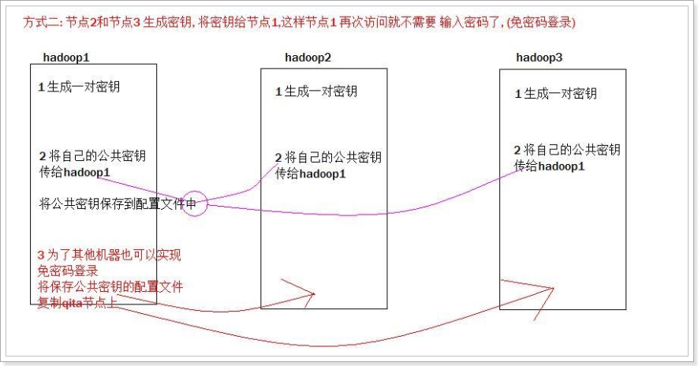 

```
	第一步: ssh-keygen -t rsa  在hadoop1和hadoop2和hadoop3上面都要执行，产生公钥和私钥
	第二步：ssh-copy-id hadoop1 将公钥拷贝到hadoop1上面去
	
	第三步：
			scp authorized_keys hadoop2:$PWD
			scp authorized_keys hadoop3:$PWD
```

注意1: 第三步需要在/root/.ssh/目录下.

注意2: 先测试第二台机器免密码登录, 发现有时handoop01有问题,但是 过一会就好了.


#### 


