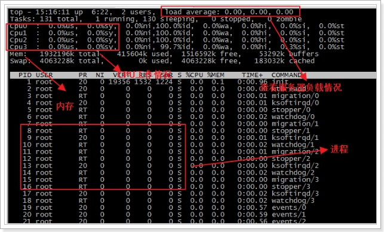
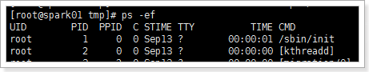
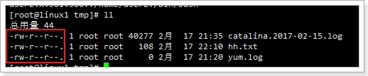
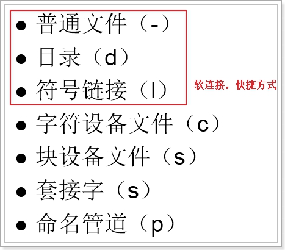
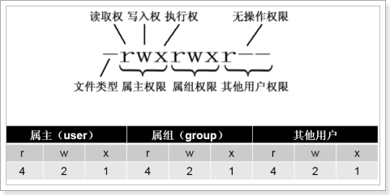
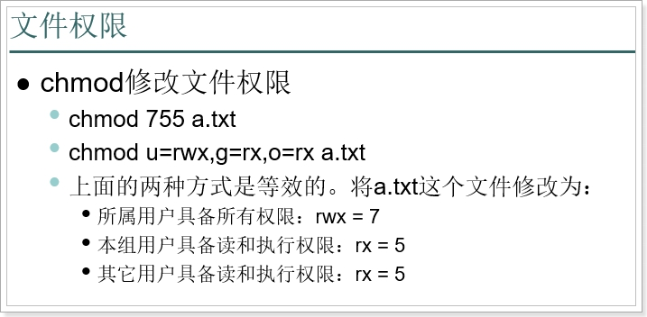

# 1 系统相关命令

## 1.1 系统基本信息(了解)

date  显示或设置系统时间

```
date  显示当前系统时间

date -s “2014-01-01 10:10:10” 设置系统时间
```


df 显示磁盘信息 disk free

```
df –h  友好显示大小 
```


free 显示内存状态

```
free –m 以mb单位显示内存状态
```


who 显示目前登入系统的用户信息。

 ```
who
 ```


hostname 查看当前主机名

```
修改：vi /etc/sysconfig/network 
```


uname 显示系统信息。

```
uname –a 显示本机详细信息。

依次为：内核名称(类别)，主机名，内核版本号，内核版本，内核编译日期，硬件名，处理器类型，硬件平台类型，操作系统名称
```

## 1.2 系统运行状态(了解)

top命令用于动态的监视进程活动与系统负载等信息，格式为：“top”。

这个top命令可真的是太厉害了，完全可以比喻成是“强化版的Windows任务管理器”，运行界面如图所示：



第一行(top)：

　　“15:16:11”为系统当前时刻;

　　“6:22”为系统启动后到现在的运作时间;

　　“2 users”为当前登录到系统的用户，更确切的说是登录到用户的终端数 -- 同一个用户同一时间对系统多个终端的连接将被视为多个用户连接到系统，这里的用户数也将表现为终端的数目;

　　“load average”为当前系统负载的平均值，后面的三个值分别为1分钟前、5分钟前、15分钟前进程的平均数，一般的可以认为这个数值超过 CPU 数目时，CPU 将比较吃力的负载当前系统所包含的进程;

第二行(Tasks)：

　　“131 total”为当前系统进程总数;

　　“1 running”为当前运行中的进程数;

　　“130 sleeping”为当前处于等待状态中的进程数;

　　“0 stoped”为被停止的系统进程数;

　　“0 zombie”未被复原的进程数（僵尸进程）;

第三行(Cpus)：

分别表示了 CPU 当前的使用率;

“0.1% us”：用户进程占用CPU百分比

“0.1% sy”：内核进程占用CPU百分比  

“0.1% ni”：用户进程空间内改变过优先级的进程占用CPU百分比  

“99.7% id”：空闲CPU百分比  

“0.0% wa”：等待输入输出的CPU时间百分比  

“0.0% hi”：硬件中断请求时间     

“0.0% si”：软终端请求时间

第四行(Mem)：

　　分别表示了内存总量、当前使用量、空闲内存量、以及缓冲使用中的内存量;

第五行(Swap)：

表示类别同第四行(Mem)，但此处反映着交换分区(Swap)的使用情况。通常，交换分区(Swap)被频繁使用的情况，将被视作物理内存不足而造成的。

列表部分：

PID：进程id

USER；进程所有者的用户名

PR：进程的优先级

NI：nice值。负值表示高优先级，正值表示低优先级

VIRT -- 进程使用的虚拟内存总量，单位kb。VIRT=SWAP+RES

RES -- 进程使用的、未被换出的物理内存大小，单位kb。RES=CODE+DATA

SHR -- 共享内存大小，单位kb

S -- 进程状态。

                D =不可中断的睡眠状态
    
                R =运行
    
                S =睡眠
    
                T =跟踪/停止
    
                Z =僵尸进程  

 


%CPU -- 上次更新到现在的CPU时间占用百分比  

%MEM -- 进程使用的物理内存 百分比

TIME+ -- 进程使用的CPU时间总计，单位1/100秒 

COMMAND：启动任务的命令行（包括参数）

## 1.3 系统进程管理（掌握）

```
ps(Process Status) 	翻译: 进程状态
	-e(all processes)	翻译: 所有的进程
    -f(full)	翻译: 完整的
```


通过ps 命令可以查看Linux中的进程 

ps 正在运行的某个进程的状态

```
ps –ef  			查看所有进程

ps –ef | grep mysql 	查找mysql软件进程 
```


 

| 列序号 | 列含义 | 列含义说明                  |
| ------ | ------ | --------------------------- |
| 1      | UID    | 用户标识ID                  |
| 2      | PID    | 进程ID                      |
| 3.     | PPID   | 父进程ID                    |
| 4      | C      | CPU占用率                   |
| 5      | STIME  | 进程开始时间                |
| 6      | TTY    | 启动此进程的TTY（终端设备） |
| 7      | TIME   | 此进程运行的总时间          |
| 8      | CMD    | 完整的命令名(带启动参数)    |

ps aux命令可以查看更详细的进程信息！


 杀掉指定进程

```
kill 杀掉某一进程

kill 2868  杀掉2868编号的进程

kill -9 2868  强制杀死进程 
```

## 1.4 开机和关机管理

关机命令

```
shutdown -h now  （立刻关机）

shutdown -h 5  （5分钟后关机）

poweroff  （立刻关机）

halt （立刻关机）
```

重启命令

```
shutdown -r now (立刻重启)

shutdown -r 5 (5分钟重启)

reboot （立刻重启）
```


# 2 权限管理 

我们查看文件列表时，前面有一串信息：



其含义是：

 

read	读

write	写

execute	执行

## 2.1 文件类型

第一个位置代表的是Linux中的文件类型： 

  

创建软连接(快捷方式)的方式：

	ln -s 源文件地址 联接地址

例如：

	ln –s /usr/local/jdk_1.7.52 /usr/jdk
	
	这样就用 /usr/jdk  指向了 /user/local/jdk_1.7.52这个文件夹

需求

```
1 创建目录 /usr/tmp/aaa/bbb/ccc/ddd
2 在目录 /usr/tmp/aaa/bbb/ccc/ddd 下 创建文件 1.txt
3 给目录 /usr/tmp/aaa/bbb/ccc/ddd 创建快捷方式, 指定别名为 /abcd
4 跳转到 /abcd, 查看内容
```


答案

```
[root@itheima16 tmp]# mkdir -p /usr/tmp/aaa/bbb/ccc/ddd
[root@itheima16 tmp]# cd /usr/tmp/aaa/bbb/ccc/ddd
[root@itheima16 ddd]# ll
总用量 0
[root@itheima16 ddd]# touch 1.txt
[root@itheima16 ddd]# ll
总用量 0
-rw-r--r--. 1 root root 0 7月  24 04:41 1.txt
[root@itheima16 ddd]# ln -s /usr/tmp/aaa/bbb/ccc/ddd /abcd
[root@itheima16 ddd]# cd /
[root@itheima16 /]# ll
[root@itheima16 /]# cd /abcd
[root@itheima16 abcd]# ll
总用量 0
-rw-r--r--. 1 root root 0 7月  24 04:41 1.txt
```

## 2.2 文件权限



 

权限分段，每一段代表不同的用户：

属主权限：当前文件所属用户的权限，在Linux中每一个文件都有所属的用户

属组权限：当前文件的用户所在组的其它成员的权限

其它用户权限：跟文件所属用户不在同组的其它用户的权限

 

每一段中的内容都是一样的，分别限定：读（r=4）、写（w=2）、执行（x=1）

 

rwx		7		具备所有权限(421) 

rw-		6		具备读写权限(420)

r-x		5		具备读和执行权限(401)

r--		4		具备只读权限(400)

-wx		3		具备写和执行权限(021)

-w-		2		具备写权限(020)

--x		1		具备执行权限(001)

---		0		000

问题:

```
1 777 什么意思?
2 644 什么意思
3 755 什么意思?
```


答案

```
777 所属用户具有 读写执行权限, 所属同组用户具有 读写执行权限, 其他人具有 读写执行权限
644 所属用户具有 读写权限, 所属同组用户具有 读权限, 其他人具有 读权限
755 所属用户具有 读写执行权限, 所属同组用户具有 读执行权限, 其他人具有 读执行权限
```

## 2.3 权限管理

修改文件权限



需求:

```
1 新增 /usr/tmp/1.txt 文件 且 查看 权限
2 修改权限为 777(方式一)
3 修改权限为 755(方式二)
```


答案

```
[root@itheima16 tmp]# touch /usr/tmp/1.txt
[root@itheima16 tmp]# ll
总用量 0
-rw-r--r--. 1 root root 0 7月  24 05:15 1.txt
[root@itheima16 tmp]# chmod 777 1.txt
[root@itheima16 tmp]# ll
总用量 0
-rwxrwxrwx. 1 root root 0 7月  24 05:15 1.txt
[root@itheima16 tmp]# chmod u=rwx,g=rx,o=rx 1.txt
[root@itheima16 tmp]# ll
总用量 0
-rwxr-xr-x. 1 root root 0 7月  24 05:15 1.txt
```

