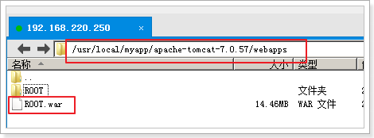
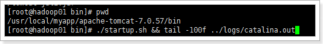

# 1 搭建Linux环境，部署WEB项目

## 1.1 linux安装JDK

安装完Centos6.5的Base Server版会默认安装OpenJDK，首先需要删除OpenJDK

 

 

1、查看以前是不是安装了openjdk

如果不是root用户需要切换到root用户（su - root）

命令：rpm -qa | grep java

 ```
RPM软件包管理器
	英文原义：RPM Package Manager（原Red Hat Package Manager，现在是一个递归缩写）
	－qa: 查找相应文件，如 rpm -qa mysql
		q(query)	翻译: 查询
		a(all)		翻译: 所有
 ```


显示如下：（有则卸载，没有就不用），注意版本可能会有些不一样，以实际操作的为准。

tzdata-java-2013g-1.el6.noarch

java-1.7.0-openjdk-1.7.0.45-2.4.3.3.el6.x86_64

java-1.6.0-openjdk-1.6.0.0-1.66.1.13.0.el6.x86_64

 

2、卸载openjdk：

（其中参数“tzdata-java-2013j-1.el6.noarch”为上面查看中显示的结果，粘进来就行，如果你显示的不一样，请复制你查询到的结果）

rpm -e --nodeps java-1.6.0-openjdk-1.6.0.0-1.66.1.13.0.el6.i686
rpm -e --nodeps java-1.7.0-openjdk-1.7.0.45-2.4.3.3.el6.i686
rpm -e --nodeps tzdata-java-2013g-1.el6.noarch

```
-e 			erase package(uninstall)			移除包(卸载)
--nodeps	do not verify package dependencies	不要验证包依赖关系
```


3、安装jdk

（1）、切换到root用户并进入usr目录： cd /usr

（2）、在usr目录下创建java文件夹： mkdir java

（3）、将jdk-7u71-linux-x64.tar.gz拷贝或上传到java目录下（也可以用工具）

 

（4）、进入/usr/java文件夹下：cd /usr/java/

（5）、修改权限，参数“jdk-7u71-linux-x64.tar.gz”为你自己上传的jdk安装文件

chmod 755 jdk-7u71-linux-x64.tar.gz

（6）、解压：tar –zxvf jdk-7u71-linux-x64.tar.gz

（7）、配置环境变量

vi /etc/profile

添加内容：

 ```
export JAVA_HOME=/usr/java/jdk1.7.0_71
export PATH=$PATH:$JAVA_HOME/bin
export CLASSPATH=.:$JAVA_HOME/lib/dt.jar:$JAVA_HOME/lib/tools.jar
export JAVA_HOME PATH CLASSPATH
 ```

/usr/java/jdk1.7.0_71

（8）、重新编译环境变量

```
source /etc/profile 
```

（9）、测试

```
java -version
```

 

## 1.2 安装Tomcat

 

安装Tomcat

1、进入tomcat压缩文件的目录中：cd /usr/local/myapp/

2、解压tomcat压缩文件：tar -zxvf apache-tomcat-7.0.57.tar.gz

 

3、关闭防火墙（永久，需要重启）：chkconfig iptables off

4、重启机器：reboot

 

注意，这里也可以只打开tomcat所需端口：8080

```
/sbin/iptables -I INPUT -p tcp --dport 8080 -j ACCEPT
/etc/rc.d/init.d/iptables save
/etc/init.d/iptables status
```


 

5、启动tomcat：

进入tomcat的bin目录：cd /usr/local/myapp/apache-tomcat-7.0.57/bin/

启动tomcat web服务器：./startup.sh

 

访问：192.168.220.250:8080

 

6、停止tomcat：./shutdown.sh

7、查看tomcat日志信息：

```
tail -200f /usr/local/myapp/apache-tomcat-7.0.57/logs/catalina.out
```

200表示最后显示行数

 

也可以用组合命令，启动并查看日志：

进入tomcat的bin目录

```
./startup.sh && tail -200f ../logs/catalina.out 
```

设置tomcat开机启动(可选)

在/etc/rc.d/rc.local文件最后添加

```
export JAVA_HOME=/usr/java/jdk1.7.0_71
/usr/local/myapp/apache-tomcat-7.0.57/bin/startup.sh start
```

## 1.3 Linux下安装Mysql

需求

```
1 卸载默认自带的mysql
2 安装mysql
3 修改编码集
4 允许远程访问
```


1、查看是否有自带的MySql

查看：rpm -qa | grep mysql

 

2、卸载自带的MySql

删除：rpm -e --nodeps 查看到的选项

 

3、解压缩

进入MySql目录 : cd /usr/local/myapp/

解压安装包：得到安装文件：

 

4、安装服务端

修改权限：chmod 777 MySQL-server-5.6.34-1.rhel5.x86_64.rpm

执行安装：rpm -ivh MySQL-server-5.6.34-1.rhel5.x86_64.rpm --nodeps --force

注：--nodeps --force 表示不检查依赖

```
rpm -ivh 服务端程序 --nodeps --force
```


5、安装客户端：client

修改权限：		chmod 777 MySQL-client-5.6.34-1.rhel5.x86_64.rpm

执行安装：		rpm -ivh MySQL-client-5.6.34-1.rhel5.x86_64.rpm --nodeps --force

 ```
rpm -ivh 客户端程序 --nodeps --force
 ```


6、启动和关闭mysql

```
启动mysql:	service mysql start
关闭mysql:	service mysql stop
重启mysql:	service mysql restart
```


7、添加密码

/usr/bin/mysqladmin -u root password '123456'


A7tZg_1fk4cRMvTR


错误1：

如果是安装的5.6，会生成随机密码：


1）进入该文件查看密码

	vi /root/.mysql_secret

2）使用这个密码登录mysql

	mysql –uroot –p密码

3）修改密码

	SET PASSWORD = PASSWORD('123');

 


错误2：

/usr/bin/mysqladmin: connect to server at 'localhost' failed

error: 'Can't connect to loca* MySQ* server through socket '/var/lib/mysql/mysql.sock' (2)'

Check that mysqld is running and that the socket: '/var/lib/mysql/mysql.sock' exists!

可能是mysql服务启动失败，或者没有启动

 

ps –ef | grep mysql查看一下，是否有进程，如果没有，重新启动mysql服务

如果有，使用kill -9 进程id 来杀死mysql进程，重新启动

 

 

8、修改mysql的编码表

1）查看/etc下是否有my.cnf文件，如果有则删除

2）上传课前资料中的my.cnf到/etc下

3）重启mysql服务

	service mysql restart

4）登录mysql,查看编码表

	先登录mysql：
	
	mysql –uroot –p123456

查看编码表：

	show variables like '%char%';

 


5.5版本的同学：

1）切换到mysql目录：

	cd /usr/share/mysql

2）复制my-small.cnf 到 /etc/my.cnf

	cp my-small.cnf /etc/my.cnf

3）修改my.cnf,添加一些内容：

	【client】下面添加：default-character-set = utf8
	
	【mysqld】下面添加：character_set_server = utf8 

 


9、设置允许远程连接mysql

尝试使用远程连接，发现报错：


 

 

（1）进入 mysql：

mysql -u root -p

（2）使用 mysql库 ：

```
use mysql;
```

（3）查看用户表 ：

```
SELECT Host,User FROM user;
```

（4）授权用户 ：

```
grant all privileges on *.* to 'root' @'%' identified by '123'; 
```

（5）强制刷新权限 ：

```
flush privileges;
```


10、配置MySQL自启动(可选操作)

1）加入到系统服务：

```
chkconfig --add mysql
```

2）自动启动：

```
chkconfig mysql on
```

3）查询列表：

```
chkconfig
```


在linux中执行shell脚本文件：

	1、./xxx.sh
	
	2、sh xxx.sh

 


## 1.4 部署项目到tomcat，并访问

 ### 1.4.1 将项目打成war包

 

### 1.4.2 改名成ROOT.war包

 

### 1.4.3 复制到 tomcat/webapps目录下

 

### 1.4.4 启动测试

```
[root@hadoop01 bin]# ./startup.sh && tail -100f ../logs/catalina.out
```

 

  

 