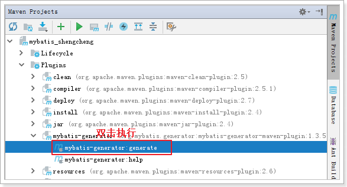
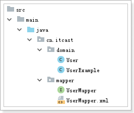
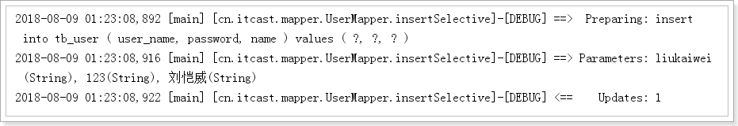
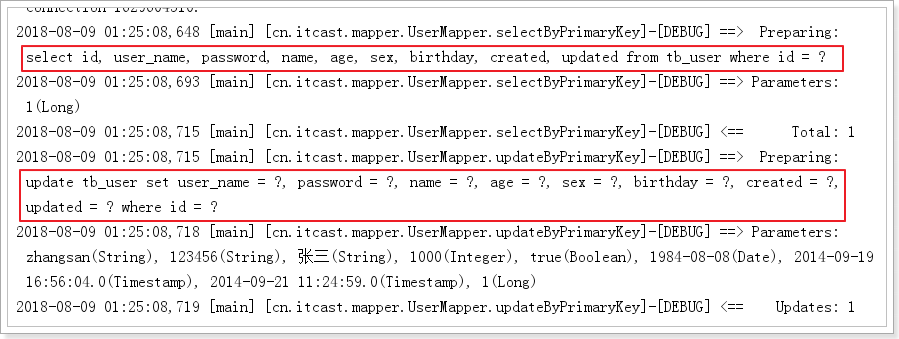
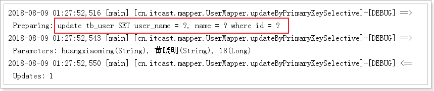
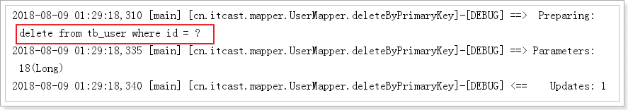

1. 框架整合 debug测试
2. 聚合工程
3. 逆向工程

# 1 什么是逆向工程?

　　mybatis的一个主要的特点就是需要程序员自己编写sql，那么如果表太多的话，难免会很麻烦，所以mybatis官方提供了一个逆向工程，可以针对单表自动生成mybatis执行所需要的代码（包括mapper.xml、mapper.java、pojo）。一般在开发中，常用的逆向工程方式是通过数据库的表生成代码。 

# 2 HOW?

## 2.1 创建maven工程(略)

## 2.2 pom.xml : 添加插件和依赖

```xml
<build>
    <plugins>
        <plugin>
            <groupId>org.mybatis.generator</groupId>
            <artifactId>mybatis-generator-maven-plugin</artifactId>
            <version>1.3.5</version>
            <configuration>
                <verbose>true</verbose>
                <overwrite>true</overwrite>
            </configuration>
        </plugin>
    </plugins>
</build>

<dependencies>
    <dependency>
        <groupId>mysql</groupId>
        <artifactId>mysql-connector-java</artifactId>
        <version>5.1.34</version>
    </dependency>
</dependencies>
```

## 2.3 配置文件

在maven项目下的src/main/resources 目录下建立名为 generatorConfig.xml的配置文件，作为mybatis-generator-maven-plugin 插件的执行目标，模板如下

```xml
<?xml version="1.0" encoding="UTF-8"?>
<!DOCTYPE generatorConfiguration
        PUBLIC "-//mybatis.org//DTD MyBatis Generator Configuration 1.0//EN"
        "http://mybatis.org/dtd/mybatis-generator-config_1_0.dtd">

<generatorConfiguration>
    <!--mysql 连接数据库jar 这里选择自己本地位置-->
    <classPathEntry location="E:/Maven_Repository/mysql/mysql-connector-java/5.1.34/mysql-connector-java-5.1.34.jar" />

    <context id="testTables" targetRuntime="MyBatis3">
        <commentGenerator>
            <!-- 是否去除自动生成的注释 true：是 ： false:否 -->
            <property name="suppressAllComments" value="true" />
        </commentGenerator>
        <!--数据库连接的信息：驱动类、连接地址、用户名、密码 -->
        <jdbcConnection driverClass="com.mysql.jdbc.Driver"
                        connectionURL="jdbc:mysql://localhost:3306/mybatis_db"
                        userId="root"
                        password="123">
        </jdbcConnection>

        <!-- 默认false，把JDBC DECIMAL 和 NUMERIC 类型解析为 Integer，为 true时把JDBC DECIMAL 和
           NUMERIC 类型解析为java.math.BigDecimal -->
        <javaTypeResolver>
            <property name="forceBigDecimals" value="false" />
        </javaTypeResolver>

        <!-- targetProject:生成PO类的位置 -->
        <javaModelGenerator targetPackage="cn.itcast.pojo"
                            targetProject="src/main/java">
            <!-- enableSubPackages:是否让schema作为包的后缀 -->
            <property name="enableSubPackages" value="false" />
            <!-- 从数据库返回的值被清理前后的空格 -->
            <property name="trimStrings" value="true" />
        </javaModelGenerator>
        <!-- targetProject:mapper映射文件生成的位置
           如果maven工程只是单独的一个工程，targetProject="src/main/java"
           若果maven工程是分模块的工程，targetProject="所属模块的名称"，例如：
           targetProject="ecps-manager-mapper"，下同-->
        <sqlMapGenerator targetPackage="cn.itcast.mapper"
                         targetProject="src/main/java">
            <!-- enableSubPackages:是否让schema作为包的后缀 -->
            <property name="enableSubPackages" value="false" />
        </sqlMapGenerator>

        <!-- targetPackage：mapper接口生成的位置 -->
        <javaClientGenerator type="XMLMAPPER"
                             targetPackage="cn.itcast.mapper"
                             targetProject="src/main/java">
            <!-- enableSubPackages:是否让schema作为包的后缀 -->
            <property name="enableSubPackages" value="false" />
        </javaClientGenerator>

        <!-- 指定数据库表 -->
        <table schema="" tableName="tb_user" domainObjectName="User"
               enableCountByExample="false" enableUpdateByExample="false"
               enableDeleteByExample="false" enableSelectByExample="true"
               selectByExampleQueryId="false">
        </table>
    </context>
</generatorConfiguration>
```

## 2.4 运行插件

使用maven运行mybatis-generator-maven-plugin插件：

工程名->Plugins->mybatis-generator->mybatis-generator:generate->Run Maven Build

 

## 2.5 自动生成的结构

 


# 3 MyBatis的Mapper接口以及Example的实例函数及详解

## 3.1 mapper接口的方法

| 方法                                                         | 功能说明                                                     |
| ------------------------------------------------------------ | ------------------------------------------------------------ |
| int countByExample(UserExample example) thorws SQLException  | 按条件计数                                                   |
| int deleteByPrimaryKey(Integer id) thorws SQLException       | 按主键删除                                                   |
| int deleteByExample(UserExample example) thorws SQLException | 按条件查询                                                   |
| String/Integer insert(User record) thorws SQLException       | 插入数据（返回值为ID）                                       |
| User selectByPrimaryKey(Integer id) thorws SQLException      | 按主键查询                                                   |
| List selectByExample(UserExample example) thorws SQLException | 按条件查询                                                   |
| List selectByExampleWithBLOGs(UserExample example) thorws SQLException | 按条件查询（包括BLOB字段）。只有当数据表中的字段类型有为二进制的才会产生。 |
| int updateByPrimaryKey(User record) thorws SQLException      | 按主键更新                                                   |
| int updateByPrimaryKeySelective(User record) thorws SQLException | 按主键更新值不为null的字段                                   |
| int updateByExample(User record, UserExample example) thorws SQLException | 按条件更新                                                   |
| int updateByExampleSelective(User record, UserExample example) thorws SQLException | 按条件更新值不为null的字段                                   |

## 3.2 Exaple实例解析

mybatis的逆向工程中会生成实例及实例对应的example，example用于添加条件，相当where后面的部分  xxxExample example = new xxxExample();  

Criteria criteria = new Example().createCriteria(); 

| 方法                                       | 说明                                          |
| ------------------------------------------ | --------------------------------------------- |
| example.setOrderByClause(“字段名 ASC”);    | 添加升序排列条件，DESC为降序                  |
| example.setDistinct(false)                 | 去除重复，boolean型，true为选择不重复的记录。 |
| criteria.andXxxIsNull                      | 添加字段xxx为null的条件                       |
| criteria.andXxxIsNotNull                   | 添加字段xxx不为null的条件                     |
| criteria.andXxxEqualTo(value)              | 添加xxx字段等于value条件                      |
| criteria.andXxxNotEqualTo(value)           | 添加xxx字段不等于value条件                    |
| criteria.andXxxGreaterThan(value)          | 添加xxx字段大于value条件                      |
| criteria.andXxxGreaterThanOrEqualTo(value) | 添加xxx字段大于等于value条件                  |
| criteria.andXxxLessThan(value)             | 添加xxx字段小于value条件                      |
| criteria.andXxxLessThanOrEqualTo(value)    | 添加xxx字段小于等于value条件                  |
| criteria.andXxxIn(List<？>)                | 添加xxx字段值在List<？>条件                   |
| criteria.andXxxNotIn(List<？>)             | 添加xxx字段值不在List<？>条件                 |
| criteria.andXxxLike(“%”+value+”%”)         | 添加xxx字段值为value的模糊查询条件            |
| criteria.andXxxNotLike(“%”+value+”%”)      | 添加xxx字段值不为value的模糊查询条件          |
| criteria.andXxxBetween(value1,value2)      | 添加xxx字段值在value1和value2之间条件         |
| criteria.andXxxNotBetween(value1,value2)   | 添加xxx字段值不在value1和value2之间条件       |

## 3.3 应用举例

### 3.3.1 查询

#### 3.3.3.1 根据主键查询用户信息

select * from tb_user where id=?

```java
package cn.itcast.mapper;

import cn.itcast.domain.User;
import cn.itcast.domain.UserExample;
import org.apache.ibatis.io.Resources;
import org.apache.ibatis.session.SqlSession;
import org.apache.ibatis.session.SqlSessionFactory;
import org.apache.ibatis.session.SqlSessionFactoryBuilder;
import org.junit.Before;
import org.junit.Test;

import java.io.InputStream;
import java.util.ArrayList;
import java.util.Collections;
import java.util.List;

public class UserMapperTest {

    private UserMapper userMapper;

    @Before
    public void setUp() throws Exception {
        InputStream in = Resources.getResourceAsStream("mybatis-config.xml");
        SqlSessionFactory sqlSessionFactory = new SqlSessionFactoryBuilder().build(in);
        SqlSession sqlSession = sqlSessionFactory.openSession(true);
        userMapper = sqlSession.getMapper(UserMapper.class);
    }

    @Test
    public void selectByPrimaryKey() throws Exception {
        User user = userMapper.selectByPrimaryKey(1L);
        System.out.println(user);
    }

}
```

#### 3.3.3.2 查询所有的用户

select * from tb_user

```java
@Test
public void selectByExample() {
    UserExample example = new UserExample();
    List<User> userList = userMapper.selectByExample(example);
    for (User user : userList) {
        System.out.println(user);
    }
}
```

#### 3.3.3.3 根据编号查询多个用户

select * from tb_user where id in (?, ?, ?)

```java
@Test
public void selectByExample2() {
    UserExample example = new UserExample();

    UserExample.Criteria criteria = example.createCriteria();
    List<Long> idList = new ArrayList<Long>();
    Collections.addAll(idList, 1L, 2L, 3L);
    criteria.andIdIn(idList);
    

    List<User> userList = userMapper.selectByExample(example);
    for (User user : userList) {
        System.out.println(user);
    }
}
```


```java
@Test
public void selectByExample02() throws Exception {
    // 需求: 查询所有姓李的用户信息 和 年龄是28
    UserExample userExample = new UserExample();
    UserExample.Criteria criteria = userExample.createCriteria();
    criteria.andNameLike("%李%");
    criteria.andAgeEqualTo(28);

    List<User> userList = userMapper.selectByExample(userExample);
    System.out.println("===========================================================");
    for (User user : userList) {
        System.out.println(user);
    }
    System.out.println("===========================================================");
}
```

### 3.3.2 插入

#### 3.3.2.1 所有字段

```java
@Test
public void insert() throws Exception {
    User user = new User();
    user.setUserName("yangmi");

    userMapper.insert(user);
}
```


#### 3.3.2.2 不为null的字段

```java
@Test
public void insertSelective() throws Exception {
    User user = new User();
    user.setUserName("liukaiwei");
    user.setPassword("123");
    user.setName("刘恺威");

    userMapper.insertSelective(user);
}
```



### 3.3.3 修改

#### 3.3.3.1 修改所有字段

```java
@Test
public void updateByPrimaryKey() throws Exception {
    User user = userMapper.selectByPrimaryKey(1L);
    user.setAge(1000);

    userMapper.updateByPrimaryKey(user);
}
```



#### 3.3.3.2 修改部分字段

```java
@Test
public void updateByPrimaryKeySelective() throws Exception {
    User user = new User();
    user.setId(18L);
    user.setUserName("huangxiaoming");
    user.setName("黄晓明");

    userMapper.updateByPrimaryKeySelective(user);
}
```



### 3.3.4 删除

```java
@Test
public void deleteByPrimaryKey() throws Exception {
    userMapper.deleteByPrimaryKey(18L);
}
```

