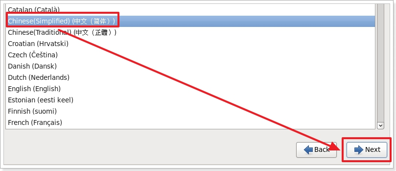
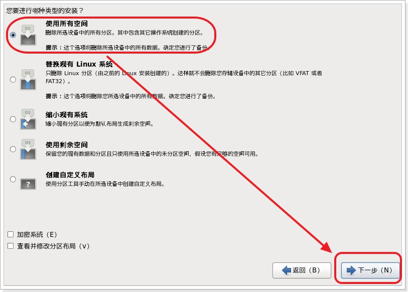

# 1 新建虚拟机

## 1.1 文件 --> 新建虚拟机

## 1.2 典型 --> 下一步

## 1.3 选择 64位的linux

## 1.4 选择安装位置

# 2 在虚拟机安装linux镜像

## 2.1 选中镜像文件

位置

 

 

 

 

 

## 2.2 安装linux

 

 

选择 skip 跳过

 

 

 

 

 

 

 

 

 

 

 

设置密码: 111111

 

 

 

稍等片刻,正在格式化

 

安装软件包(估计需要5分钟)

 

 

输入密码: 111111

 

 

 

# 3 配置静态IP

配置网络的目的主要是为了固定虚拟机的内网IP，方便我们在真实的操作系统中使用Linux连接工具软件进行远程连接

 

 

1）执行命令：setup

 

开启DHCP可以让Linux虚拟机自动分配IP

关闭DHCP需要指定IP

 

 

 

 

 

 

 

2）重启网络服务

service network restart

 

 

3）Linux查看IP地址的命令：

 

ifconfig

ifconfig | more ：分行进行显示，用于显示内容较多时

 

 

 

4）测试Linux网络配置是否成功：

在我们windows操作系统中运行命令：

 

ping 192.168.154.200(Linux虚拟机的IP地址)

 

 

注意：Linux系统中是严格区分大小写的,写明令时不要写错

 

 

# 4 给虚拟机进行快照(备份 还原点)

快照其实就是还原点，我们设置了快照。以后如果被我们玩坏了，也可以快速的还原到以前状态！

VMware快照

 

 

 

# 5 安装远程连接工具

直接操作Linux系统所在机器的问题：

​	A：虚拟机有鼠标独占问题，不好操作

​	B：真实开发中，虚拟机与我们不在一起。

使用远程连接工具：

​	A：操作方便快捷

​	B：随时随地都可以连接Linux系统，方便管理

 

 

## 5.1 远程终端命令工具

主要功能是向Linux系统远程发送命令	

Xshell：目前最好用

Secure Shell Client：老牌的连接工具，对中文支持较差

SecureCRT：收费

Putty：早就停止维护了，很多东西支持的很差。但因为习惯依旧很多人支持

 

我们使用XShell5，安装时安装免费版

 

 

 

 

使用步骤：

 

 

 

 

 

 

 

 

 

用鼠标实现复制和粘贴：

 

 

 

 

 

测试

 

 

## 5.2 远程FTP工具

FTP工具的目的是：便捷的与Linux系统之间进行文件传输

有以下途径：

Xftp：配合XShell使用，支持简单在线编辑

Secure Shell Client：自带FTP工具

SecureFX：配合SecureCRT使用

Lrzsz：可以安装在Linux系统中，通过在远程终端中使用命令来实现FTP功能

 

我们使用Xftp或者Lrzsz都可以。

 

 

 

如果要向Linux进行文件传输，可以在Xshell界面中，点击文件传输按钮，自动就会打开我们安装的Xftp了：

 

 

 

 

通过XFTP工具，我们可以让本机操作系统和linux系统之间进行文件的上传和下载。