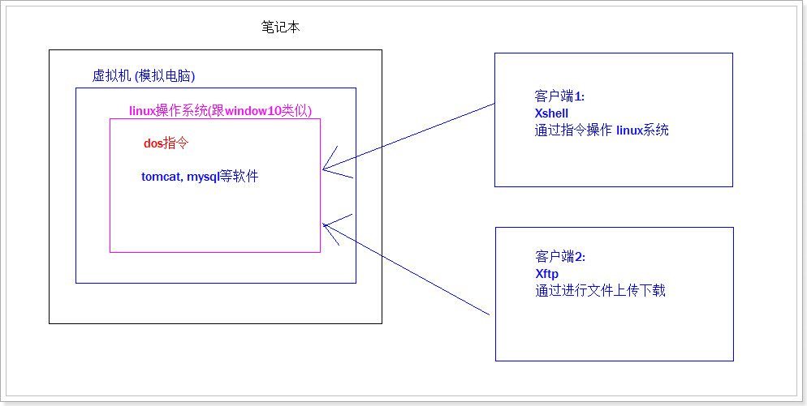

# 1 Linux概述

## 1.1 了解Unix系统

* Unix是一个强大的多用户、多任务操作系统。

* 于1969年在AT&T的贝尔实验室开发。

* UNIX的商标权由国际开放标准组织（The Open Group）所拥有。

* UNIX操作系统是商业版，需要收费，价格比Microsoft Windows正版要贵一些。

 

## 1.2 了解Linux发展历史

  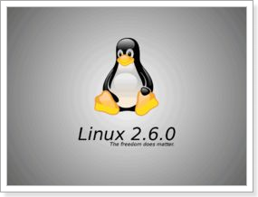


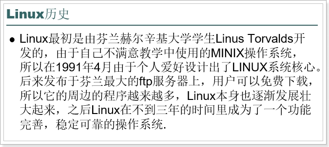 

* Linux是基于Unix的。

* 诞生于1991 年10 月5 日。

* Linux基于GPL协议，是一个自由的，免费的，源码开放的操作系统。

* Linux存在着许多不同的Linux版本，但它们都使用了Linux内核。

 开源

	Git

 	GitHub

## 1.3 Linux的应用领域

* 服务器系统
  * Web应用服务器、数据库服务器、游戏服务器、接口服务器、DNS、FTP等等；
* 嵌入式系统
  * 路由器、防火墙、手机、PDA、IP 分享器、交换器、家电用品的微电脑控制器等等

* 高性能运算、计算密集型应用
  * Linux有强大的运算能力。IBM的Watson超级计算机就是使用了Linux系统
* 桌面应用系统
  * 很多桌面操作系统的底层也是Linux
* 移动手持系统
  * 安卓系统就是基于Linux

 

 

## 1.4 Linux版本

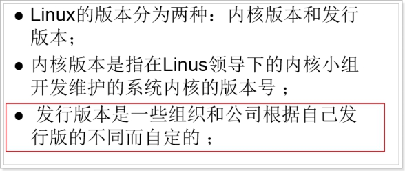 


 


 redhat：目前，全球最大的linux发行厂商，功能全面、稳定。遵循GPL协议

ubuntu：目前，是linux桌面操作系统做的最好的。

centos：免费版的redhat，centos基于redhat发行版基础之上，再重新编译发布的版本。

 

目前centos已经被Redhat公司收购，但是依然免费

 

# 2 安装Linux

## 2.1 安装虚拟机软件

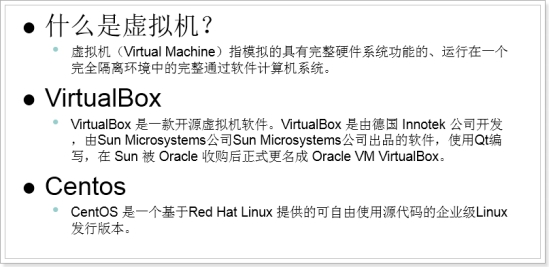 

常用的虚拟机软件 主要包括：VMware Workstation、 VirtualBox、Virtua* PC

VMware Workstation: 是VMware公司销售的商业软件产品之一。该工作站软件包含一个用于英特尔x86相容电脑的虚拟机套装，其允许用户同时创建和运行多个x86虚拟机

VirtualBox: VirtualBox 是一款开源[虚拟机软件](http://baike.baidu.com/view/2690045.htm)。VirtualBox 是由德国 Innotek 公司开发，由Sun Microsystems公司出品的软件，使用[Qt](http://baike.baidu.com/view/23681.htm)编写，在 Sun 被 [Oracle](http://baike.baidu.com/view/15020.htm) 收购后正式更名成 Oracle VM VirtualBox

 Virtua* PC：是Microsoft 最新的虚拟化技术。主要适合做微软自己产品的服务

 

## 2.2 安装Centos6.5系统

安装VMware的同学：参考《VMware安装centos_6.5步骤.docx》

 

 

## 2.3 配置静态IP

配置网络的目的主要是为了固定虚拟机的内网IP，方便我们在真实的操作系统中使用Linux连接工具软件进行远程连接

 

1）执行命令：setup

 

开启DHCP可以让Linux虚拟机自动分配IP

关闭DHCP需要指定IP

 

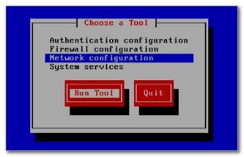 

 

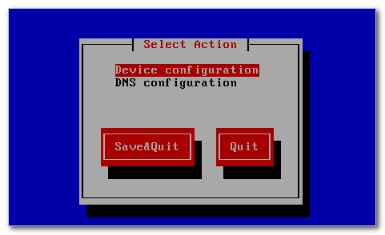 

 

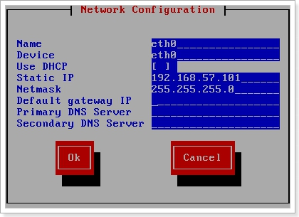 

2）重启网络服务

service network restart

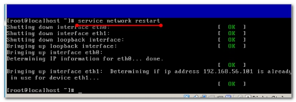 

 

3）Linux查看IP地址的命令：

 

ifconfig

ifconfig | more ：分行进行显示，用于显示内容较多时

 

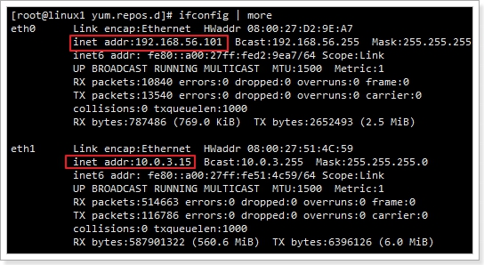 

 

4）测试Linux网络配置是否成功：

在我们windows操作系统中运行命令：

 

ping 192.168.56.101(Linux虚拟机的IP地址)

 

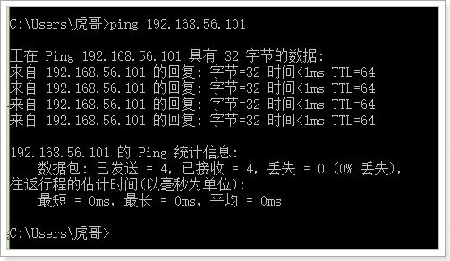 

注意：Linux系统中是严格区分大小写的,写明令时不要写错

 

 

## 2.4 给虚拟机进行快照

快照其实就是还原点，我们设置了快照。以后如果被我们玩坏了，也可以快速的还原到以前状态！

 VMware快照

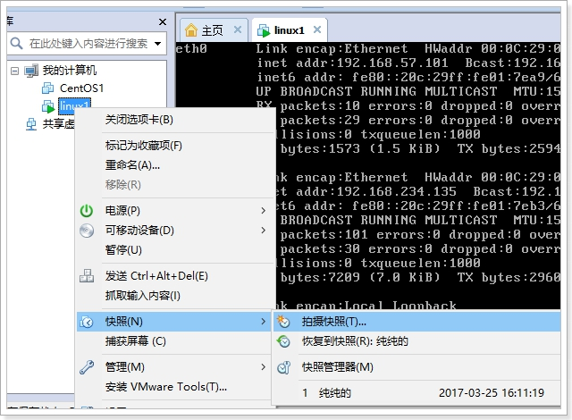 

 

## 2.5 安装远程连接工具

直接操作Linux系统所在机器的问题：

	A：虚拟机有鼠标独占问题，不好操作
	
	B：真实开发中，虚拟机与我们不在一起。

使用远程连接工具：

	A：操作方便快捷
	
	B：随时随地都可以连接Linux系统，方便管理

 


### 2.5.1 远程终端命令工具

主要功能是向Linux系统远程发送命令	

Xshell：目前最好用

Secure Shel* Client：老牌的连接工具，对中文支持较差

SecureCRT：收费

Putty：早就停止维护了，很多东西支持的很差。但因为习惯依旧很多人支持

 

我们使用XShell5，安装时安装免费版

 

 

 

 

使用步骤：

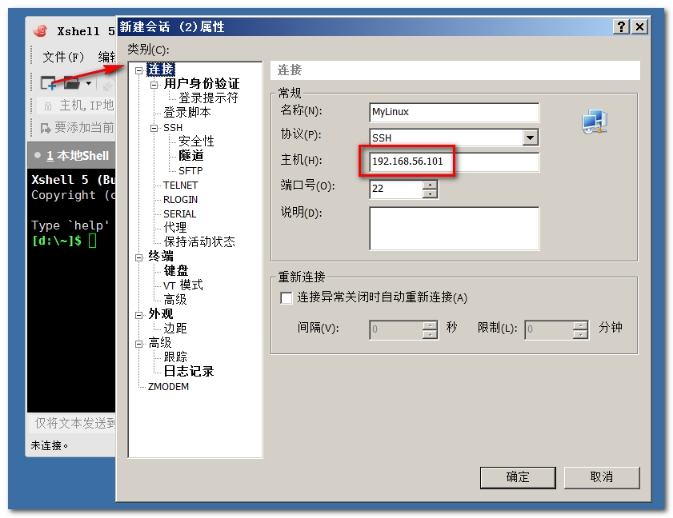 

 

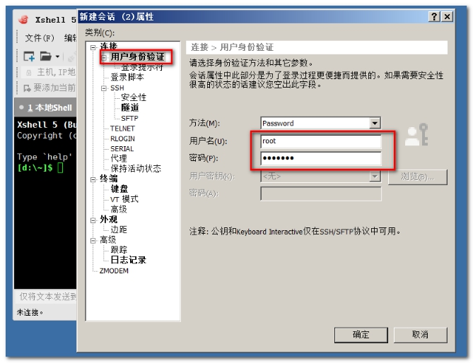 

 

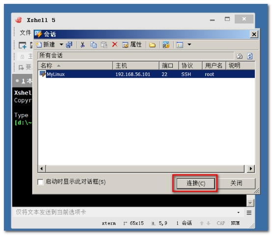 

 

 

 

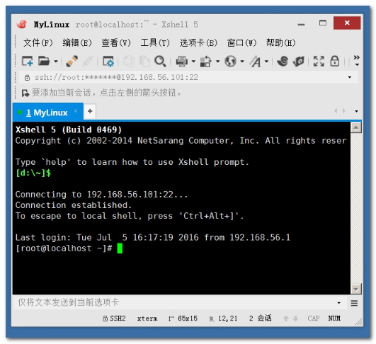 

 

用鼠标实现复制和粘贴：

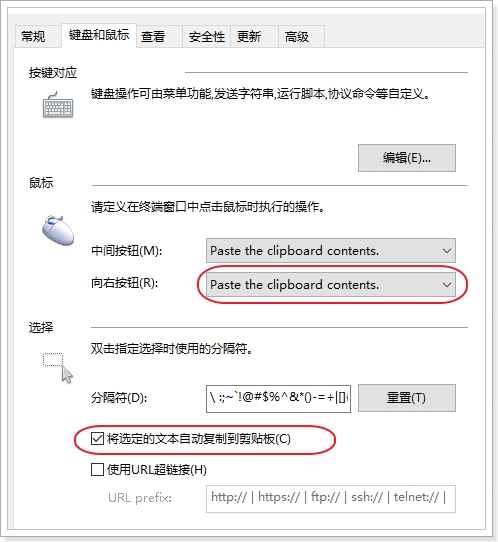 

 

### 2.5.2 远程FTP工具

FTP工具的目的是：便捷的与Linux系统之间进行文件传输

有以下途径：

Xftp：配合XShell使用，支持简单在线编辑

Secure Shel* Client：自带FTP工具

SecureFX：配合SecureCRT使用

Lrzsz：可以安装在Linux系统中，通过在远程终端中使用命令来实现FTP功能

 

我们使用Xftp或者Lrzsz都可以。

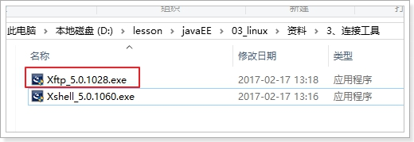 

 

 

如果要向Linux进行文件传输，可以在Xshell界面中，点击文件传输按钮，自动就会打开我们安装的Xftp了：

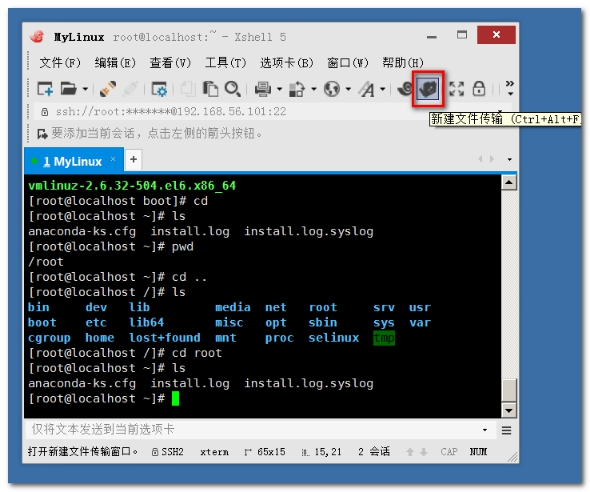 

 

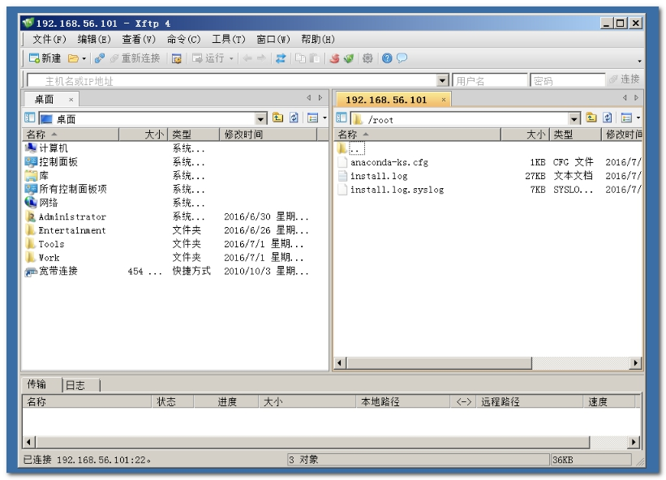 

 

通过XFTP工具，我们可以让本机操作系统和linux系统之间进行文件的上传和下载。

 

# 3 Linux的结构

## 3.1 Linux组成

 

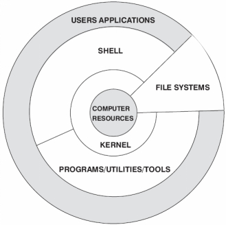 

 

内核：是系统的心脏，是运行程序和管理像磁盘和打印机等硬件设备的核心程序。
Shell：是系统的用户界面，提供了用户和内核进行交互操作的一种接口。它接收用户输入的命令并把它送入内核去执行，是一个命令解释器。但它不仅是命令解释器，而且还是高级编程语言，shell编程。
FILE SYSTEMS(文件系统)：文件系统是文件存放在磁盘等存储设备上的组织方法，Linux支持多种文件系统，如ext3,ext2,NFS,SMB,iso9660等

应用程序：标准的Linux操作系统都会有一套应用程序例如X-Window,Open Office等

 

 

## 3.2 Linux目录结构

详情参考 相关资料\文档\《Linux各目录及每个目录的详细介绍.docx》

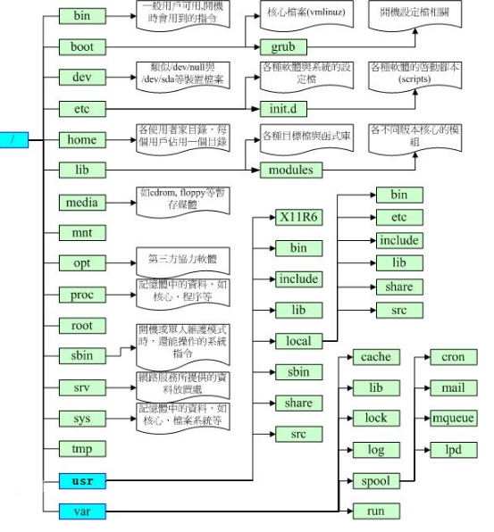 

 

 

注意：

	A：Linux中的根目录就是/，没有windows中的盘符
	
	B：Linux中如果有新的用户创建，默认会在/home/下创建一个与用户名一样的文件夹，作为该用户的home文件夹
	
	C：root用户的HOME在/root文件夹下。比较特殊
	
	D：一般我们安装文件都放在 /usr/local这个文件夹下
	
	E：/etc下有很多系统的配置文件
	
	F：/bin目录下可以设置一些自启动脚本

 


# 4 Linux基本命令

## 4.1 Linux命令的格式

Linux命令，其实就是Shell命令，是我们学好Linux的关键。

注意：

	A：通过上下方向键来调取过往执行过的命令。
	
	B：命令或参数仅需输入前几位就可以用tab键补全。


格式：

	命令名称 [命令参数] [命令对象]

 

```
rm –f 1.txt
```


	命令名称：有很多，我们会学习其中重要的一些
	
	命令参数：可选，有两种格式：
	
			长格式：--help
	
			短格式：-h
	
	命令对象：可选，就是命令作用的目标，可以是文件、目录、URL等等

 


例如：

	rm –f 1.txt

注意：Linux中的命令严格区分大小写的！

 

## 4.2 目录操作命令

Linux中并没有文件夹的概念，应该叫目录。

### 4.2.1 切换目录

```
cd(change directory) 功能: 切换目录
pwd(print work directory)	功能: 显示当前工作目录
```

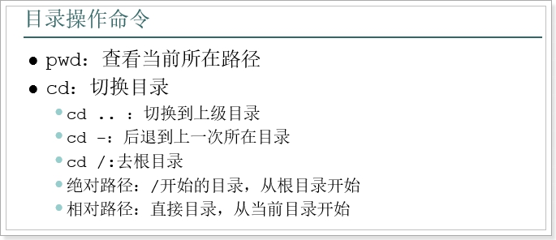 

需求:

```
1 查看当前所在目录
2 切换到 /usr/local(绝对路径)
3 切换到 上一级 /usr
4 切换到 /usr/tmp (相对路径)
5 切换回 /usr/local
6 后退到上一次所在目录
```


答案

```
pwd
cd /usr/local
cd ..
cd tmp
cd /usr/local
cd -
```


### 4.2.2 查看目录内容

```
ls(list)	功能: 列出目录内容
	a(all)		功能: 所有
	h(human)	功能: 人性化的显示(单位: K,G等)
```

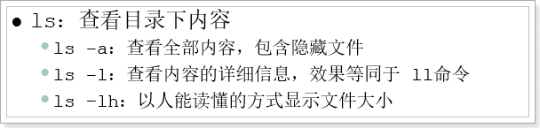 

需求

```
1 查看 /usr内容
2 查看所有 /usr内容(既包含隐藏,也包含非隐藏)
3 查看 /usr详细内容
4 简化 查看 /usr详细内容
5 易懂简化版 查看 /usr详细内容
```


答案

```
[root@itheima16 usr]# ls
bin  etc  games  include  lib  libexec  local  sbin  share  src  tmp

[root@itheima16 usr]# ls -a
.  ..  bin  etc  games  include  lib  libexec  local  sbin  share  src  tmp

[root@itheima16 usr]# ls -l
总用量 120
dr-xr-xr-x.   2 root root 36864 7月  24 04:19 bin
drwxr-xr-x.   2 root root  4096 9月  23 2011 etc
drwxr-xr-x.   2 root root  4096 9月  23 2011 games
drwxr-xr-x.  34 root root  4096 7月  24 03:35 include
dr-xr-xr-x.  77 root root 36864 7月  24 04:19 lib
drwxr-xr-x.  17 root root  4096 7月  24 04:19 libexec
drwxr-xr-x.  11 root root  4096 7月  24 03:32 local
dr-xr-xr-x.   2 root root 12288 7月  24 04:19 sbin
drwxr-xr-x. 120 root root  4096 7月  24 03:37 share
drwxr-xr-x.   4 root root  4096 7月  24 03:32 src
lrwxrwxrwx.   1 root root    10 7月  24 03:32 tmp -> ../var/tmp

[root@itheima16 usr]# ll
总用量 120
dr-xr-xr-x.   2 root root 36864 7月  24 04:19 bin
drwxr-xr-x.   2 root root  4096 9月  23 2011 etc
drwxr-xr-x.   2 root root  4096 9月  23 2011 games
drwxr-xr-x.  34 root root  4096 7月  24 03:35 include
dr-xr-xr-x.  77 root root 36864 7月  24 04:19 lib
drwxr-xr-x.  17 root root  4096 7月  24 04:19 libexec
drwxr-xr-x.  11 root root  4096 7月  24 03:32 local
dr-xr-xr-x.   2 root root 12288 7月  24 04:19 sbin
drwxr-xr-x. 120 root root  4096 7月  24 03:37 share
drwxr-xr-x.   4 root root  4096 7月  24 03:32 src
lrwxrwxrwx.   1 root root    10 7月  24 03:32 tmp -> ../var/tmp

[root@itheima16 usr]# ls -lh
总用量 120K
dr-xr-xr-x.   2 root root  36K 7月  24 04:19 bin
drwxr-xr-x.   2 root root 4.0K 9月  23 2011 etc
drwxr-xr-x.   2 root root 4.0K 9月  23 2011 games
drwxr-xr-x.  34 root root 4.0K 7月  24 03:35 include
dr-xr-xr-x.  77 root root  36K 7月  24 04:19 lib
drwxr-xr-x.  17 root root 4.0K 7月  24 04:19 libexec
drwxr-xr-x.  11 root root 4.0K 7月  24 03:32 local
dr-xr-xr-x.   2 root root  12K 7月  24 04:19 sbin
drwxr-xr-x. 120 root root 4.0K 7月  24 03:37 share
drwxr-xr-x.   4 root root 4.0K 7月  24 03:32 src
lrwxrwxrwx.   1 root root   10 7月  24 03:32 tmp -> ../var/tmp
```


```
扩展:  linux 如何树结构显示某文件夹下的所有文件（包括子文件夹 ）？ 
ls -R
```

### 4.2.3 操作目录

```
mkdir(make derectory)	功能:	制造目录,创建目录
	p(parent)	功能: 父目录
	v(view)		功能: 视图,显示过程
rmdir(remove derictory)	功能: 删除目录
```

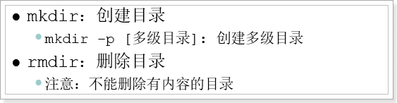 

需求:

```
1 切换到 /usr/tmp
2 创建 cba目录
3 创建 aaa/bbb/ccc目录
4 删除 cba目录
5 删除 aaa目录
6 再次创建 aaa/bbb/ccc 目录
```


答案:

```
[root@itheima16 ~]# cd /usr/tmp
[root@itheima16 tmp]# mkdir cba
[root@itheima16 tmp]# ll
总用量 4
drwxr-xr-x. 2 root root 4096 7月  27 18:26 cba
[root@itheima16 tmp]# mkdir aaa/bbb/ccc
mkdir: 无法创建目录"aaa/bbb/ccc": 没有那个文件或目录
[root@itheima16 tmp]# mkdir -p aaa/bbb/ccc
[root@itheima16 tmp]# ll
总用量 8
drwxr-xr-x. 3 root root 4096 7月  27 18:26 aaa
drwxr-xr-x. 2 root root 4096 7月  27 18:26 cba
[root@itheima16 tmp]# rmdir cba
[root@itheima16 tmp]# ll
总用量 4
drwxr-xr-x. 3 root root 4096 7月  27 18:26 aaa
[root@itheima16 tmp]# rmdir aaa/bbb/ccc
[root@itheima16 tmp]# ll
总用量 4
drwxr-xr-x. 3 root root 4096 7月  27 18:26 aaa
[root@itheima16 tmp]# rmdir aaa/bbb
[root@itheima16 tmp]# rmdir aaa
[root@itheima16 tmp]# ll
总用量 0
[root@itheima16 tmp]# mkdir aaa/bbb/ccc
mkdir: 无法创建目录"aaa/bbb/ccc": 没有那个文件或目录
[root@itheima16 tmp]# mkdir -p aaa/bbb/ccc
```

因为rmdir删除当前目录不能有后代目录或文件, 所以开发时几乎不用

## 4.3 文件操作命令

```
rm(remove)	功能: 删除
	f(force)	功能: 强制
	r(recursion) 功能: 递归
```


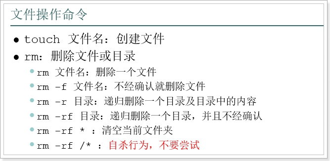 

 **通配符'*' 表示任意.**

* 删除文件需求: 

```
1 在/usr/tmp目录下 创建 1.txt
2 在/usr/tmp目录下 同时创建 2.txt 3.txt
3 删除 1.txt
4 强制删除 2.txt 3.txt
```


答案

```
[root@spark01 tmp]# touch 1.txt
[root@spark01 tmp]# touch 2.txt 3.txt
[root@spark01 tmp]# ls -a
.  ..  1.txt  2.txt  3.txt
[root@spark01 tmp]# rm 1.txt
rm：是否删除普通空文件 "1.txt"？y
[root@spark01 tmp]# ls -a
.  ..  2.txt  3.txt
[root@spark01 tmp]# rm -f 2.txt 3.txt
[root@spark01 tmp]# ll
总用量 0
```


需求2:

```
1 在/usr/tmp 创建aaa/bbb/ccc多级目录
2 删除 /usr/tmp/aaa 目录(比较麻烦)
3 再次创建 /usr/tmp/aaa/bbb/ccc目录, 递归删除 /usr/tmp/aaa 目录
4 再次创建 /usr/tmp/aaa/bbb/ccc目录, 强制递归删除 /usr/tmp/aaa 目录
5 创建3.txt 和 4.txt, 删除所有的 txt 文件
6 创建目录ddd 和 文件5.txt, 删除当前目录的所有内容
```


答案

 ```
[root@spark01 tmp]# mkdir -p aaa/bbb/ccc
[root@spark01 tmp]# ls -R
.:
aaa

./aaa:
bbb

./aaa/bbb:
ccc

./aaa/bbb/ccc:
[root@spark01 tmp]# rm aaa
rm: 无法删除"aaa": 是一个目录
[root@spark01 tmp]# rm aaa/bbb/ccc
rm: 无法删除"aaa/bbb/ccc": 是一个目录
[root@spark01 tmp]# rm -r aaa
rm：是否进入目录"aaa"? y
rm：是否进入目录"aaa/bbb"? y
rm：是否删除目录 "aaa/bbb/ccc"？y
rm：是否删除目录 "aaa/bbb"？y
rm：是否删除目录 "aaa"？y
[root@spark01 tmp]# ll
总用量 0
[root@spark01 tmp]# mkdir -p aaa/bbb/ccc
[root@spark01 tmp]# ll
总用量 4
drwxr-xr-x. 3 root root 4096 9月  14 02:11 aaa
[root@spark01 tmp]# rm -rf aaa
[root@spark01 tmp]# ll
总用量 0

[root@spark01 tmp]# touch 3.txt 4.txt
[root@spark01 tmp]# ll
总用量 0
-rw-r--r--. 1 root root 0 9月  14 02:21 3.txt
-rw-r--r--. 1 root root 0 9月  14 02:21 4.txt
[root@spark01 tmp]# rm -rf *.txt


[root@spark01 tmp]# mkdir ddd && touch 5.txt
[root@spark01 tmp]# ll
总用量 4
-rw-r--r--. 1 root root    0 9月  14 02:22 5.txt
drwxr-xr-x. 2 root root 4096 9月  14 02:22 ddd
[root@spark01 tmp]# rm -rf *
 ```


## 4.4 复制和剪切命令

```
cp(copy)	功能: 复制
mv(move)	功能: 移动 剪切
```

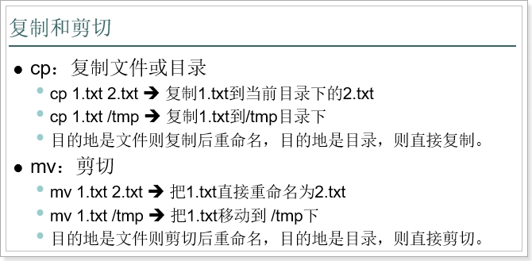 

mv是剪切，而cp是复制

cp复制目录的时候，需要加 -r参数

mv移动目录的时候，不需要参数 

需求:

```
1 创建1.txt文件 和 aaa目录
2 复制1.txt文件 到 aaa目录
3 复制1.txt文件 到 aaa目录, 且 更改文件名为 2.txt
4 将aaa目录复制到 新建的bbb目录
5 将1.txt 剪切到 新建的ccc目录
6 新建2.txt文件, 剪切到当前目录 且 改名为 3.txt(重命名)
7 将ccc目录 移动到 新建的ddd目录
```


答案:

1 创建1.txt文件 和 aaa目录

```
[root@spark01 tmp]# touch 1.txt && mkdir aaa
[root@spark01 tmp]# ls -R
.:
1.txt  aaa

./aaa:
```


2 复制1.txt文件 到 aaa目录

```
[root@spark01 tmp]# cp 1.txt aaa
[root@spark01 tmp]# ls -R
.:
1.txt  aaa

./aaa:
1.txt
```


3 复制1.txt文件 到 aaa目录, 且 更改文件名为 2.txt

```
[root@spark01 tmp]# cp 1.txt aaa/2.txt
[root@spark01 tmp]# ls -R
.:
1.txt  aaa

./aaa:
1.txt  2.txt
```


4 将aaa目录复制到 新建的bbb目录

```
[root@spark01 tmp]# mkdir bbb
[root@spark01 tmp]# ls -R
.:
1.txt  aaa  bbb

./aaa:
1.txt  2.txt

./bbb:
[root@spark01 tmp]# cp -r aaa/ bbb/
[root@spark01 tmp]# ls -R
.:
1.txt  aaa  bbb

./aaa:
1.txt  2.txt

./bbb:
aaa

./bbb/aaa:
1.txt  2.txt
```


5 将1.txt 剪切到 新建的ccc目录

```
[root@spark01 tmp]# mkdir ccc
[root@spark01 tmp]# ls -R
.:
1.txt  aaa  bbb  ccc

./aaa:
1.txt  2.txt

./bbb:
aaa

./bbb/aaa:
1.txt  2.txt

./ccc:
[root@spark01 tmp]# mv 1.txt ccc/
[root@spark01 tmp]# ls -R
.:
aaa  bbb  ccc

./aaa:
1.txt  2.txt

./bbb:
aaa

./bbb/aaa:
1.txt  2.txt

./ccc:
1.txt
```


6 新建2.txt文件, 剪切到当前目录 且 改名为 3.txt(重命名)

```
[root@spark01 tmp]# touch 2.txt
[root@spark01 tmp]# ls -R
.:
2.txt  aaa  bbb  ccc

./aaa:
1.txt  2.txt

./bbb:
aaa

./bbb/aaa:
1.txt  2.txt

./ccc:
1.txt
[root@spark01 tmp]# mv 2.txt 3.txt
[root@spark01 tmp]# ls -R
.:
3.txt  aaa  bbb  ccc

./aaa:
1.txt  2.txt

./bbb:
aaa

./bbb/aaa:
1.txt  2.txt

./ccc:
1.txt
```


7 将ccc目录 移动到 新建的ddd目录

```
[root@spark01 tmp]# ls -R
.:
3.txt  aaa  bbb  ccc

./aaa:
1.txt  2.txt

./bbb:
aaa

./bbb/aaa:
1.txt  2.txt

./ccc:
1.txt
[root@spark01 tmp]# mkdir ddd && mv ccc/ ddd/ && ls -R
.:
3.txt  aaa  bbb  ddd

./aaa:
1.txt  2.txt

./bbb:
aaa

./bbb/aaa:
1.txt  2.txt

./ddd:
ccc

./ddd/ccc:
1.txt
```


## 4.5 打包和解包命令(重点重点重点-- 解包)

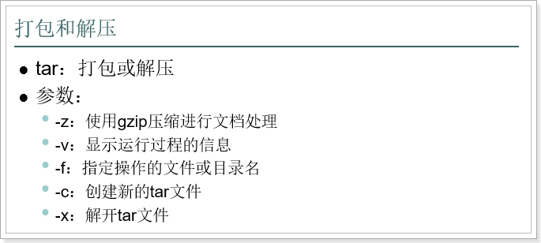 

将cba目录 打包成 cba.tar

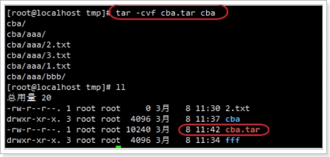 

准备工作

```
mkdir ddd
cd ddd
touch 1.txt
touch 2.txt
```


常用命令组合

```
打包命令组合:		   cvf
解包命名组合(常用):   xvf
压缩命令组合: 	   zcvf
解压命令组合(常用):   zxvf		记忆敲门: 至 孝 潍 坊
```


z 压缩

x 解

v 显示执行过程

f 指定文件或目录


zxvf 解压缩

zcvf	创建压缩包

xvf   解包

cvf	打包


需求:

```
1 对ddd目录进行打包成 ddd.tar
2 对ddd目录进行压缩打包 ddd.tar.gz
3 对ddd.tar 进行解包到当前目录
4 对ddd.tar.gz 进行解压缩包到当前目录
5 对ddd.tar 进行解包到指定目录 
6 对ddd.tar.gz 进行解压缩包到指定目录
```


答案:

1 对ddd目录进行打包成 ddd.tar

```
[root@spark01 tmp]# tar -cvf ddd.tar ddd
ddd/
ddd/1.txt
ddd/2.txt
[root@spark01 tmp]# ls -R
.:
ddd  ddd.tar

./ddd:
1.txt  2.txt
```


2 对ddd目录进行压缩打包 ddd.tar.gz

```
[root@spark01 tmp]# tar -zcvf ddd.tar.gz ddd
ddd/
ddd/1.txt
ddd/2.txt
[root@spark01 tmp]# ls -R
.:
ddd  ddd.tar  ddd.tar.gz

./ddd:
1.txt  2.txt
```


3 对ddd.tar 进行解包到当前目录

```
[root@spark01 tmp]# rm -rf ddd
[root@spark01 tmp]# ls -R
.:
ddd.tar  ddd.tar.gz
[root@spark01 tmp]# tar -xvf ddd.tar
ddd/
ddd/1.txt
ddd/2.txt
[root@spark01 tmp]# ls -R
.:
ddd  ddd.tar  ddd.tar.gz

./ddd:
1.txt  2.txt
```


4 对ddd.tar.gz 进行解压缩包到当前目录

```
[root@spark01 tmp]# rm -rf ddd
[root@spark01 tmp]# ls
ddd.tar  ddd.tar.gz
[root@spark01 tmp]# tar -zxvf ddd.tar.gz
ddd/
ddd/1.txt
ddd/2.txt
[root@spark01 tmp]# ls
ddd  ddd.tar  ddd.tar.gz
```


5 对ddd.tar 进行解包到指定目录 

```
[root@spark01 tmp]# mkdir aaa && ls -R
.:
aaa  ddd  ddd.tar  ddd.tar.gz

./aaa:

./ddd:
1.txt  2.txt

[root@spark01 tmp]# tar -xvf ddd.tar -C aaa
ddd/
ddd/1.txt
ddd/2.txt
[root@spark01 tmp]# ls -R
.:
aaa  ddd  ddd.tar  ddd.tar.gz

./aaa:
ddd

./aaa/ddd:
1.txt  2.txt

./ddd:
1.txt  2.txt
```


6 对ddd.tar.gz 进行解压缩包到指定目录

```
[root@spark01 tmp]# mkdir bbb && ls -R
.:
aaa  bbb  ddd  ddd.tar  ddd.tar.gz

./aaa:
ddd

./aaa/ddd:
1.txt  2.txt

./bbb:

./ddd:
1.txt  2.txt
[root@spark01 tmp]# tar -zxvf ddd.tar.gz -C bbb
ddd/
ddd/1.txt
ddd/2.txt
[root@spark01 tmp]# ls -R
.:
aaa  bbb  ddd  ddd.tar  ddd.tar.gz

./aaa:
ddd

./aaa/ddd:
1.txt  2.txt

./bbb:
ddd

./bbb/ddd:
1.txt  2.txt

./ddd:
1.txt  2.txt
```

## 4.6 查看文件内容命令(重点)

### 4.6.1 

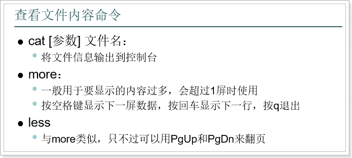 

 需求:

```
1 查询日志文件内容(cat 比较适合查看小文件)
2 查询日志文件内容(more和less 适合大文件) 
3 查看下一行内容, 查看下一页内容, 退出
```

答案

```
cat 日志文件名
more 日志文件名
less 日志文件名
```


**更加实用重点重点重点**

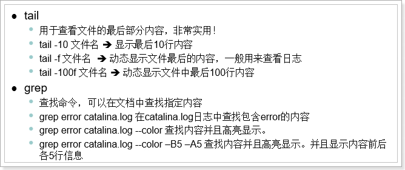 

 注意：tail和grep命令非常重要，一定要掌握

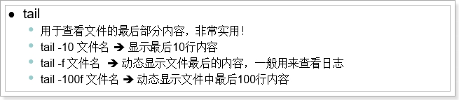 

需求:

 ```
1 查看文件后10行内容
2 动态追踪文件内容
3 动态追踪 最后10行内容 且 退出
 ```


答案

```
tail -10 文件名
tail -f 文件名
tail -10f 文件名 (ctrl + c 是退出)
```


```
grep(Global Regular Expression Print) 全局正则表达式版本(搜索)
```

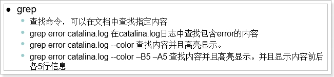 

需求

```
1 搜索文件中的Exception字符串
2 搜索文件中的Exception字符串 且 高亮显示
3 搜索文件中的Exception字符串 且 高亮显示, 且 前五行内容
4 搜索文件中的Exception字符串 且 高亮显示, 且 前五行内容, 且 后五行内容
```


答案

```
grep Exception 文件名
grep Exception 文件名 --color
grep Exception 文件名 --color -B5
grep Exception 文件名 --color -B5 -A5
```


## 4.7 编辑文件内容：vi编辑器(重点重点重点)

* 在Linux下一般使用vi编辑器来编辑文件。

* vi既可以查看文件也可以编辑文件。

* 而vim是vi的升级版本，具备更多的功能.

* vi如果目标文件不存在，会创建新的文件。但是如果新文件没做编辑，退出后还会消失。

### vi的三种模式介绍

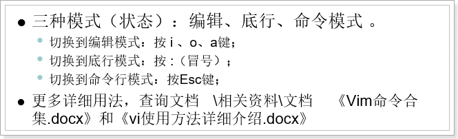 

 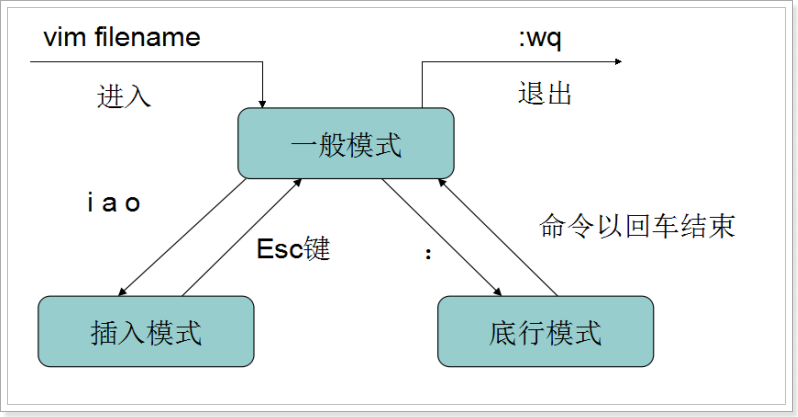 

编辑模式：对文本进行输入和修改

底行模式：退出vim或者查找、替换功能

命令模式：通过快捷命令操作数据，打开vi默认就是命令模式

 

### 4.7.1 编辑模式

命令模式按下：i、o、a进入编辑模式：

i：光标不动

o：另起一行

a：光标到下一个字符

 

按ESC退出编辑模式,进入命令模式

 

### 4.7.2 底行模式

命令模式下，按‘：’或者‘/’进入底行模式，可以输入命令

 

1）退出vim:(重点重点重点)

:q				未编辑时退出vim

:q!				编辑后，退出并且不保存

:wq				编辑后，退出且保存


2）撤销上次操作(扩展)

	u 			撤销上一次操作(ctrl + z windows操作)
	
	ctrl + r 		恢复上一次被撤销的操作


3）设置行号(了解)

:set nu		显示行号

:set nonu		不显示行号

 

4）替换文本(了解)

:s/old/new/ 用new替换old，替换当前行的第一个匹配

:s/old/new/g 用new替换old，替换当前行的所有匹配

:%s/old/new/ 用new替换old，替换所有行的第一个匹配

:%s/old/new/g 用new替换old，替换整个文件的所有匹配

 

 

5）查找

/文本			搜索指定文本，高亮显示，按n显示下一个，按N显示前一个

:整数			快捷跳转到指定行

 

### 4.7.3 命令模式

p(pause)			将之前dd或yy的数据粘贴到光标位置


yy				复制光标所在行

5yy				复制光标及下面共5行


dd				剪切当前行

5dd				剪切光标及下面共5行

 

作业: 修改库名和密码

	1 打开spring的配置文件 vim
	
	2 进入编辑模式
	
	3 找到对应行修改内容
	
	4 保存后退出

## 4.8 组合命令

Linux中的命令组合后，可以产生神奇的效果!

append 追加

replace 替换,覆盖

### 4.8.1 重定向输出>和>>

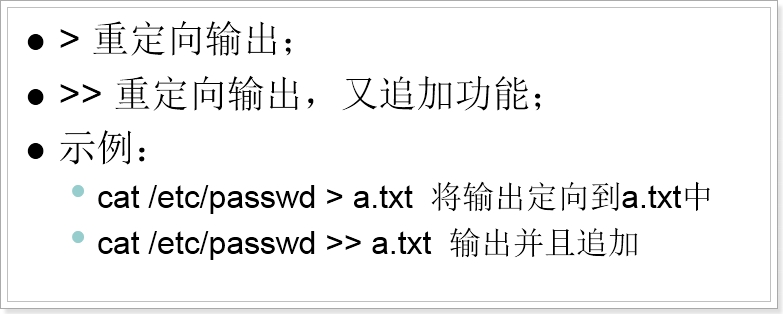 

echo 控制台输出的内容 (类似sout)


需求:

```
1 删除 /usr/tmp/目录下的所有内容
2 增加 1.txt文件, 内容: hello
3 增加 2.txt文件, 内容: world
4 将2.txt内容 复制粘贴到 3.txt
5 将1.txt内容 复制粘贴到 3.txt(缺点: 产生替换效果)
6 将2.txt内容 复制追加粘贴到 3.txt中
7 将ifconfig指令内容 追加到 3.txt中
```

 


答案:

1 删除 /usr/tmp/目录下的所有内容

```
[root@spark01 tmp]# rm -rf *
```

2 增加 1.txt文件, 内容: hello

```
[root@spark01 tmp]# touch 1.txt && ls
1.txt
[root@spark01 tmp]# echo hello > 1.txt && cat 1.txt
hello
```

3 增加 2.txt文件, 内容: world

```
[root@spark01 tmp]# touch 2.txt && ls
1.txt  2.txt
[root@spark01 tmp]# echo world > 2.txt && cat 2.txt
world
```

4 将2.txt内容 复制粘贴到 3.txt

```
[root@spark01 tmp]# touch 3.txt && ls
1.txt  2.txt  3.txt
[root@spark01 tmp]# cat 2.txt > 3.txt && cat 3.txt
world
```

5 将1.txt内容 复制粘贴到 3.txt(缺点: 产生替换效果)

```
[root@spark01 tmp]# cat 1.txt > 3.txt && cat 3.txt
hello
```

6 将2.txt内容 复制追加粘贴到 3.txt中

```
[root@spark01 tmp]# cat 2.txt >> 3.txt && cat 3.txt
hello
world
```

7 将ifconfig指令内容 追加到 3.txt中

```
[root@spark01 tmp]# ifconfig >> 3.txt
[root@spark01 tmp]# cat 3.txt
hello
world
eth0      Link encap:Ethernet  HWaddr 00:0C:29:0E:3F:05  
          inet addr:192.168.220.200  Bcast:192.168.220.255  Mask:255.255.255.0
          inet6 addr: fe80::20c:29ff:fe0e:3f05/64 Scope:Link
          UP BROADCAST RUNNING MULTICAST  MTU:1500  Metric:1
          RX packets:12903 errors:0 dropped:0 overruns:0 frame:0
          TX packets:10765 errors:0 dropped:0 overruns:0 carrier:0
          collisions:0 txqueuelen:1000 
          RX bytes:1189753 (1.1 MiB)  TX bytes:3324044 (3.1 MiB)
          Interrupt:19 Base address:0x2000 

lo        Link encap:Local Loopback  
          inet addr:127.0.0.1  Mask:255.0.0.0
          inet6 addr: ::1/128 Scope:Host
          UP LOOPBACK RUNNING  MTU:16436  Metric:1
          RX packets:0 errors:0 dropped:0 overruns:0 frame:0
          TX packets:0 errors:0 dropped:0 overruns:0 carrier:0
          collisions:0 txqueuelen:0 
          RX bytes:0 (0.0 b)  TX bytes:0 (0.0 b)
```


### 4.8.2 管道 “|”

```
ps(Process Status) 	进程状态
grep(Global Regular Expression Print) 全局正则表达式版本(搜索)
```


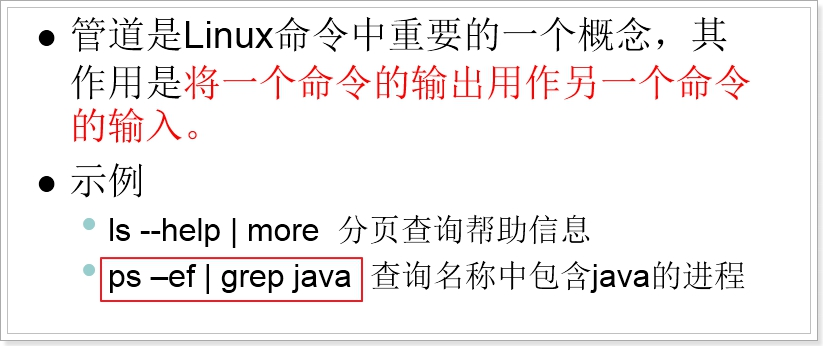 

 需求:

```
1 分页查询 ls的帮助信息(回车键 下一行, 空格键 下一页, ctrl +c 退出)
2 查询ls帮助信息中包含'递归'的指令
```


答案:

```
ls --help | more
ls --help | grep '递归'
```


### 4.8.3 逻辑控制&& 

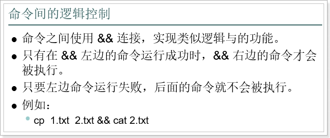 

 因为 启动软件通常不会打印启动的日志信息, 所以需要再打开对应的日志信息查看.

分:

	tail -100f catalina.out
	
	./startup.sh

合

	./startup.sh && tail -100f catalina.out

缺点: 比较麻烦.     解决:  使用&&指令就可以一步到位


这个经常把一些命令组合使用，比如我们在启动tomcat后，再用tail命令查看日志。如果启动失败，则不查看

./startup.sh && tail -50f ../logs/catalina.out

需求:

```
1 打印1.txt内容 且 打印2.txt内容
2 打印100.txt内容 且 打印2.txt内容(没有)
3 启动tomcat 且 打印日志信息
```


答案:

```
cat 1.txt && cat 2.txt
cat 100.txt && cat.2.txt
./startup.sh && tail -50f ../logs/catalina.out
```


 

 