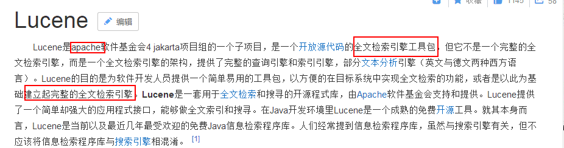
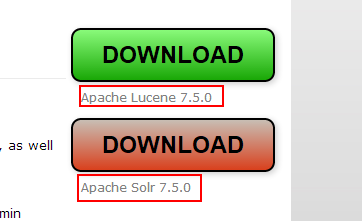
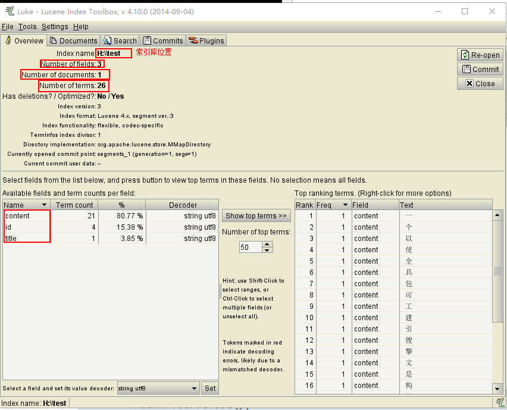
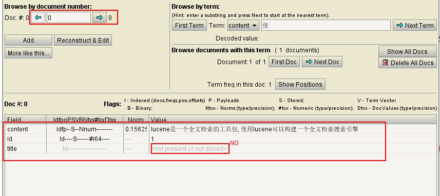
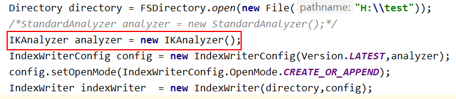
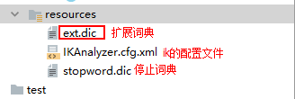

# 爬虫day04 -- 搜索lucene(了解)

课前回顾:

* redis数据库:
  * redis概念:
  * redis的特点:
    * redis的效率非常高
  * redis的数据类型使用范围:
    * String: 做缓存
    * hash: 做缓存
    * list: 做任务队列
    * set: 做去重
    * sortedSet: 排行榜
  * redis的安装
  * redis的客户端: jedis
    * jedis操作redis :  String  list  set
    * jedis的连接池: 会抽取工具类
  * redis的持久化: RDB   AOF
* 分布式爬虫:
  * 分布式 和 集群的区别
  * 分布式爬虫的开发的基本流程:
    * master: 根据分页url, 获取pid,将pid保存到redis中list
    * slave: 从redis中获取pid, 解析pid, 保存数据
  * 分布式爬虫的开发:
* 分布式爬虫的部署:  使用三台服务器, 模拟6台服务器
  * 准备工作:
* 扩展: 攻防技术  代理ip

今日内容:

* 搜索引擎:

  * 搜索引擎的概念
  * 搜索引擎的执行流程

  * 原始数据库作为搜索的弊端
  * 倒排索引的技术(理解)

* lucene:

  * lucene基本概念
  * lucene  和 solr 有什么关系
  * lucene的入门的代码(写入索引)
  * lucene的写入索引API
  * lucene的引入第三方分词器
  * lucene的查询(多样化的查询)

* lucene 高级:(了解)

  * lucene的高亮
  * lucene的分页
  * lucene的排序
  * lucene的激励因子

## 1. lucene



### 1.1 lucene 和 solr的关系



lucene:  是一个全文检索的工具包(jar),可以使用lucene构建一个搜索引擎

solr: 就是一个全文检索的搜索引擎, 其底层就是lucene

### 1.2 lucene入门程序(写入索引)

* 第一步: 导包

```xml
<dependency>
			<groupId>org.apache.lucene</groupId>
			<artifactId>lucene-core</artifactId>
			<version>4.10.2</version>
		</dependency>
		<dependency>
			<groupId>org.apache.lucene</groupId>
			<artifactId>lucene-queries</artifactId>
			<version>4.10.2</version>
		</dependency>
		<dependency>
			<groupId>org.apache.lucene</groupId>
			<artifactId>lucene-test-framework</artifactId>
			<version>4.10.2</version>
		</dependency>
		<dependency>
			<groupId>org.apache.lucene</groupId>
			<artifactId>lucene-analyzers-common</artifactId>
			<version>4.10.2</version>
		</dependency>
		<dependency>
			<groupId>org.apache.lucene</groupId>
			<artifactId>lucene-queryparser</artifactId>
			<version>4.10.2</version>
		</dependency>
		<dependency>
			<groupId>org.apache.lucene</groupId>
			<artifactId>lucene-highlighter</artifactId>
			<version>4.10.2</version>
		</dependency>
```

* 入门代码:

```java
@Test
    public void indexWriterTest01() throws Exception {
        //1. 创建索引写入器对象
        Directory directory = FSDirectory.open(new File("H:\\test"));
        StandardAnalyzer analyzer = new StandardAnalyzer();
        IndexWriterConfig config = new IndexWriterConfig(Version.LATEST,analyzer);

        IndexWriter indexWriter  = new IndexWriter(directory,config);

        //2. 添加文档数据: 一个文档 可以看做是一条数据, 或者看做是一个文件
        Document doc = new Document();
        doc.add(new LongField("id",1L, Field.Store.YES));
        doc.add(new StringField("title","lucene简介", Field.Store.NO));
        doc.add(new TextField("content","lucene是一个全文检索的工具包, 使用lucene可以构建一个全文检索搜索引擎", Field.Store.YES));
        indexWriter.addDocument(doc);

        //3. 提交
        indexWriter.commit();

        //4. 将写入器关闭
        indexWriter.close();

    }
```





> lucene 是自己去维护文档id的, 从0开始依次递增

### 1.3 引入ik分词器

* 第一步: 导包

```xml
 <dependency>
            <groupId>com.janeluo</groupId>
            <artifactId>ikanalyzer</artifactId>
            <version>2012_u6</version>
        </dependency>
```

* 第二步: 将标准分词器切换为ik分词器即可







> 当使用扩展词典来进行分词, 在执行程序的时候会显示加载了扩展词典, 但是有一个前提条件, document中的字段的类型必须有一个是支持分词(TextField)的

### 1.4 lucene索引的查询

* 入门代码

```java
@Test
    public void indexSearchTest01() throws Exception {
        //1.创建索引查询器对象
        DirectoryReader reader = DirectoryReader.open(FSDirectory.open(new File("H:\\test")));
        IndexSearcher indexSearcher = new IndexSearcher(reader);

        //2. 执行查询
        // 使用查询解析器获取query对象
        // 注意: 分词器的使用 一定要和 写入索引库的分词器保持一致了
        QueryParser queryParser = new QueryParser("content",new IKAnalyzer());
        Query query = queryParser.parse("全文检索");

        //参数1: query 查询条件
        //参数2: int n  最大的查询条数
        // TopDocs: 第一部分: 查询的总条数  第二部分: 文档的数组
        TopDocs topDocs = indexSearcher.search(query, Integer.MAX_VALUE);
        int totalHits = topDocs.totalHits;// 总条数
        // 得分文档的数组
        ScoreDoc[] scoreDocs = topDocs.scoreDocs;

        for (ScoreDoc scoreDoc : scoreDocs) {
           //scoreDoc : 第一部分: 当前文档的得分 第二部分 : 文档的id
            float score = scoreDoc.score;//得分

            int docId = scoreDoc.doc;

            Document doc = indexSearcher.doc(docId);
            String id = doc.get("id");
            String title = doc.get("title");
            String content = doc.get("content");
            System.out.println("得分数:"+score +"=="+id+"=="+title+"=="+content);
        }
    }
```

### 1.5 lucene多样化的查询

常用的五种查询对象:

* 1) 词条查询 : TermQuery
* 2) 统配符查询:wildCardQuery
* 3) 模糊查询 : fuzzyQuery
* 4) 数值范围查询 : numericRangeQuery
* 5) 组合查询 : BooleanQuery

```java
 @Test
    public void queryTest() throws Exception {
        //1. 词条查询: TermQery   用来查询不需要进行分词的数据
        //词条的特点: 词条是一个不可在分割的单位, 词条看做是文档分词的后的关键字
        //     词条查询的书写的时候不允许出现错误, 一旦出错, 将会查询不到数据
        TermQuery termQuery = new TermQuery(new Term("content","扎心了老铁"));
        //publicQuery(termQuery);

        //2. 通配符查询
        // ? : 占用一个字符  类似于 mysql 中 like的查询 _
        // * : 占用0到多个字符  类似于 mysql 中 like的查询 %
        // ? 和 * 可以在任意的位置使用, 但是mysql中 _ 和 % 只能在首尾使用
        WildcardQuery wildcardQuery = new WildcardQuery(new Term("content","扎心了老铁*"));
        //publicQuery(wildcardQuery);

        //3. 模糊查询
        // 模糊查询只能在2次范围内能够查询到对应的词条:  补位  替换 移动
        // 模糊查询可以自定义最大的编辑次数: 0~2 之间
        FuzzyQuery fuzzyQuery = new FuzzyQuery(new Term("content","扎心了老铁"),2);
        //publicQuery(fuzzyQuery);

        //4. 数值范围查询
        //final String field, Long min, Long max, final boolean minInclusive, final boolean maxInclusive4
        // 参数1: 默认的查询字段
        // 参数2: 最小值
        // 参数3: 最大值
        // 参数4: 是否包含最小值
        // 参数5: 是否包含最大值
        NumericRangeQuery<Long> numericRangeQuery = NumericRangeQuery.newLongRange("id",1L,15L,false,true);

        //publicQuery(numericRangeQuery);

        // 5. 组合查询
        // BooleanQuery 本身是没有任何的查询条件的
        BooleanQuery booleanQuery  = new BooleanQuery();

        booleanQuery.add(numericRangeQuery, BooleanClause.Occur.MUST); //此条件必须存在

        booleanQuery.add(fuzzyQuery , BooleanClause.Occur.SHOULD); // 可选的

        booleanQuery.add(termQuery, BooleanClause.Occur.MUST_NOT);// 不能出现这个条件下的内容

        publicQuery(booleanQuery);
    }
```

### 1.6 索引的修改 和 删除

```java
// 索引修改
    // 本质 先将匹配到的数据全部删除, 然后添加新的数据
        // 如果采用updateDocument: 添加一条
        //如果采用updateDocuments: 会吧匹配的数据全部删除, 将list中的数据添加到索引中
    @Test
    public void indexWriterUpdate() throws Exception {
        //1.创建 indexWriter对象
        Directory directory = FSDirectory.open(new File("H:\\test"));
        /*StandardAnalyzer analyzer = new StandardAnalyzer();*/
        IKAnalyzer analyzer = new IKAnalyzer();
        IndexWriterConfig config = new IndexWriterConfig(Version.LATEST,analyzer);
        config.setOpenMode(IndexWriterConfig.OpenMode.CREATE_OR_APPEND);
        IndexWriter indexWriter  = new IndexWriter(directory,config);

        //2. 执行索引的修改
        Document doc = new Document();
        doc.add(new LongField("id", 16, Field.Store.YES));
        doc.add(new StringField("title", "lucene简介", Field.Store.NO));
        doc.add(new TextField("content", "lucene是一个全文检索的工具包, 使用lucene可以构建一个全文检索搜索引擎,修改数据", Field.Store.YES));

        // 参数1: 表示词条
        // 参数2: 修改成什么内容
        indexWriter.updateDocument(new Term("content","扎心了老铁"),doc);

        //3. 提交
        indexWriter.commit();

        //4. 关闭写入器对象
        indexWriter.close();
    }

    //索引的删除
    @Test
    public void indexWriterDel() throws Exception {
        //1.创建 indexWriter对象
        Directory directory = FSDirectory.open(new File("H:\\test"));
        /*StandardAnalyzer analyzer = new StandardAnalyzer();*/
        IKAnalyzer analyzer = new IKAnalyzer();
        IndexWriterConfig config = new IndexWriterConfig(Version.LATEST, analyzer);
        config.setOpenMode(IndexWriterConfig.OpenMode.CREATE_OR_APPEND);
        IndexWriter indexWriter = new IndexWriter(directory, config);


        //2. 执行删除
       // indexWriter.deleteAll(); //删除所有
        indexWriter.deleteDocuments(new Term("content","修改"));

        //3. 提交
        indexWriter.commit();
        //4. 关闭
        indexWriter.close();
    }
```

## 2. lucene高亮

高亮: 就是将用户输入的内容, 加上高亮的标签即可

lucene的高亮是一个独立的子项目

```java
package com.itheima.lucene;

import org.apache.lucene.document.Document;
import org.apache.lucene.index.DirectoryReader;
import org.apache.lucene.queryparser.classic.MultiFieldQueryParser;
import org.apache.lucene.search.IndexSearcher;
import org.apache.lucene.search.Query;
import org.apache.lucene.search.ScoreDoc;
import org.apache.lucene.search.TopDocs;
import org.apache.lucene.search.highlight.Highlighter;
import org.apache.lucene.search.highlight.QueryScorer;
import org.apache.lucene.search.highlight.SimpleHTMLFormatter;
import org.apache.lucene.store.FSDirectory;
import org.wltea.analyzer.lucene.IKAnalyzer;

import java.io.File;

//高亮显示
public class IndexSearchHight {

    public static void main(String[] args) throws  Exception{
        //1.创建索引查询器对象
        DirectoryReader reader = DirectoryReader.open(FSDirectory.open(new File("H:\\test")));
        IndexSearcher indexSearcher = new IndexSearcher(reader);

        //2. 执行查询
        MultiFieldQueryParser queryParser = new MultiFieldQueryParser(new String[]{"content","title"},new IKAnalyzer());
        Query query = queryParser.parse("全文检索");

        // --------------高亮设置 start-------------------
        SimpleHTMLFormatter formatter = new SimpleHTMLFormatter("<font color='red'>","</font>");
        QueryScorer scorer = new QueryScorer(query);
        Highlighter highlighter  = new Highlighter(formatter,scorer);

        // --------------高亮设置 end-------------------
        //参数1: query 查询条件
        //参数2: int n  最大的查询条数
        // TopDocs: 第一部分: 查询的总条数  第二部分: 文档的数组
        TopDocs topDocs = indexSearcher.search(query, Integer.MAX_VALUE);
        int totalHits = topDocs.totalHits;// 总条数
        // 得分文档的数组
        ScoreDoc[] scoreDocs = topDocs.scoreDocs;

        for (ScoreDoc scoreDoc : scoreDocs) {
            //scoreDoc : 第一部分: 当前文档的得分 第二部分 : 文档的id
            float score = scoreDoc.score;//得分

            int docId = scoreDoc.doc;

            Document doc = indexSearcher.doc(docId);
            String id = doc.get("id");
            String title = doc.get("title");
            String content = doc.get("content");

            //获取高亮 -------------start----------------
            content = highlighter.getBestFragment(new IKAnalyzer(), "content", content);
            //获取高亮 -------------end----------------
            System.out.println("得分数:"+score +"=="+id+"=="+title+"=="+content);
        }
    }

}

```

作业:

- **1) 将索引写入的代码(二遍)**
  - **1) 第一遍: 照着笔记写一遍(添加详细的注释)**
  - **2) 第二遍: 尝试自己写一遍**
- **2) 将查询索引的代码(五种多样化查询)(1~2)**
- 3) 将高亮写一遍(看一遍)
- 4) 其他高级的内容(看一遍)