# 爬虫课堂笔记day05--solr

* 回顾:
  * 搜索引擎:
    * 搜索引擎的概念:
    * 搜索引擎执行流程
    * 原始数据库不适合作为搜索的弊端:
      * 查询的效率慢. 查询只能进行首尾的匹配, 不允许用户输入错误
    * 倒排索引: 将数据库中数据进行分词, 建立索引 , 将索引保存到索引库当中, 当用户进行搜索的时候, 将用户的关键词再次进行分词, 然后查询索引库
  * lucene:
    * lucene的入门代码(写入索引的操作)
      * 1) 创建indexWriter对象
      * 2) 添加文档数据:
      * 3) 提交数据
      * 4) 关闭索引写入器对象
    * lucene索引的查询:
      * 使用查询解析器获取query对象:两个
      * 多样化查询: 五种
        * 词条查询
        * 通配符查询
        * 模糊查询 
        * 数值范围查询
        * 组合查询
    * lucene索引的修改 和 删除
  * lucene高级:
    * lucene的分页 高亮 排序 激励因子

今日内容:

* solr:
  * solr的基本概念
  * solr部署:
    * solr的下载
    * solr的目录结构
    * solr的两种部署方式
  * solr管理界面
  * solr三个核心配置文件
  * solr客户端工具 solrj
    * solrj完成索引库CURD
    * solrj完成高级内容: 高亮 , 排序  分页

## 1. solr的基本概念

​	solr是Apache公司开发的全文搜索的应用服务器, 访问solr, 需要使用http请求来访问solr的数据, solr的底层就是lucene

## 2. solr部署:

### 2.1 solr的下载

* 1) 官网进行下载即可  http://lucene.apache.org/
* 2) 历史版本的下载: http://archive.apache.org/dist/lucene/solr/4.10.2/
* 3) 使用资料中的安装包即可

### 2.2 solr的目录结构

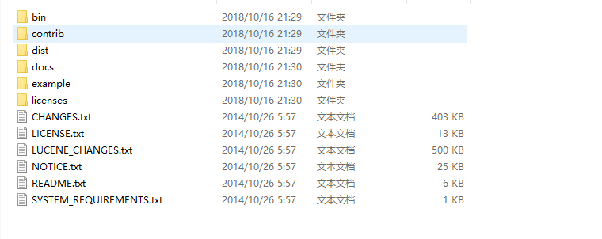

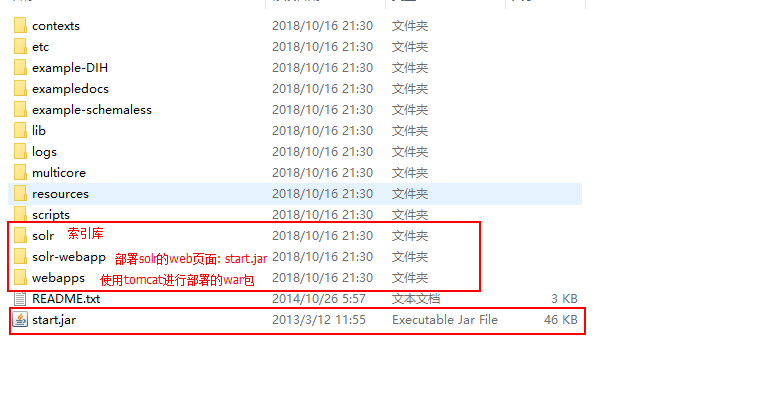

### 2.3 solr的部署: 两种方案

* 第一种部署方案:  启动start.jar即可

> start.jar中内置了jetty的服务器

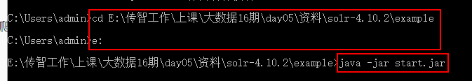

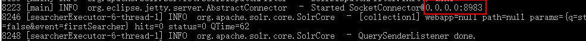

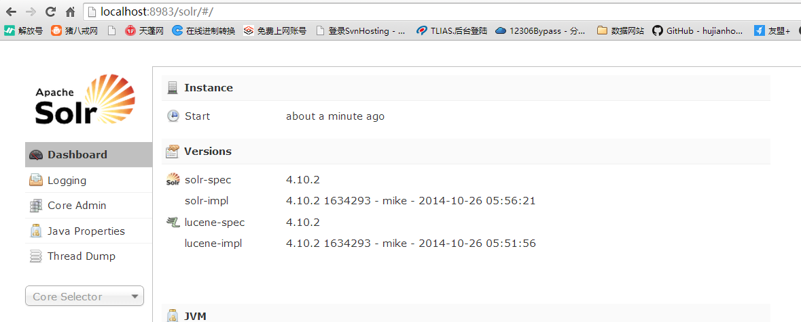

* 第二种部署方案: 基于tomcat进行部署

  * 1) 寻找一个没有中文和空格的目录, 将Tomcat放置在这个目录中
  * 2) 将solr.war部署到Tomcat中, 并进行解压

  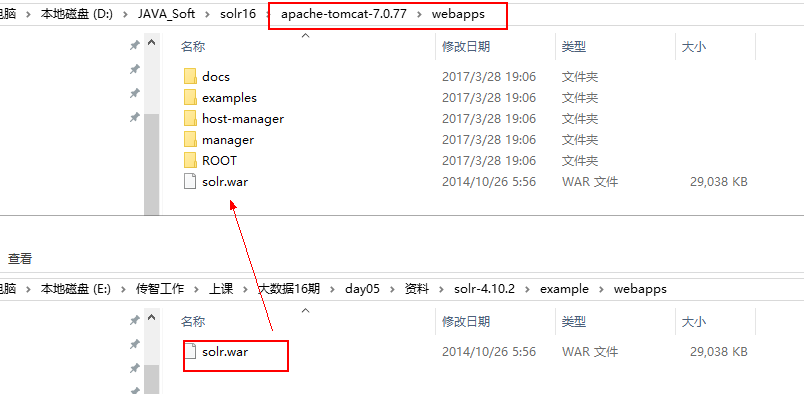

  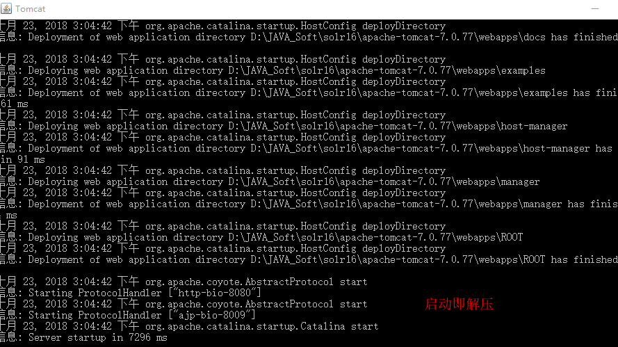

  * 3) 将war包进行改名, 或者直接删除

  > 改名或者进行删除的时候, 一定要将tomcat关闭

  -  4) 添加相关的配置文件 和 jar包

  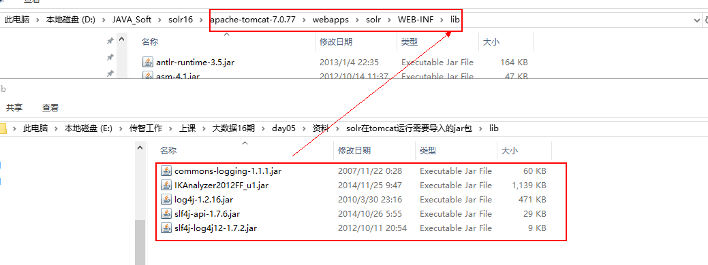


  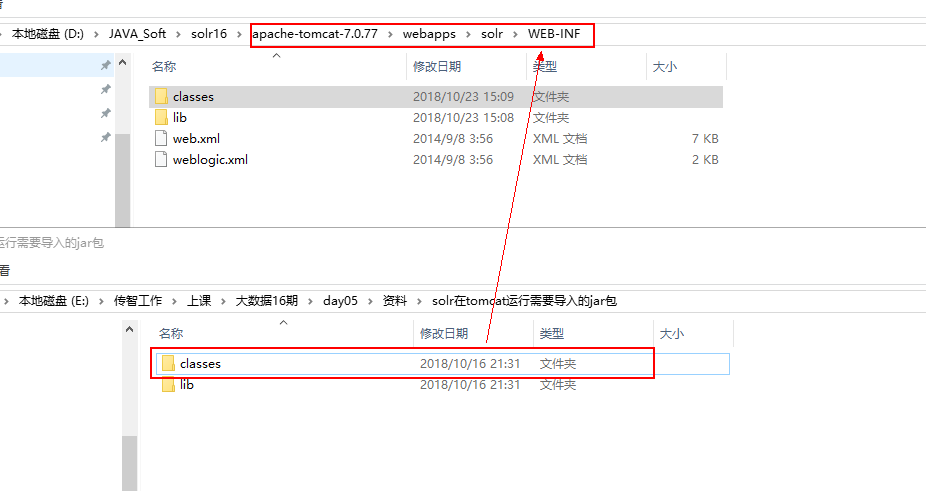

   - 5) 将solr的索引库复制到tomcat同级的目录下

  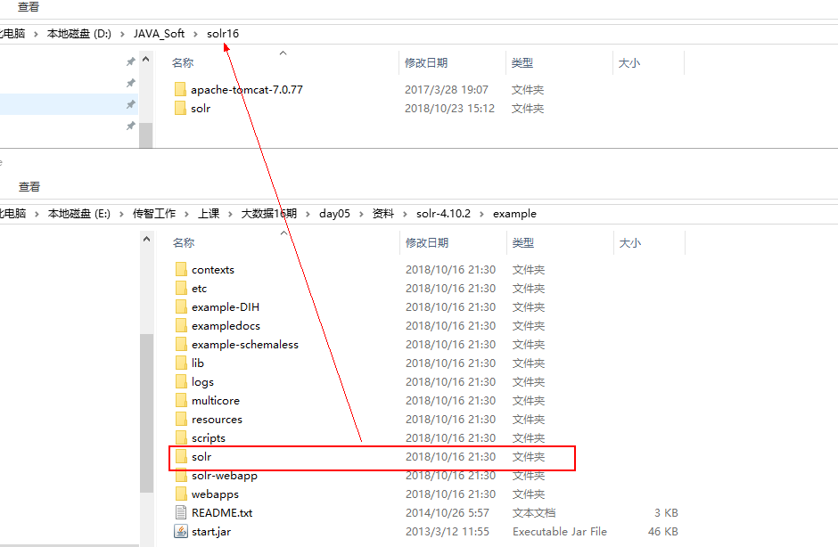

   - 6) 打开tomcat的bin目录下Catalina.bat文件,添加如下内容

  > set "JAVA_OPTS=-Dsolr.solr.home=目录位置"

  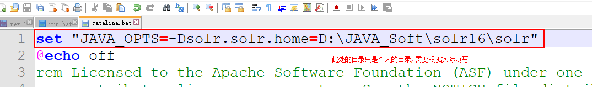

  * 7) 启动tomcat, 查看管理界面

  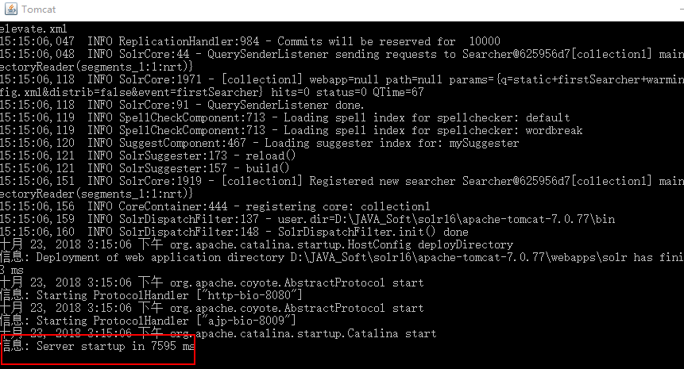

  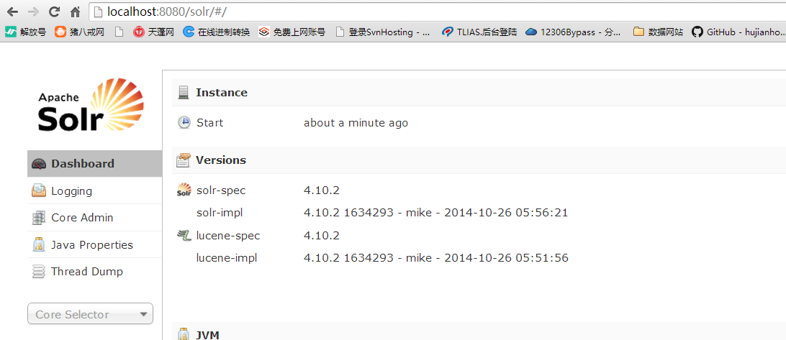

## 3, solr的管理界面

* 日志窗口: 解决警告的问题

  * 1) 将扩展依赖添加的solr的索引库中

  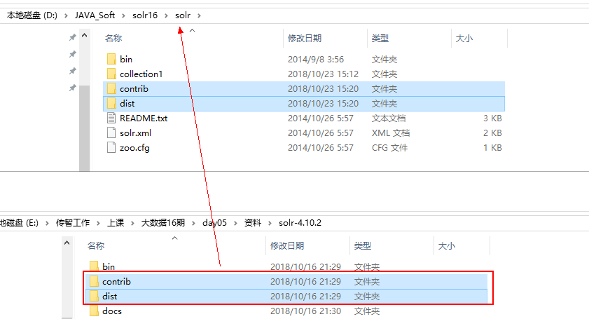

  * 2) 修改solr的配置文件: solrConfig.xml

  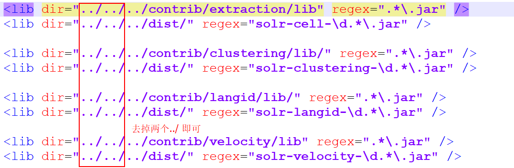

* 添加多个索引库

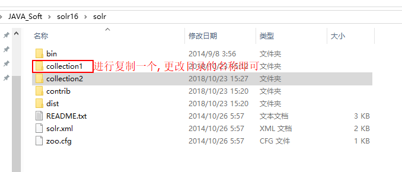

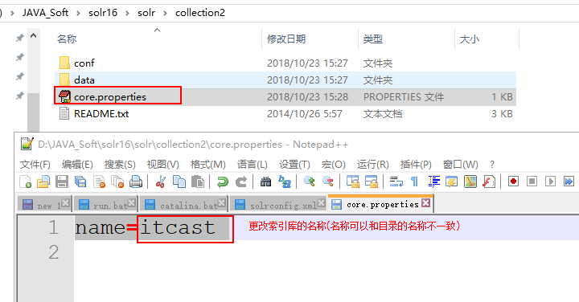

## 4. solr的索引选择器界面的内容

* 分词器的界面

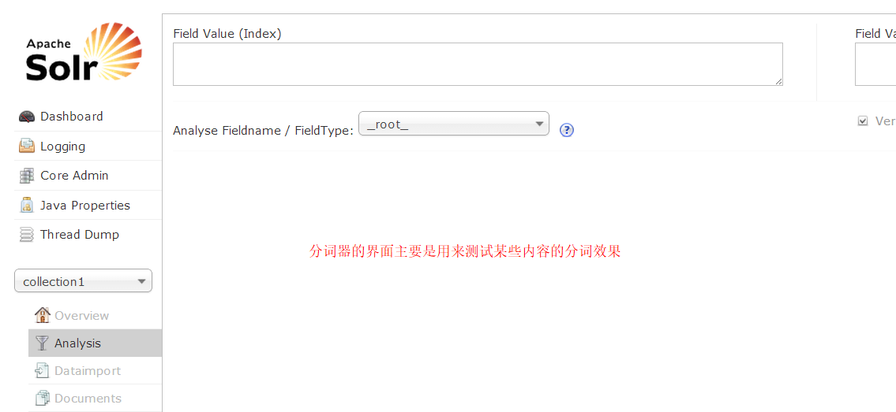

* 文档界面

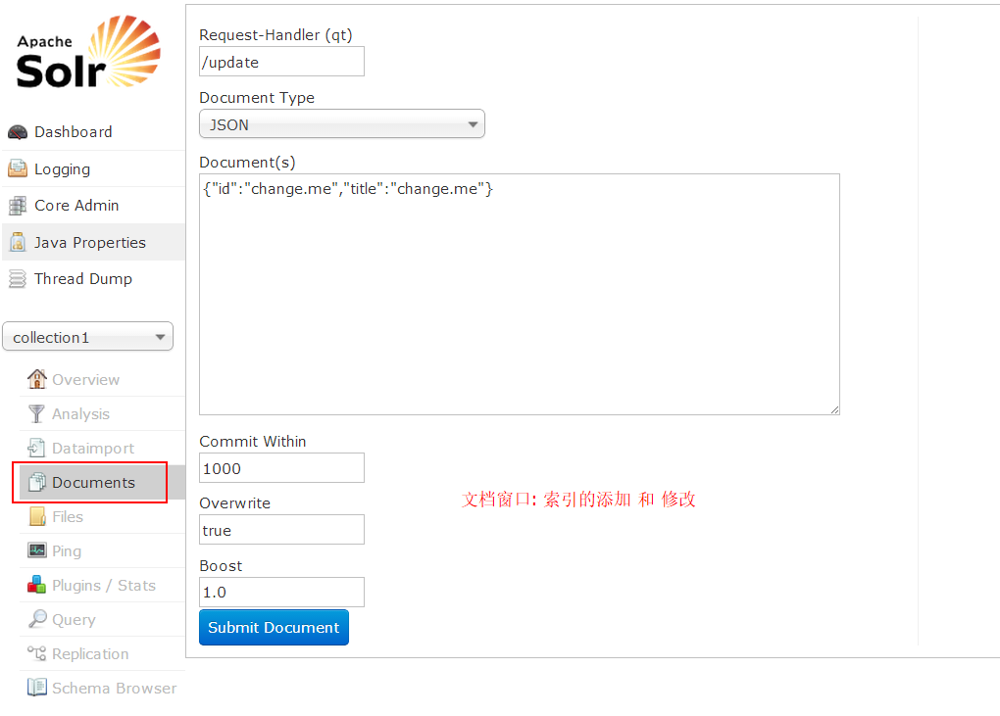

* query视图

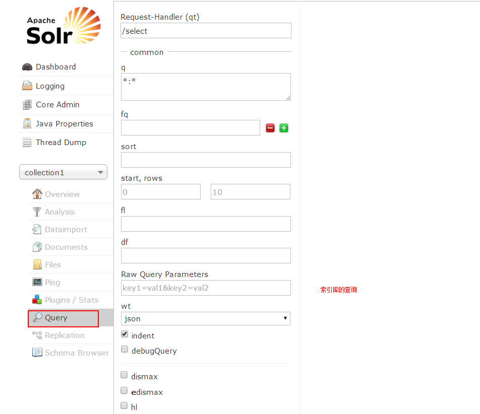

* schema界面


## 5. solr的核心配置文件

### 5.1 core.properties

​	设置索引库的名称的

### 5.2 solrConfig.xml文件

​	solr的核心配置文件, 里面存储了solr相关参数设置, solr的执行处理器, solr优化的配置, 一般不会对这个文件进行相关的修改, 一般采用默认即可

### 5.3 schema.xml文件

```xml
<schema name="example" version="1.5">
  

   <!-- 不删除
   --> 
   <field name="_version_" type="long" indexed="true" stored="true"/>
   
   <field name="_root_" type="string" indexed="true" stored="false"/>

   <!-- 不删除
   --> 

	<!--
		field标签: 字段标签, 用来初始化solr的默认字段
			name:  字段的名称
			type : 字段的类型
			indexed: 是否分词
			stored : 是否保存
			required : 是否必须存在
			multiValued: 是否是多值(数组或集合)
			
		id: 是一个必须的存在的字段, 也就是说当创建一个文档的时候, 必须要有id字段, 而且需要保证id字段唯一
			lucene当中, 唯一字段由lucene自己进行维护, 而在solr中需要程序员进行手动的维护这个字段
	-->
   <field name="id" type="string" indexed="true" stored="true" required="true" multiValued="false" /> 
        
   <field name="name" type="text_general" indexed="true" stored="true"/>
  
   <field name="price"  type="float" indexed="true" stored="true"/>
   
   <field name="title" type="text_general" indexed="true" stored="true" multiValued="true"/>
   
   <field name="content" type="text_general" indexed="false" stored="true" multiValued="true"/>
  
   <field name="text" type="text_general" indexed="true" stored="false" multiValued="true"/>

   <!--
		dynamicField: 动态域, 用来对初始化的字段进行扩展的, 因为默认的字段不可能写的很全, 如果有新的字段添加进来
			可以通过动态域进行扩展字段
			name: 动态字段的名称
   -->
   <dynamicField name="*_i"  type="int"    indexed="true"  stored="true"/>
  <!--
		uniqueKey: 指定唯一键的字段
  -->
 <uniqueKey>id</uniqueKey>

 <!--
	copyField:复制域, 这个 域主要是用来做查询的, 如果想对多个字段进行同时查询的时候, 就可以使用复制域
		source: 数据的来源字段
		dest: 目的的字段
 -->
   <copyField source="title" dest="text"/>
   <copyField source="name" dest="text"/>
   <copyField source="content" dest="text"/>
   
   <!--
		fieldType: 设置字段类型的标签, 一般使用这个标签添加ik分词器
   -->
   
   <fieldType name="string" class="solr.StrField" sortMissingLast="true" />

    <fieldType name="int" class="solr.TrieIntField" precisionStep="0" positionIncrementGap="0"/>
    <fieldType name="float" class="solr.TrieFloatField" precisionStep="0" positionIncrementGap="0"/>
    <fieldType name="long" class="solr.TrieLongField" precisionStep="0" positionIncrementGap="0"/>
    <fieldType name="double" class="solr.TrieDoubleField" precisionStep="0" positionIncrementGap="0"/>

    <fieldType name="date" class="solr.TrieDateField" precisionStep="0" positionIncrementGap="0"/>

</schema>
```

### 5.4 引入ik分词器

* 1) 添加ik的jar包 和 ik分词器的配置文件(做过了)
* 2) 添加ik分词器的类型到schema.xml中

```xml
 <fieldType name="text_ik" class="solr.TextField">
		<analyzer class="org.wltea.analyzer.lucene.IKAnalyzer"/>
 </fieldType>
```

* 3) 将ik配置到指定的字段上

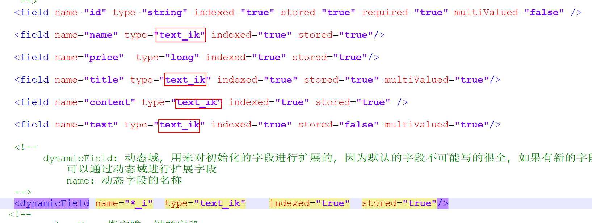

## 6. solr的客户端工具: solrj

solrj 是Apache提供的一款专为针对solr获取索引数据的javaAPI, solrj中提供了相关的快捷的API

* solrj基本入门代码(原生写入索引)

```xml
	<dependency>
			<groupId>org.apache.solr</groupId>
			<artifactId>solr-solrj</artifactId>
			<version>4.10.2</version>
		</dependency>
	<!--日志的包, solrj执行需要一个日志包-->
		<dependency>
			<groupId>commons-logging</groupId>
			<artifactId>commons-logging-api</artifactId>
			<version>1.1</version>
		</dependency>
```

```java
// 原生的方式写入索引的操作
    @Test
    public void indexWriterTest01() throws Exception {
        //1.  创建的solrj的服务对象
        SolrServer solrServer = new HttpSolrServer("http://localhost:8080/solr/collection1");

        //2. 添加文档数据
        List<SolrInputDocument> docs = new ArrayList<SolrInputDocument>();
        SolrInputDocument doc1 = new SolrInputDocument();
        doc1.addField("id","1");
        doc1.addField("title","托塔天王");
        doc1.addField("name","老夯");
        doc1.addField("content","老夯, 被誉为是托塔李天王,从未在6.30下过课");
        docs.add(doc1);

        SolrInputDocument doc2 = new SolrInputDocument();
        doc2.addField("id","2");
        doc2.addField("title","搞笑天王");
        doc2.addField("name","川哥");
        doc2.addField("content","川哥被誉为搞笑天王, 因为永远离不了娃娃两字");
        docs.add(doc2);

        //solrServer.add(doc);
        solrServer.add(docs);
        //3. 提交数据
        solrServer.commit();
    }
```

* 使用javaBean来写入索引数据(重点)

```java
    //使用javaBean写入索引数据
    @Test
    public void indexWriterTest02() throws Exception {
        //1.  创建的solrj的服务对象
        SolrServer solrServer = new HttpSolrServer("http://localhost:8080/solr/collection1");

        //2. 添加javaBean
        Product product = new Product("3","iPhone XS Max","13000","非常的好用, 因为很贵");
        solrServer.addBean(product);

        //3. 提交数据
        solrServer.commit();
    }
```

* solr索引库的删除

```java
    // 索引的删除
    @Test
    public void indexWriterTest03() throws Exception {
        //1.  创建的solrj的服务对象
        SolrServer solrServer = new HttpSolrServer("http://localhost:8080/solr/collection1");


        //2. 执行索引的删除
        //solrServer.deleteById("10");
        solrServer.deleteByQuery("*:*"); //删除所有的数据
        //3. 提交数据
        solrServer.commit();
    }
```

* solr索引库的查询入门(原生的方式)

```JAVA
    //原生的方式获取数据
    @Test
    public void indexSearchTest01() throws Exception {
        //1. 创建solrserver对象
        SolrServer solrServer = new HttpSolrServer("http://localhost:8080/solr/collection1");

        //2. 执行查询
        SolrQuery solrQuery = new SolrQuery("*:*");
        QueryResponse response = solrServer.query(solrQuery);
        
        //3. 获取数据
        SolrDocumentList documentList = response.getResults();

        for (SolrDocument document : documentList) {
            String id = (String)document.get("id");
            List title = (List)document.get("title");
            Long price =(Long) document.get("price");
            String content =(String) document.get("content");
            System.out.println(id+"=="+title+"=="+price+"=="+content);
        }
    }
```

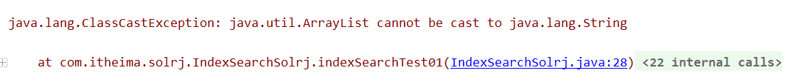

如何解决这样转换异常:

> 1) 修改solr的schema的配置文件, 将对应的多值属性去掉

> 2) 修改返回值的类型, 是集合,就使用集合来接收即可

* 索引查询:返回javaBean(重点)

```java
//索引查询:返回javaBean
    @Test
    public void indexSearchTest02() throws Exception {
        //1. 创建solrserver对象
        SolrServer solrServer = new HttpSolrServer("http://localhost:8080/solr/collection1");

        //2. 执行查询
        SolrQuery solrQuery = new SolrQuery("*:*");
        QueryResponse response = solrServer.query(solrQuery);

        //3. 获取数据:javaBean

        List<Product> productList = response.getBeans(Product.class);

        for (Product product : productList) {
            System.out.println(product);
        }
//响应回来的json字符串: {name:"",price:13000}

    }
```


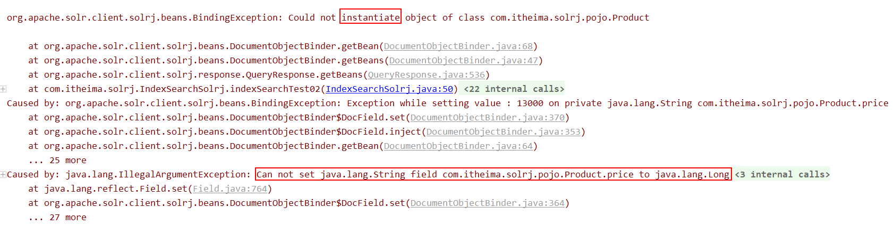

* solrj多样化的查询方式

在创建SolrQuery时，我们填写的Query语句，可以有以下高级写法：

查询语句中如果有特殊字符，需要转义，可以使用：  ” ”

1、匹配所有文档：\*:\* （通配符？和 \* ：“*”表示匹配任意字符；“?”表示匹配出现的位置）

2、布尔操作：AND、OR和NOT布尔操作（推荐使用大写，区分普通字段）

3、子表达式查询（子查询）：可以使用“()”构造子查询。 比如：(query1 AND query2) OR (query3 AND query4)

4、相似度查询：

（1）默认相似度查询：title:appla~，此时默认编辑距离是2

（2）指定编辑距离的相似度查询：对模糊查询可以设置编辑距离，可选0~2的整数：title:appla~1。

5、范围查询（Range Query）：Lucene支持对数字、日期甚至文本的范围查询，并且两端范围。结束的范围可以使用“*”通配符。

（1）日期范围（ISO-8601 时间GMT）：birthday:[1990-01-01T00:00:00.000Z TO 1999-12-31T24:59:99.999Z]

（2）数字：age:[2000 TO *] 

（3）文本：content:[a TO a]

```java
//多样化查询
    @Test
    public void indexSearchTest03() throws Exception {
        //1. 通配符查询: ? *\
        // q的格式:    字段的名 : 字段的值
        SolrQuery solrQuery = new SolrQuery("title:ipho*");
        //publicSearch(solrQuery);

        //2. 相似度查询：模糊查询
        //  最大编辑次数: 2
        // solr支持更改最大编辑次数: 0~2 但是如果改的值大于了2, 那么久采用2, 如果小于0了, 那么就采用0
        //如果用户输入~, 那么就会导致solr报错, 此时需要将用户的输入的内容两侧加上单引号或者双引号
        solrQuery = new SolrQuery("title:'iphon~'~2");
        //publicSearch(solrQuery);

        //3. 范围查询: TO 一定要大写
        // id 是String类型的, 如果是String类型其实使用范围的时候文本范围, 字典顺序进行排序
        // demo: 1,2,3,4    1,2,3,10 ,20    :[1~2]  1,10,2,20
        solrQuery = new SolrQuery("id:[1 TO 3]");
        //publicSearch(solrQuery);

        //4. 布尔查询(组合查询中一种): AND(MUST)  OR(SHOULD)  NOT(MUST_NOT)
        solrQuery = new SolrQuery("title:iphone NOT id:3");
        //publicSearch(solrQuery);

        //5.子表达式查询
        solrQuery = new SolrQuery("(title:iphone OR id:10) AND title:max");
        publicSearch(solrQuery);

    }
```

## 7. solr的高级

### 7.1 solr的高亮

```
 //solr的高亮
    @Test
    public  void indexSearchTest04() throws Exception {
        //1. 创建solrserver对象
        SolrServer solrServer = new HttpSolrServer("http://localhost:8080/solr/collection1");

        //2. 执行查询
        SolrQuery query = new SolrQuery("content:誉为");
        //高亮设置的开始 ----------------------------

        query.setHighlight(true); //开启了高亮
        query.addHighlightField("content"); //可以给多个字段设置高亮

        query.setHighlightSimplePre("<font color='red'>");
        query.setHighlightSimplePost("</font>");
        // 用来设置高亮的分片数: 默认值为 1
        query.setHighlightSnippets(1000);

        //高亮设置的结束 ----------------------------
        QueryResponse response = solrServer.query(query);

        //获取高亮:开始-----------------
        /**
         * 最外层的map:
         *      key: 高亮的这个文档的id值
         *      value: 对应这个文档的高亮的内容map集合
         * 内层map:
         *      key: 高亮的字段的名称
         *      value: 高亮的内容集合
         * list集合: 里面一般只有一个数据, 除非当前高亮的字段是一个多值的字段, 同时高亮的分片必须大于1
         */
        Map<String, Map<String, List<String>>> highlighting = response.getHighlighting();

        for (String docID : highlighting.keySet()) {
           // System.out.println(docID);

            Map<String, List<String>> listMap = highlighting.get(docID);
            List<String> list = listMap.get("content");

            System.out.println(list.get(0));

        }

        //获取高亮:结束-----------------
        //3. 获取结果
        List<Product> productList = response.getBeans(Product.class);

        for (Product product : productList) {
            System.out.println(product);
        }

    }
```

### 7.2 solr的排序 和 分页

```java
//solr的分页 和 排序
    @Test
    public  void indexSearchTest05() throws Exception {
        int  page = 2;
        int pageSize = 2;

        //1. 创建solrserver对象
        SolrServer solrServer = new HttpSolrServer("http://localhost:8080/solr/collection1");


        //2.执行查询

        SolrQuery solrQuery = new SolrQuery("*:*");

        solrQuery.setSort("id", SolrQuery.ORDER.asc);

        solrQuery.setStart((page-1)*pageSize);

        solrQuery.setRows(pageSize);

        QueryResponse response = solrServer.query(solrQuery);

        //3. 获取数据
        List<Product> productList = response.getBeans(Product.class);

        for (Product product : productList) {
            System.out.println(product);
        }

    }
```

作业:

* **1) solr的第二种部署方式**
* **2) solrj 完成 索引库的CURD**
* **3) solr高级: 高亮 排序 分页**