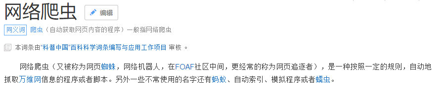
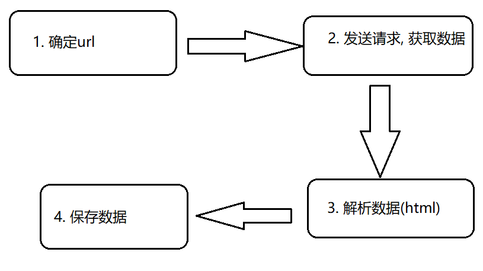
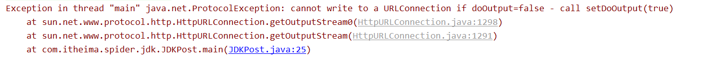
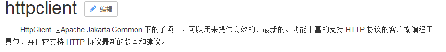
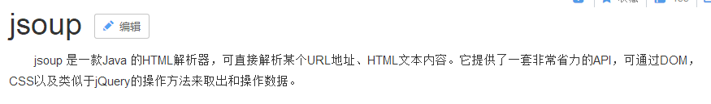

# 爬虫课堂笔记day01

* 今日内容:

  * 爬虫的基本概念:
    * 1) 爬虫是什么
    * 2) 爬虫的价值
    * 3) 爬虫的分类
    * 4) 爬虫的执行流程

  * 爬虫三大模块:
    * 1) 获取数据
    * 2) 解析数据
    * 3) 保存数据
  * 案例: 
    * 163新闻网站的爬取(爬取某一条新闻数据)
    * 爬取起点中文网的小说(爬取某一本小说)

## 1. 爬虫的基础概念

### 1.1 爬虫是什么



​	爬虫本质上就是一个程序, 只不过这个程序可以获取互联网中的信息(数据)

### 1.2 爬虫的价值

爬虫的价值就是获取数据的价值, 如果获取的数据的价值越高, 那么爬虫的程序的价值也就越高

* 数据的价值:
  * 例如: 假设获取到了大量的用户的信息(浏览信息, 基本信息, 购物的信息): 精准广告推荐, 用户画像(行为分析)
  * 例如: 假设获取到了大量的商品的信息: 比价网

### 1.3 爬虫的分类

* 通用爬虫: 用来做搜索的
  * 用来获取互联网中所有的数据, 不局限于网站, 分类, 行业
    * 例如: 百度  谷歌
* 垂直爬虫: 数据分析
  * 用来获取互联网中某一个行业, 某一个分类, 某一个网站的数据
    * 例如: 慢慢买,  笔趣阁

### 1.4 爬虫的执行流程



* 爬虫的步骤:
  * 1) 确定url
  * 2) 发送请求, 获取数据
  * 3) 解析数据
  * 4) 保存数据

## 2. 爬虫的三大模块

### 2.1 获取数据

回顾http请求:

* 请求:
  * 请求行: 请求路径, 请求协议 请求方式
    * get 和 post的 区别:
      * 1) get没有请求体
      * 2) 请求参数放置的位置不同
      * 3) get请求不能无限的拼接
      * 4) post请求的安全性相对而言较高
  * 请求头
    * user-agent: 标识浏览器的内核版本的
    * cookie: 用来将此网站的保存到本地浏览器的cookie发送给服务端
  * 请求体
    * 只有post才有请求体
* 响应:
  * 响应行: 状态码
    * 200
    * 302
    * 304: 本地缓存
    * 404
    * 500
  * 响应头
    * Location : 一般和302结合使用, 重定向
    * set-cookie:  向浏览器写入cookie信息
  * 响应体
    * 爬虫要获取的内容(数据)

#### 2.1.1: 使用原生的jdk来发送http请求

* 使用原生jdk发送 get 请求

```java
package com.itheima.spider.jdk;

import java.io.InputStream;
import java.net.HttpURLConnection;
import java.net.MalformedURLException;
import java.net.URL;
import java.net.URLConnection;

//演示使用原生jdk发送get请求
public class JDKGet {

    public static void main(String[] args) throws Exception {
        //1.确定url
        String indexUrl = "http://www.itcast.cn?username=xiaochaun";

        //2. 发送请求, 获取数据
        //2.1: 将url转换成一个url对象
        URL url = new URL(indexUrl);
        //2.2 : 根据这个url获取此url的远程连接
        HttpURLConnection connection = (HttpURLConnection)url.openConnection();
        //2.3: 设置请求方式
        connection.setRequestMethod("GET");// 注意 此处的请求方式的值一定要大写

        //2.4 : 设置参数: 请求参数, 请求头

        //2.5 发送请求
        InputStream in = connection.getInputStream();// 获取输入流,
        //2.6 获取数据
        int len = 0;
        byte[] b = new byte[1024];
        while( (len = in.read(b) ) !=-1 ){
            System.out.println(new String(b,0,len));// 注意String的包的问题
        }
        in.close();
    }
}

```

* 使用原生JDK发送post请求

```java
package com.itheima.spider.jdk;

import java.io.InputStream;
import java.io.OutputStream;
import java.net.HttpURLConnection;
import java.net.MalformedURLException;
import java.net.URL;

// 演示 元素JDK发送post请求
public class JDKPost {

    public static void main(String[] args) throws Exception {
        //1.确定url
        String  indexUrl = "http://www.itcast.cn";
        //2. 发送请求, 获取数据
        //2.1 创建url对象
        URL url = new URL(indexUrl);
        //2.2 获取远程的连接对象
        HttpURLConnection connection = (HttpURLConnection)url.openConnection();

        //2.3 设置请求方式
        connection.setRequestMethod("POST");

        //2.4 设置参数: 请求参数 请求头
        connection.setDoOutput(true);// 注意: 此代码一定要写在获取输出流之前
        OutputStream out = connection.getOutputStream();
        out.write("username=xiaochaun&age=58".getBytes());

        //2.5 发送请求
        InputStream in = connection.getInputStream();

        //2.6 获取数据
        int len = 0;
        byte[] b = new byte[1024];
        while((len = in.read(b))!=-1){
            System.out.println(new String(b,0,len));

        }
        in.close();
        out.close();


    }
}

```



#### 2.1.2: 使用HTTPClient发送请求



​	httpClient是专为为发送http请求而生的

* httpClient的基本使用

```xml
使用第一步: 导包
        <dependency>
            <groupId>org.apache.httpcomponents</groupId>
            <artifactId>httpclient</artifactId>
            <version>4.5.4</version>
        </dependency>
```

* 使用httpClient发送get请求

```java
package com.itheima.spider.httpClient;

import org.apache.http.Header;
import org.apache.http.client.HttpClient;
import org.apache.http.client.methods.CloseableHttpResponse;
import org.apache.http.client.methods.HttpGet;
import org.apache.http.impl.client.CloseableHttpClient;
import org.apache.http.impl.client.HttpClients;
import org.apache.http.util.EntityUtils;

import java.io.IOException;

// 演示使用httpClient发送get请求
public class HttpClientGet {
    public static void main(String[] args) throws IOException {
        //1. 确定url
        String url = "http://www.itcast.cn?username=hangge";

        //2. 发送请求, 获取数据
        //2.1 获取httpClient对象
        CloseableHttpClient httpClient = HttpClients.createDefault();
        //2.2 创建请求方式
        HttpGet httpGet = new HttpGet(url);

        //2.3 设置参数: 请求参数 请求头
        httpGet.setHeader("user-agent","Mozilla/5.0 (Windows NT 6.3; WOW64) AppleWebKit/537.36 (KHTML, like Gecko) Chrome/35.0.1916.153 Safari/537.36");

        //2.4 发送请求, 获得响应对象
        // CloseableHttpResponse包含了响应行, 响应头, 响应体
        CloseableHttpResponse response = httpClient.execute(httpGet);

        //2.5 获取数据
        int statusCode = response.getStatusLine().getStatusCode();
        System.out.println(statusCode);

        if(statusCode==200){
            //表示请求成功
            // 获取响应头
            Header[] headers = response.getHeaders("Content-Type");
            String value = headers[0].getValue();
            System.out.println(value);

            // 获取响应体
            String html = EntityUtils.toString(response.getEntity(), "UTF-8");
            System.out.println(html);
        }
    }
}

```

* 使用httpClient发送post请求

```java
package com.itheima.spider.httpClient;

import org.apache.http.NameValuePair;
import org.apache.http.client.entity.UrlEncodedFormEntity;
import org.apache.http.client.methods.CloseableHttpResponse;
import org.apache.http.client.methods.HttpPost;
import org.apache.http.impl.client.CloseableHttpClient;
import org.apache.http.impl.client.HttpClients;
import org.apache.http.message.BasicNameValuePair;
import org.apache.http.util.EntityUtils;

import java.io.UnsupportedEncodingException;
import java.util.ArrayList;
import java.util.List;

// 演示 使用httpClient发送Post请求
public class HttpClientPost {

    public static void main(String[] args) throws Exception {
        //1. 确定url
        String url = "http://www.itcast.cn";
        //2. 发送请求, 获取数据
        //2.1 获取httpClient对象
        CloseableHttpClient httpClient = HttpClients.createDefault();

        //2.2 创建请求方式
        HttpPost httpPost = new HttpPost(url);

        //2.3 设置参数: 请求参数 和  请求头
        List<NameValuePair> list = new ArrayList<NameValuePair>();
        list.add(new BasicNameValuePair("username","hangge"));
        list.add(new BasicNameValuePair("age","18"));
        UrlEncodedFormEntity entity = new UrlEncodedFormEntity(list);
        httpPost.setEntity(entity);

        //2.4 发送请求
        CloseableHttpResponse response = httpClient.execute(httpPost);

        //2.5 获取数据
        int statusCode = response.getStatusLine().getStatusCode();
        if(statusCode==200){

            System.out.println(EntityUtils.toString(response.getEntity(),"utf-8"));
        }

    }
}

```

总结: 使用HttpClient的基本步骤

* 1) 导包

* 2) 确定url

* 3) 获取httpClient对象 HttpClients.createDefault();

* 4) 设置请求方式: HttpGet HttpPost

* 5) 设置参数:请求参数 和 请求头

  * 请求参数只有post比较复杂一点

  ```java
  List<NameValuePair> list = new ArrayList<NameValuePair>();
  list.add(new BasicNameValuePair("username","hangge"));
  list.add(new BasicNameValuePair("age","18"));
  UrlEncodedFormEntity entity = new UrlEncodedFormEntity(list);
  httpPost.setEntity(entity);
  ```

* 6) 发送请求: httpClient.execute(HttpGet/HttpPost);

* 7) 获取数据: 获取响应行, 响应头, 响应体
  * 关于响应体: entityUtils.toString(response.getEntity(),"UTF-8")
  * 关于响应行: int statusCode = response.getStatusLine().getStatusCode();
  * 关于响应头: response.getHeaders(String name)

### 2.2 解析数据

目前获取到的数据本质就是一个HTML文档, 解析数据其实就是在解析HTML文档

* 如果解析HTML文档呢?
  * 可以使用js 或者 jQuery 来进行解析HTML文档, 但是js 和jQuery是前端技术, 无法直接在java客户端中使用, 所以需要一个可以在java的客户端中来解析HTML文档的技术---> jsoup

#### 2.2.1 jsoup



jsoup其实就一款java的解析HTML的工具

* jsoup的基本使用

```xml
第一步: 导包
	<dependency>
            <groupId>org.jsoup</groupId>
            <artifactId>jsoup</artifactId>
            <version>1.10.3</version>
        </dependency>
```

使用jsoup的前提, 需要先获取document对象

* jsoup获取document的方式

```java
package com.itheima.spider.jsoup;

import org.jsoup.Jsoup;
import org.jsoup.nodes.Document;

import java.io.File;
import java.io.IOException;

public class JsoupTest {
    // 演示获取document的方式
    public static void main(String[] args) throws IOException {
        //1. 最常用的一种
        String html = "<!DOCTYPE html>\n" +
                "<html lang=\"en\">\n" +
                "<head>\n" +
                "    <meta charset=\"UTF-8\">\n" +
                "    <title>jsoup获取document最常用的一种方式</title>\n" +
                "</head>\n" +
                "<body>\n" +
                "\n" +
                "</body>\n" +
                "</html>";
        Document document = Jsoup.parse(html);
        String title = document.title();
        System.out.println(title);


        //2. 最简单的方式
        String url = "http://www.itcast.cn";
        Document document1 = Jsoup.connect(url).get();
       // System.out.println(document1);

        //3. 支持将HTML的代码片段转化成document
        Document document2 = Jsoup.parseBodyFragment("<a>跳转首页url</a>");
        //Document document2 = Jsoup.parse("<a>跳转首页url</a>");
        String text = document2.text();
        System.out.println(text);

        //4. 获取本地的HTML文档
        Document document3 = Jsoup.parse(new File(""), "utf-8");

    }

}

```

#### 2.2.2 使用jsoup解析html

在jsoup中, 提供了两套API来解析HTML

* 基于js原生API来实现解析HTML的目的
  * 如果要使用这种方式, 需要程序员必须熟悉js的API, 对程序员的js的要求比较高
* 基于CSS的选择器或者jQuery的选择器来实现的解析HTML文档
  * 常用的选择器: id选择器 类选择器 元素选择器 层级选择器 属性选择器

******

需求: 获取传智播客目前开设了那些课程

* 使用原生js的方式来解析html

```java
package com.itheima.spider.jsoup;

import org.jsoup.Jsoup;
import org.jsoup.nodes.Document;
import org.jsoup.nodes.Element;
import org.jsoup.select.Elements;

import java.io.IOException;

// 基于原生js的方式来解析HTML文档
public class ItcastClassJs {

    public static void main(String[] args) throws IOException {
        String url = "http://www.itcast.cn";
        //1. 使用jsoup获取document
        Document document = Jsoup.connect(url).get();
        //2. 解析数据
        Elements divEls = document.getElementsByClass("nav_txt");
        Element divEl = divEls.get(0);
        Elements ulEls = divEl.getElementsByTag("ul");
        Element ulEl = ulEls.get(0);
        Elements liEls = ulEl.getElementsByTag("li");
        for (Element liEl : liEls) {
            /*String text = liEl.text();
            System.out.println(text);*/
            Elements aEls = liEl.getElementsByTag("a");
            Element aEl = aEls.get(0);
            String text = aEl.text();
            System.out.println(text);
        }
    }
}

```

* 使用选择器的方式来获取数据

```java
package com.itheima.spider.jsoup;

import org.jsoup.Jsoup;
import org.jsoup.nodes.Document;
import org.jsoup.nodes.Element;
import org.jsoup.select.Elements;

import java.io.IOException;

// 使用 选择器的方式来解析数据
public class ItcastClassSelector {

    public static void main(String[] args) throws IOException {
        //1. 确定url
        String url = "http://www.itcast.cn";

        //2. 使用jsoup获取document对象
        Document document = Jsoup.connect(url).get();

        //3. 解析数据
        Elements aEls = document.select(".nav_txt>ul>li>a");
        for (Element aEl : aEls) {
            System.out.println(aEl.text());
        }
    }
}

```

总结: 最常用的方法

* 1) parse(String html); 根据给定HTML文档获取document对象]
* 2) select("选择器"); 根据给定的选择器获取对应的元素
* 3) **text()** / html(); 获取某一个元素的内容体
  * 例如: \<a>跳转\<font color='red'>首页\</font>\<a>
* 4) attr(String name); 根据给定的属性的名称, 获取其内容

### 2.3 保存数据

目前可以将数据保存MySQL 或者 文件当中, 后期可以将数据保存大数据环境的下的容器中: hadoop hbase

* 如何将数据保存到MySQL中:
  * 1)JDBC: 
  * 2) DbUtils:
  * 3) mybatis
  * 4) **spring : JDBCTemplate**


## 3. 案例

### 3.1 爬取163新闻网站的数据

```java
package com.itheima.spider.anli;

import org.apache.http.client.methods.CloseableHttpResponse;
import org.apache.http.client.methods.HttpGet;
import org.apache.http.impl.client.CloseableHttpClient;
import org.apache.http.impl.client.HttpClients;
import org.apache.http.util.EntityUtils;
import org.jsoup.Jsoup;
import org.jsoup.nodes.Document;
import org.jsoup.nodes.Element;
import org.jsoup.select.Elements;

import java.io.IOException;

public class News163Spider {

    public static void main(String[] args) throws IOException {
        //1. 确定url
        String url = "https://news.163.com/18/1017/16/DUB7C0GE000189FH.html";

        //2. 发送请求, 获取数据
        //2.1 创建httpClient对象
        CloseableHttpClient httpClient = HttpClients.createDefault();
        //2.2 创建请求方式
        HttpGet httpGet = new HttpGet(url);

        //2.3 封装参数:
        // 标准的设置方式: 将请求头当中所有的信息, 全部填充
        httpGet.setHeader("User-Agent","Mozilla/5.0 (Windows NT 6.3; WOW64) AppleWebKit/537.36 (KHTML, like Gecko) Chrome/35.0.1916.153 Safari/537.36");


        //2.4 发送请求
        CloseableHttpResponse response = httpClient.execute(httpGet);

        //2.5 获取数据
        String html = EntityUtils.toString(response.getEntity(), "UTF-8");

        //3.解析数据
        //3.1 获取document对象
        Document document = Jsoup.parse(html);
        //3.2 解析新闻数据
        //3.2.1 获取新闻的标题
        Elements h1El = document.select("#epContentLeft>h1");
        System.out.println(h1El.text());

        //3.2.2 获取新闻的发布时间
        Elements divEl = document.select(".post_time_source");
        String timeAndSource = divEl.text();
        System.out.println(timeAndSource);

        String[] split = timeAndSource.split("　");
        System.out.println(split[0]);

        //3.2.3 获取新闻的来源
        System.out.println(split[1]);

        //3.2.4 新闻的正文
        Elements pEls = document.select("#endText>p");
        for (Element pEl : pEls) {
            System.out.println(pEl.text());
        }

        //3.2.5 获取责任编辑
        Elements editorEl = document.select(".ep-editor");
        System.out.println(editorEl.text());
    }
}

```

### 3.2 爬取起点中文网的小说

```java
package com.itheima.spider.anli;

import org.apache.http.client.methods.CloseableHttpResponse;
import org.apache.http.client.methods.HttpGet;
import org.apache.http.impl.client.CloseableHttpClient;
import org.apache.http.impl.client.HttpClients;
import org.apache.http.util.EntityUtils;
import org.jsoup.Jsoup;
import org.jsoup.nodes.Document;
import org.jsoup.nodes.Element;
import org.jsoup.select.Elements;

import java.io.IOException;

// 爬取起点中文网的小说
public class QiDianSpider {

    public static void main(String[] args) throws IOException {
        //1. 确定url
        String url  = "https://read.qidian.com/chapter/2R9G_ziBVg41/eSlFKP1Chzg1";
        while(true) {
            //2. 发送请求获取数据
            //2.1 创建httpClient对象
            CloseableHttpClient httpClient = HttpClients.createDefault();
            //2.2 创建请求方式
            HttpGet httpGet = new HttpGet(url);
            //2.3 设置参数

            //2.4 发送请求, 获取响应对象
            CloseableHttpResponse response = httpClient.execute(httpGet);

            //2.5 获取数据
            String html = EntityUtils.toString(response.getEntity(), "UTF-8");

            //3. 解析数据
            //3.1 获取document对象
            Document document = Jsoup.parse(html);
            //3.2 解析小说内容
            Elements chapterNameEl = document.select(".j_chapterName");
            System.out.println(chapterNameEl.text());

            // 获取小说的内容
            Elements pEls = document.select("[class=read-content j_readContent] p");

            for (Element pEl : pEls) {
                System.out.println(pEl.text());
            }

            //3.3 获取下一章的数据
            //https://vipreader.qidian.com/chapter/1209977/23724364
            //https://read.qidian.com/chapter/2R9G_ziBVg41/dBHJYlixU5oex0RJOkJclQ2
            Elements chapterNextUrlEl = document.select("#j_chapterNext[href*=read.qidian.com]");
            if(chapterNextUrlEl == null || chapterNextUrlEl.size()==0){
                System.out.println("跳出循环");
                break;
            }

            String chapterNextUrl = chapterNextUrlEl.attr("href");
            System.out.println(chapterNextUrl);
            url = "https:" + chapterNextUrl;
        }
    }
}
```


