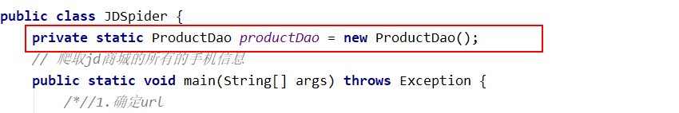
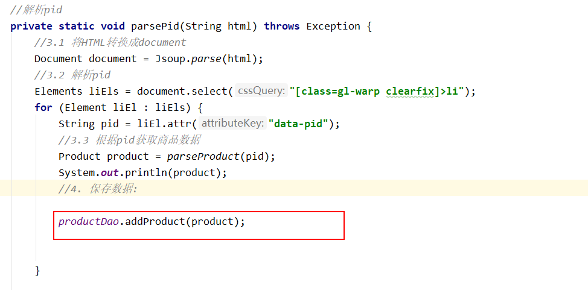
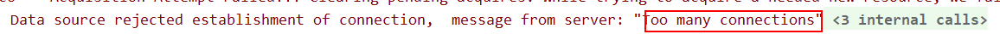
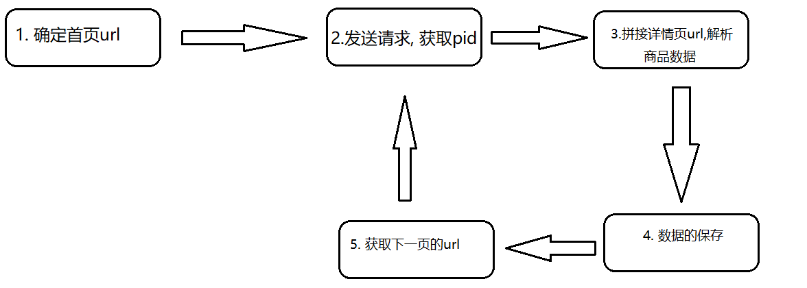
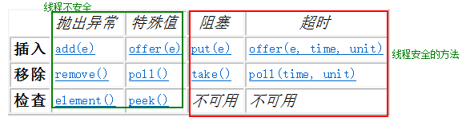
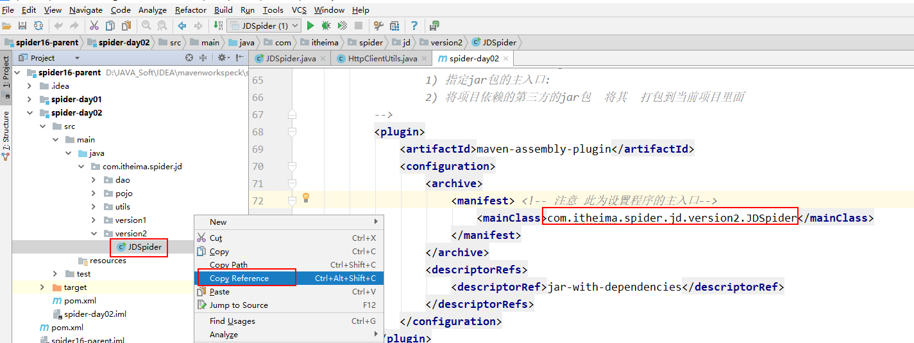
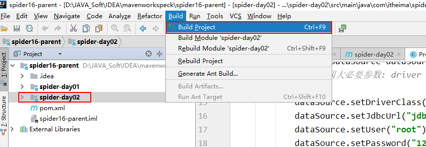
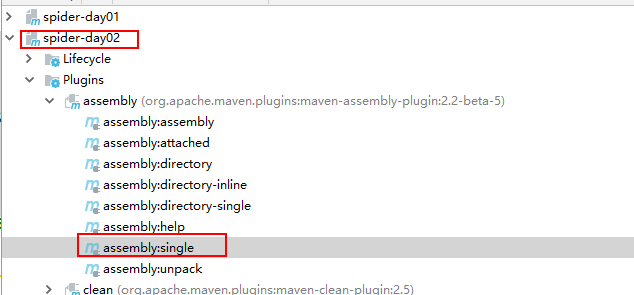
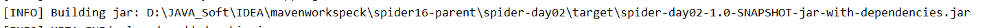
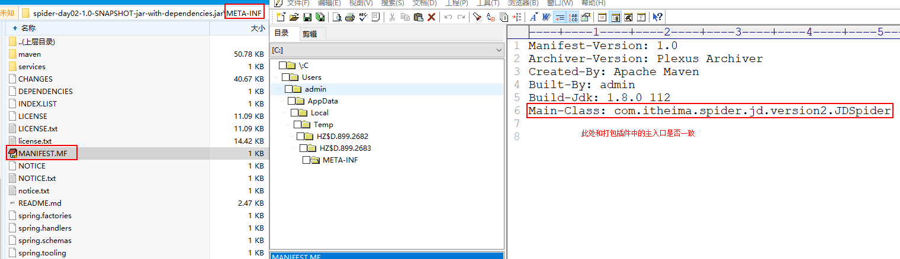

# 爬虫课堂笔记day02

回顾:

* 爬虫基础概念
  * 爬虫是什么:
  * 爬虫的价值: 爬虫的价值就是数据的价值
  * 爬虫的分类: 通用爬虫  垂直爬虫
  * 爬虫的执行流程
    * 1) 确定url
    * 2) 发送请求, 获取数据
    * 3) 解析数据
    * 4) 保存数据
* 爬虫的三大模块:
  * 发送请求, 获取数据
    * httpClient使用步骤:
      * 1) 导包
      * 2) 确定url
      * 3) 获取httpClient对象
      * 4) 创建请求方式: HttpGet  HttpPost
      * 5) 设置参数: 请求参数  请求头
      * 6) 发送请求, 获取响应对象
      * 7) 获取数据:响应行 响应头 响应体
  * 解析数据
    * jsoup常用的方法
      * 1) parse(String html); 根据给定HTML获取其document对象
      * 2) select("选择器");  根据给定的选择器获取对应的元素
      * 3) text()/html(): 获取某一个元素的内容体
      * 4) attr(String name) ; 获取给定属性的值

今日内容:

* 需求: 爬取jd商城中所有的手机信息
  * 1) 先来完成基础版本(重点)
  * 2) 对基础版本进行优化:
    * 多线程  线程池 队列
  * 3) 对优化后的爬虫进行一个基础部署

## 1. 完成jd爬虫的基础版本

### 1.1 jd爬虫的准备工作

* 导包

```xml
<dependencies>
        <dependency>
            <groupId>org.apache.httpcomponents</groupId>
            <artifactId>httpclient</artifactId>
            <version>4.5.4</version>
        </dependency>
        <dependency>
            <groupId>org.jsoup</groupId>
            <artifactId>jsoup</artifactId>
            <version>1.10.3</version>
        </dependency>
        <dependency>
            <groupId>mysql</groupId>
            <artifactId>mysql-connector-java</artifactId>
            <version>5.1.38</version>
        </dependency>

        <dependency>
            <groupId>org.springframework</groupId>
            <artifactId>spring-jdbc</artifactId>
            <version>4.2.4.RELEASE</version>
        </dependency>

        <dependency>
            <groupId>c3p0</groupId>
            <artifactId>c3p0</artifactId>
            <version>0.9.1.2</version>
        </dependency>

        <dependency>
            <groupId>com.google.code.gson</groupId>
            <artifactId>gson</artifactId>
            <version>2.8.1</version>
        </dependency>
    </dependencies>
```

* 导入相关的工具类

```java
package com.itheima.spider.jd.utils;

import org.apache.http.HttpEntity;
import org.apache.http.client.config.RequestConfig;
import org.apache.http.client.entity.UrlEncodedFormEntity;
import org.apache.http.client.methods.CloseableHttpResponse;
import org.apache.http.client.methods.HttpGet;
import org.apache.http.client.methods.HttpPost;
import org.apache.http.client.methods.HttpRequestBase;
import org.apache.http.impl.client.CloseableHttpClient;
import org.apache.http.impl.client.HttpClients;
import org.apache.http.impl.conn.PoolingHttpClientConnectionManager;
import org.apache.http.message.BasicNameValuePair;
import org.apache.http.util.EntityUtils;

import java.io.IOException;
import java.util.ArrayList;
import java.util.List;
import java.util.Map;

public class HttpClientUtils {


    private static PoolingHttpClientConnectionManager connectionManager;

    static {
        //定义一个连接池的工具类对象
        connectionManager = new PoolingHttpClientConnectionManager();
        //定义连接池属性
        //定义连接池最大的连接数
        connectionManager.setMaxTotal(200);
        //定义主机的最大的并发数
        connectionManager.setDefaultMaxPerRoute(20);
    }

    //获取closeHttpClient
    private static CloseableHttpClient getCloseableHttpClient() {

        CloseableHttpClient httpClient = HttpClients.custom().setConnectionManager(connectionManager).build();

        return httpClient;
    }


    //执行请求返回HTML页面
    private static String execute(HttpRequestBase httpRequestBase) throws IOException {

        httpRequestBase.setHeader("User-Agent", "Mozilla/5.0 (Windows NT 6.3; WOW64) AppleWebKit/537.36 (KHTML, like Gecko) Chrome/35.0.1916.153 Safari/537.36");
        /**
         * setConnectionRequestTimeout:设置获取请求的最长时间
         *
         * setConnectTimeout: 设置创建连接的最长时间
         *
         * setSocketTimeout: 设置传输超时的最长时间
         */

        RequestConfig config = RequestConfig.custom().setConnectionRequestTimeout(5000).setConnectTimeout(5000)
                .setSocketTimeout(10 * 1000).build();

        httpRequestBase.setConfig(config);


        CloseableHttpClient httpClient = getCloseableHttpClient();

        CloseableHttpResponse response = httpClient.execute(httpRequestBase);

        String html = EntityUtils.toString(response.getEntity(), "UTF-8");

        return html;
    }

    //get请求执行
    public static String doGet(String url) throws IOException {
        HttpGet httpGet = new HttpGet(url);

        String html = execute(httpGet);

        return html;

    }

    //post请求执行
    public static String doPost(String url, Map<String, String> param) throws Exception {
        HttpPost httpPost = new HttpPost(url);

        List<BasicNameValuePair> list = new ArrayList<BasicNameValuePair>();

        for (String key : param.keySet()) {

            list.add(new BasicNameValuePair(key, param.get(key)));
        }
        HttpEntity entity = new UrlEncodedFormEntity(list);
        httpPost.setEntity(entity);

        return execute(httpPost);
    }
}

```

### 1.2 解析pid

```java
package com.itheima.spider.jd.version1;

import com.itheima.spider.jd.utils.HttpClientUtils;
import org.jsoup.Jsoup;
import org.jsoup.nodes.Document;
import org.jsoup.nodes.Element;
import org.jsoup.select.Elements;

import java.io.IOException;

public class JDSpider {
    // 爬取jd商城的所有的手机信息
    public static void main(String[] args) throws Exception {
        //1.确定url
        String url = "https://search.jd.com/Search?keyword=%E6%89%8B%E6%9C%BA&enc=utf-8";

        //2. 发送请求, 获取数据
        String html = HttpClientUtils.doGet(url);

        //3. 解析数据
        parsePid(html);

    }
    //解析pid
    private static void parsePid(String html) {
        //3.1 将HTML转换成document
        Document document = Jsoup.parse(html);
        //3.2 解析pid
        Elements liEls = document.select("[class=gl-warp clearfix]>li");
        for (Element liEl : liEls) {
            String pid = liEl.attr("data-pid");
            System.out.println(pid);
        }

    }
}

```

### 1.3 拼接详情页url,解析商品数据

* pojo:

```JAVA
package com.itheima.spider.jd.pojo;

public class Product {
    private String pid;
    private String title;
    private String price;
    private String brand;
    private String name;
    private String url;

    public String getPid() {
        return pid;
    }

    public void setPid(String pid) {
        this.pid = pid;
    }

    public String getTitle() {
        return title;
    }

    public void setTitle(String title) {
        this.title = title;
    }

    public String getPrice() {
        return price;
    }

    public void setPrice(String price) {
        this.price = price;
    }

    public String getBrand() {
        return brand;
    }

    public void setBrand(String brand) {
        this.brand = brand;
    }

    public String getName() {
        return name;
    }

    public void setName(String name) {
        this.name = name;
    }

    public String getUrl() {
        return url;
    }

    public void setUrl(String url) {
        this.url = url;
    }

    @Override
    public String toString() {
        return "Product{" +
                "pid='" + pid + '\'' +
                ", title='" + title + '\'' +
                ", price='" + price + '\'' +
                ", brand='" + brand + '\'' +
                ", name='" + name + '\'' +
                ", url='" + url + '\'' +
                '}';
    }
}

```

* jdspider

```java
// 根据给定pid, 解析商品数据
    private static void parseProduct(String pid) throws Exception {
        //1. 拼接url(确定url)
        String productUrl = "https://item.jd.com/"+pid+".html";

        //2. 发送请求, 获取数据
        String html = HttpClientUtils.doGet(productUrl);

        Product product = new Product();
        //3.解析商品数据
        //3.1 将HTML转换成document对象
        Document document = Jsoup.parse(html);
        //3.2 获取商品的标题
        Elements titleEl = document.select(".sku-name");
        product.setTitle(titleEl.text());

        //3.3 获取商品的价格: 暂不获取
        /*Elements priceEl = document.select("[class=price J-p-"+pid+"]");
        System.out.println(priceEl);
        product.setPrice(priceEl.text());*/

        //https://p.3.cn/prices/mgets?skuIds=J_5089275
        String priceUrl = "https://p.3.cn/prices/mgets?skuIds=J_"+pid;
        String priceJson = HttpClientUtils.doGet(priceUrl);
        //回顾json: json格式有几种: 二种  []js中的数组  {}js中的对象
        // var persion  = {"name":"张三"}
        // java中可以将标准的json字符串转换成什么东东呢?
        // [] : 可以转换数组 也可以转换成 集合(list set)
        // {} : 可以转换成 对象  也可以转换成map
        // 如何区分一个json字符串是什么类型的呢?  只需要查看json的最外侧的符号, 如果是[] 就是数组 如果是{} 对象
        Gson gson = new Gson();
        List<Map<String,String>> list = gson.fromJson(priceJson, List.class);
        String price = list.get(0).get("p");
        product.setPrice(price);

        //3.4 获取商品的品牌
        Elements brandEl = document.select("#parameter-brand>li");
        product.setBrand(brandEl.attr("title"));

        //3.5 获取商品的名称
        Elements nameEl = document.select("[class=parameter2 p-parameter-list]>li:first-child");
        product.setName(nameEl.attr("title"));

        //3.6 填充url 和 pid
        product.setPid(pid);
        product.setUrl(productUrl);

        System.out.println(product);
    }
```

### 1.4 保存数据

* sql脚本

```


CREATE DATABASE `spider16` ;

USE `spider16`;

DROP TABLE IF EXISTS `jdspider`;

CREATE TABLE `jdspider` (
  `pid` varchar(150) DEFAULT NULL,
  `title` varchar(150) DEFAULT NULL,
  `price` varchar(150) DEFAULT NULL,
  `brand` varchar(150) DEFAULT NULL,
  `name` varchar(150) DEFAULT NULL,
  `url` varchar(150) DEFAULT NULL
) ENGINE=InnoDB DEFAULT CHARSET=utf8;

```

* productDao

```java
package com.itheima.spider.jd.dao;

import com.itheima.spider.jd.pojo.Product;
import com.mchange.v2.c3p0.ComboPooledDataSource;
import org.springframework.jdbc.core.JdbcTemplate;

import java.beans.PropertyVetoException;

public class ProductDao extends JdbcTemplate{

    public ProductDao()  {
        ComboPooledDataSource dataSource = new ComboPooledDataSource();
        // 数据库的四大必要参数: driver 连接字符串  用户名 密码
        try {
            dataSource.setDriverClass("com.mysql.jdbc.Driver");
            dataSource.setJdbcUrl("jdbc:mysql://localhost:3306/spider16?characterEncoding=UTF-8");
            dataSource.setUser("root");
            dataSource.setPassword("123456");
        } catch (PropertyVetoException e) {
            e.printStackTrace();
        }

        super.setDataSource(dataSource);
    }

    //添加商品数据的方法
    public void addProduct(Product product){
        String sql = "insert into jdspider values(?,?,?,?,?,?)";
        String[] params = {product.getPid(),product.getTitle(),product.getPrice(),product.getBrand(),product.getName(),product.getUrl()};
        update(sql,params);
    }
}

```

* jdspider






会出现的异常:



## 2. 优化爬虫

### 2.1 为什么要优化



说明: 每一次根据分页的url可以解析出30个pid,但是解析pid的操作每一次只有一个,解析pid的步骤太慢了

所以: 如果能够让解析pid的步骤变得多一点 整个解析的效率也就越高了

### 2.2 解决方案

使用 多线程解决效率比较低的问题, 一旦使用多线程务必有考虑一下问题:

* 1) 线程是否安全
* 2) pid存储的问题:
  * 2.1) 先进先出
  * 2.2) 这个容器必须是线程安全的

如何解决问题:

​	可以找一个线程安全的容器, 当多个线程来操作这个容器的时候, 由于容器是安全的, 只能同时有一个线程来获取数据, 这样, 就能线程也是安全的, 而这个容器其实就是队列

### 2.3 多线程

#### 2.3.1 什么是多线程

- 多线程指的是在一个进程中拥有了多个可执行的单元, 这些执行单元合并称为是多线程

#### 2.3.2 实现多线程的方式

- 1) 继承Thread类, 重写其run方法

```java
new Thread(){
    public void run(){
        //线程执行的代码
    }
    
}.start();
```

- 2) 实现runnable接口, 实现其run方法

```java
new Thread(new Runnable(){
    
    public void  run(){
        //线程执行的代码
    };
}).start();
```

- 3) 创建一个有返回值的线程, 通过collable和future来实现的

```java
public static void main(String[] args) throws ExecutionException {
    //Callable的返回值就要使用Future对象，Callable负责计算结果，Future负责拿到结果
    //1、实现Callable接口
    Callable<Integer> callable = new Callable<Integer>() {
        public Integer call() throws Exception {
            int i=999;
            //do something
            // eg request http server and process
            return i;
        }
    };
    //2、使用FutureTask启动线程
    FutureTask<Integer> future = new FutureTask<Integer>(callable);
    new Thread(future).start();
    //3、获取线程的结果
    try {
        Thread.sleep(5000);// 可能做一些事情
        System.out.println(future.get());
    } catch (InterruptedException e) {
        e.printStackTrace();
    } catch (ExecutionException e) {
        e.printStackTrace();
    }
}
```

#### 2.3.4 多线程的对于系统资源的消耗

- 关于时间，创建线程使用是直接向系统申请资源的，对操作系统来说,创建一个线程的代价是十分昂贵的, 需要给它分配内存、列入调度,同时在线程切换的时候还要执行内存换页,CPU 的缓存被 清空,切换回来的时候还要重新从内存中读取信息,破坏了数据的局部性。
- 关于资源,Java线程的线程栈所占用的内存是在Java堆外的，所以是不受java程序控制的，只受系统资源限制，**默认一个线程的线程栈大小是1M**（当让这个可以通过设置-Xss属性设置，但是要注意栈溢出问题），但是，如果每个用户请求都新建线程的话，1024个用户光线程就占用了1个G的内存，如果系统比较大的话，一下子系统资源就不够用了，最后程序就崩溃了。
- 总结一句话: 频繁的创建线程是非常的耗费资源和时间的
- 顾:  希望能够在程序启动的时候, 创建好所需要的线程, 方便程序的后期使用, 提高效率

#### 2.3.5 线程池的概念

在java中提供了Executors类, 用来创建线程池, 大体分为如下几类:

- 1) 创建一个固定大小的线程池: 线程任务比较固定

```java
static ExecutorService newFixedThreadPool(int nThreads);
```

- 2) 创建一个可缓存的线程池: 用来线程任务可变的情况下

```java
static ExecutorService newCachedThreadPool()  
```

- 3) 创建一个定时执行的线程池: 适用于定时任务
  - scheduleAtFixedRate()
  - scheduleWithFixedDelay()
  - 区别:  
    - scheduleAtFixedRate 固定周期执行, 不管上次的线程执行完成没有
    - scheduleWithFixedDelay 固定周期执行, 此方法会等待上次线程执行完成后按照周期执行

```java
static ScheduledExecutorService newScheduledThreadPool(int corePoolSize)  
```

- 4) 创建一个单线程执行的线程池

```java
static ExecutorService newSingleThreadExecutor()  
```

- 5) 创建一个单线程定时执行的线程池

```java
static ScheduledExecutorService newSingleThreadScheduledExecutor()    
```

- 代码如下

```java
public static  void testFixedThreadPool() {
    //创建固定的线程池，使用3个线程来并发执行提交的任务。底层是个无界队列
    ExecutorService executorService = Executors.newFixedThreadPool(6);
    executorService.execute(new MyThread());
    executorService.execute(new MyRunnable());
    executorService.execute(new MyRunnable());
    executorService.execute(new MyRunnable());
    executorService.execute(new MyThread());
    executorService.execute(new MyThread());
}


public static void testCacheThreadPool() {
    //创建非固定数量，可缓存的线程池。当提交的任务数量起起伏伏时，会自动创建或者减少执行线程的数量。
    //当然，重用线程是线程池的基本特征。
    ExecutorService executorService = Executors.newCachedThreadPool();
    executorService.execute(new MyThread());
    executorService.execute(new MyRunnable());
    executorService.execute(new MyRunnable());
    executorService.execute(new MyRunnable());
    executorService.execute(new MyThread());
}

public static void testScheduledThreadPool(){
    //创建一个定时执行线程池
    ScheduledExecutorService executorService = Executors.newScheduledThreadPool(30);
    //1、配置任务的执行周期
    //scheduleAtFixedRate 固定周期执行完毕
    //定时执行线程任务, 但是不在乎上一次有没有执行完成
    executorService.scheduleAtFixedRate(new MyRunnable(),0,1000,TimeUnit.MILLISECONDS);
    //scheduleWithFixedDelay 上一次执行完毕之后下一次开始执行
    //定时执行线程任务, 但是在乎上一次是否执行完成,如果没有执行会等待这个线程执行完以后, 才会等待具体间隔时间后执行下一次
    executorService.scheduleWithFixedDelay(new MyRunnable(),0,1000,TimeUnit.MILLISECONDS);
}

public static void testSingleCacheThreadPool(){
    //创建一个单个线程执行的定时器
    ScheduledExecutorService executorService = Executors.newSingleThreadScheduledExecutor();
    //scheduleAtFixedRate 固定周期执行完毕
    executorService.scheduleAtFixedRate(new MyRunnable(),0,1000,TimeUnit.MILLISECONDS);
    //scheduleWithFixedDelay 上一次执行完毕之后下一次开始执行
    executorService.scheduleWithFixedDelay(new MyRunnable(),0,1000,TimeUnit.MILLISECONDS);
}

public static void testSingleThreadPool() {
    //创建单线程,在任务执行时，会依次执行任务。底层是个无界队列。
    ExecutorService executorService = Executors.newSingleThreadExecutor();
    executorService.execute(new MyThread());
    executorService.execute(new MyRunnable());
    executorService.execute(new MyRunnable());
    executorService.execute(new MyRunnable());
    executorService.execute(new MyThread());
}
```


### 2.4 队列

#### 2.4.1 原生队列



在java中提供了一个类, queue用来模拟普通原生队列的

- 普通队列的特性:
  - 1) 先进先出
  - 2) 队列的头部保存的应该是在队列中存储时间最长的, 队尾应该是存储时间最短的
  - 3)新的元素应该插入的队列的尾部, 取出的元素应该是队列的头部
  - 4) 队列一般不允许随机访问其中的某个元素
- 常用方法:

|          |                     *抛出异常*                      |                   *返回特殊值*                    |
| :------: | :-------------------------------------------------: | :-----------------------------------------------: |
| **插入** |    [`add(e)`](../../java/util/Queue.html#add(E))    | [`offer(e)`](../../java/util/Queue.html#offer(E)) |
| **移除** |  [`remove()`](../../java/util/Queue.html#remove())  |   [`poll()`](../../java/util/Queue.html#poll())   |
| **检查** | [`element()`](../../java/util/Queue.html#element()) |   [`peek()`](../../java/util/Queue.html#peek())   |

- 插入: add(元素)  offer(元素);
  - 建议使用offer方法, 一般来说会比add方法更高效
- 移除: remove()  poll();
  - 建议使用poll进行移除
- 检查: element()  peek()
  - 检查操作其实就是到队列的头部获取一个内容, 但是不是删除
  - 建议使用peek() 当获取不到的时候null

#### 2.4.2 双端队列

在java中, 使用Deque双端队列, 顾名思义, 可以分别在队列的两边进行插入和移除数据

- 常用方法

|          |                   **第一个元素（头部）**                    |                                                             |                 **最后一个元素（尾部）**                  |                                                           |
| :------: | :---------------------------------------------------------: | :---------------------------------------------------------: | :-------------------------------------------------------: | :-------------------------------------------------------: |
|          |                         *抛出异常*                          |                          *特殊值*                           |                        *抛出异常*                         |                         *特殊值*                          |
| **插入** |   [`addFirst(e)`](../../java/util/Deque.html#addFirst(E))   | [`offerFirst(e)`](../../java/util/Deque.html#offerFirst(E)) |   [`addLast(e)`](../../java/util/Deque.html#addLast(E))   | [`offerLast(e)`](../../java/util/Deque.html#offerLast(E)) |
| **移除** | [`removeFirst()`](../../java/util/Deque.html#removeFirst()) |   [`pollFirst()`](../../java/util/Deque.html#pollFirst())   | [`removeLast()`](../../java/util/Deque.html#removeLast()) |   [`pollLast()`](../../java/util/Deque.html#pollLast())   |
| **检查** |    [`getFirst()`](../../java/util/Deque.html#getFirst())    |   [`peekFirst()`](../../java/util/Deque.html#peekFirst())   |    [`getLast()`](../../java/util/Deque.html#getLast())    |   [`peekLast()`](../../java/util/Deque.html#peekLast())   |

- 一般来说, 我们通常使用的都是返回特殊值的方法

------

那么在原生的队列或者是双端队列是线程安全的吗?  不是的, 原生的队列并没有实现线程安全

```java
public class QueueDemo {

    public static void main(String[] args) {
        //演示原生queue的线程不安全
        //定义一个queue

        Queue<String> queue = new ArrayDeque<String>();
        //向原生queue存值
        for(int i = 0 ; i<100 ; i++){
            queue.offer(i+"");
        }


        new Thread(new Runnable() {
            @Override
            public void run() {
                while (true) {
                    try {
                        Thread.sleep(100);
                    } catch (InterruptedException e) {
                        e.printStackTrace();
                    }
                    String poll = queue.poll();
                    System.out.println(Thread.currentThread().getName() + "  " + poll);
                }

            }
        }).start();
        new Thread(new Runnable() {
            @Override
            public void run() {
                while (true) {
                    try {
                        Thread.sleep(100);
                    } catch (InterruptedException e) {
                        e.printStackTrace();
                    }
                    String poll = queue.poll();
                    System.out.println(Thread.currentThread().getName() + "  " + poll);
                }

            }
        }).start();

    }

}
****** 发现线程不安全,重现了重复值
Thread-1  0
Thread-0  1
Thread-1  2
Thread-0  2
Thread-1  4
Thread-0  3
Thread-0  5
Thread-1  6
Thread-1  7
Thread-0  7
```

其实在java中针对于原生queue的线程不安全性, 还提供了一种队列, 称为阻塞队列, 用来解决线程的安全

#### 2.4.3 阻塞队列

- BlockingQueue
  - 阻塞的原生队列

|          | *抛出异常*                                                   | *特殊值*                                                     | *阻塞*                                                       | *超时*                                                       |
| -------- | ------------------------------------------------------------ | ------------------------------------------------------------ | ------------------------------------------------------------ | ------------------------------------------------------------ |
| **插入** | [`add(e)`](../../../java/util/concurrent/BlockingQueue.html#add(E)) | [`offer(e)`](../../../java/util/concurrent/BlockingQueue.html#offer(E)) | [`put(e)`](../../../java/util/concurrent/BlockingQueue.html#put(E)) | [`offer(e,  time, unit)`](../../../java/util/concurrent/BlockingQueue.html#offer(E, long, java.util.concurrent.TimeUnit)) |
| **移除** | [`remove()`](../../../java/util/concurrent/BlockingQueue.html#remove(java.lang.Object)) | [`poll()`](../../../java/util/concurrent/BlockingQueue.html#poll(long, java.util.concurrent.TimeUnit)) | [`take()`](../../../java/util/concurrent/BlockingQueue.html#take()) | [`poll(time,  unit)`](../../../java/util/concurrent/BlockingQueue.html#poll(long, java.util.concurrent.TimeUnit)) |
| **检查** | [`element()`](../../../java/util/Queue.html#element())       | [`peek()`](../../../java/util/Queue.html#peek())             | *不可用*                                                     | *不可用*                                                     |

- BlockingDeque   
  - 阻塞的双端队列

| **第一个元素（头部）**   |                                                              |                                                              |                                                              |                                                              |
| ------------------------ | ------------------------------------------------------------ | ------------------------------------------------------------ | ------------------------------------------------------------ | ------------------------------------------------------------ |
|                          | *抛出异常*                                                   | *特殊值*                                                     | *阻塞*                                                       | *超时期*                                                     |
| **插入**                 | [`addFirst(e)`](../../../java/util/concurrent/BlockingDeque.html#addFirst(E)) | [`offerFirst(e)`](../../../java/util/concurrent/BlockingDeque.html#offerFirst(E)) | [`putFirst(e)`](../../../java/util/concurrent/BlockingDeque.html#putFirst(E)) | [`offerFirst(e,  time, unit)`](../../../java/util/concurrent/BlockingDeque.html#offerFirst(E, long, java.util.concurrent.TimeUnit)) |
| **移除**                 | [`removeFirst()`](../../../java/util/Deque.html#removeFirst()) | [`pollFirst()`](../../../java/util/concurrent/BlockingDeque.html#pollFirst(long, java.util.concurrent.TimeUnit)) | [`takeFirst()`](../../../java/util/concurrent/BlockingDeque.html#takeFirst()) | [`pollFirst(time,  unit)`](../../../java/util/concurrent/BlockingDeque.html#pollFirst(long, java.util.concurrent.TimeUnit)) |
| **检查**                 | [`getFirst()`](../../../java/util/Deque.html#getFirst())     | [`peekFirst()`](../../../java/util/Deque.html#peekFirst())   | *不适用*                                                     | *不适用*                                                     |
| **最后一个元素（尾部）** |                                                              |                                                              |                                                              |                                                              |
|                          | *抛出异常*                                                   | *特殊值*                                                     | *阻塞*                                                       | *超时期*                                                     |
| **插入**                 | [`addLast(e)`](../../../java/util/concurrent/BlockingDeque.html#addLast(E)) | [`offerLast(e)`](../../../java/util/concurrent/BlockingDeque.html#offerLast(E)) | [`putLast(e)`](../../../java/util/concurrent/BlockingDeque.html#putLast(E)) | [`offerLast(e,  time, unit)`](../../../java/util/concurrent/BlockingDeque.html#offerLast(E, long, java.util.concurrent.TimeUnit)) |
| **移除**                 | [`removeLast()`](../../../java/util/Deque.html#removeLast()) | [`pollLast()`](../../../java/util/Deque.html#pollLast())     | [`takeLast()`](../../../java/util/concurrent/BlockingDeque.html#takeLast()) | [`pollLast(time,  unit)`](../../../java/util/concurrent/BlockingDeque.html#pollLast(long, java.util.concurrent.TimeUnit)) |
| **检查**                 | [`getLast()`](../../../java/util/Deque.html#getLast())       | [`peekLast()`](../../../java/util/Deque.html#peekLast())     | *不适用*                                                     | *不适用*                                                     |

阻塞的方法:

- put(e);
  - put方法, 如果队列容量满了, 那么此方法会进行永久等待
- take();
  - take方法, 如果队列当中没有了元素, 那么此方法会进行永久等待

超时的方法:

- offer(e,time,unit);
  - 带时间参数的offer方法, 如果队列容量满了, 那么此方法会在规定的时间内进行等待
- poll(time,unit);
  - 带时间参数的poll方法, 如果队列没有了元素, 那么此方法会 规定时间内进行等待

推荐大家使用的方式是: 阻塞的方法和超时的方法,这两套方法都是线程安全的方法

- 验证阻塞队列是否是线程安全的队列

```java
public static void main(String[] args) throws InterruptedException {
        //验证阻塞队列的是否是线程安全
        ArrayBlockingQueue blockingQueue = new ArrayBlockingQueue(100);
        for (int i = 1 ; i<=100 ; i++){

            blockingQueue.put(i);
            //System.out.println(i);
        }
        new Thread(new Runnable() {
            @Override
            public void run() {
                while(true){
                    try {
                        Thread.sleep(10);

                    Object o = blockingQueue.take();
                    System.out.println(o);
                    } catch (InterruptedException e) {
                        e.printStackTrace();
                    }
                }

            }
        }).start();

        new Thread(new Runnable() {
            @Override
            public void run() {
                while(true){

                    try {
                        Thread.sleep(10);

                        Object o = blockingQueue.take();
                        System.out.println(o);
                    } catch (InterruptedException e) {
                        e.printStackTrace();
                    }
                }
            }
        }).start();


    }
 ************ 阻塞队列是线程安全的
```

总结:

- 原生队列: queue

  - 插入的操作: offer(e)
  - 弹出的操作: poll()
  - 检测: peek();

- 双端队列: Deque

  - 从头部操作:
    - 向头部插入元素 offerFirst(e)
    - 向头部弹出一个元素: pollFirst();
  - 从尾部进行操作:
    - 向尾部插入元素  offerLast(e);
    - 向尾部弹出一个元素: pollLast()

- 阻塞队列:

  - 原生的阻塞队列:

    - 阻塞的方法
      - 插入操作 put(e)
      - 弹出操作: take()
    - 超时的方法
      - 插入操作 offer(e,time,unit);
      - 弹出操作: poll(time,unit)

  - 双端的阻塞队列:

    - 阻塞的方法:

      - 从头部操作:

        - 向头部插入元素: putFirst(E e)

          [`putFirst(e)`](../../../java/util/concurrent/BlockingDeque.html#putFirst(E))

        - 向头部弹出一个元素:takeFirst()

      - 从尾部操作:

        - 向尾部插入元素:putLast(E e)
        - 向尾部弹出元素:takeLast()

    - 超时的方法 :

      - 从头部操作:
        - 向头部插入元素: offerFirst(E e,long timeout,  TimeUnit unit)
        - 向头部弹出一个元素: pollFirst(long timeout,TimeUnit unit)
      - 从尾部操作:
        - 向尾部插入元素:offerLast(E e,long timeout,  TimeUnit unit)
        - 向尾部弹出元素: pollLast(long timeout, TimeUnit unit)

## 3. jd爬虫的部署

### 3.1 爬虫部署的准备工作:

* linux: 一台

  * 安装 jdk1.8 mysql(远程连接) 上网

* 程序:

  * 打包:

    * 1) 添加打包插件 和 编译插件

    * 2) 修改打包插件的主入口类

    

    * 3) 修改dao中数据库相关的配置

    * 4) 将项目进行编译, 然后进行打包
      * 因为maven自动的进行编译, 当启动项目的时候, 会先进行编译

    

    

    

* 打包后测试



### 3.2 将jar上传linux, 启动

```
启动的命令:
	java -jar jdspider.jar
```


## 4. 相关部署的问题

​	查看课件中的解决方案即可