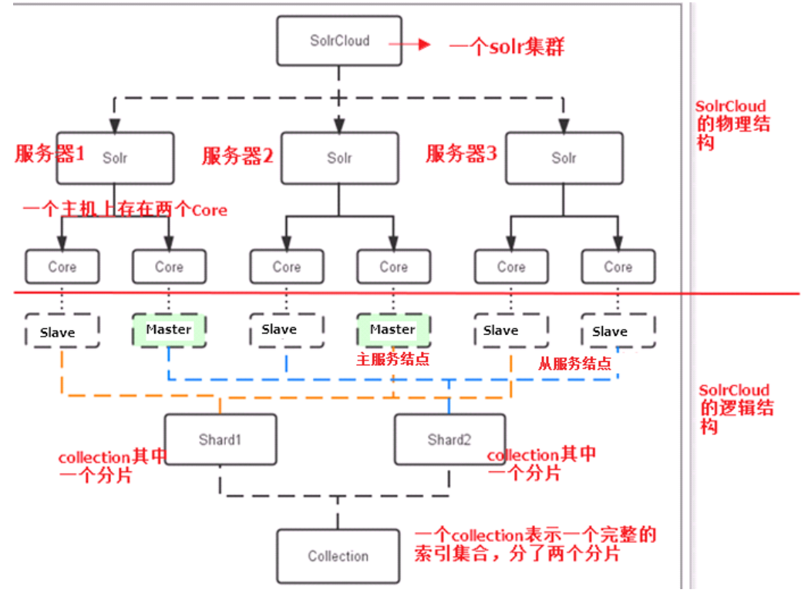
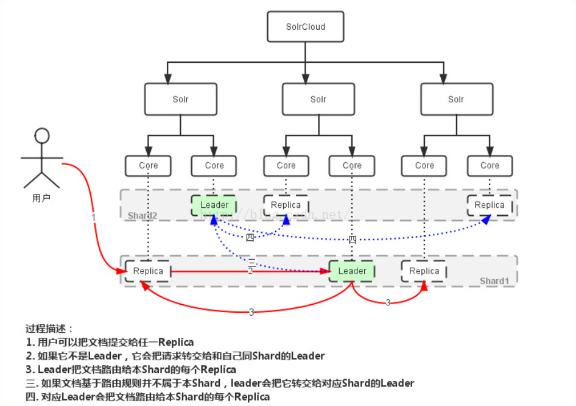
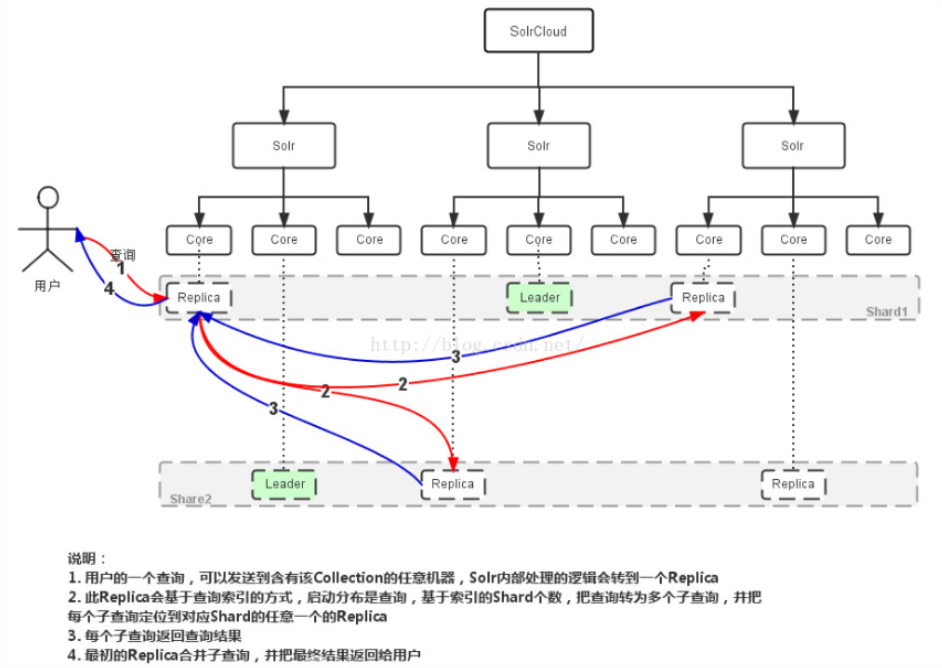
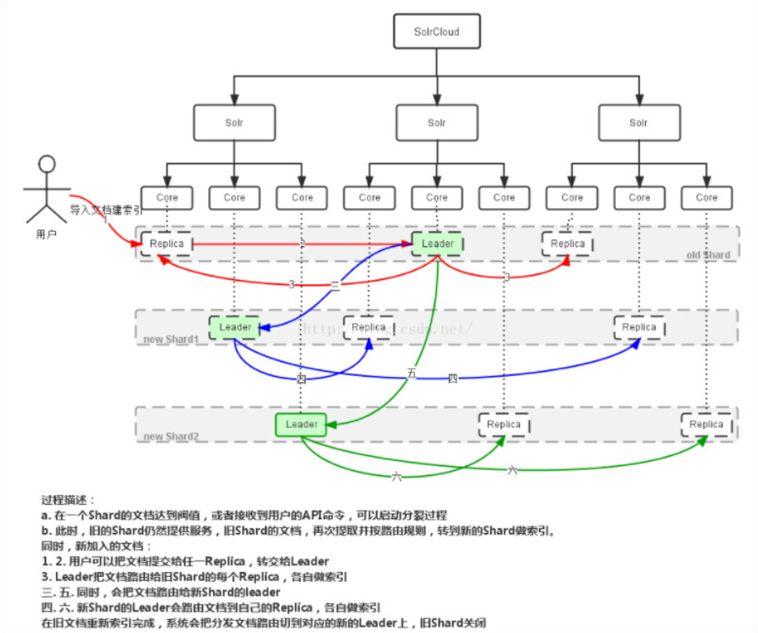
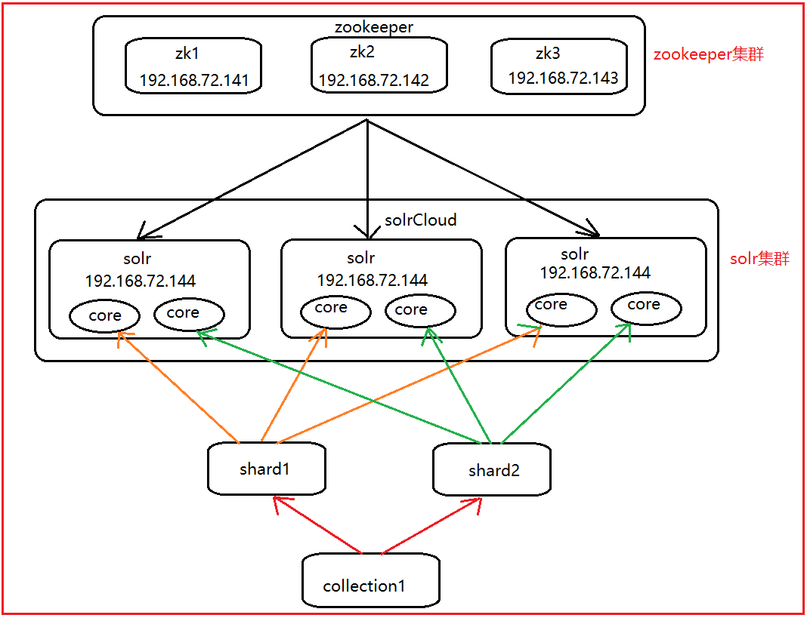

# 爬虫课程day06--solrCloud

* 课前回顾

  * solr基本概念: 
  * solr的部署:
    * solr的下载
    * solr的目录结构: 
    * solr的两种部署方式:
      * 基于tomcat实现solr服务
  * solr的管理界面
  * solr的核心配置文件: core.properties ,  solrconfig.xml, schema.xml
  * solr 客户端工具: solrj
    * solrj操作索引库: CURD
  * solr高级的内容: 高亮 , 排序 分页

今日内容:

* solrCloud概念
* solrCloud结构: 一个图
* solrCloud读写的流程: 二个图
* solrCloud副本分裂: 一个图
* **solrCloud的部署:**
* solrCloud的管理命令(了解)
* **solrj连接solrCloud操作**


## 1. solrCloud的基本概念

​	SolrCloud(solr 云)是Solr提供的分布式搜索方案，当你需要大规模，容错，分布式索引和检索能力时使用 SolrCloud。当一个系统的索引数据量少的时候是不需要使用SolrCloud，当**索引量很大**，**搜索请求并发很高**，这时需要使用SolrCloud来满足这些需求。

### 1.2 solrCloud的结构

​	SolrCloud为了降低单机的处理压力，需要由多台服务器共同来完成索引和搜索任务。实现的思路是将索引数据进行Shard（分片）拆分，每个分片由多台的服务器共同完成，当一个索引或搜索请求过来时会分别从不同的Shard的服务器中操作索引。

​	SolrCloud需要Solr基于Zookeeper部署，Zookeeper是一个集群管理软件，由于SolrCloud需要由多台服务器组成，由zookeeper来进行协调管理。



## 3. solrCloud读写流程

* 写数据



>1) 当用户发送一个写入索引请求, solrj会连接任意一台节点的服务器, 此时如果这个节点不是一个master节点,
>
>2) 将这个请求转发到master节点(同分片的转发), 由这个master进行数据的保存,在保持的时候, 会采用类似于hash值进行取模计算, 得到需要将数据保存在某一个分片上, master会将保存自己的数据保存了,
>
>3) 保存之后, 将其同步另外两台slave上
>
>4) 将剩余的数据转发另一个分片的master的节点上, 让其进行保存, 保存结束后, 将数据同步到另外的两台slave节点上

* 读的操作



>1) 用户执行一个查询的操作(\*:\*), 执行查询的操作会由slave节点进行查询, 会将查询条件分为两个(分片数), 分贝在两个分片上的slave节点执行查询
>
>2) 将两个分片查询到的结果将其汇总到最初用户连接的那个节点上, 将数据返回给用户即可

* 副本分裂




> 副本分裂, 指的就是讲一个分片进行一分为二
>
> 1) 当用户执行分裂的命令以后, 当前需要进行分类的分片,会分出两个新的分片, 然后新的分片会将旧分片上的数据保存下来, 各占50%
>
> 2) 保存结束, 旧的分片就会失去读取和写入索引的功能, 此时, 就可以将旧的分片删除

如果要删除一个分片, 必须将这个分片进行分裂


## 4. solrCloud的部署



### 4.1 zookeeper集群

ZooKeeper是一个分布式的，开放源码（apache）的分布式应用程序协调服务，是Google的Chubby一个开源的实现，是Hadoop和Hbase、dubbox、kafka的重要组件。它是一个为分布式应用提供一致性服务的软件，提供的功能包括:配置维护、域名服务、分布式同步、组服务等。

- zookeeper在solrCloud中的作用
  - 主要用来管理solr集群中的相关配置信息和集群的运行状态, 协助solr进行主节点的选举


* 准备工作:

```
1) 保证三台服务器的防火墙务必关闭
2) 域名映射关系: node01  node02  node03   三台服务器都需要进行配置

192.168.72.141 hadoop01 node01
192.168.72.142 hadoop02 node02
192.168.72.143 hadoop03 node03
```

部署过程参考课件即可


* zookeeper的选举机制

zookeeper在进行投票选举的时候, 会采用过半机制, 如果发送投票的数据达到了整个集群的一半以上, 就会产生主节点

初始化的时候:

```
假设: node01  node02  node03  
node01启动了: zookeeper启动了其中的一台, 此时这台zookeeper会将票投给自己
node02启动了: zookeeper集群启动了两台, node02 会将票投给id最大的那个机子, 此时就是自己, node01发现又有一台启动了, 此时会重新投票, 投给node02. 一共只有三台,已经过半了, 随即产生主节点 node02
node03启动了:zookeeper集群启动了三台, node03 会将票投给自己, 但是由于主节点已经产生了, node01 和 node02 就不会投票, node02担任主节点
```

第二次以后访问: 谁的数据比较多, 谁就是老大, 同时过半机制也在执行

```
node01 100kb    node02 200kb  node03 300kb
```

### 4.2 solrCloud集群

 	查看课件即可

## 5. solrCloud的管理命令

## 6 使用solrj完成对solrCloud索引CURD

* 添加索引

```java
  //写入索引的操作
    @Test
    public void indexWriterTest01() throws Exception {
        //1. 创建solrCloud的服务对象
        String zkHost = "192.168.72.141:2181,192.168.72.142:2181,192.168.72.143:2181";
        CloudSolrServer solrServer = new CloudSolrServer(zkHost);

        solrServer.setDefaultCollection("collection2"); //设置默认连接的索引库

        solrServer.setZkClientTimeout(5000); // 连接zookeeper的超时时间
        solrServer.setZkConnectTimeout(5000); // 从zookeeper上获取solr的连接的超时连接

        solrServer.connect(); //获取连接

        //2. 添加索引
        SolrInputDocument doc = new SolrInputDocument();
        doc.addField("id","1");
        doc.addField("title","这是一个solrCloud的集群");
        doc.addField("content","今天在部署solrCloud的时候, 一定要小心小心再小心");
        solrServer.add(doc);

        //3. 提交数据
        solrServer.commit();

    }
```

* 删除索引

```java
 //索引的删除
    @Test
    public void indexWriterDel() throws Exception {
        //1. 创建solrCloud服务对象
        String zkHost = "192.168.72.141:2181,192.168.72.142:2181,192.168.72.143:2181";
        CloudSolrServer solrServer = new CloudSolrServer(zkHost);

        solrServer.setDefaultCollection("collection2");//设置默认连接的索引库

        solrServer.setZkClientTimeout(5000); //获取zookeeper的连接的超时时间
        solrServer.setZkConnectTimeout(5000);//通过zookeeper获取solr的连接的超时时间

        solrServer.connect(); //获取连接

        //2. 删除索引
        solrServer.deleteById("1");

        //3. 提交数据
        solrServer.commit();

    }
```

* 查询索引

```java
//索引的查询
    @Test
    public void indexWriterQuery() throws Exception {
        //1. 创建solrCloud服务对象
        String zkHost = "192.168.72.141:2181,192.168.72.142:2181,192.168.72.143:2181";
        CloudSolrServer solrServer = new CloudSolrServer(zkHost);

        solrServer.setDefaultCollection("collection2");//设置默认连接的索引库

        solrServer.setZkClientTimeout(5000); //获取zookeeper的连接的超时时间
        solrServer.setZkConnectTimeout(5000);//通过zookeeper获取solr的连接的超时时间

        solrServer.connect(); //获取连接

        //2. 执行查询
        SolrQuery solrQuery = new SolrQuery("*:*");
        QueryResponse response = solrServer.query(solrQuery);

        //3. 获取数据
        SolrDocumentList documentList = response.getResults();

        for (SolrDocument document : documentList) {
            Object id = document.get("id");
            Object title = document.get("title");
            Object content = document.get("content");
            System.out.println(id +"=="+title+"=="+content);
        }
    }
```


https://www.52pojie.cn

链接：https://pan.baidu.com/s/1V6lGiYM-zmC41CaB8KqXeQ 
提取码：440e