# 三大框架整合

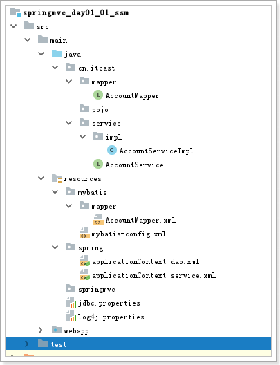 

# 1 准备工作

```
create database springmvc_db;

use springmvc_db;

create table account(name varchar(50), money double);

insert into account(name, money) values('aaa', 1000);
insert into account(name, money) values('bbb', 1000);
```

## 1.1 创建项目,导入配置文件

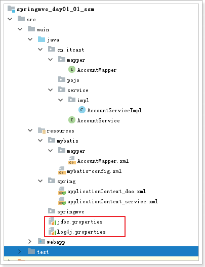 

## 1.2 pom.xml 导入依赖 和 tomcat插件

```xml
<?xml version="1.0" encoding="UTF-8"?>
<project xmlns="http://maven.apache.org/POM/4.0.0"
         xmlns:xsi="http://www.w3.org/2001/XMLSchema-instance"
         xsi:schemaLocation="http://maven.apache.org/POM/4.0.0 http://maven.apache.org/xsd/maven-4.0.0.xsd">
    <parent>
        <artifactId>itcast_parent</artifactId>
        <groupId>cn.itcast.maven</groupId>
        <version>1.0-SNAPSHOT</version>
    </parent>
    <modelVersion>4.0.0</modelVersion>

    <artifactId>springmvc_day01_01_ssm</artifactId>
    <!--web项目-->
    <packaging>war</packaging>

    <dependencies>
        <!-- 单元测试 -->
        <dependency>
            <groupId>junit</groupId>
            <artifactId>junit</artifactId>
        </dependency>

        <!-- Spring -->
        <dependency>
            <groupId>org.springframework</groupId>
            <artifactId>spring-webmvc</artifactId>
        </dependency>
        <dependency>
            <groupId>org.springframework</groupId>
            <artifactId>spring-jdbc</artifactId>
        </dependency>
        <dependency>
            <groupId>org.springframework</groupId>
            <artifactId>spring-aspects</artifactId>
        </dependency>
        <dependency>
            <groupId>org.springframework</groupId>
            <artifactId>spring-test</artifactId>
        </dependency>

        <!-- Mybatis -->
        <dependency>
            <groupId>org.mybatis</groupId>
            <artifactId>mybatis</artifactId>
        </dependency>
        <dependency>
            <groupId>org.mybatis</groupId>
            <artifactId>mybatis-spring</artifactId>
        </dependency>

        <!-- MySql -->
        <dependency>
            <groupId>mysql</groupId>
            <artifactId>mysql-connector-java</artifactId>
        </dependency>

        <!--日志包-->
        <dependency>
            <groupId>org.slf4j</groupId>
            <artifactId>slf4j-log4j12</artifactId>
        </dependency>

        <!-- 连接池 -->
        <dependency>
            <groupId>com.alibaba</groupId>
            <artifactId>druid</artifactId>
        </dependency>

        <dependency>
            <groupId>jstl</groupId>
            <artifactId>jstl</artifactId>
        </dependency>
        <dependency>
            <groupId>javax.servlet</groupId>
            <artifactId>servlet-api</artifactId>
            <scope>provided</scope>
        </dependency>
        <dependency>
            <groupId>javax.servlet</groupId>
            <artifactId>jsp-api</artifactId>
            <scope>provided</scope>
        </dependency>

        <!-- Apache工具组件 -->
        <dependency>
            <groupId>org.apache.commons</groupId>
            <artifactId>commons-lang3</artifactId>
        </dependency>
        <dependency>
            <groupId>org.apache.commons</groupId>
            <artifactId>commons-io</artifactId>
        </dependency>

    </dependencies>

    <build>
        <plugins>
            <!-- 配置Tomcat插件 -->
            <plugin>
                <groupId>org.apache.tomcat.maven</groupId>
                <artifactId>tomcat7-maven-plugin</artifactId>
                <version>2.2</version>
                <configuration>
                    <path>/</path>
                    <port>80</port>
                </configuration>
            </plugin>
        </plugins>
    </build>

</project>
```

# 2 dao层

## 2.1 mapper接口

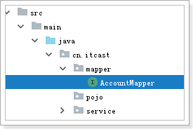 

```java
package cn.itcast.mapper;

import org.apache.ibatis.annotations.Param;

public interface AccountMapper {
    // 出账
    public void out(@Param("name") String outAccount,
                    @Param("money") double money);

    // 入账
    public void in(@Param("name") String inAccount,
                    @Param("money") double money);

}
```

## 2.2 mapper文件(sql语句)

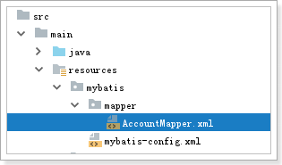 

```xml
<?xml version="1.0" encoding="UTF-8" ?>
<!DOCTYPE mapper
        PUBLIC "-//mybatis.org//DTD Mapper 3.0//EN"
        "http://mybatis.org/dtd/mybatis-3-mapper.dtd">
<mapper namespace="cn.itcast.mapper.AccountMapper">
    <!--出账-->
    <update id="out">
        update account
        set money = money - #{money}
        where name=#{name}
    </update>

    <!--入账-->
    <update id="in">
        update account
        set money = money + #{money}
        where name=#{name}
    </update>
</mapper>
```

## 2.3 mybatis核心配置文件

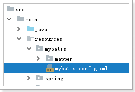 

```xml
<?xml version="1.0" encoding="UTF-8" ?>
<!DOCTYPE configuration
        PUBLIC "-//mybatis.org//DTD Config 3.0//EN"
        "http://mybatis.org/dtd/mybatis-3-config.dtd">
<configuration>

</configuration>
```

## 2.4 spring配置文件: 整合

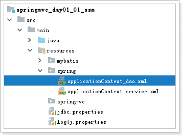 

```xml
<?xml version="1.0" encoding="UTF-8"?>
<beans xmlns="http://www.springframework.org/schema/beans"
       xmlns:xsi="http://www.w3.org/2001/XMLSchema-instance"
       xmlns:context="http://www.springframework.org/schema/context"
       xsi:schemaLocation="http://www.springframework.org/schema/beans http://www.springframework.org/schema/beans/spring-beans.xsd http://www.springframework.org/schema/context http://www.springframework.org/schema/context/spring-context.xsd">
    <!--1 关联jdbc.properties-->
    <context:property-placeholder location="classpath:jdbc.properties"/>

    <!--2 配置连接池-->
    <bean id="ds" class="com.alibaba.druid.pool.DruidDataSource">
        <property name="driverClassName" value="${jdbc.driverClassName}"/>
        <property name="url" value="${jdbc.url}"/>
        <property name="username" value="${jdbc.username}"/>
        <property name="password" value="${jdbc.password}"/>
    </bean>

    <!--3 配置sqlSessionFactory-->
    <bean id="sqlSessionFactory" class="org.mybatis.spring.SqlSessionFactoryBean">
        <!--3.1 配置连接池属性-->
        <property name="dataSource" ref="ds"/>
        <!--3.2 加载mybatis的核心配置文件-->
        <property name="configLocation" value="classpath:mybatis/mybatis-config.xml"/>
        <!--3.3 加载mybatis的mapper文件-->
        <property name="mapperLocations" value="classpath:mybatis/mapper/*Mapper.xml"/>
        <!--3.4 给pojo类起别名-->
        <property name="typeAliasesPackage" value="cn.itcast.pojo"/>
    </bean>

    <!--4 将mapper接口实现类交给spring管理,扫描包-->
    <bean class="org.mybatis.spring.mapper.MapperScannerConfigurer">
        <property name="basePackage" value="cn.itcast.mapper"/>
    </bean>
</beans>
```

## 2.5 测试

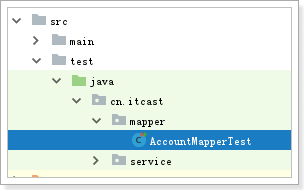 

```java
package cn.itcast.mapper;

import org.junit.Test;
import org.junit.runner.RunWith;
import org.springframework.beans.factory.annotation.Autowired;
import org.springframework.test.context.ContextConfiguration;
import org.springframework.test.context.junit4.SpringJUnit4ClassRunner;

@RunWith(SpringJUnit4ClassRunner.class)
@ContextConfiguration(locations = "classpath:spring/applicationContext_dao.xml")
public class AccountMapperTest {

    @Autowired
    private AccountMapper accountMapper;

    @Test
    public void out() throws Exception {
        accountMapper.out("aaa", 300);
    }

    @Test
    public void in() throws Exception {
        accountMapper.in("aaa", 300);
    }

}
```

# 3 service层

## 3.1 业务接口和业务接口实现类

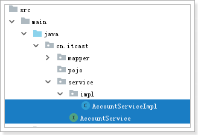 

```java
package cn.itcast.service;

public interface AccountService {
    // 转账
    public void transfer(String outAccount, String inAccount, double money);
}
```


```java
package cn.itcast.service.impl;

import cn.itcast.mapper.AccountMapper;
import cn.itcast.service.AccountService;
import org.springframework.beans.factory.annotation.Autowired;
import org.springframework.stereotype.Service;
import org.springframework.transaction.annotation.Transactional;

@Service
public class AccountServiceImpl implements AccountService {

    @Autowired
    private AccountMapper accountMapper;

    @Transactional
    public void transfer(String outAccount, String inAccount, double money) {
        // 出账
        accountMapper.out(outAccount, money);

        // 制造异常
        int j = 1/0;

        // 入账
        accountMapper.in(inAccount, money);
    }
}
```

## 3.2 交给spring管理且开启事务

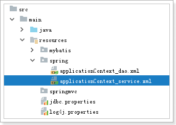 

```xml
<?xml version="1.0" encoding="UTF-8"?>
<beans xmlns="http://www.springframework.org/schema/beans"
       xmlns:xsi="http://www.w3.org/2001/XMLSchema-instance"
       xmlns:context="http://www.springframework.org/schema/context" xmlns:tx="http://www.springframework.org/schema/tx"
       xsi:schemaLocation="http://www.springframework.org/schema/beans http://www.springframework.org/schema/beans/spring-beans.xsd http://www.springframework.org/schema/context http://www.springframework.org/schema/context/spring-context.xsd http://www.springframework.org/schema/tx http://www.springframework.org/schema/tx/spring-tx.xsd">
    <!--1 扫描包, 将service实现类交给spring管理-->
    <context:component-scan base-package="cn.itcast.service.impl"/>

    <!--2 开启事务注解-->
    <bean id="transactionManager" class="org.springframework.jdbc.datasource.DataSourceTransactionManager">
        <property name="dataSource" ref="ds"/>
    </bean>
    <tx:annotation-driven transaction-manager="transactionManager"/>
</beans>
```

## 3.3 测试

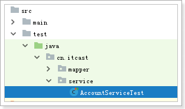 

```java
package cn.itcast.service;

import org.junit.Test;
import org.junit.runner.RunWith;
import org.springframework.beans.factory.annotation.Autowired;
import org.springframework.test.context.ContextConfiguration;
import org.springframework.test.context.junit4.SpringJUnit4ClassRunner;

@RunWith(SpringJUnit4ClassRunner.class)
@ContextConfiguration(locations = "classpath:spring/applicationContext_*.xml")
public class AccountServiceTest {

    @Autowired
    AccountService accountService;

    @Test
    public void transfer() throws Exception {
        accountService.transfer("aaa", "bbb", 200);
    }

}
```

# 4 服务器启动后,实例化spring容器

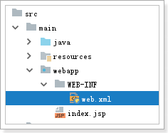 

```xml
<!DOCTYPE web-app PUBLIC
 "-//Sun Microsystems, Inc.//DTD Web Application 2.3//EN"
 "http://java.sun.com/dtd/web-app_2_3.dtd" >

<web-app>
  <display-name>Archetype Created Web Application</display-name>
  <!--告知服务器依据哪个配置文件实例化spring容器-->
  <context-param>
    <param-name>contextConfigLocation</param-name>
    <param-value>classpath:spring/applicationContext_*.xml</param-value>
  </context-param>
  <!--目的: 当服务器启动后,立刻创建spring容器-->
  <listener>
    <listener-class>org.springframework.web.context.ContextLoaderListener</listener-class>
  </listener>
</web-app>
```

# 5 web层_整合spring_mvc

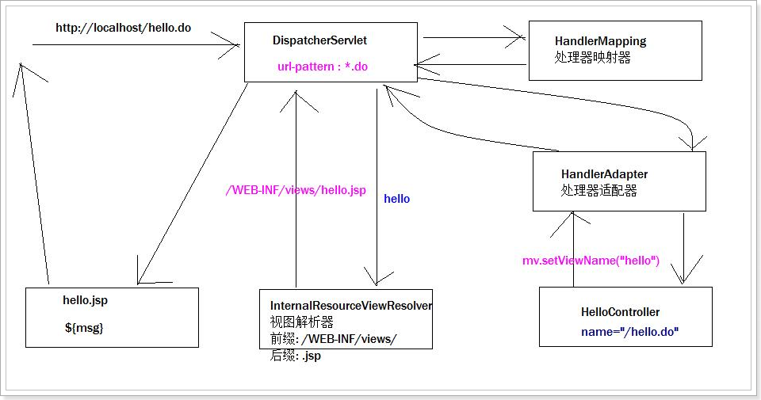

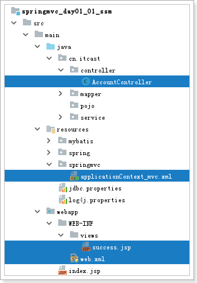 

## 5.1 编写自定义控制器

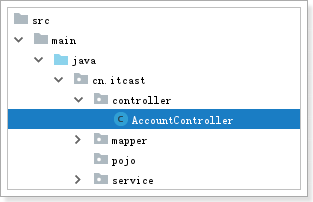 


```java
package cn.itcast.controller;

import cn.itcast.service.AccountService;
import org.springframework.beans.factory.annotation.Autowired;
import org.springframework.stereotype.Controller;
import org.springframework.web.bind.annotation.RequestMapping;
import org.springframework.web.bind.annotation.RequestParam;
import org.springframework.web.servlet.ModelAndView;

@Controller
@RequestMapping("account")
public class AccountController {

    @Autowired
    private AccountService accountService;

    @RequestMapping("transfer")
    public ModelAndView transfer(@RequestParam("outAccount") String outAccount,
                                 @RequestParam("inAccount") String inAccount,
                                 @RequestParam("money") double money) {

        String paramStr = outAccount + ", " + inAccount + ", " + money;
        // 调用业务层完成转账功能
        accountService.transfer(outAccount, inAccount, money);

        ModelAndView mv = new ModelAndView("success");
        mv.addObject("msg", "转账成功! " + paramStr);
        return mv;
    }
}
```

## 5.2 编写jsp文件

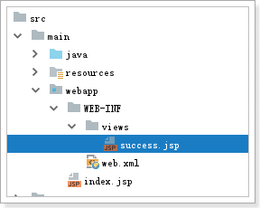 

```jsp
<%@ page contentType="text/html;charset=UTF-8" language="java" isELIgnored="false" %>
<html>
<head>
    <title>Title</title>
</head>
<body>
    <span style="color:red; font-size: 25px">${msg}</span>
</body>
</html>
```

## 5.3 web.xml

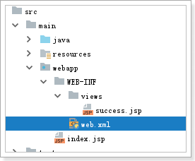 

```xml
<!DOCTYPE web-app PUBLIC
 "-//Sun Microsystems, Inc.//DTD Web Application 2.3//EN"
 "http://java.sun.com/dtd/web-app_2_3.dtd" >

<web-app>
  <display-name>Archetype Created Web Application</display-name>
  <!--告知服务器依据哪个配置文件实例化spring容器-->
  <context-param>
    <param-name>contextConfigLocation</param-name>
    <param-value>classpath:spring/applicationContext_*.xml</param-value>
  </context-param>
  <!--目的: 当服务器启动后,立刻创建spring容器-->
  <listener>
    <listener-class>org.springframework.web.context.ContextLoaderListener</listener-class>
  </listener>

  <!--配置springmvc的dispatcherServlet-->
  <servlet>
    <servlet-name>springmvc</servlet-name>
    <servlet-class>org.springframework.web.servlet.DispatcherServlet</servlet-class>
    <!--配置springmvc的配置位置-->
    <init-param>
      <param-name>contextConfigLocation</param-name>
      <param-value>classpath:springmvc/applicationContext_mvc.xml</param-value>
    </init-param>
    <!--1 表示当前servlet在服务器启动后被创建; 0 表示第一次访问servlet才会被创建-->
    <load-on-startup>1</load-on-startup>
  </servlet>
  <servlet-mapping>
    <servlet-name>springmvc</servlet-name>
    <url-pattern>*.do</url-pattern>
  </servlet-mapping>
</web-app>
```

## 5.4 springmvc的配置文件

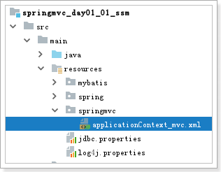 

```xml
<?xml version="1.0" encoding="UTF-8"?>
<beans xmlns="http://www.springframework.org/schema/beans"
       xmlns:xsi="http://www.w3.org/2001/XMLSchema-instance" xmlns:mvc="http://www.springframework.org/schema/mvc"
       xmlns:context="http://www.springframework.org/schema/context"
       xsi:schemaLocation="http://www.springframework.org/schema/beans http://www.springframework.org/schema/beans/spring-beans.xsd http://www.springframework.org/schema/mvc http://www.springframework.org/schema/mvc/spring-mvc.xsd http://www.springframework.org/schema/context http://www.springframework.org/schema/context/spring-context.xsd">
    <!--1 配置handlerMapping和handlerAdapter-->
    <mvc:annotation-driven/>

    <!--2 将自定义控制器交给spring管理-->
    <context:component-scan base-package="cn.itcast.controller"/>

    <!--3 配置视图解析器-->
    <bean class="org.springframework.web.servlet.view.InternalResourceViewResolver">
        <!--配置前缀-->
        <property name="prefix" value="/WEB-INF/views/"/>
        <!--配置后缀-->
        <property name="suffix" value=".jsp"/>
    </bean>
</beans>
```

## 5.5 测试

 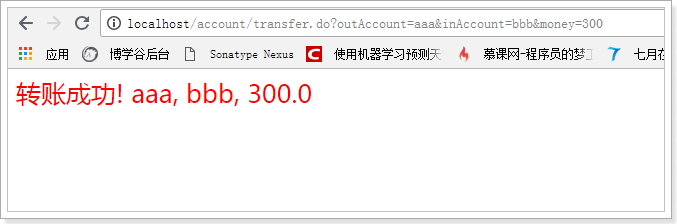 


