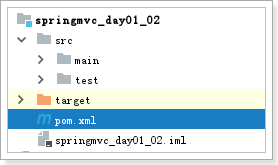
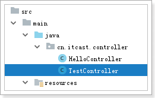

# 1  springmvc的快速入门

 

 

## 1.1 创建项目, 导入依赖

 

```xml
<?xml version="1.0" encoding="UTF-8"?>
<project xmlns="http://maven.apache.org/POM/4.0.0"
         xmlns:xsi="http://www.w3.org/2001/XMLSchema-instance"
         xsi:schemaLocation="http://maven.apache.org/POM/4.0.0 http://maven.apache.org/xsd/maven-4.0.0.xsd">
    <parent>
        <artifactId>itcast_parent</artifactId>
        <groupId>cn.itcast.maven</groupId>
        <version>1.0-SNAPSHOT</version>
    </parent>
    <modelVersion>4.0.0</modelVersion>

    <artifactId>springmvc_day01_02</artifactId>
    <!--web项目-->
    <packaging>war</packaging>
    <build>
        <plugins>
            <!-- 配置Tomcat插件 -->
            <plugin>
                <groupId>org.apache.tomcat.maven</groupId>
                <artifactId>tomcat7-maven-plugin</artifactId>
                <version>2.2</version>
                <configuration>
                    <path>/</path>
                    <port>80</port>
                </configuration>
            </plugin>
        </plugins>
    </build>
    <!--导入springmvc需要的依赖包-->
    <dependencies>
        <!--springmvc包-->
        <dependency>
            <groupId>org.springframework</groupId>
            <artifactId>spring-webmvc</artifactId>
        </dependency>

        <!--servlet+jsp-->
        <dependency>
            <groupId>jstl</groupId>
            <artifactId>jstl</artifactId>
        </dependency>
        <dependency>
            <groupId>javax.servlet</groupId>
            <artifactId>servlet-api</artifactId>
            <scope>provided</scope>
        </dependency>
        <dependency>
            <groupId>javax.servlet</groupId>
            <artifactId>jsp-api</artifactId>
            <scope>provided</scope>
        </dependency>

        <!--日志包-->
        <dependency>
            <groupId>org.slf4j</groupId>
            <artifactId>slf4j-log4j12</artifactId>
        </dependency>
    </dependencies>

</project>
```

## 1.2 第一步: 配置DispatcherServlet

 

```xml
<!DOCTYPE web-app PUBLIC
 "-//Sun Microsystems, Inc.//DTD Web Application 2.3//EN"
 "http://java.sun.com/dtd/web-app_2_3.dtd" >

<web-app>
  <display-name>Archetype Created Web Application</display-name>
  <!--springmvc第一步-->
  <servlet>
    <servlet-name>springmvc</servlet-name>
    <servlet-class>org.springframework.web.servlet.DispatcherServlet</servlet-class>
    <!--加载springmvc的配置文件-->
    <init-param>
      <param-name>contextConfigLocation</param-name>
      <param-value>classpath:springmvc/applicationContext_mvc.xml</param-value>
    </init-param>
    <!--1 让当前servlet在服务器启动后,被立刻实例化; 默认情况下是0, 初次访问servlet才会被实例化-->
    <load-on-startup>1</load-on-startup>
  </servlet>
  <servlet-mapping>
    <servlet-name>springmvc</servlet-name>
    <!--
      serlve映射拦截路径有三种方式: 全路径匹配, 通配符匹配, 扩展名匹配
      /abc
      /*    拦截所有,注意: 能不用就不用
      *.do  拦截以.do结尾的url
      /     拦截jsp以外的url
    -->
    <url-pattern>*.do</url-pattern>
  </servlet-mapping>
</web-app>
```

## 1.3 第二步: 配置springmvc的配置文件

 

```xml
<?xml version="1.0" encoding="UTF-8"?>
<beans xmlns="http://www.springframework.org/schema/beans"
       xmlns:xsi="http://www.w3.org/2001/XMLSchema-instance"
       xsi:schemaLocation="http://www.springframework.org/schema/beans http://www.springframework.org/schema/beans/spring-beans.xsd">
    <!--第二步: 配置映射处理器-->
    <bean class="org.springframework.web.servlet.handler.BeanNameUrlHandlerMapping"/>
    <!--第三步: 配置映射适配器-->
    <bean class="org.springframework.web.servlet.mvc.SimpleControllerHandlerAdapter"/>
    <!--第四步: 配置处理器-->
    <bean name="/hello.do" class="cn.itcast.controller.HelloController"/>
    <!--第五步: 配置视图解析器
         * 例子: prefix="/WEB-INF/jsp/", suffix=".jsp", viewname="test" -> /WEB-INF/jsp/test.jsp"
         * 例子: 前缀="/WEB-INF/jsp/", 后缀=".jsp", 视图名称="test" 转化成路径 /WEB-INF/jsp/test.jsp"
         已知条件: 前缀="/WEB-INF/views/", 后缀=".jsp", 视图名称: "hello"
         求: 对应哪个jsp
         答案: /WEB-INF/views/ + hello + .jsp
    -->
    <bean class="org.springframework.web.servlet.view.InternalResourceViewResolver">
        <!--指定前缀-->
        <property name="prefix" value="/WEB-INF/views/"/>
        <!--指定后缀-->
        <property name="suffix" value=".jsp"/>
    </bean>
</beans>
```

## 1.4 配置自定义处理器

 

```java
package cn.itcast.controller;

import org.springframework.web.servlet.ModelAndView;
import org.springframework.web.servlet.mvc.Controller;

import javax.servlet.http.HttpServletRequest;
import javax.servlet.http.HttpServletResponse;
import java.util.Date;

public class HelloController implements Controller {
    @Override
    public ModelAndView handleRequest(HttpServletRequest request, HttpServletResponse response) throws Exception {
        ModelAndView mv = new ModelAndView();
        // 设置视图名称
        mv.setViewName("hello");
        // 设置模型数据,类似于 request.setAttribute("msg", "xxxxx")
        mv.addObject("msg", "这是我的第一个springmvc程序!" + new Date().toLocaleString());
        return mv;
    }
}
```

## 1.5 创建视图名称对应的jsp文件

 

```jsp
<%@ page contentType="text/html;charset=UTF-8" language="java" isELIgnored="false" %>
<html>
<head>
    <title>Title</title>
</head>
<body>
    <font></font>
    <span style="color:red;font-size: 25px;">${msg}</span>
</body>
</html>
```

## 1.6 启动测试

 

# 2 改造1: 一个方法对应一个请求

## 2.1 处理器类

 

```java
package cn.itcast.controller;

import org.springframework.stereotype.Controller;
import org.springframework.web.bind.annotation.RequestMapping;
import org.springframework.web.servlet.ModelAndView;

@Controller
public class TestController {

    @RequestMapping(value="/show1")
    public ModelAndView show1() {
        ModelAndView mv = new ModelAndView();
        mv.setViewName("hello");
        mv.addObject("msg", "敢于亮剑,绝不后退!");
        return mv;
    }
}
```

## 2.2 将新建的处理器类交给spring管理


## 2.3 重启测试

 

# 3 改造2: 代替废弃的映射处理器和映射适配器


# 4 springmvc的基本用法

```java
package cn.itcast.controller;

import org.springframework.stereotype.Controller;
import org.springframework.web.bind.annotation.PathVariable;
import org.springframework.web.bind.annotation.RequestMapping;
import org.springframework.web.bind.annotation.RequestMethod;
import org.springframework.web.bind.annotation.RequestParam;
import org.springframework.web.servlet.ModelAndView;

@Controller
public class TestController {

    @RequestMapping(value="show1")
    public ModelAndView show1() {
        ModelAndView mv = new ModelAndView();
        mv.setViewName("hello");
        mv.addObject("msg", "敢于亮剑,绝不后退!");
        return mv;
    }

    @RequestMapping(value = "show2/**")
    public ModelAndView show2() {
        ModelAndView mv = new ModelAndView();
        mv.setViewName("hello");
        mv.addObject("msg", "Ant风格的映射 ?");
        return mv;
    }

    @RequestMapping(value = "/show3/{id}")
    public ModelAndView show3(@PathVariable("id") String pid) {
        ModelAndView mv = new ModelAndView();
        mv.setViewName("hello");
        mv.addObject("msg", "占位符映射: pid=" + pid);
        return mv;
    }

    @RequestMapping(value = "/show4", method = RequestMethod.POST)
    public ModelAndView show4() {
        ModelAndView mv = new ModelAndView();
        mv.setViewName("hello");
        mv.addObject("msg", "如果看到了,表示这是一个post方式的请求 ... ...");
        return mv;
    }

    @RequestMapping(value = "/show5", params = {"outAccount", "inAccount", "money"})
    public ModelAndView show5(@RequestParam("outAccount") String outAccount,
                              @RequestParam("inAccount")String inAccount,
                              @RequestParam("money")double money) {

        String paramStr = "outAccount = " + outAccount
                            + ", inAccount = " + inAccount
                            + ", money" + money;
        ModelAndView mv = new ModelAndView();
        mv.setViewName("hello");
        mv.addObject("msg", "接受参数:" + paramStr);
        return mv;
    }
}
```

