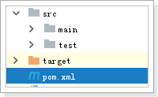
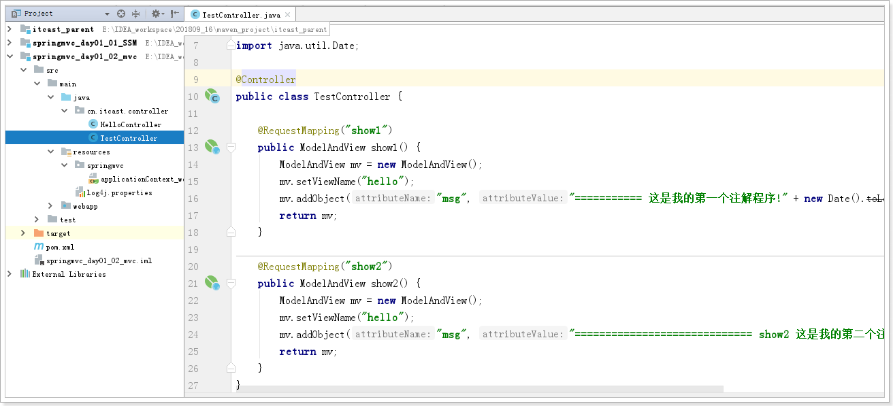

# 今日目标

1. 三大框架整合 SSM
2. 温故 spring和mybatis
3. 知新 spring mvc(入门)

# 1. 温故 spring和mybatis的整合

```
/*
SQLyog Ultimate v8.32 
MySQL - 5.5.27 : Database - springmvc01_db
*********************************************************************
*/


/*!40101 SET NAMES utf8 */;

/*!40101 SET SQL_MODE=''*/;

/*!40014 SET @OLD_UNIQUE_CHECKS=@@UNIQUE_CHECKS, UNIQUE_CHECKS=0 */;
/*!40014 SET @OLD_FOREIGN_KEY_CHECKS=@@FOREIGN_KEY_CHECKS, FOREIGN_KEY_CHECKS=0 */;
/*!40101 SET @OLD_SQL_MODE=@@SQL_MODE, SQL_MODE='NO_AUTO_VALUE_ON_ZERO' */;
/*!40111 SET @OLD_SQL_NOTES=@@SQL_NOTES, SQL_NOTES=0 */;
CREATE DATABASE /*!32312 IF NOT EXISTS*/`springmvc01_db` /*!40100 DEFAULT CHARACTER SET utf8 */;

USE `springmvc01_db`;

/*Table structure for table `account` */

DROP TABLE IF EXISTS `account`;

CREATE TABLE `account` (
  `name` varchar(50) DEFAULT NULL,
  `money` double DEFAULT NULL
) ENGINE=InnoDB DEFAULT CHARSET=utf8;

/*Data for the table `account` */

insert  into `account`(`name`,`money`) values ('aaa',1000),('bbb',1000);

/*!40101 SET SQL_MODE=@OLD_SQL_MODE */;
/*!40014 SET FOREIGN_KEY_CHECKS=@OLD_FOREIGN_KEY_CHECKS */;
/*!40014 SET UNIQUE_CHECKS=@OLD_UNIQUE_CHECKS */;
/*!40111 SET SQL_NOTES=@OLD_SQL_NOTES */;

```

## 1.1 导包和插件

 

```xml
<?xml version="1.0" encoding="UTF-8"?>
<project xmlns="http://maven.apache.org/POM/4.0.0"
         xmlns:xsi="http://www.w3.org/2001/XMLSchema-instance"
         xsi:schemaLocation="http://maven.apache.org/POM/4.0.0 http://maven.apache.org/xsd/maven-4.0.0.xsd">
    <parent>
        <artifactId>itcast_parent</artifactId>
        <groupId>cn.itcast.maven</groupId>
        <version>1.0-SNAPSHOT</version>
        <relativePath>../itcast_parent/pom.xml</relativePath>
    </parent>
    <modelVersion>4.0.0</modelVersion>

    <artifactId>springmvc_day01_01_SSM</artifactId>
    <!--web项目-->
    <packaging>war</packaging>

    <build>
        <plugins>
            <!-- 配置Tomcat插件 -->
            <plugin>
                <groupId>org.apache.tomcat.maven</groupId>
                <artifactId>tomcat7-maven-plugin</artifactId>
                <version>2.2</version>
                <configuration>
                    <port>9000</port>
                    <path>/</path>
                </configuration>
            </plugin>
        </plugins>
    </build>

    <dependencies>
        <!-- 单元测试 -->
        <dependency>
            <groupId>junit</groupId>
            <artifactId>junit</artifactId>
        </dependency>

        <!-- Spring -->
        <dependency>
            <groupId>org.springframework</groupId>
            <artifactId>spring-context</artifactId>
        </dependency>
        <dependency>
            <groupId>org.springframework</groupId>
            <artifactId>spring-jdbc</artifactId>
        </dependency>
        <dependency>
            <groupId>org.springframework</groupId>
            <artifactId>spring-aspects</artifactId>
        </dependency>
        <dependency>
            <groupId>org.springframework</groupId>
            <artifactId>spring-test</artifactId>
        </dependency>

        <!-- Mybatis -->
        <dependency>
            <groupId>org.mybatis</groupId>
            <artifactId>mybatis</artifactId>
        </dependency>
        <dependency>
            <groupId>org.mybatis</groupId>
            <artifactId>mybatis-spring</artifactId>
        </dependency>

        <!-- MySql -->
        <dependency>
            <groupId>mysql</groupId>
            <artifactId>mysql-connector-java</artifactId>
        </dependency>

        <!--日志-->
        <dependency>
            <groupId>org.slf4j</groupId>
            <artifactId>slf4j-log4j12</artifactId>
        </dependency>

        <!--连接池-->
        <dependency>
            <groupId>com.alibaba</groupId>
            <artifactId>druid</artifactId>
        </dependency>

        <!-- JSP相关 -->
        <dependency>
            <groupId>jstl</groupId>
            <artifactId>jstl</artifactId>
        </dependency>
        <dependency>
            <groupId>javax.servlet</groupId>
            <artifactId>servlet-api</artifactId>
            <scope>provided</scope>
        </dependency>
        <dependency>
            <groupId>javax.servlet</groupId>
            <artifactId>jsp-api</artifactId>
            <scope>provided</scope>
        </dependency>

        <dependency>
            <groupId>org.apache.commons</groupId>
            <artifactId>commons-lang3</artifactId>
        </dependency>
        <dependency>
            <groupId>org.apache.commons</groupId>
            <artifactId>commons-io</artifactId>
        </dependency>

    </dependencies>

</project>
```

## 1.2 mapper接口

 

```java
package cn.itcast.mapper;

import org.apache.ibatis.annotations.Param;

public interface AccountMapper {
    // 出账
    public void out(@Param("name") String outAccount,
                     @Param("money") double money);

    // 入账
    public void in(@Param("name") String inAccount,
                    @Param("money") double money);
}
```

## 1.3 配置文件

 

```xml
<?xml version="1.0" encoding="UTF-8" ?>
<!DOCTYPE mapper
        PUBLIC "-//mybatis.org//DTD Mapper 3.0//EN"
        "http://mybatis.org/dtd/mybatis-3-mapper.dtd">
<mapper namespace="cn.itcast.mapper.AccountMapper">
    <!--出账-->
    <update id="out">
        update account
        set money = money - #{money}
        where name = #{name}
    </update>

    <!--入账-->
    <update id="in">
        update account
        set money = money + #{money}
        where name = #{name}
    </update>
</mapper>
```


```xml
<?xml version="1.0" encoding="UTF-8" ?>
<!DOCTYPE configuration
        PUBLIC "-//mybatis.org//DTD Config 3.0//EN"
        "http://mybatis.org/dtd/mybatis-3-config.dtd">
<configuration>

</configuration>
```


```xml
<?xml version="1.0" encoding="UTF-8"?>
<beans xmlns="http://www.springframework.org/schema/beans"
       xmlns:xsi="http://www.w3.org/2001/XMLSchema-instance"
       xmlns:context="http://www.springframework.org/schema/context"
       xsi:schemaLocation="http://www.springframework.org/schema/beans http://www.springframework.org/schema/beans/spring-beans.xsd http://www.springframework.org/schema/context http://www.springframework.org/schema/context/spring-context.xsd">
    <!--1. 关联jdbc.properties-->
    <context:property-placeholder location="classpath:jdbc.properties"/>

    <!--2. 连接池-->
    <bean id="ds" class="com.alibaba.druid.pool.DruidDataSource">
        <property name="driverClassName" value="${jdbc.driverClassName}"/>
        <property name="url" value="${jdbc.url}"/>
        <property name="username" value="${jdbc.username}"/>
        <property name="password" value="${jdbc.password}"/>
    </bean>
    <!--3. sqlSessionFactory-->
    <bean id="sqlSessionFactory" class="org.mybatis.spring.SqlSessionFactoryBean">
        <!--3.1 连接池-->
        <property name="dataSource" ref="ds"/>
        <!--3.2 mybatis核心配置文件-->
        <property name="configLocation" value="classpath:mybatis/mybatis-config.xml"/>
        <!--3.3 mapper文件-->
        <property name="mapperLocations" value="classpath:mybatis/mapper/*Mapper.xml"/>
        <!--3.4 指定扫描pojo包 起别名-->
        <property name="typeAliasesPackage" value="cn.itcast.pojo"/>
    </bean>

    <!--4. 将mapper接口的实现类交给spring管理-->
    <bean class="org.mybatis.spring.mapper.MapperScannerConfigurer">
        <property name="basePackage" value="cn.itcast.mapper"/>
    </bean>
</beans>
```

## 1.4 测试

 

```java
package cn.itcast.mapper;

import org.junit.Test;
import org.junit.runner.RunWith;
import org.springframework.beans.factory.annotation.Autowired;
import org.springframework.test.context.ContextConfiguration;
import org.springframework.test.context.junit4.SpringJUnit4ClassRunner;

@RunWith(SpringJUnit4ClassRunner.class)
@ContextConfiguration(locations = "classpath:spring/applicationContext_dao.xml")
public class AccountMapperTest {

    @Autowired
    private AccountMapper accountMapper;

    @Test
    public void out() throws Exception {
        accountMapper.out("aaa", 200);
    }

    @Test
    public void in() throws Exception {
        accountMapper.in("bbb", 200);
    }

}
```

## 1.5 业务层的开发

 

```java
package cn.itcast.service;

import cn.itcast.mapper.AccountMapper;
import org.springframework.beans.factory.annotation.Autowired;
import org.springframework.stereotype.Service;
import org.springframework.transaction.annotation.Transactional;

@Service
public class AccountService {

    @Autowired
    private AccountMapper accountMapper;

    // 转账
    @Transactional
    public void transfer(String outAccount, String inAccount, double money) {
        // 出账
        accountMapper.out(outAccount, money);

        //int j = 1/0;

        // 入账
        accountMapper.in(inAccount, money);
    }
}
```

 

```xml
<?xml version="1.0" encoding="UTF-8"?>
<beans xmlns="http://www.springframework.org/schema/beans"
       xmlns:xsi="http://www.w3.org/2001/XMLSchema-instance"
       xmlns:context="http://www.springframework.org/schema/context" xmlns:tx="http://www.springframework.org/schema/tx"
       xsi:schemaLocation="http://www.springframework.org/schema/beans http://www.springframework.org/schema/beans/spring-beans.xsd http://www.springframework.org/schema/context http://www.springframework.org/schema/context/spring-context.xsd http://www.springframework.org/schema/tx http://www.springframework.org/schema/tx/spring-tx.xsd">
    <!--1 将service类交给spring管理, 扫描service包-->
    <context:component-scan base-package="cn.itcast.service"/>

    <!--2 通知spring框架识别跟事务相关的注解-->
    <bean id="transactionManager" class="org.springframework.jdbc.datasource.DataSourceTransactionManager">
        <property name="dataSource" ref="ds"/>
    </bean>
    <tx:annotation-driven transaction-manager="transactionManager"/>
</beans>
```

## 1.6 测试

 

```java
package cn.itcast.service;

import org.junit.Test;
import org.junit.runner.RunWith;
import org.springframework.beans.factory.annotation.Autowired;
import org.springframework.test.context.ContextConfiguration;
import org.springframework.test.context.junit4.SpringJUnit4ClassRunner;

@RunWith(SpringJUnit4ClassRunner.class)
@ContextConfiguration(locations = "classpath:spring/applicationContext_*.xml")
public class AccountServiceTest {

    @Autowired
    AccountService accountService;

    @Test
    public void transfer() throws Exception {
        accountService.transfer("aaa", "bbb", 100);
    }

}
```

## 1.7 在web项目启动 实例化spring容器

 

```xml
<!DOCTYPE web-app PUBLIC
 "-//Sun Microsystems, Inc.//DTD Web Application 2.3//EN"
 "http://java.sun.com/dtd/web-app_2_3.dtd" >

<web-app>
  <display-name>Archetype Created Web Application</display-name>
  <!--需求: 在web项目启动 实例化spring容器-->
  <!--告诉服务器spring配置文件的位置-->
  <context-param>
    <param-name>contextConfigLocation</param-name>
    <param-value>classpath:spring/applicationContext_*.xml</param-value>
  </context-param>

  <listener>
    <listener-class>org.springframework.web.context.ContextLoaderListener</listener-class>
  </listener>
</web-app>
```

## 1.8 启动测试(略)

# 2 知新 spring mvc(入门)

## 2.1 准备工作

建项目导包

 

```xml
<?xml version="1.0" encoding="UTF-8"?>
<project xmlns="http://maven.apache.org/POM/4.0.0"
         xmlns:xsi="http://www.w3.org/2001/XMLSchema-instance"
         xsi:schemaLocation="http://maven.apache.org/POM/4.0.0 http://maven.apache.org/xsd/maven-4.0.0.xsd">
    <parent>
        <artifactId>itcast_parent</artifactId>
        <groupId>cn.itcast.maven</groupId>
        <version>1.0-SNAPSHOT</version>
        <relativePath>../itcast_parent/pom.xml</relativePath>
    </parent>
    <modelVersion>4.0.0</modelVersion>

    <artifactId>springmvc_day01_02_mvc</artifactId>
    <packaging>war</packaging>
    <build>
        <plugins>
            <!-- 配置Tomcat插件 -->
            <plugin>
                <groupId>org.apache.tomcat.maven</groupId>
                <artifactId>tomcat7-maven-plugin</artifactId>
                <version>2.2</version>
                <configuration>
                    <port>80</port>
                    <path>/</path>
                </configuration>
            </plugin>
        </plugins>
    </build>

    <dependencies>
        <!--springmvc-->
        <dependency>
            <groupId>org.springframework</groupId>
            <artifactId>spring-webmvc</artifactId>
        </dependency>
        <!--日志包-->
        <dependency>
            <groupId>org.slf4j</groupId>
            <artifactId>slf4j-log4j12</artifactId>
        </dependency>
        <!--servlet相关的包-->
        <dependency>
            <groupId>jstl</groupId>
            <artifactId>jstl</artifactId>
        </dependency>
        <dependency>
            <groupId>javax.servlet</groupId>
            <artifactId>servlet-api</artifactId>
            <scope>provided</scope>
        </dependency>
        <dependency>
            <groupId>javax.servlet</groupId>
            <artifactId>jsp-api</artifactId>
            <scope>provided</scope>
        </dependency>
    </dependencies>

</project>
```

## 2.2 原理


## 2.3 HOW 快速入门

### 2.3.1 转发servlet

 

```xml
<!DOCTYPE web-app PUBLIC
 "-//Sun Microsystems, Inc.//DTD Web Application 2.3//EN"
 "http://java.sun.com/dtd/web-app_2_3.dtd" >

<web-app>
  <display-name>Archetype Created Web Application</display-name>
  <!--配置springmvc的转发servlet-->
  <servlet>
    <servlet-name>springmvc</servlet-name>
    <servlet-class>org.springframework.web.servlet.DispatcherServlet</servlet-class>
    <!--目的: 加载springmvc的配置文件-->
    <init-param>
      <param-name>contextConfigLocation</param-name>
      <param-value>classpath:springmvc/applicationContext_web.xml</param-value>
    </init-param>
    <!--默认serlvet在第一次访问时被创建 默认值是0 ; 我们现在想 服务器启动后立刻创建servlet 设置成1 -->
    <load-on-startup>1</load-on-startup>
  </servlet>
  <servlet-mapping>
    <servlet-name>springmvc</servlet-name>
    <!--.do 映射 以.do结尾的url-->
    <url-pattern>*.do</url-pattern>
  </servlet-mapping>
</web-app>
```

### 2.3.2 配置处理器类

 

```java
package cn.itcast.controller;

import org.springframework.web.servlet.ModelAndView;
import org.springframework.web.servlet.mvc.Controller;

import javax.servlet.http.HttpServletRequest;
import javax.servlet.http.HttpServletResponse;
import java.util.Date;

public class HelloController implements Controller {
    @Override
    public ModelAndView handleRequest(HttpServletRequest request, HttpServletResponse response) throws Exception {
        ModelAndView mv = new ModelAndView();
        // 返回视图名称:  根据视图名称找到指定具体的页面
        mv.setViewName("hello");
        // 设置数据: requet.setAttribute(name, value)
        mv.addObject("msg", "这是我的第一个springmvc程序!" + new Date().toLocaleString());
        return mv;
    }
}
```

### 2.3.3 配置视图

 

```jsp
<%@ page contentType="text/html;charset=UTF-8" language="java" isELIgnored="false" %>
<html>
<head>
    <title>Title</title>
</head>
<body>
<h3>${msg}</h3>
</body>
</html>
```

### 2.3.4 将映射处理器 视图解析器等配置到配置文件中

 

```xml
<?xml version="1.0" encoding="UTF-8"?>
<beans xmlns="http://www.springframework.org/schema/beans"
       xmlns:xsi="http://www.w3.org/2001/XMLSchema-instance"
       xsi:schemaLocation="http://www.springframework.org/schema/beans http://www.springframework.org/schema/beans/spring-beans.xsd">
    <!--1 配置映射处理器-->
    <bean class="org.springframework.web.servlet.handler.BeanNameUrlHandlerMapping"/>

    <!--2 配置映射适配器-->
    <bean class="org.springframework.web.servlet.mvc.SimpleControllerHandlerAdapter"/>

    <!--3 配置自定义处理器-->
    <bean name="/hello.do" class="cn.itcast.controller.HelloController"/>

    <!--4 配置视图解析器
        视图名称'hello' 对应一个具体文件 /WEB-INF/views/hello.jsp
            前缀:  /WEB-INF/views/
            后缀:  .jsp
            视图名称: hello
    -->
    <bean class="org.springframework.web.servlet.view.InternalResourceViewResolver">
        <!--前缀-->
        <property name="prefix" value="/WEB-INF/views/"/>
        <!--后缀-->
        <property name="suffix" value=".jsp"/>
    </bean>
</beans>
```

### 2.3.5 测试

 

## 2.4 优化配置

```
问题1: 每次都配置前两步, 而前两步都在配置文件中, 能否省略? 可以省略
问题2: 能否 一个方法 对应 一次请求?
```

 

```java
package cn.itcast.controller;

import org.springframework.stereotype.Controller;
import org.springframework.web.bind.annotation.RequestMapping;
import org.springframework.web.servlet.ModelAndView;

import java.util.Date;

@Controller
public class TestController {

    @RequestMapping("show1")
    public ModelAndView show1() {
        ModelAndView mv = new ModelAndView();
        mv.setViewName("hello");
        mv.addObject("msg", "=========== 这是我的第一个注解程序!" + new Date().toLocaleString());
        return mv;
    }

    @RequestMapping("show2")
    public ModelAndView show2() {
        ModelAndView mv = new ModelAndView();
        mv.setViewName("hello");
        mv.addObject("msg", "============================= show2 这是我的第二个注解程序!" + new Date().toLocaleString());
        return mv;
    }
}
```

 

```xml
<?xml version="1.0" encoding="UTF-8"?>
<beans xmlns="http://www.springframework.org/schema/beans"
       xmlns:xsi="http://www.w3.org/2001/XMLSchema-instance"
       xmlns:context="http://www.springframework.org/schema/context"
       xmlns:mvc="http://www.springframework.org/schema/mvc"
       xsi:schemaLocation="http://www.springframework.org/schema/beans http://www.springframework.org/schema/beans/spring-beans.xsd http://www.springframework.org/schema/context http://www.springframework.org/schema/context/spring-context.xsd http://www.springframework.org/schema/mvc http://www.springframework.org/schema/mvc/spring-mvc.xsd">
    <!--1 配置映射处理器-->
    <!--<bean class="org.springframework.web.servlet.handler.BeanNameUrlHandlerMapping"/>-->
    <!--<bean class="org.springframework.web.servlet.mvc.method.annotation.RequestMappingHandlerMapping"/>-->

    <!--2 配置映射适配器-->
    <!--<bean class="org.springframework.web.servlet.mvc.SimpleControllerHandlerAdapter"/>-->
    <!--<bean class="org.springframework.web.servlet.mvc.method.annotation.RequestMappingHandlerAdapter"/>-->

    <!--使用标签简化 第一步和第二步-->
    <mvc:annotation-driven/>

    <!--3 配置自定义处理器-->
    <!--<bean name="/hello.do" class="cn.itcast.controller.HelloController"/>-->
    <!--配置扫描注解-->
    <context:component-scan base-package="cn.itcast.controller"/>

    <!--4 配置视图解析器
        视图名称'hello' 对应一个具体文件 /WEB-INF/views/hello.jsp
            前缀:  /WEB-INF/views/
            后缀:  .jsp
            视图名称: hello
    -->
    <bean class="org.springframework.web.servlet.view.InternalResourceViewResolver">
        <!--前缀-->
        <property name="prefix" value="/WEB-INF/views/"/>
        <!--后缀-->
        <property name="suffix" value=".jsp"/>
    </bean>
</beans>
```

## 2.5 主要用法

```java
package cn.itcast.controller;

import org.springframework.stereotype.Controller;
import org.springframework.web.bind.annotation.PathVariable;
import org.springframework.web.bind.annotation.RequestMapping;
import org.springframework.web.bind.annotation.RequestMethod;
import org.springframework.web.bind.annotation.RequestParam;
import org.springframework.web.servlet.ModelAndView;

import java.io.UnsupportedEncodingException;
import java.util.Date;

@Controller
// @RequestMapping("/test")
public class TestController {

    @RequestMapping("/show1")
    public ModelAndView show1() {
        ModelAndView mv = new ModelAndView();
        mv.setViewName("hello");
        mv.addObject("msg", "=========== 这是我的第一个注解程序!" + new Date().toLocaleString());
        return mv;
    }

    @RequestMapping("show2")
    public ModelAndView show2() {
        ModelAndView mv = new ModelAndView();
        mv.setViewName("hello");
        mv.addObject("msg", "============================= show2 这是我的第二个注解程序!" + new Date().toLocaleString());
        return mv;
    }

    @RequestMapping("/show3/**")
    public ModelAndView show3() {
        ModelAndView mv = new ModelAndView();
        mv.setViewName("hello");
        mv.addObject("msg", "show3 Ant风格映射: " + new Date().toLocaleString());
        return mv;
    }

    // 需求: 获取路径 中 http://localhost/show4/2342342.do  的 '2342342'
    @RequestMapping("/show4/{id}")
    public ModelAndView show4(@PathVariable("id") String id) {
        ModelAndView mv = new ModelAndView();
        mv.setViewName("hello");
        mv.addObject("msg", "占位符映射: id = " + id);
        return mv;
    }

    // 需求: 更改 post请求方式
    @RequestMapping(value = "/show5", method = RequestMethod.POST)
    public ModelAndView show5() {
        ModelAndView mv = new ModelAndView();
        mv.setViewName("hello");
        mv.addObject("msg", "如果你看到了这句话,表示这个一个post请求!");
        return mv;
    }

    // 需求: 获取参数
    @RequestMapping(value = "/show6", method = RequestMethod.POST)
    public ModelAndView show6(@RequestParam("name") String name,
                               @RequestParam("city") String city) throws UnsupportedEncodingException {
        ModelAndView mv = new ModelAndView();
        mv.setViewName("hello");
        mv.addObject("msg", "获取参数: name = " + name + ", city = " + city);
        return mv;
    }

}
```

# 3 整合三大框架


## 3.1 导入spring-webmvc的包

```xml
<!-- Spring -->
<dependency>
    <groupId>org.springframework</groupId>
    <artifactId>spring-webmvc</artifactId>
</dependency>
```

## 3.2转发serlvet

 

```xml
<!DOCTYPE web-app PUBLIC
 "-//Sun Microsystems, Inc.//DTD Web Application 2.3//EN"
 "http://java.sun.com/dtd/web-app_2_3.dtd" >

<web-app>
  <display-name>Archetype Created Web Application</display-name>
  <!--需求: 在web项目启动 实例化spring容器-->
  <!--告诉服务器spring配置文件的位置-->
  <context-param>
    <param-name>contextConfigLocation</param-name>
    <param-value>classpath:spring/applicationContext_*.xml</param-value>
  </context-param>

  <listener>
    <listener-class>org.springframework.web.context.ContextLoaderListener</listener-class>
  </listener>

  <!--配置springmvc的转发servlet-->
  <servlet>
    <servlet-name>springmvc</servlet-name>
    <servlet-class>org.springframework.web.servlet.DispatcherServlet</servlet-class>
    <!--目的: 加载springmvc的配置文件-->
    <init-param>
      <param-name>contextConfigLocation</param-name>
      <param-value>classpath:springmvc/applicationContext_web.xml</param-value>
    </init-param>
    <!--默认serlvet在第一次访问时被创建 默认值是0 ; 我们现在想 服务器启动后立刻创建servlet 设置成1 -->
    <load-on-startup>1</load-on-startup>
  </servlet>
  <servlet-mapping>
    <servlet-name>springmvc</servlet-name>
    <!--.do 映射 以.do结尾的url-->
    <url-pattern>*.do</url-pattern>
  </servlet-mapping>
</web-app>
```

## 3.3 spirngmvc的配置文件

 

```xml
<!DOCTYPE web-app PUBLIC
 "-//Sun Microsystems, Inc.//DTD Web Application 2.3//EN"
 "http://java.sun.com/dtd/web-app_2_3.dtd" >

<web-app>
  <display-name>Archetype Created Web Application</display-name>
  <!--需求: 在web项目启动 实例化spring容器-->
  <!--告诉服务器spring配置文件的位置-->
  <context-param>
    <param-name>contextConfigLocation</param-name>
    <param-value>classpath:spring/applicationContext_*.xml</param-value>
  </context-param>

  <listener>
    <listener-class>org.springframework.web.context.ContextLoaderListener</listener-class>
  </listener>

  <!--配置springmvc的转发servlet-->
  <servlet>
    <servlet-name>springmvc</servlet-name>
    <servlet-class>org.springframework.web.servlet.DispatcherServlet</servlet-class>
    <!--目的: 加载springmvc的配置文件-->
    <init-param>
      <param-name>contextConfigLocation</param-name>
      <param-value>classpath:springmvc/applicationContext_web.xml</param-value>
    </init-param>
    <!--默认serlvet在第一次访问时被创建 默认值是0 ; 我们现在想 服务器启动后立刻创建servlet 设置成1 -->
    <load-on-startup>1</load-on-startup>
  </servlet>
  <servlet-mapping>
    <servlet-name>springmvc</servlet-name>
    <!--.do 映射 以.do结尾的url-->
    <url-pattern>*.do</url-pattern>
  </servlet-mapping>
</web-app>
```

## 3.4 处理器类


```java
package cn.itcast.controller;

import cn.itcast.service.AccountService;
import org.springframework.beans.factory.annotation.Autowired;
import org.springframework.stereotype.Controller;
import org.springframework.web.bind.annotation.PathVariable;
import org.springframework.web.bind.annotation.RequestMapping;
import org.springframework.web.servlet.ModelAndView;

@Controller
public class AccountController {

    @Autowired
    private AccountService accountService;

    // 需求: 接受转账参数, 完成转账业务
    @RequestMapping("/transfer/{out}/{in}/{money}")
    public ModelAndView zhuanzhang(@PathVariable("out") String outAccount,
                                   @PathVariable("in")String inAccount,
                                   @PathVariable("money")double money) {
        // 调用业务层 完成转账
        accountService.transfer(outAccount, inAccount, money);

        ModelAndView mv = new ModelAndView("success");
        mv.addObject("msg", "转账成功!");
        return mv;
    }
}
```

## 3.5 视图: success.jsp

 

```jsp
<%@ page contentType="text/html;charset=UTF-8" language="java" isELIgnored="false" %>
<html>
<head>
    <title>Title</title>
</head>
<body>
    <h1>${msg}</h1>
</body>
</html>
```

