[TOC]

# 1 **视图解析**(掌握)

## 1.1 **什么是视图？**

视图就是展示给用户看的结果。可以是很多形式，例如：html, JSP, excel表单, Word文档, PDF文档, JSON数据, freemarker模板视图等等。

 

我们目前比较常用的就是JSP视图了。

## 1.2 **传统JSP和JSTL视图**

我们所使用的InternalResourceViewResolver解析器，默认支持JSP视图，而JSP中最常用的莫过于JSTL标签库了：

 

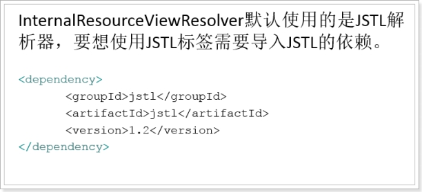 

 

案例：将一个User的集合放入模型中返回：

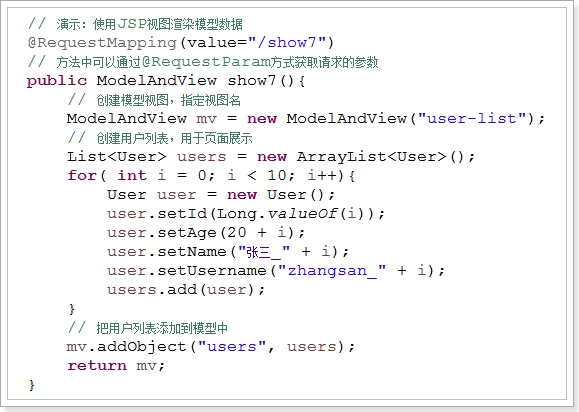 

 

在页面中引入JSTL的标签库：

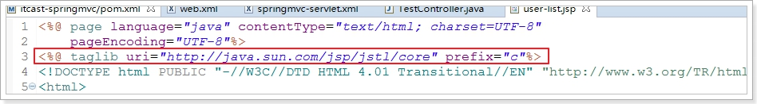 

 

通过标签库结合el表达式来遍历集合，展示到页面：

```jsp
<%@ page language="java" contentType="text/html; charset=UTF-8"
	pageEncoding="UTF-8"%>
<%@ taglib uri="http://java.sun.com/jsp/jstl/core" prefix="c"%>
<!DOCTYPE html PUBLIC "-//W3C//DTD HTML 4.01 Transitional//EN" "http://www.w3.org/TR/html4/loose.dtd">
<html>
<head>
<meta http-equiv="Content-Type" content="text/html; charset=UTF-8">
<title>Insert title here</title>
<style type="text/css">
	table {border-collapse: collapse;}	
	table, th, td {border: 1px solid green;padding: 10px}
</style>
</head>
<body>
	<table>
		<tr>
			<th>ID</th>
			<th>UserName</th>
			<th>Name</th>
			<th>Age</th>
		</tr>
		<c:forEach items="${users }" var="user">
			<tr>
				<td>${user.id }</td>
				<td>${user.username }</td>
				<td>${user.name }</td>
				<td>${user.age }</td>
			</tr>
		</c:forEach>
	</table>
</body>
</html>
```

## 1.3 JSON视图(重点重点重点)

在实际开发中，我们经常需要以JSON的格式进行数据的传输，所以在SpringMVC中提供了一种非常便捷的方式来返回一个JSON视图

 

### 1.3.1 **引入依赖**

SpringMVC的JSON功能，底层依赖的是Jackson这个JSON工具

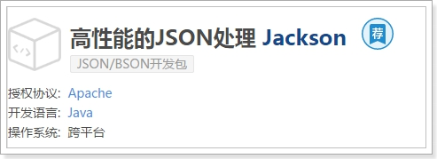 

 

我们需要引入Jackson的依赖包：

```xml
		<!-- Jackson Json处理工具包 -->
		<dependency>
			<groupId>com.fasterxml.jackson.core</groupId>
			<artifactId>jackson-databind</artifactId>
		</dependency>
```


### 1.3.2 定义controller

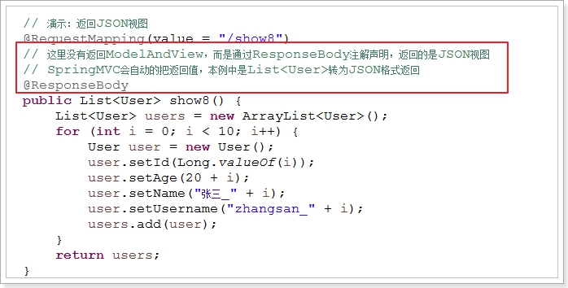 

 

### 1.3.3 **访问测试**

得到的就是User集合的JSON格式数据

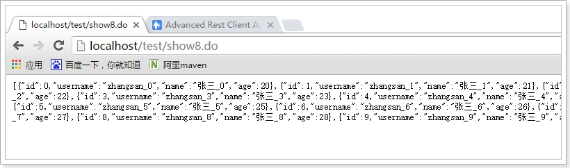 

 

原理：

	1） 当SpringMVC读取到方法上的@ResponseBody注解时，就知道该方法不再使用默认的视图解析器解析视图，而是直接把结果写到响应体中，这样就需要对结果进行转换。
	
	2） SpringMVC会从框架中查找有没有定义MessageConvertor（消息转换器），通过消息转换器转换结果，返回对应视图
	
	3） 在SpringMVC的注解驱动类中，会进行默认的消息转换器注册，因为我们引入了jacksonJson包，所以会注册JSON的消息转换器

注解驱动类中的代码：

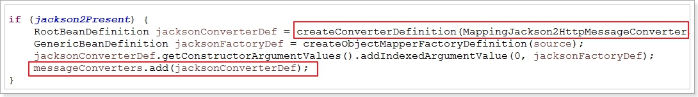 

	4） 因为只有JSON消息转换器可以对Java对象序列化，因此这里默认用了JSON转换

 


问题：如果有多个消息转换的依赖被引入，那么就会注册多个消息转换器：例如JSONXML等等，此时会用哪个转换器？

	此时会根据请求头中的accept来判断返回什么类型数据

## 1.4 直接返回视图名称

有时候，我们并不需要返回数据模型，而仅仅是访问某个JSP页面。如果是传统做法，你要创建一个ModelAndView对象，并且返回。很麻烦。

 

所以，SpringMVC允许直接返回一个String数据，作为视图名称。不需要数据模型。

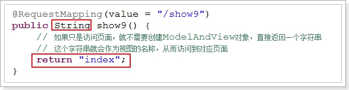 

 

定义好的index.jsp页面：

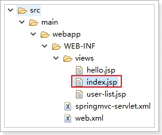 

 


访问成功：

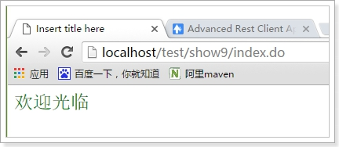 

 

也可以把视图与模型分离。在参数中注入Model对象：

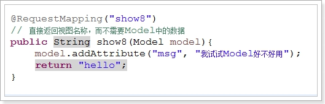 

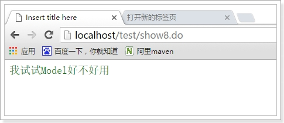 

 

## 1.5 重定向和转发

回顾

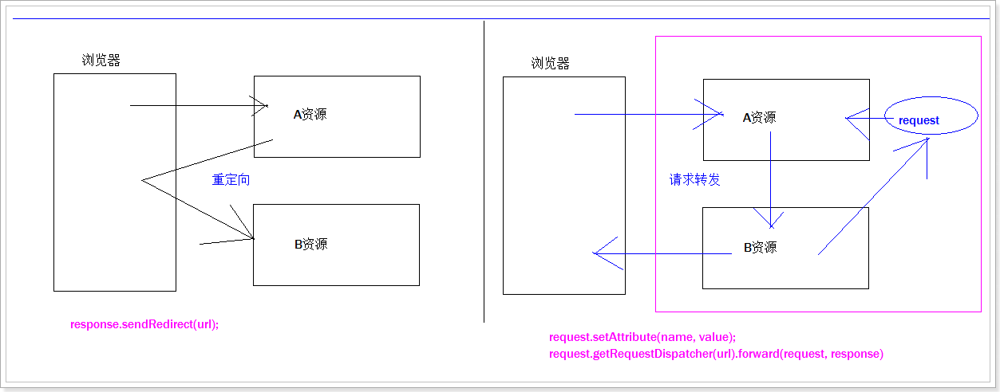

1. 几次请求 几次响应
2. 浏览器地址栏和窗体内容是否一致
3. 谁可以将request容器中的数据共享?
4. 谁可以外网, 谁可以访问内网?


在SpringMVC中，如果要实现重定向或转发，也非常简单，只需要在返回的字符串前以下面的格式做前缀即可：

 

redirect:/hello.do 重定向到hello.do

forward:/hello.do 转发到hello.do

 

注意：后面必须跟上URL路径而非视图名

 

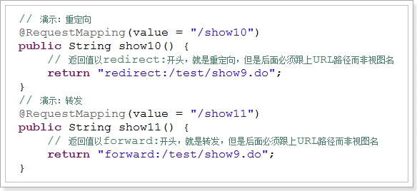 

 

访问show10,被重定向到show9,页面的地址也跟着变了

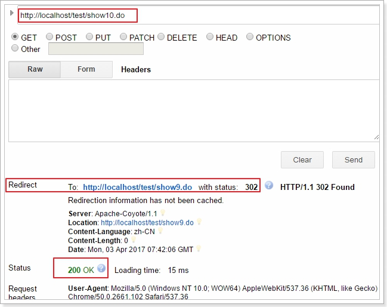 

 

访问show11,被转发到show9,得到的页面一样，地址还是show11

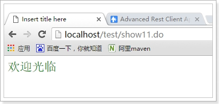 

 

注意：返回ModelAndView，或者没有写redirect和forward时，默认都属于转发。

 

 

## 1.6 不返回视图

有的时候，我们接收一个请求，处理后并不打算给页面返回任何数据，只是返回成功的状态码即可。

 

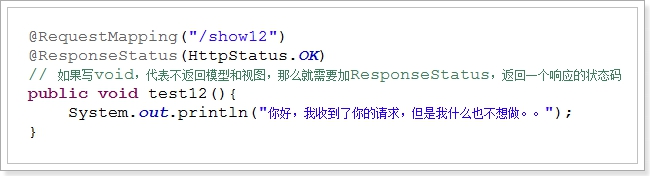 

 

 

页面访问：只得到了状态码，没有内容：

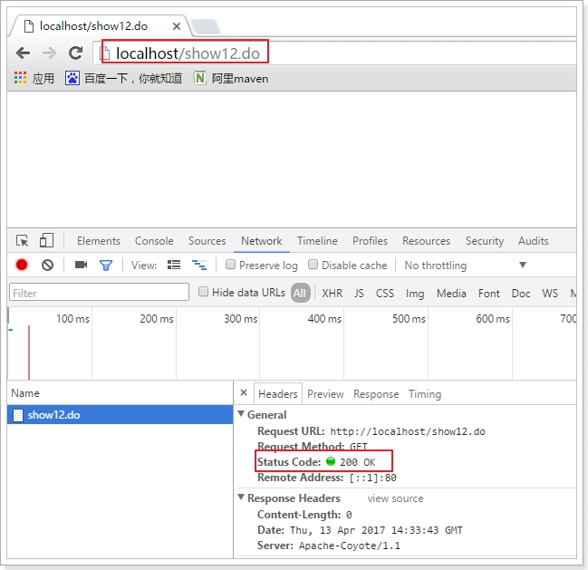 

 

控制台：

 

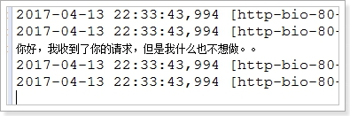 

 

 

# 2 **请求参数绑定和获取**

获取页面请求的参数，是JavaWEB必不可少的一个环节，在Struts中，是通过在Action中定义属性，或者Model的方式来进行数据绑定和获取。需要提供setter或getter方法，略显麻烦。

	而在SpringMVC中，却可以非常方便的获取请求参数，只需要在对应方法的参数列表中定义出来，即可获取，所见即所得！

## 2.1 获取servlet内置对象(了解)

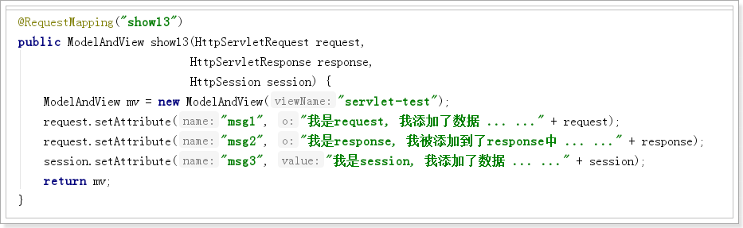 

定义页面：

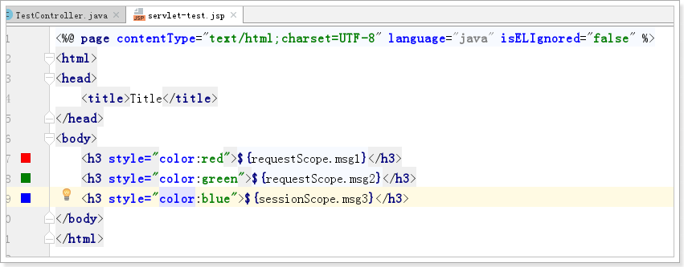  

访问结果：

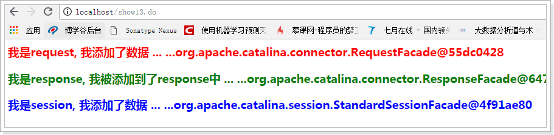  

**获取Servlet内置对象的这种方式我们不推荐使用。因为SpringMVC有更好的方式来获取请求参数。**

 

## 2.2 **获取PathVariable参数**(掌握 重点重点重点)

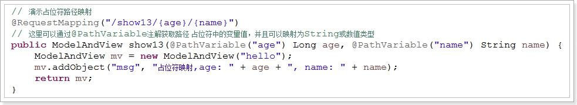 

 

 注意：参数类型必须匹配，否则会出错

## 2.3 获取基本数据类型请求参数(重点重点重点)

在SpringMVC中，要获取表单中的各种数据，可以通过@RequestParam注解的方式

例如，有一个页面：

```jsp
<%@ page contentType="text/html;charset=UTF-8" language="java" %>
<html>
<head>
    <title>Title</title>
</head>
<body>
<form action="/show10.do" method="post">
    <table>
        <tr>
            <td>姓名:</td>
            <td><input name="name" value="liuyan" /></td>
        </tr>
        <tr>
            <td>年龄:</td>
            <td><input name="age" value="20" /></td>
        </tr>
        <tr>
            <td>收入:</td>
            <td><input name="income" value="100000" /></td>
        </tr>
        <tr>
            <td>结婚:</td>
            <td>
                <input type="radio" name="isMarried" value="true" checked="checked" />是
                <input type="radio" name="isMarried" value="false" />否
            </td>
        </tr>
        <tr>
            <td>兴趣:</td>
            <td>
                <input type="checkbox" name="interests" value="shopping" checked="checked" />购物
                <input type="checkbox" name="interests" value="sport" checked="checked" />运动
                <input type="checkbox" name="interests" value="movie" checked="checked" />看电影
            </td>
        </tr>
        <tr>
            <td colspan="2"><input type="submit" value="提交表单" /></td>
        </tr>
    </table>
</form>
</body>
</html>

```


提交的数据包含了各种基本数据类型，我们可以这样接收：

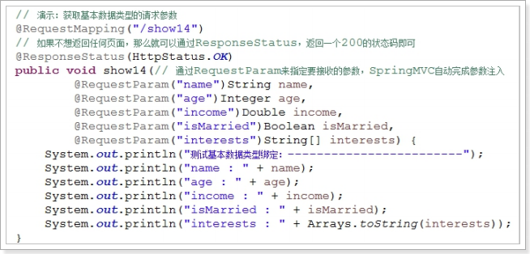 

注意：类似interests这种多个值的数据，可以用数组或者是List来接收都行

 访问表单页面：

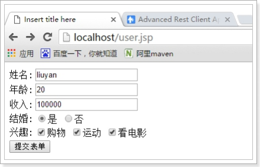 

提交表单：

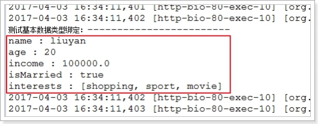 

 


request.getParameterMap()

BeanUtils.populate(user, request.getParameterMap())

### 2.3.1 获取请求参数并封装为POJO对象

我们发现一个一个获取参数非常麻烦，能不能直接把整个表单中的数据封装为对象呢？

 

定义Controller，只需要在参数中写上要封装的对象即可：

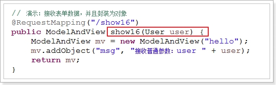 


提交表单，访问：

 

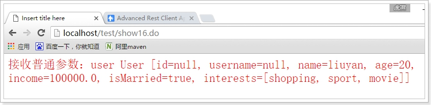 


## 2.4 RequestParam的更多用法

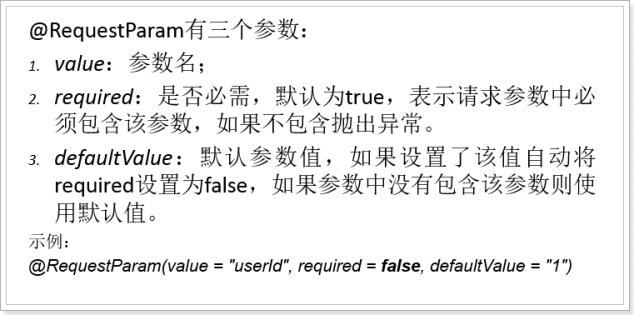 

 

1）默认情况： 

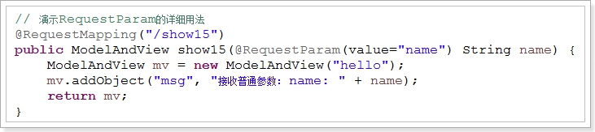 

因为默认required为true，所以访问时，如果没有name参数肯定报错：

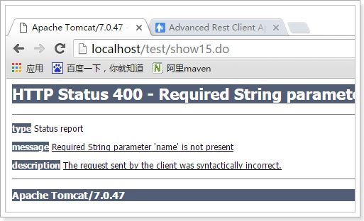 

	

2）设置required为false，并且给定一个默认值

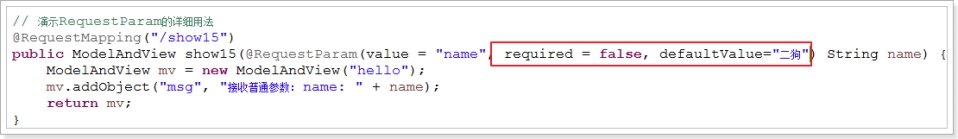

 


访问时没有传递参数，但是没有报错，并且得到了默认值：二狗

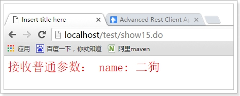 

 

 

## 2.5 获取cookie值(掌握重点重点重点)

jsp : ${cookie.username.value}

java:

	Cookie[] cookieArr = request.getCookies();
	
	String username = "";
	
	if(cookieArr !=null) {
	
		for(... ...) {
	
			if(cookie.getName().equals("usernam")) {
	
				username = cookie.getValue;
	
			}
	
		}
	
	}

传统的Servlet获取Cookie的方式非常的麻烦，需要用到request，然后获取cookie数组。逐个遍历

 

SpringMVC中依然是通过注解加参数注入的方式：

 

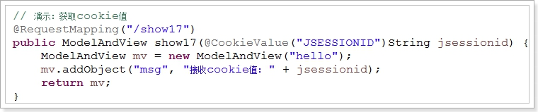 

访问：

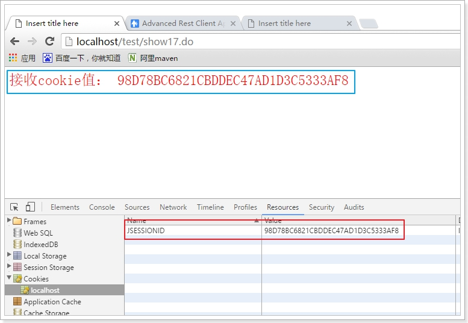

 


## 2.6 接收对象List集合

表单中，还有这样一种写法： 

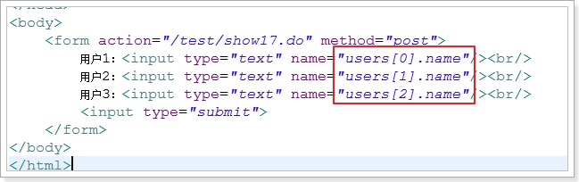 

```jsp
<%@ page contentType="text/html;charset=UTF-8" language="java" %>
<html>
<head>
    <title>Title</title>
</head>
<body>
<form method="post" action="/test/show20.do">
    用户名1<input type="text" name="users[0].name"/> <br/>
    用户名2<input type="text" name="users[1].name"/> <br/>
    用户名3<input type="text" name="users[2].name"/> <br/>
    <input type="submit" value="提交"/>
</form>
</body>
</html>
```


上面的表单相当于同时提交三个用户，也就是用户的集合。

要注意的是，我们在Controller中，不能直接接收一个User的List集合

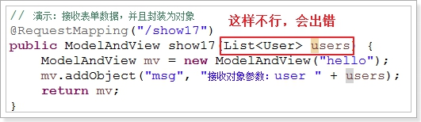 

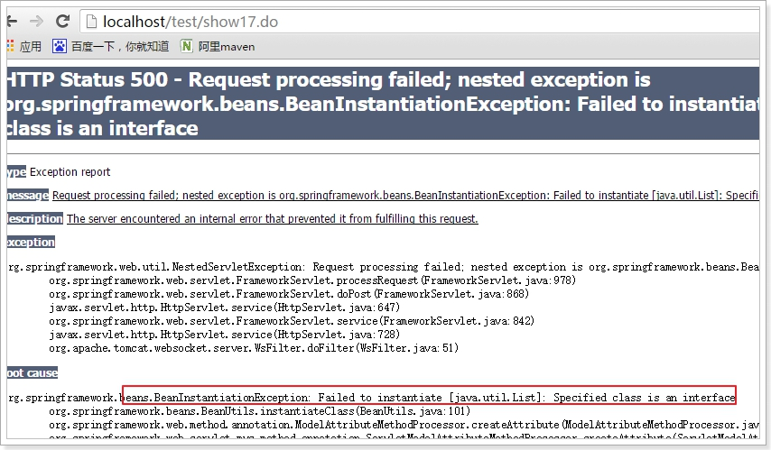 


 


正确的方式是，定义一个对象，在对象中定义一个List<User>的属性：

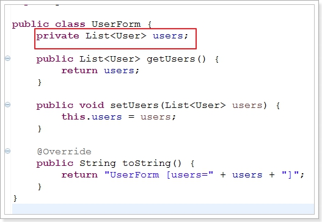 

然后在Controller中接收这个对象，而不是Use集合

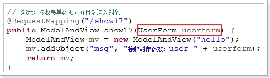 

最后访问：

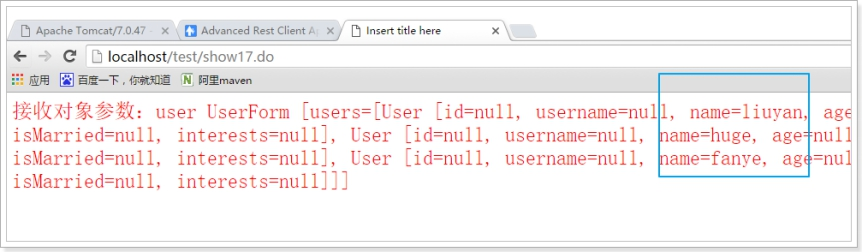

 

http协议: 只能有浏览器向服务器发送请求, 服务器才会向浏览器回送响应,没有请求,就不会有响应!


服务器给浏览器返回json : @responseBody()

浏览器给服务器传递json: @requestBody()

## 2.7 接收JSON格式请求(重点重点重点)

SpringMVC还可以接收JSON数据，并且把JSON字符串转为POJO对象  

这个时候，就要用到@RequestBody注解。

所以：

	@ResponseBody	是把返回值的Pojo对象变为JSON字符串，称为序列化
	
	@RequestBody	是把接收到的JSON字符串变为Pojo对象，称为反序列化

 


### 2.7.1 接收单个User对象

定义Controller：接收一个User对象

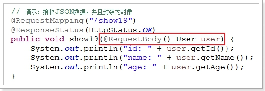 

使用RestClient来模拟发送JSON数据：

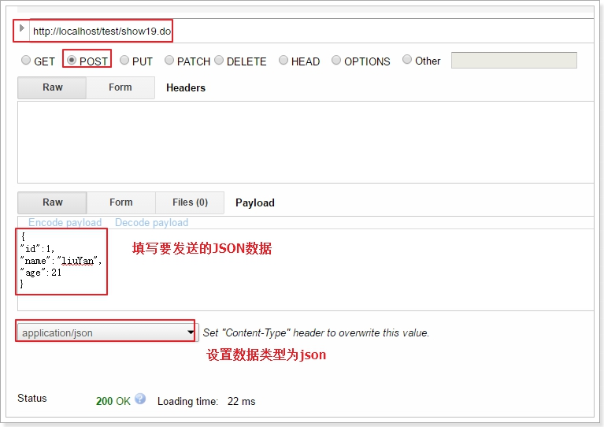

结果：

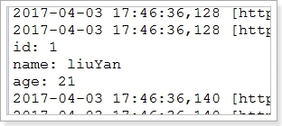


### 2.7.2 接收JSON的数组

定义Controller，可以直接接收List<User>

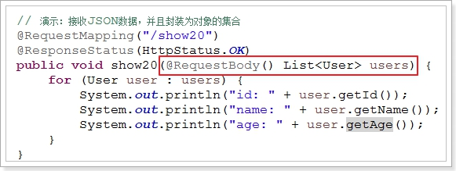 

模拟发送JSON数据：

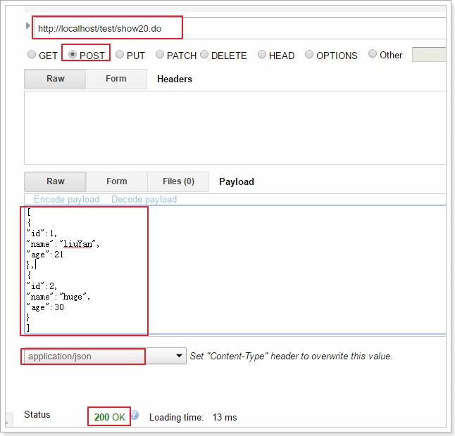 

结果：

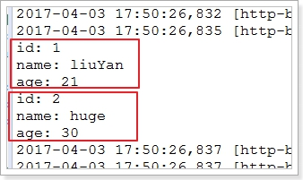 


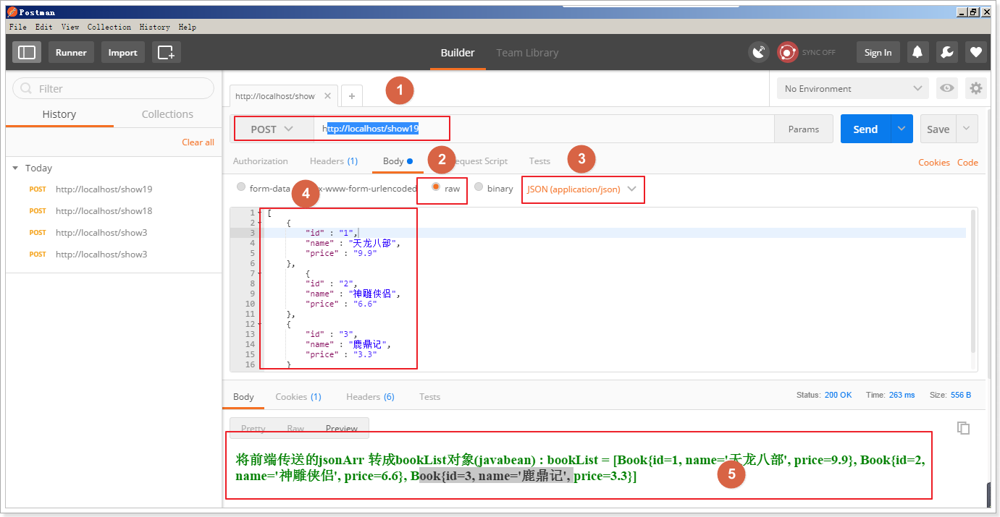 

# 4 文件上传

SpringMVC的文件上传，底层也是使用的Apache的Commons-fileupload

## 4.1 引入依赖包

```xml
		<!-- 文件上传的依赖 -->
		<dependency>
			<groupId>commons-fileupload</groupId>
			<artifactId>commons-fileupload</artifactId>
			<version>1.3.1</version>
		</dependency>
```

## 4.2 **添加文件上传的解析器**

注意: id不能省略

```xml
	<!-- 定义文件上传解析器 -->
	<bean id="multipartResolver" class="org.springframework.web.multipart.commons.CommonsMultipartResolver">
		<!-- 设定默认编码 -->
		<property name="defaultEncoding" value="UTF-8"></property>
		<!-- 设定文件上传的最大值5MB，5*1024*1024 -->
		<property name="maxUploadSize" value="5242880"></property>
	</bean> 
```

## 4.3 **编写controller控制器**

依然是通过注解 + 参数注入的方式来获取上传的文件

```java
	// 演示：文件上传
	@RequestMapping("/show21")
	// 通过参数：MultipartFile file来接收上传的文件，这个是SpringMVC中定义的类，会被自动注入
	public ModelAndView show21(@RequestParam("file") MultipartFile file) throws Exception {
		ModelAndView mv = new ModelAndView("hello");
		if(file != null){
			// 将上传得到的文件 转移到指定文件。
			file.transferTo(new File("D:/test/" + file.getOriginalFilename()));
		}
		mv.addObject("msg", "上传成功！" + file.getOriginalFilename());
		return mv;
	}
```

访问：

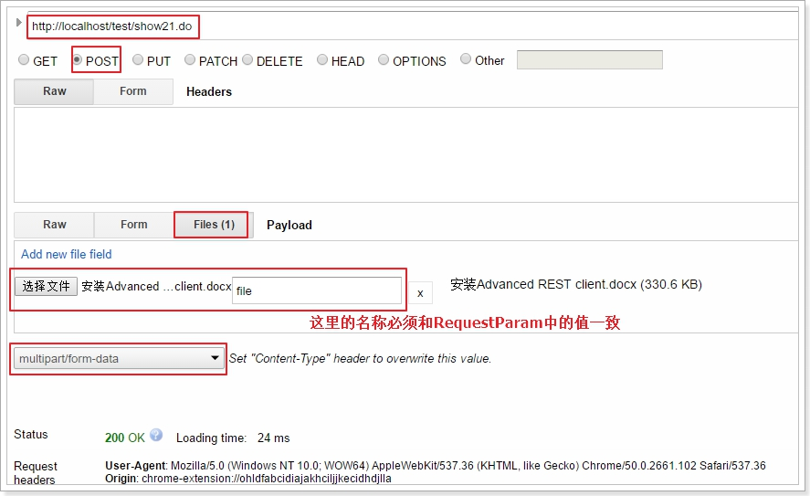

上传成功：

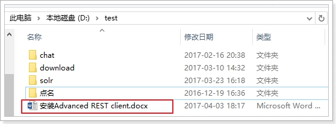 


 

 文件上传表单:

```jsp
<%@ page contentType="text/html;charset=UTF-8" language="java" %>
<html>
<head>
    <title>Title</title>
</head>
<body>
<form action="/show20" method="post" enctype="multipart/form-data">
    <input type="file" name="picFile" />
    <input type="submit" value="文件上传"/>
</form>
</body>
</html>

```


# 5 拦截器

## 5.1 **HandlerExecutionChain回顾**

HandlerExecutionChain是一个执行链，当用户的请求到达DispatcherServlet的时候，DispatcherServlet会到HandlerMapping中查找对应的Handler，找到后返回的就是这个：HandlerExecutionChain，里面包含了：

1） 正确的Handler对象

2） Handler的拦截器集合，这里的拦截器对象是：HandlerInterceptor

 

 

## 5.2 拦截器接口：HandlerInterceptor

HandlerInterceptor是SpringMVC拦截器的接口

 

 

 

其中定义了三个方法：

preHandle：预处理回调方法，在Handler执行前执行，第三个参数为处理器（Controller 实现）；

	返回值：true 表示继续流程（如调用下一个拦截器或处理器）；
	
			false表示流程中断（如登录检查失败），不会继续调用其他的拦截器或处理器；

postHandle ：后处理回调方法，实现处理器的后处理（但在渲染视图之前）

afterCompletion： ：整个请求处理完毕回调方法，即在视图渲染完毕时回调

 

当然，这个接口还有一个适配器类：HandlerInterceptorAdapter，对三个方法进行了空实现。我们可以有选择的重写想要实现的方法。

 

 

## 5.3 **拦截器执行顺序**

 正常执行的流程：

 

异常中断的流程：


## 5.4 **自定义拦截器**

拦截器1：

```java
public class MyInterceptor1 implements HandlerInterceptor {
	@Override
	public boolean preHandle(HttpServletRequest request, HttpServletResponse response, Object handler)
			throws Exception {
		System.out.println("**********我是拦截器1的前置处理方法。");
		// 这里返回true，代表放行，如果是false，流程中断，不再执行后续的Controller中的方法了
		return true;
	}
	@Override
	public void postHandle(HttpServletRequest request, HttpServletResponse response, Object handler,
			ModelAndView modelAndView) throws Exception {
		System.out.println("**********我是拦截器1的后处理方法。我看到了View：" + modelAndView.getViewName());
	}
	@Override
	public void afterCompletion(HttpServletRequest request, HttpServletResponse response, Object handler, Exception ex)
			throws Exception {
		System.out.println("**********我是拦截器1的完成后处理方法。");
	}
}
```


拦截器2：

```java
public class MyInterceptor2 implements HandlerInterceptor {
	@Override
	public boolean preHandle(HttpServletRequest request, HttpServletResponse response, Object handler)
			throws Exception {
		System.out.println("------------------我是拦截器2的前置处理方法。");
		// 这里返回true，代表放行，如果是false，流程中断，不再执行后续的Controller中的方法了
		return true;
	}
	@Override
	public void postHandle(HttpServletRequest request, HttpServletResponse response, Object handler,
			ModelAndView modelAndView) throws Exception {
		System.out.println("------------------我是拦截器2的后处理方法。我看到了View：" + modelAndView.getViewName());
	}
	@Override
	public void afterCompletion(HttpServletRequest request, HttpServletResponse response, Object handler, Exception ex)
			throws Exception {
		System.out.println("------------------我是拦截器2的完成后处理方法。");
	}
}
```


 

## 5.5 **配置自定义拦截器**

```xml
    <!--配置springmvc拦截器-->
    <mvc:interceptors>
        <!--方式一: 拦截mvc中的所有方法-->
        <!--<bean class="cn.itcast.interceptor.MyInteceptor1"/>-->
        <!--<bean class="cn.itcast.interceptor.MyInteceptor2"/>-->
        <!--<bean class="cn.itcast.interceptor.MyInteceptor3"/>-->

        <!--方式二: 一个拦截器可以拦截多个路径-->
        <mvc:interceptor>
            <mvc:mapping path="/show1"/>
            <mvc:mapping path="/show4"/>
            <bean class="cn.itcast.interceptor.MyInteceptor1"/>
        </mvc:interceptor>

        <mvc:interceptor>
            <mvc:mapping path="/show4"/>
            <bean class="cn.itcast.interceptor.MyInteceptor2"/>
        </mvc:interceptor>
    </mvc:interceptors>
```

## 5.6 **测试总结**

Controller定义：

 

 

访问结果：

 

 


我们让拦截器2返回false看看：

 

结果：

 

	前置方法执行到拦截器2时，返回false，那么Controller和所有拦截器的后置方法以及视图解析都不会执行了。直接执行了前面返回true的拦截器（也就是拦截器1）的完成后方法。

 总结：

	**拦截器的前置方法顺序执行，如果返回true，继续。返回false，流程终止，执行前面所有返回true的拦截器的完成方法**
	
	**拦截器的后置方法倒序执行，在Controller执行结束后，视图解析前执行。**
	
	**拦截器的完成后方法倒序执行，在视图解析后执行。无论前面是否出错或返回false，已经执行过的拦截器的完成方法都会被执行，类似于finally**
