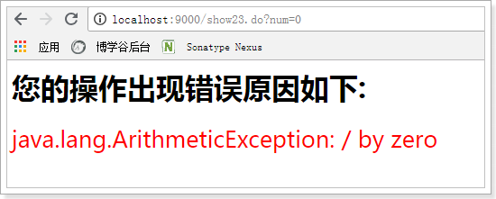
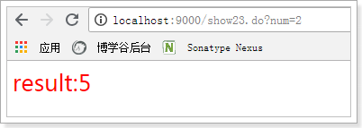
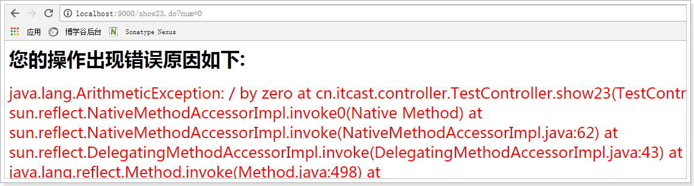

# 1 注解版

## 1.1 web层定义处理请求的方法 

```java
// 测试异常处理
@RequestMapping("show23")
public ModelAndView show23(@RequestParam("num") int num) {
    ModelAndView mv = new ModelAndView("hello");
    mv.addObject("msg", "result:" + (10/num));
    return mv;
}
```

## 1.2 web层定义处理异常的方法

```java
@ExceptionHandler({Exception.class})
public ModelAndView handlerException(Exception ex) {
    System.out.println("出现异常了: " + ex);
    ModelAndView mv = new ModelAndView("error");
    mv.addObject("exMessage", ex);
    return mv;
}
```

## 1.3 错误处理页面

```jsp
<%@ page contentType="text/html;charset=UTF-8" language="java" isELIgnored="false" %>
<html>
<head>
    <title>Title</title>
</head>
<body>
    <h1>您的操作出现错误原因如下:</h1>
    <span style="color:red;font-size:25px;">${exMessage}</span>
</body>
</html>
```

## 1.4 启动测试

 

 

# 2 非注解版(了解)

## 2.1 自定义异常类

```java
package cn.itcast.exception;

/**
 * 自定义异常类
 */
public class CustomException extends Exception{

    public CustomException(String exMessage) {
        super();
        this.exMessage = exMessage;
    }

    private String exMessage;

    public String getExMessage() {
        return exMessage;
    }

    public void setExMessage(String exMessage) {
        this.exMessage = exMessage;
    }
}
```

## 2.2 异常处理器实现

```java
package cn.itcast.exception;

import org.springframework.web.servlet.HandlerExceptionResolver;
import org.springframework.web.servlet.ModelAndView;

import javax.servlet.http.HttpServletRequest;
import javax.servlet.http.HttpServletResponse;
import java.io.PrintWriter;
import java.io.StringWriter;

public class CustomHandlerExceptionResolver implements HandlerExceptionResolver {
    @Override
    public ModelAndView resolveException(HttpServletRequest request,
                                         HttpServletResponse response,
                                         Object handler,
                                         Exception ex) {

        // 1 发短信,发邮件通知主要负责人

        // 2 判断是自定义异常吗?
        String exMessage = "";
        if(ex instanceof CustomException) {
            // 2.1 如果是自定义异常, 获取异常信息
            CustomException customException = (CustomException) ex;
            exMessage = ((CustomException) ex).getExMessage();
        }else {
            // 2.2 其他异常, 获取异常信息
            StringWriter stringWriter = new StringWriter();
            PrintWriter printWriter = new PrintWriter(stringWriter);
            ex.printStackTrace(printWriter);
            CustomException customException = new CustomException(stringWriter.toString());
            exMessage = customException.getExMessage();
        }

        // 3 给浏览器返回响应信息
        ModelAndView mv = new ModelAndView("error");
        mv.addObject("exMessage", exMessage);
        return mv;
    }
}
```

## 2.3 错误页面

```jsp
<%@ page contentType="text/html;charset=UTF-8" language="java" isELIgnored="false" %>
<html>
<head>
    <title>Title</title>
</head>
<body>
    <h1>您的操作出现错误原因如下:</h1>
    <span style="color:red;font-size:25px;">${exMessage}</span>
</body>
</html>
```

## 2.4 异常处理器配置

```xml
<bean class="cn.itcast.exception.CustomHandlerExceptionResolver"/>
```

## 2.5 异常测试

```java
// 测试异常处理
@RequestMapping("show23")
public ModelAndView show23(@RequestParam("num") int num) {
    ModelAndView mv = new ModelAndView("hello");
    mv.addObject("msg", "result:" + (10/num));
    return mv;
}
```

