[TOC]


# Spring 框架 第二天 AOP切面编程

今天内容安排：

1、 AOP概述 

理解AOP原理，如何进行AOP编程，常用术语 

2、 AOP底层实现技术（**了解**）

JDK动态代理 和 Cglib动态代理 

3、 传统 Spring AOP 编程开发 （**了解 **）

4、 Spring 整合 AspectJ 框架 AOP 编程开发 （**重点**）

XML方式和注解方式 

# 1.  **AOP概述** 

## 1.1.  什么是AOP？

AOP Aspect Oriented Programing 面向切面编程 

扩展： OOP 面向对象编程， SOA 面向服务架构 

OOP 编程思想，Java 语言

AOP 设计思想 

SOA 架构思想 

 

 AOP采取横向抽取机制，取代了传统纵向继承体系重复性代码（性能监视、事务管理、安全检查、缓存）

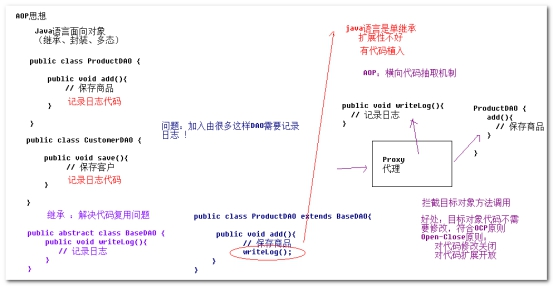 

AOP思想：采用代理思想，在不改变原来目标代码前提下，实现功能增强！ 

IoC 工厂制造对象，AOP 代码增强对象，在工厂制造对象过程中，使用代理进行对象的增强（BeanPostProcessor ）

## 1.2.  **如何学习SpringAOP编程** 

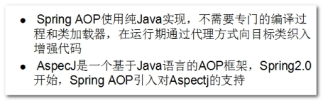 

Spring2.0之前（1.2）开始支持AOP编程，编写比较复杂，称为 传统AOP编程

	套路:

  		1. 目标类
  		2. 增强类
  		3. 建立关系


Spring2.0之后，为了简化AOP编程，开始支持第三方AOP框架 AspectJ 

## 1.3.  **AOP编程应用场景（面试）**

应用场景：

*  事务管理

*  记录日志

* 监测性能（统计方法运行时间）

* 权限控制
* 缓存

 

静态代理：代理类是用户编写的 

动态代理：代理类在JVM运行时，动态在内存生成的 

# 2.  AOP相关术语 

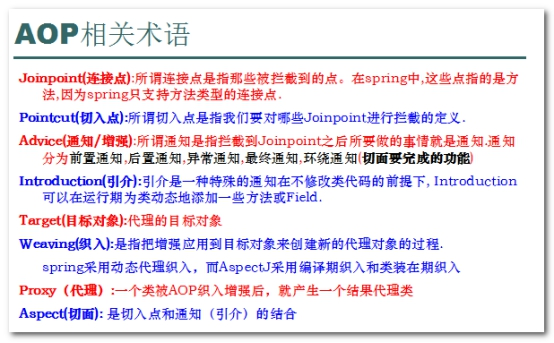 

建议采用图解方式理解 

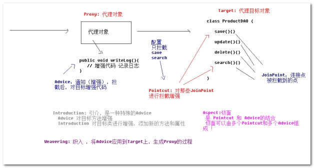 

面向切面编程 --- 切面 Aspect --- 通知（增强代码逻辑）和切入点（对目标哪些方法进行拦截） 编程 

# 3.  AOP编程代理技术底层实现(了解) 

动态代理代码 --> 操作步骤 --> 需要记忆 --> 多敲

## 3.1.  **JDK动态代理** 

JDK动态代理，1.3版本开始提供，在不改变目标对象代码情况下，在JVM虚拟机内部，动态为目标对象的接口生成代理类 ------ 动态 

 

编写动态代理程序

java.lang.reflect.Proxy

java.lang.reflect.InvocationHandler

 

### 3.1.1 被代理目标对象 

```java
package cn.itcast.spring.a_jdkproxy;

// 商品操作 接口
public interface ProductService {
   public void add();

   public void edit();

   public void delete();

   public void query();
}
```

 ```java
package cn.itcast.spring.a_jdkproxy;

// 实现类
public class ProductServiceImpl implements ProductService {

	@Override
	public void add() {
		System.out.println("添加商品...");
	}

	@Override
	public void edit() {
		System.out.println("修改商品...");
	}

	@Override
	public void delete() {
		System.out.println("删除商品...");
	}

	@Override
	public void query() {
		System.out.println("查询商品...");
	}

}

 ```


### 3.1.2 编写JDK动态代理 工厂类

```java
package cn.itcast.a_proxy;

import java.lang.reflect.InvocationHandler;
import java.lang.reflect.Method;
import java.lang.reflect.Proxy;

public class JDKProxyFactory {
    // 指定对谁进行增强(目标类)
    private Object target;

    public JDKProxyFactory(Object target) {
        this.target = target;
    }

    // 创建增强功能
    public Object creatProxyObj() {
        // 第一个参数: 类加载器
        // 第二个参数: 目标类的接口
        // 第三个参数: 回调函数, 增强的代码
        return Proxy.newProxyInstance(target.getClass().getClassLoader(),
                target.getClass().getInterfaces(),
                new InvocationHandler() {
                    // method : 反射的方法对象
                    // args : 方法中的参数
                    @Override
                    public Object invoke(Object proxy, Method method, Object[] args) throws Throwable {
                        System.out.println("jdk proxy 记录日志: " + method.getName() + " 方法执行了!"); // 增强代码
                        return method.invoke(target, args); // 业务代码: 通过反射调用
                    }
                });
    }
}
 
```

### 3.1.3  编写测试代码

```java
package cn.itcast.spring.a_jdkproxy;

import org.junit.Test;

// 测试
public class JdkProxyTest {

   @Test
   // 没有代理
   public void testNoProxy() {
      ProductService productService = new ProductServiceImpl();
      productService.add();
      productService.edit();
      productService.query();
   }

   @Test
   // JDK代理
   public void testJdkProxy() {
      // 目标对象
      ProductService target = new ProductServiceImpl();
      // 创建代理
      JdkProxyFactory factory = new JdkProxyFactory(target);
      ProductService proxy = (ProductService) factory.createProxy(); // 代理面向接口
      // 通过代理调用方法
      proxy.add();
      proxy.edit();
      proxy.query();
   }
}
```

缺点： JDK动态代理，必须面向接口，生成代理对象 ，如果目标对象没有实现接口，无法使用JDK动态代理 ！


## 3.2.  Cglib动态代理 

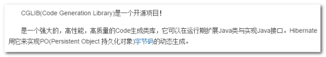 

下载： <http://sourceforge.net/projects/cglib/files/> 

spring core 核心包 已经集成cglib的class文件 ！！

```xml
    <dependencies>
        <dependency>
            <groupId>junit</groupId>
            <artifactId>junit</artifactId>
        </dependency>
        <dependency>
            <groupId>org.springframework</groupId>
            <artifactId>spring-context</artifactId>
        </dependency>
    </dependencies>
```


 

### 3.2.1被代理 目标对象  

```java
package cn.itcast.spring.b_cglib;

// 客户 操作 
public class CustomerService {
	public int save() {
		System.out.println("保存客户");
		return 1;
	}

	public void update() {
		System.out.println("修改客户");
	}

	public void delete() {
		System.out.println("删除客户");
	}

	public void search() {
		System.out.println("查询客户");
	}
}
```


### 3.2.2  编写 CglibProxyFactory 工具类 ，对目标对象进行cglib代理 

```java
package cn.itcast.a_proxy;

import org.springframework.cglib.proxy.Enhancer;
import org.springframework.cglib.proxy.MethodInterceptor;
import org.springframework.cglib.proxy.MethodProxy;

import java.lang.reflect.Method;

public class CglibProxyFactory {
    // 目标类
    private Object target;

    public CglibProxyFactory(Object target) {
        this.target = target;
    }

    // 操作步骤==>记住==>记不住==>多敲
    public Object createProxyObject() {
        // 1 增强类
        Enhancer enhancer = new Enhancer();
        // 2 确定给哪个目标类增强
        enhancer.setSuperclass(target.getClass());
        // 3 书写增强代码
        enhancer.setCallback(new MethodInterceptor() {
            @Override
            public Object intercept(Object proxy, Method method, Object[] args, MethodProxy methodProxy) throws Throwable {
                System.out.println("cglib 记录日志: " + method.getName() + " 方法执行了" ); // 增强代码
                return methodProxy.invokeSuper(proxy, args); // 业务代码
            }
        });
        // 4 返回结果
        return enhancer.create();
    }
}

```

 

### 3.2.3 编写测试 

```java
package cn.itcast.spring.b_cglib;

import org.junit.Test;

public class CglibProxyTest {
	@Test
	// 没有代理
	public void testNoProxy() {
		CustomerService customerService = new CustomerService();
		customerService.save();
		customerService.update();
		customerService.delete();
		customerService.search();
	}

	@Test
	// 测试 cglib代理
	public void testCglibProxy() {
		// 目标
		CustomerService target = new CustomerService();
		// 生成代理
		CglibProxyFactory factory = new CglibProxyFactory(target);
		CustomerService proxy = (CustomerService) factory.createProxy();
		// 调用代理对象的方法
		proxy.save();
		proxy.update();
		proxy.delete();
		proxy.search();
	}
}


```


小结： Spring AOP 优先对接口创建代理 ，对接口代理使用JDK动态代理

如果目标对象没有接口，使用cglib动态代理 

# 4.  传统Spring AOP编程(了解) 

主要用于spring2.0之前 （1.2）年代，这个版本AOP编程比较复杂 

**要求：看得懂，会配置 **

## 4.1.  传统Spring AOP编程 Advice类型 

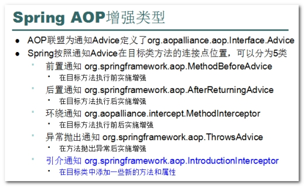 

AOP编程，最早是由AOP联盟组织定义接口规范 org.aopalliance.aop.interface.Advice

Spring AOP 编程，对Advice接口进行扩展，共定义5类通知 

## 4.2.  编写 管理事务的方法 

// 事务套路

try{

	// 1 开启事务: 前置增强代码(通知)
	
	// 2 执行一组sql语句
	
	执行转账业务(); //  a-100; b+100
	
	// 3.1 如果一切正常, 提交事务(生效) : 后置增强代码(通知)

} catch(Exception e) {

	// 3.2 如果出现问题, 回滚事务(撤销): 后置异常增强代码(通知)

} finally {

	// 4 释放资源: 最终增强代码(通知)

}


### 4.2.1 第一步： 在项目导入jar包 

```xml
<?xml version="1.0" encoding="UTF-8"?>
<project xmlns="http://maven.apache.org/POM/4.0.0"
         xmlns:xsi="http://www.w3.org/2001/XMLSchema-instance"
         xsi:schemaLocation="http://maven.apache.org/POM/4.0.0 http://maven.apache.org/xsd/maven-4.0.0.xsd">
    <parent>
        <artifactId>itcast_parent</artifactId>
        <groupId>cn.itcast</groupId>
        <version>1.0-SNAPSHOT</version>
        <relativePath>../itcast_parent/pom.xml</relativePath>
    </parent>
    <modelVersion>4.0.0</modelVersion>

    <artifactId>spring_day02_01_aop_xml</artifactId>
    <packaging>jar</packaging>

    <dependencies>
        <!--测试-->
        <dependency>
            <groupId>junit</groupId>
            <artifactId>junit</artifactId>
        </dependency>
        <dependency>
            <groupId>org.springframework</groupId>
            <artifactId>spring-test</artifactId>
            <version>4.1.3.RELEASE</version>
        </dependency>
        <!--spring-->
        <dependency>
            <groupId>org.springframework</groupId>
            <artifactId>spring-context</artifactId>
        </dependency>
        <dependency>
            <groupId>org.springframework</groupId>
            <artifactId>spring-aspects</artifactId>
        </dependency>
    </dependencies>

</project>
```

### 4.2.2 第二步： 使用 ProductService 和 CustomerService作为 target目标对象 配置

 ```xml
<?xml version="1.0" encoding="UTF-8"?>
<beans xmlns="http://www.springframework.org/schema/beans"
       xmlns:xsi="http://www.w3.org/2001/XMLSchema-instance"
       xsi:schemaLocation="
                            http://www.springframework.org/schema/beans
                            http://www.springframework.org/schema/beans/spring-beans.xsd
">
    <!--1 配置目标类-->
    <bean id="customerService" class="cn.itcast.a_quick.CustomerService"/>
    <bean id="productService" class="cn.itcast.a_quick.ProductServiceImpl"/>
</beans>
 ```

### 4.2.3 第三步：编写spring 测试 

```java
package cn.itcast.a_quick;

import org.junit.Test;
import org.junit.runner.RunWith;
import org.springframework.beans.factory.annotation.Value;
import org.springframework.test.context.ContextConfiguration;
import org.springframework.test.context.junit4.SpringJUnit4ClassRunner;

@RunWith(SpringJUnit4ClassRunner.class)
@ContextConfiguration(locations = "classpath:beans.xml")
public class SpringTest {

    @Value("#{customerService}")
    private  CustomerService customerService;

    @Value("#{productService}")
    private ProductService productService;

    @Test
    public void demo01() {
        productService.add();
        productService.edit();
        productService.del();
        productService.query();

        customerService.add();
        customerService.edit();
        customerService.del();
        customerService.query();
    }
}
```

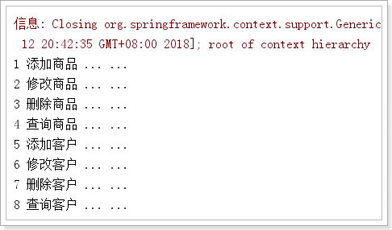 


 

### 4.2.4 第四步：编写记录方法运行时间Advice （MethodInterceptor ）

```java
package cn.itcast.a_quick;

import org.aopalliance.intercept.MethodInterceptor;
import org.aopalliance.intercept.MethodInvocation;

// 自定义 环绕通知（Spring 传统AOP Advice）
public class MyMethodInterceptor implements MethodInterceptor {
    @Override
    // 拦截目标对象方法，mi用于执行目标方法
    public Object invoke(MethodInvocation invocation) throws Throwable {
        long start = System.currentTimeMillis();
        Object returnVal = invocation.proceed(); // 执行目标方法
        long end = System.currentTimeMillis();
        System.out.println("=====================================");
        System.out.println("类  :" + invocation.getThis().getClass().getSimpleName());
        System.out.println("方法:" + invocation.getMethod().getName());
        System.out.println("耗时:" + (end - start) + "毫秒!");
        System.out.println("=====================================");
        return returnVal;
    }
}
```


beans.xml

```xml
    <!--2 配置增强类-->
    <bean id="myMethodInterceptor" class="cn.itcast.a_quick.MyMethodInterceptor"/>
```


### 4.2.5 第五步：引入aop名称空间 

 ```xml
<?xml version="1.0" encoding="UTF-8"?>
<beans xmlns="http://www.springframework.org/schema/beans"
       xmlns:aop="http://www.springframework.org/schema/aop"
       xmlns:xsi="http://www.w3.org/2001/XMLSchema-instance"
       xsi:schemaLocation="
                            http://www.springframework.org/schema/beans
                            http://www.springframework.org/schema/beans/spring-beans.xsd
                            http://www.springframework.org/schema/aop
                            http://www.springframework.org/schema/aop/spring-aop.xsd
">
 ```

### 4.2.6 第六步：配置切入点和切面 

```xml
    <!-- 3、配置切入点和切面  -->
    <!-- 这是一组切面配置  -->
    <!-- proxy-target-class=false 优先对接口代理，设置为true ，使用cglib直接对类代理  -->
    <aop:config proxy-target-class="false">
        <aop:pointcut id="myPointcut" expression="bean(*Service)"/>
        <!--
            aop:pointcut 配置切入点
            aop:advisor 切面 配置传统Spring AOP切面 ，只能包含一个切入点和一个通知
            aop:aspect 切面 配置 aspectj切面 , 可以包含多个切入点和多个通知
         -->
        <aop:advisor advice-ref="myMethodInterceptor" pointcut-ref="myPointcut"/>
    </aop:config>
```

### 4.2.7 再次测试执行 

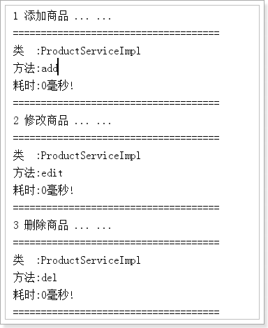

 

## 4.3.  **切入点语法说明** 

Spring 只支持AspectJ的部分切入点语法 

### 4.3.1 语法一： execution(修饰符? 返回值 方法名(参数) 异常?)

execution(* \*(..))  匹配所有spring管理对象所有方法， 第一个\*任意返回值 ，第二个\*任意方法， .. 任意参数 

execution(* cn.itcast.spring.\*..\*(..)) 匹配cn.itcast.spring包中所有对象所有方法

execution(* cn.itcast.spring.CustomerService.s*(..)) 匹配CustomerService中s开头方法 

 

### 4.3.2 语法二：bean(beanName) 匹配目标Bean所有方法 

bean(*Service) 匹配所有以Service结尾BeanName 的对象 

 

### 4.3.3 语法三：within(包.*) 匹配包下所有类的所有方法 

within(cn.itcast.spring..*) 匹配spring包及其子包中类所有方法 

 注意: 一个`.`代表子目录; 两个点`..` 表示后代目录 

重点：掌握bean、within、execution 

```
小结AOP编程步骤：

1、目标

2、增强类

3、建立关系
```


# 5.  AspectJ AOP切面编程（重点 掌握）(4遍)

Spring2.0之后，为了简化AOP编程，开发支持AspectJ 

使用之前测试用例，修改加载 applicationContext-aspectj.xml 

## 5.0.  **AspectJ AOP编程 Advice类型** 

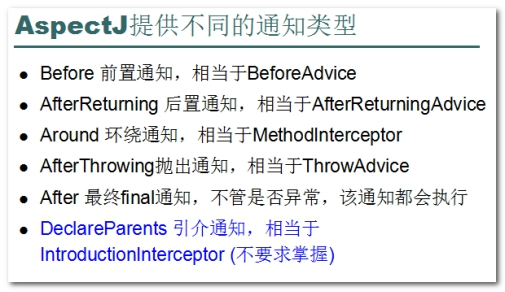 

AspectJ 共提供6种通知类型（前置、后置、环绕、异常、最终通知），AspectJ通知不需要实现任何接口 

```
try{
	前置增强...
	// 执行目标方法
	后置增强
}catch{
	抛出增强
}finally{
	最终通知
}
```

## 5.1 准备工作

```java
package cn.itcast.b_aspect;

public class AccountDao {
    public void in(String inUser, double money) {
        System.out.println(inUser + "收到 " + money );
        int j = 1/0;
    }

    public void out(String outUser, double money) {
        System.out.println(outUser + "转出 " + money);
    }
}
```


```java
package cn.itcast.b_aspect;

public class AccountService {

    private AccountDao accountDao;

    public void setAccountDao(AccountDao accountDao) {
        this.accountDao = accountDao;
    }

    public void transfer(String outUser, String inUser, double money) {
        accountDao.in(inUser, money);

        accountDao.out(outUser, money);
    }
}
```


beans_aspect.xml

```xml
<!--1 配置目标类-->
<bean id="accountDao" class="cn.itcast.b_aspect.AccountDao"/>
<bean id="accountService" class="cn.itcast.b_aspect.AccountService">
    <property name="accountDao" ref="accountDao"/>
</bean>
```


## 5.2.  编写AspectJ的环绕通知，实现转账业务  

```java
package cn.itcast.b_aspect;

import org.aspectj.lang.JoinPoint;
import org.aspectj.lang.ProceedingJoinPoint;

// 在一个切面类,可以提供多个 advice方法
public class MyAspectJ {

    // 环绕通知: 返回object
    public Object around(ProceedingJoinPoint joinPoint) throws Throwable {
        Object returnVal = null;
        try {
           // 1 开启事务
           System.out.println("================1 开启事务");
           // 2 执行一组sql语句
           returnVal = joinPoint.proceed();
           // 3.1  提交事务
           System.out.println("================3.1 提交事务");
       } catch (Exception ex) {
           ex.printStackTrace();
           // 3.2 回滚事务
            System.out.println("================3.2 回滚事务");
       } finally {
           // 4 释放资源
            System.out.println("================4 释放资源");
       }
       return returnVal;
    }
}

```

第二步：编写好Advice，注册到Spring容器 

```xml
<!--2 配置增强类-->
<bean id="myAspectJ" class="cn.itcast.b_aspect.MyAspectJ"/>
```
## 5.3.  **配置切入点和切面** 

```xml
<!--3 配置切入点和切面-->
<aop:config proxy-target-class="false">
    <!--3.1 ref引入通知方法所在的类-->
    <aop:aspect ref="myAspectJ">
        <!--3.2 配置六种通知类型和切入点-->
        <aop:pointcut id="myPointcut" expression="bean(*Service)"/>
        <aop:around method="around" pointcut-ref="myPointcut"/>
    </aop:aspect>
</aop:config>
```

测试:

```java
package cn.itcast.b_aspect;

import org.junit.Test;
import org.junit.runner.RunWith;
import org.springframework.beans.factory.annotation.Value;
import org.springframework.test.context.ContextConfiguration;
import org.springframework.test.context.junit4.SpringJUnit4ClassRunner;

@RunWith(SpringJUnit4ClassRunner.class)
@ContextConfiguration(locations = "classpath:beans_aspect.xml")
public class SpringTest {

    @Value("#{accountService}")
    private AccountService accountService;

    @Test
    public void demo01() {
        accountService.transfer("刘德华", "柳岩", 10000);
    }
}
```

## 5.4.  **AspectJ各种通知编程案例（xml方式 ）**

l Before Advice 前置增强，在目标对象 方法运行前，进行增强代码 

特性：拦截目标方法执行 

经典场景： 权限控制（判断当前用户访问目标方法是否具有权限，没有权限，抛出异常）

扩展：装饰者模式 和 代理模式区别 

装饰者模式： 对目标对象方法进行功能增强 

new BufferedInputStream(new FileInputStream(文件)) 进行缓存读取增强 

代理模式：拦截目标对象方法访问 

 

l 传统AOP编程，每个Advice必须实现对应接口，一个Advice对应一个类 

l AspectJ AOP编程，将多个Advice增强方法，写入到一个类中，无需实现任何接口 

### 5.4.1 前置通知

在所有增强方法中，都可以接受JoinPoint类型连接点参数对象，可以获取当前增强是哪个类的哪个方法，还可以获取调用目标方法传递参数

```java
// 前置通知
public void before01(JoinPoint joinPoint) {
    System.out.println("--------------------- 前置通知: 开启事务 ... ..." );
}
```

配置 

```xml
<!--前置增强-->
<aop:before method="before01" pointcut-ref="myPointcut"/>
```


### 5.4.2 后置通知

l AfterReturing 后置通知 ，在目标正常运行返回后，进行增强操作 

特点：获取目标方法返回值  

```java
// 后置增强
public void afterRegurning(JoinPoint joinPoint, Object returnObject) {
    System.out.println("--------------------- 后置通知: 提交事务 ... ..." );
}
```

配置  

 ```xml
<!--后置增强-->
<aop:after-returning method="afterRegurning" pointcut-ref="myPointcut" returning="returnObject"/>
 ```


### 5.4.3 环绕通知 

Around 环绕通知，最重要一类通知，实现其它各种通知增强效果 

特性：目标方法前后都可以拦截 

经典场景：权限、日志、监控、事务控制、缓存 

 

缓存实现思路：内存中创建Map，方法执行前，判断map中是否具有目标方法作为key的缓存数据，如果有，直接返回缓存数据，不执行目标方法； 如果没有，执行目标方法，将目标方法返回值，放入缓存Map ！ ------- 通常情况下，目标方法+参数 作为 key 

 

环绕通知，对方法签名有规范 

Object 返回值，任意返回值

ProceedingJoint 参数，用于控制目标方法执行

抛出Throwable异常，代表目标方法可以发生任何异常 

 ```java
    // 环绕通知: 返回object
    public Object around(ProceedingJoinPoint joinPoint) throws Throwable {
        Object returnVal = null;
        try {
           // 1 开启事务
           System.out.println("================1 开启事务");
           // 2 执行一组sql语句
           returnVal = joinPoint.proceed();
           // 3.1  提交事务
           System.out.println("================3.1 提交事务");
       } catch (Exception ex) {
           ex.printStackTrace();
           // 3.2 回滚事务
            System.out.println("================3.2 回滚事务");
       } finally {
           // 4 释放资源
            System.out.println("================4 释放资源");
       }
       return returnVal;
    }
 ```


### 5.4.4 抛出通知 

l AfterThrowing 抛出通知，在目标方法抛出异常后，执行增强 

特性：捕获目标方法异常 

经典场景： 将异常信息写入日志文件或者发送邮件给管理员 

```java
    public void afterThrowing(JoinPoint joinPoint, Throwable ex) {
        System.out.println("--------------------- 异常通知: 回滚事务 ... ..." );
    }
```


配置 

```xml
<!--异常通知-->
<aop:after-throwing method="afterThrowing" pointcut-ref="myPointcut" throwing="ex"/>
```


### 5.4.5 最终通知 		

l After 最终通知，无论目标方法是否有异常，都会执行 

相当于finally代码块 

经典场景： 释放资源 

```java
public void after(JoinPoint joinPoint) {
	System.out.println("--------------------- 最终通知: 释放资源 ... ..." );
}
```

配置  

 ```xml
<!--最终通知-->
<aop:after method="after" pointcut-ref="myPointcut" />
 ```

小结： 只需要掌握Around 环绕通知就可以 

Around 可以实现其它通知效果 

完整代码:

```xml
<?xml version="1.0" encoding="UTF-8"?>
<beans xmlns="http://www.springframework.org/schema/beans"
       xmlns:aop="http://www.springframework.org/schema/aop"
       xmlns:xsi="http://www.w3.org/2001/XMLSchema-instance"
       xsi:schemaLocation="
                            http://www.springframework.org/schema/beans
                            http://www.springframework.org/schema/beans/spring-beans.xsd
                            http://www.springframework.org/schema/aop
                            http://www.springframework.org/schema/aop/spring-aop.xsd
">
    <!--1 配置目标类-->
    <bean id="accountDao" class="cn.itcast.b_aspect.AccountDao"/>
     <bean id="accountService" class="cn.itcast.b_aspect.AccountService">
        <property name="accountDao" ref="accountDao"/>
    </bean>

    <!--2 配置增强类-->
   <bean id="myAspectJ" class="cn.itcast.b_aspect.MyAspectJ"/>

    <!--3 配置切入点和切面-->
    <aop:config proxy-target-class="false">
        <!--3.1 ref引入通知方法所在的类-->
        <aop:aspect ref="myAspectJ">
            <!--3.2 配置六种通知类型和切入点-->
            <aop:pointcut id="myPointcut" expression="bean(*Service)"/>
             <!--环绕增强-->
            <!--<aop:around method="around" pointcut-ref="myPointcut"/>-->

            <!--前置增强-->
            <aop:before method="before01" pointcut-ref="myPointcut"/>

            <!--后置增强-->
            <aop:after-returning method="afterRegurning" pointcut-ref="myPointcut" returning="returnObject"/>

            <!--异常通知-->
            <aop:after-throwing method="afterThrowing" pointcut-ref="myPointcut" throwing="ex"/>

            <!--最终通知-->
            <aop:after method="after" pointcut-ref="myPointcut" />
        </aop:aspect>
    </aop:config>
</beans>
```

正常结果:

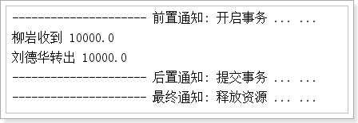

异常结果:

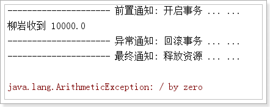

 

# 6.  AspectJ AOP注解编程 (5遍)

## 6.1.  编写目标，注解扫描注册

新建项目 spring02_day02_aspectjannotation ，导入jar包 

```xml
<?xml version="1.0" encoding="UTF-8"?>
<project xmlns="http://maven.apache.org/POM/4.0.0"
         xmlns:xsi="http://www.w3.org/2001/XMLSchema-instance"
         xsi:schemaLocation="http://maven.apache.org/POM/4.0.0 http://maven.apache.org/xsd/maven-4.0.0.xsd">
    <parent>
        <artifactId>itcast_parent</artifactId>
        <groupId>cn.itcast</groupId>
        <version>1.0-SNAPSHOT</version>
        <relativePath>../itcast_parent/pom.xml</relativePath>
    </parent>
    <modelVersion>4.0.0</modelVersion>

    <artifactId>spring_day02_02_aop_annotation</artifactId>
    <packaging>jar</packaging>
    <dependencies>
        <!--测试-->
        <dependency>
            <groupId>junit</groupId>
            <artifactId>junit</artifactId>
        </dependency>
        <dependency>
            <groupId>org.springframework</groupId>
            <artifactId>spring-test</artifactId>
            <version>4.1.3.RELEASE</version>
        </dependency>
        <!--spring-->
        <dependency>
            <groupId>org.springframework</groupId>
            <artifactId>spring-context</artifactId>
        </dependency>
        <dependency>
            <groupId>org.springframework</groupId>
            <artifactId>spring-aspects</artifactId>
        </dependency>
    </dependencies>
</project>
```

 

第一步：编写目标，配置到spring容器，进行无AOP增强测试 

使用之前编写 AccountDao 和 AccountService

使用注解修饰目标对象，配置spring 包扫描 

数据类:

```java
package cn.itcast.a_aspect;

import org.springframework.stereotype.Repository;

@Repository("accountDao")
public class AccountDao {
    public void in(String inUser, double money) {
        System.out.println(inUser + "收到 " + money );
        //int j = 1/0;
    }

    public void out(String outUser, double money) {
        System.out.println(outUser + "转出 " + money);
    }
}
```

业务类:

```java
package cn.itcast.a_aspect;

import org.springframework.beans.factory.annotation.Value;
import org.springframework.stereotype.Service;

@Service("accountService")
public class AccountService {

    @Value("#{accountDao}")
    private AccountDao accountDao;

    public void setAccountDao(AccountDao accountDao) {
        this.accountDao = accountDao;
    }

    public void transfer(String outUser, String inUser, double money) {
        accountDao.in(inUser, money);

        accountDao.out(outUser, money);
    }
}

```


配置扫描 

```xml
<?xml version="1.0" encoding="UTF-8"?>
<beans xmlns="http://www.springframework.org/schema/beans"
       xmlns:context="http://www.springframework.org/schema/context"
       xmlns:xsi="http://www.w3.org/2001/XMLSchema-instance" xmlns:aop="http://www.springframework.org/schema/aop"
       xsi:schemaLocation="http://www.springframework.org/schema/beans
                        http://www.springframework.org/schema/beans/spring-beans.xsd
                        http://www.springframework.org/schema/context
                        http://www.springframework.org/schema/context/spring-context.xsd http://www.springframework.org/schema/aop http://www.springframework.org/schema/aop/spring-aop.xsd">
    <!--开启扫描注解-->
    <context:component-scan base-package="cn.itcast"/>
</beans>
```


测试代码

```java
package cn.itcast.a_aspect;

import org.junit.Test;
import org.junit.runner.RunWith;
import org.springframework.beans.factory.annotation.Value;
import org.springframework.test.context.ContextConfiguration;
import org.springframework.test.context.junit4.SpringJUnit4ClassRunner;

@RunWith(SpringJUnit4ClassRunner.class)
@ContextConfiguration(locations = "classpath:beans.xml")
public class SpringTest {

    @Value("#{accountService}")
    private AccountService accountService;

    @Test
    public void demo01() {
        accountService.transfer("刘德华", "柳岩", 10000);
    }
}
```

## 6.2.  **编写Advice增强代码进行注册**

第二步：编写Advice 

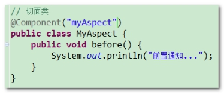


```java
package cn.itcast.a_aspect;

import org.aspectj.lang.JoinPoint;
import org.aspectj.lang.ProceedingJoinPoint;
import org.aspectj.lang.annotation.*;
import org.springframework.stereotype.Component;

// 切面类
@Component("myAspectJ")
public class MyAspectJ {

    // 前置通知
    public void before01(JoinPoint joinPoint) {
        System.out.println("--------------------- 前置通知: 开启事务 ... ..." );
    }

}
```

## 6.3.  **配置切入点和切面** 

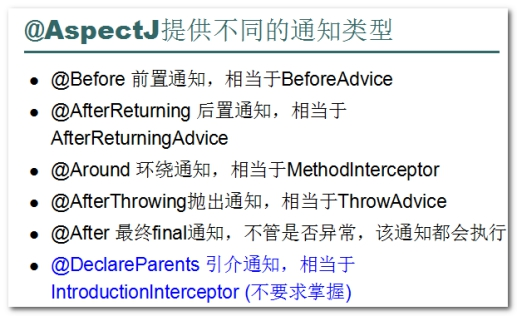 

第三步：使用通知类型注解，定义切入点 

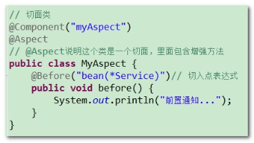 

```java
package cn.itcast.a_aspect;

import org.aspectj.lang.JoinPoint;
import org.aspectj.lang.ProceedingJoinPoint;
import org.aspectj.lang.annotation.*;
import org.springframework.stereotype.Component;

// 切面类
@Component("myAspectJ")
@Aspect
// @Aspect 说明这个类是切面类,里面包含增强方法
public class MyAspectJ {

    // 前置通知
    @Before("bean(*Service)")
    public void before01(JoinPoint joinPoint) {
        System.out.println("--------------------- 前置通知: 开启事务 ... ..." );
    }

}
```

 

第四步：配置beans.xml 开启注解自动切面代理

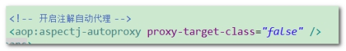 

```xml
<!--开启注解自动代理-->
<aop:aspectj-autoproxy proxy-target-class="false"/>
```

## 6.4.  **其它类型通知，注解配置使用** 

l @AfterReturning 注解 后置通知 

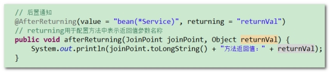 

```java
// 前置通知
@Before("bean(*Service)")
public void before01(JoinPoint joinPoint) {
    System.out.println("--------------------- 前置通知: 开启事务 ... ..." );
}
```

l @Around 注解 环绕通知

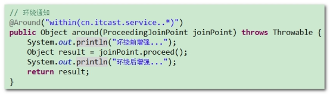 

```java
// 后置增强
@AfterReturning(value = "bean(*Service)", returning = "returnObject")
public void afterRegurning(JoinPoint joinPoint, Object returnObject) {
    System.out.println("--------------------- 后置通知: 提交事务 ... ..." );
}
```

l @AfterThrowing 注解 抛出通知

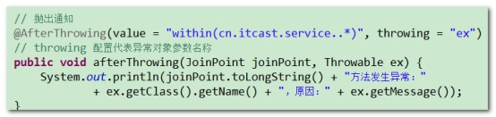 

```java
// 异常通知
@AfterThrowing(value = "bean(*Service)", throwing = "ex")
public void afterThrowing(JoinPoint joinPoint, Throwable ex) {
    System.out.println("--------------------- 异常通知: 回滚事务 ... ..." );
}
```

l @ After 注解，最终通知

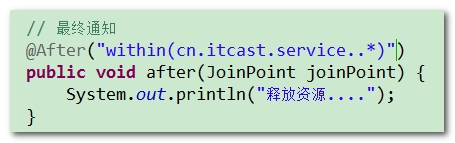 

```java
// 最终通知
@After("bean(*Service)")
public void after(JoinPoint joinPoint) {
    System.out.println("--------------------- 最终通知: 释放资源 ... ..." );
}
```

 

```java
package cn.itcast.a_aspect;

import org.aspectj.lang.JoinPoint;
import org.aspectj.lang.ProceedingJoinPoint;
import org.aspectj.lang.annotation.*;
import org.springframework.stereotype.Component;

// 切面类
@Component("myAspectJ")
@Aspect
// @Aspect 说明这个类是切面类,里面包含增强方法
public class MyAspectJ {

    // 前置通知
    @Before("bean(*Service)")
    public void before01(JoinPoint joinPoint) {
        System.out.println("--------------------- 前置通知: 开启事务 ... ..." );
    }


    // 后置增强
    @AfterReturning(value = "bean(*Service)", returning = "returnObject")
    public void afterRegurning(JoinPoint joinPoint, Object returnObject) {
        System.out.println("--------------------- 后置通知: 提交事务 ... ..." );
    }

    // 异常通知
    @AfterThrowing(value = "bean(*Service)", throwing = "ex")
    public void afterThrowing(JoinPoint joinPoint, Throwable ex) {
        System.out.println("--------------------- 异常通知: 回滚事务 ... ..." );
    }

    // 最终通知
    @After("bean(*Service)")
    public void after(JoinPoint joinPoint) {
        System.out.println("--------------------- 最终通知: 释放资源 ... ..." );
    }

}
```

 

## 6.5.  **@Pointcut 注解使用** 

 

切点方法定义规则： 私有无返回值无参数方法 ，添加@Pointcut注解，方法名就是切点名称 

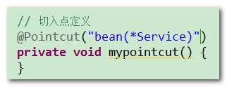 

```xml
// 切入点定义
@Pointcut("bean(*Service)")
private void mypointcut() {
}
```

其它Advice方法，使用切点，类似方法调用 

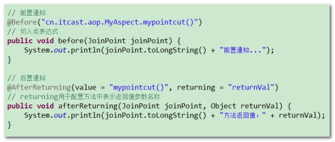 

```java
package cn.itcast.a_aspect;

import org.aspectj.lang.JoinPoint;
import org.aspectj.lang.annotation.*;
import org.springframework.stereotype.Component;

// 切面类
@Component("myAspectJ")
@Aspect
// @Aspect 说明这个类是切面类,里面包含增强方法
public class MyAspectJ {

    @Pointcut("bean(*Service)")
    private void myPointCut() {
    }

    // 前置通知
    @Before("cn.itcast.a_aspect.MyAspectJ.myPointCut()")
    public void before01(JoinPoint joinPoint) {
        System.out.println("--------------------- 前置通知: 开启事务 ... ..." );
    }


    // 后置增强
    @AfterReturning(value = "myPointCut()", returning = "returnObject")
    public void afterRegurning(JoinPoint joinPoint, Object returnObject) {
        System.out.println("--------------------- 后置通知: 提交事务 ... ..." );
    }

    // 异常通知
    @AfterThrowing(value = "myPointCut()", throwing = "ex")
    public void afterThrowing(JoinPoint joinPoint, Throwable ex) {
        System.out.println("--------------------- 异常通知: 回滚事务 ... ..." );
    }

    // 最终通知
    @After("myPointCut()")
    public void after(JoinPoint joinPoint) {
        System.out.println("--------------------- 最终通知: 释放资源 ... ..." );
    }

}
```


扩展：在开发中允许一个通知中引入多个切点 

@Before(“mypointcut1()&&mypointcut2()”) ---- 通知满足两个切点表达式

@Before(“mypointcut1()|| mypointcut2()”) ----- 只需要满足其中一个表达式即可 

 

AspectJ注解 

@Aspect 切面

@Before @AfterReturning @Around @AfterThrowing @After 通知 

@Pointcut 切入点

 

面试：aspectj、aspect、advisor、advice 有什么区别 ？

AspectJ 第三方AOP框架 

Aspect 切面，由多个切入点和多个通知组成

Advisor 切面，由一个切入点和一个通知组成

Advice 通知 

 

**核心**

1、 传统SpringAOP 编程和配置 （了解，能看懂，会配置）

2、 AspectJ XML 编程和配置 （重点）

3、 AspectJ注解 编程和配置 （重点）


 

 