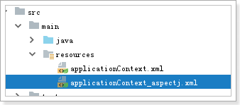

# 1 代理套路

```
1 目标类
2 增强类(代理)
3 建立目标类和增强类的关系
4 测试
```

# 2 jdk的动态代理

1 目标类

```java
package cn.itcast.a_proxy;

public interface ProductService {
    public void add();
    public void edit();
    public void del();
    public void query();
}
```

```java
package cn.itcast.a_proxy;

public class ProductServiceImpl implements ProductService {
    @Override
    public void add() {
        System.out.println("1.添加商品");
    }

    @Override
    public void edit() {
        System.out.println("2.修改商品");
    }

    @Override
    public void del() {
        System.out.println("3.删除商品");
    }

    @Override
    public void query() {
        System.out.println("4.查询商品");
    }
}
```

2 增强类(代理)

```java
package cn.itcast.a_proxy;

import java.lang.reflect.InvocationHandler;
import java.lang.reflect.Method;
import java.lang.reflect.Proxy;

public class JDKProxyFactory {
    // 指定对谁进行增强(目标类)
    private Object target;

    public JDKProxyFactory(Object target) {
        this.target = target;
    }

    // 创建增强功能
    public Object creatProxyObj() {
        // 第一个参数: 类加载器
        // 第二个参数: 目标类的接口
        // 第三个参数: 回调函数, 增强的代码
        return Proxy.newProxyInstance(target.getClass().getClassLoader(),
                target.getClass().getInterfaces(),
                new InvocationHandler() {
                    // method : 反射的方法对象
                    // args : 方法中的参数
                    @Override
                    public Object invoke(Object proxy, Method method, Object[] args) throws Throwable {
                        System.out.println("jdk proxy 记录日志: " + method.getName() + " 方法执行了!"); // 增强代码
                        return method.invoke(target, args); // 业务代码: 通过反射调用
                    }
                });
    }
}
```

3 建立目标类和增强类的关系

4 测试

```java
package cn.itcast.a_proxy;

import org.junit.Test;
import org.junit.runner.RunWith;
import org.springframework.beans.factory.annotation.Value;
import org.springframework.test.context.ContextConfiguration;
import org.springframework.test.context.junit4.SpringJUnit4ClassRunner;

@RunWith(SpringJUnit4ClassRunner.class)
@ContextConfiguration(locations = "classpath:applicationContext.xml")
public class SpringTest {

    @Value("#{productService}")
    private ProductService productService;

    @Value("#{customerService}")
    private CustomerService customerService;

    @Test
    public void demo01() {
        productService.add();
        productService.edit();
        productService.del();
        productService.query();
    }

    @Test
    public void demo02() {
        // jdk的动态代理要求: 必须有接口
        // 1 实例化 目标对象(spring已经完成)
        // 2 使用jdk动态代理增强
        JDKProxyFactory jdkProxyFactory = new JDKProxyFactory(productService);
        ProductService proxyObjec = (ProductService) jdkProxyFactory.creatProxyObj();

        // 3 测试
        proxyObjec.add();
        proxyObjec.edit();
        proxyObjec.del();
        proxyObjec.query();
    }

}
```

缺点: 目标类必须有接口

# 3 cglib的动态代理

## 3.1 目标类

```java
package cn.itcast.a_proxy;

public class CustomerService {
    public void add() {
        System.out.println("5 添加客户................");
    }

    public void edit() {
        System.out.println("6 修改客户................");
    }

    public void del() {
        System.out.println("7 删除客户................");
    }

    public void query() {
        System.out.println("8 查询客户................");
    }
}
```

## 3.2 增强类

```java
package cn.itcast.a_proxy;

import org.springframework.cglib.proxy.Enhancer;
import org.springframework.cglib.proxy.MethodInterceptor;
import org.springframework.cglib.proxy.MethodProxy;

import java.lang.reflect.Method;

public class CglibProxyFactory {
    // 目标类
    private Object target;

    public CglibProxyFactory(Object target) {
        this.target = target;
    }

    // 操作步骤==>记住==>记不住==>多敲
    public Object createProxyObject() {
        // 1 增强类
        Enhancer enhancer = new Enhancer();
        // 2 确定给哪个目标类增强
        enhancer.setSuperclass(target.getClass());
        // 3 书写增强代码
        enhancer.setCallback(new MethodInterceptor() {
            @Override
            public Object intercept(Object proxy, Method method, Object[] args, MethodProxy methodProxy) throws Throwable {
                System.out.println("cglib 记录日志: " + method.getName() + " 方法执行了" ); // 增强代码
                return methodProxy.invokeSuper(proxy, args); // 业务代码
            }
        });
        // 4 返回结果
        return enhancer.create();
    }
}
```

## 3.3 建立关系 测试

```java
package cn.itcast.a_proxy;

import org.junit.Test;
import org.junit.runner.RunWith;
import org.springframework.beans.factory.annotation.Value;
import org.springframework.test.context.ContextConfiguration;
import org.springframework.test.context.junit4.SpringJUnit4ClassRunner;

@RunWith(SpringJUnit4ClassRunner.class)
@ContextConfiguration(locations = "classpath:applicationContext.xml")
public class SpringTest {

    @Value("#{customerService}")
    private CustomerService customerService;

    @Test
    public void demo03() {
        // 1 实例化 目标对象(spring已经完成)
        // 2 使用jdk动态代理增强
        CglibProxyFactory cglibProxyFactory = new CglibProxyFactory(customerService);
        CustomerService proxyObject = (CustomerService) cglibProxyFactory.createProxyObject();

        // 3 测试
        proxyObject.add();
        proxyObject.edit();
        proxyObject.del();
        proxyObject.query();
    }
}
```

# 4 面向切面(重点)

## 4.1 给转账增加事务

### 4.1.1 目标类

```java
package cn.itcast.c_aspectj;

public class AccountDao {

    // 出账: 减钱
    public void out(String outAccount, double money){
        System.out.println(outAccount + " 出账 " + money);
    }
    // 入账: 加钱
    public void in(String stringAccount, double money){
        System.out.println(stringAccount + " 入账 " + money);
    }
}
```

```java
package cn.itcast.c_aspectj;

// 目标类
public class AccountService {

    private AccountDao accountDao;

    public void setAccountDao(AccountDao accountDao) {
        this.accountDao = accountDao;
    }

    // 转账
    public void transfer(String outAccount, String inAccount, double money) {
        // 出账
        accountDao.out(outAccount, money);

        // 模拟断电等异常操作
        int j = 1/0;

        // 入账
        accountDao.in(inAccount, money);
    }
}
```

### 4.1.2 增强类

```java
package cn.itcast.c_aspectj;

import org.aspectj.lang.ProceedingJoinPoint;

// 增强类
public class MyAspectj {

    public Object around(ProceedingJoinPoint joinPoint) {
        Object returnResult = null;
        try {
            // 1 开启事务
            System.out.println("1 开启事务----------------------------------");
            // 2 执行一组sql语句
            returnResult = joinPoint.proceed(); // 执行业务方法
            // 3.1 一切正常, 提交事务
            System.out.println("3.1 一切正常, 提交事务----------------------------------");
        } catch (Throwable throwable) {
            throwable.printStackTrace();
            // 3.2 出现问题, 回滚事务
            System.out.println("3.2 出现问题, 回滚事务----------------------------------");
        } finally {
            // 4 释放资源
            System.out.println("4 释放资源----------------------------------");
        }
        return returnResult;
    }
}
```

### 4.1.3 建立关系



```xml
<?xml version="1.0" encoding="UTF-8"?>
<beans xmlns="http://www.springframework.org/schema/beans"
       xmlns:xsi="http://www.w3.org/2001/XMLSchema-instance" xmlns:aop="http://www.springframework.org/schema/aop"
       xsi:schemaLocation="http://www.springframework.org/schema/beans http://www.springframework.org/schema/beans/spring-beans.xsd http://www.springframework.org/schema/aop http://www.springframework.org/schema/aop/spring-aop.xsd">
    <!--1 配置目标类-->
    <bean id="accountDao" class="cn.itcast.c_aspectj.AccountDao"/>

    <bean id="accountService" class="cn.itcast.c_aspectj.AccountService">
        <property name="accountDao" ref="accountDao"/>
    </bean>

    <!--2 配置增强类-->
    <bean id="myAspectj" class="cn.itcast.c_aspectj.MyAspectj"/>

    <!--3 建立目标类和增强类的关系-->
    <aop:config proxy-target-class="false">
        <aop:pointcut id="myPointcut" expression="bean(*Service)"/>

        <aop:aspect ref="myAspectj">
            <aop:around method="around" pointcut-ref="myPointcut"/>
        </aop:aspect>
    </aop:config>
</beans>
```

### 4.1.4 测试

```java
package cn.itcast.c_aspectj;

import org.junit.Test;
import org.junit.runner.RunWith;
import org.springframework.beans.factory.annotation.Value;
import org.springframework.test.context.ContextConfiguration;
import org.springframework.test.context.junit4.SpringJUnit4ClassRunner;

@RunWith(SpringJUnit4ClassRunner.class)
@ContextConfiguration(locations = "classpath:applicationContext_aspectj.xml")
public class SpringTest {

    @Value("#{accountService}")
    private AccountService accountService;

    @Test
    public void demo01() {
        accountService.transfer("刘德华", "柳岩", 100);
    }

}
```

## 4.2 其他通知

### 4.2.1 目标类(同上)

### 4.2.2 增强类

```java
package cn.itcast.c_aspectj;

import org.aspectj.lang.JoinPoint;
import org.aspectj.lang.ProceedingJoinPoint;

// 增强类
public class MyAspectj {

    public Object around(ProceedingJoinPoint joinPoint) {
        Object returnResult = null;
        try {
            // 1 开启事务
            System.out.println("1 开启事务----------------------------------");
            // 2 执行一组sql语句
            returnResult = joinPoint.proceed(); // 执行业务方法
            // 3.1 一切正常, 提交事务
            System.out.println("3.1 一切正常, 提交事务----------------------------------");
        } catch (Throwable throwable) {
            throwable.printStackTrace();
            // 3.2 出现问题, 回滚事务
            System.out.println("3.2 出现问题, 回滚事务----------------------------------");
        } finally {
            // 4 释放资源
            System.out.println("4 释放资源----------------------------------");
        }
        return returnResult;
    }

    // 前置通知
    public void before01(JoinPoint joinPoint) {
        System.out.println("1 前置通知: 开启事务 ************************************************* ");
    }

    // 后置通知
    public void afterReturning(JoinPoint joinPoint, Object returnResult) {
        System.out.println("3.1 后置通知: 提交事务 ************************************************* returnResult=" + returnResult);
    }

    // 异常通知
    public void afterThrowing(JoinPoint joinPoint, Exception ex) {
        System.out.println("3.2 异常通知,回滚事务 ************************************************* 异常原因:" + ex.getMessage());
    }

    // 最终通知
    public void after(JoinPoint joinpoint) {
        System.out.println("4 释放资源 ************************************************* ");
    }
}
```

### 4.2.3 建立关系

```xml
<?xml version="1.0" encoding="UTF-8"?>
<beans xmlns="http://www.springframework.org/schema/beans"
       xmlns:xsi="http://www.w3.org/2001/XMLSchema-instance" xmlns:aop="http://www.springframework.org/schema/aop"
       xsi:schemaLocation="http://www.springframework.org/schema/beans http://www.springframework.org/schema/beans/spring-beans.xsd http://www.springframework.org/schema/aop http://www.springframework.org/schema/aop/spring-aop.xsd">
    <!--1 配置目标类-->
    <bean id="accountDao" class="cn.itcast.c_aspectj.AccountDao"/>

    <bean id="accountService" class="cn.itcast.c_aspectj.AccountService">
        <property name="accountDao" ref="accountDao"/>
    </bean>

    <!--2 配置增强类-->
    <bean id="myAspectj" class="cn.itcast.c_aspectj.MyAspectj"/>

    <!--3 建立目标类和增强类的关系-->
    <aop:config proxy-target-class="false">
        <aop:pointcut id="myPointcut" expression="bean(*Service)"/>

        <aop:aspect ref="myAspectj">
            <!--环绕通知: 在业务代码前后都进行增强-->
            <!--<aop:around method="around" pointcut-ref="myPointcut"/>-->
            
            <!--前置通知/增强: 执行业务代码前 进行增强 -->
            <aop:before method="before01" pointcut-ref="myPointcut"/>
            <!--后置通知/增强: 执行业务代码后 进行增强 -->
            <aop:after-returning method="afterReturning" pointcut-ref="myPointcut" returning="returnResult"/>
            <!--异常通知: 出现异常后执行-->
            <aop:after-throwing method="afterThrowing" pointcut-ref="myPointcut" throwing="ex"/>
            <!--最终通知: 最后一定会(无论是否出现异常都会)执行的代码-->
            <aop:after method="after" pointcut-ref="myPointcut" />
        </aop:aspect>
    </aop:config>
</beans>
```

### 4.2.4 测试

```xml
package cn.itcast.c_aspectj;

import org.junit.Test;
import org.junit.runner.RunWith;
import org.springframework.beans.factory.annotation.Value;
import org.springframework.test.context.ContextConfiguration;
import org.springframework.test.context.junit4.SpringJUnit4ClassRunner;

@RunWith(SpringJUnit4ClassRunner.class)
@ContextConfiguration(locations = "classpath:applicationContext_aspectj.xml")
public class SpringTest {

    @Value("#{accountService}")
    private AccountService accountService;

    @Test
    public void demo01() {
        accountService.transfer("刘德华", "柳岩", 100);
    }

}
```

