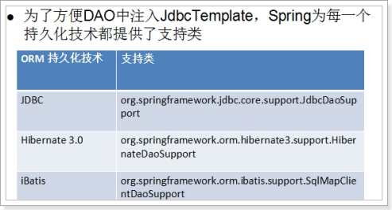
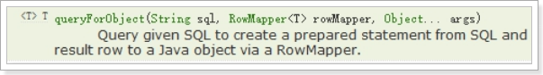
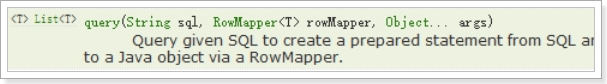
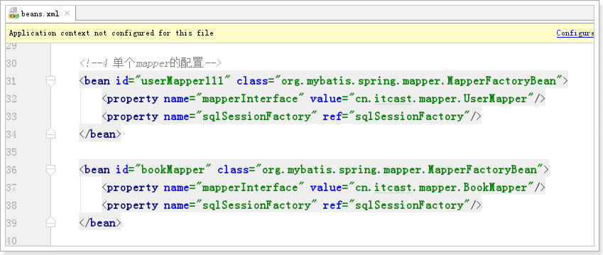

# **Spring 框架第三天 事务管理和框架整合** 

今天内容安排：

1. jdbcTemplate
2. Spring事务管理 相关知识

		事务管理三个高级接口 

		事务传播行为 （面试重点 ）

3.  转账案例，spring进行声明式事务管理 

		事务管理原理

		如何配置

4. spring整合mybatis

 

# 1.  JdbcTemplate 使用入门

对应规范文档 14节 


JDBC编程 --- Spring 提供 JdbcTemplate 简化开发

Hibernate 编程 ---- Spring提供 HibernateTemplate 简化开发 （Spring整合hibernate时）

## 1.1.  **JdbcTemplate快速入门案例**

JdbcTemplate用法和 Apache DbUtils 非常类似 ！！！ 

 

### 1.1.1 第一步：准备数据库环境 

Mysql数据库。建立spring_day03 数据库

 ```
create database spring_day03;
 ```

### 1.1.2 第二步：新建web项目 spring_day02_jdbctemplate ，导入jdbc开发jar包 

```xml
<?xml version="1.0" encoding="UTF-8"?>
<project xmlns="http://maven.apache.org/POM/4.0.0"
         xmlns:xsi="http://www.w3.org/2001/XMLSchema-instance"
         xsi:schemaLocation="http://maven.apache.org/POM/4.0.0 http://maven.apache.org/xsd/maven-4.0.0.xsd">
    <parent>
        <artifactId>itcast_parent</artifactId>
        <groupId>cn.itcast</groupId>
        <version>1.0-SNAPSHOT</version>
        <relativePath>../itcast_parent/pom.xml</relativePath>
    </parent>
    <modelVersion>4.0.0</modelVersion>

    <artifactId>spring_day03_01_jdbc</artifactId>
    <packaging>jar</packaging>
    <dependencies>
        <!--测试-->
        <dependency>
            <groupId>junit</groupId>
            <artifactId>junit</artifactId>
        </dependency>
        <dependency>
            <groupId>org.springframework</groupId>
            <artifactId>spring-test</artifactId>
            <version>4.1.3.RELEASE</version>
        </dependency>
        <!--mysql-->
        <dependency>
            <groupId>mysql</groupId>
            <artifactId>mysql-connector-java</artifactId>
        </dependency>
        <!--spring-->
        <dependency>
            <groupId>org.springframework</groupId>
            <artifactId>spring-context</artifactId>
        </dependency>
        <dependency>
            <groupId>org.springframework</groupId>
            <artifactId>spring-aspects</artifactId>
        </dependency>
        <dependency>
            <groupId>org.springframework</groupId>
            <artifactId>spring-jdbc</artifactId>
        </dependency>
    </dependencies>
</project>
```

### 1.1.3 第三步： 在程序中构造连接池，构造JdbcTemplate 操作数据库 

```java
package cn.itcast.a_quickstart;

import org.junit.Test;
import org.springframework.jdbc.core.JdbcTemplate;
import org.springframework.jdbc.datasource.DriverManagerDataSource;

public class HelloTest {
    @Test
    public void demo01() {
        // 创建连接池
        DriverManagerDataSource dataSource = new DriverManagerDataSource();
        dataSource.setDriverClassName("com.mysql.jdbc.Driver");
        dataSource.setUrl("jdbc:mysql://localhost:3306/spring_day03");
        dataSource.setUsername("root");
        dataSource.setPassword("123");

        // 创建jdbc模板
        JdbcTemplate jdbcTemplate = new JdbcTemplate(dataSource);

        // 执行sql
        jdbcTemplate.execute("create table user(id int primary key auto_increment, name varchar(50))");
    }
}

```

### 1.1.4 创建jdbc模板交给spring管理

beans.xml

```xml
<?xml version="1.0" encoding="UTF-8"?>
<beans xmlns="http://www.springframework.org/schema/beans"
       xmlns:xsi="http://www.w3.org/2001/XMLSchema-instance"
       xsi:schemaLocation="http://www.springframework.org/schema/beans http://www.springframework.org/schema/beans/spring-beans.xsd">
    <!--1 连接池-->
    <bean class="org.springframework.jdbc.datasource.DriverManagerDataSource" id="driverManagerDataSource">
        <property name="driverClassName" value="com.mysql.jdbc.Driver"/>
        <property name="url" value="jdbc:mysql://localhost:3306/spring_day03"/>
        <property name="username" value="root"/>
        <property name="password" value="123"/>
    </bean>

    <!--2 jdbc 模板-->
    <bean id="jdbcTemplate" class="org.springframework.jdbc.core.JdbcTemplate">
        <property name="dataSource" ref="driverManagerDataSource"/>
    </bean>
</beans>
```


简化测试用例 

```java
package cn.itcast.a_quickstart;

import org.junit.Test;
import org.junit.runner.RunWith;
import org.springframework.beans.factory.annotation.Value;
import org.springframework.jdbc.core.JdbcTemplate;
import org.springframework.test.context.ContextConfiguration;
import org.springframework.test.context.junit4.SpringJUnit4ClassRunner;

@RunWith(SpringJUnit4ClassRunner.class)
@ContextConfiguration(locations = "classpath:beans.xml")
public class JDBCTemplateTest {

    @Value("#{jdbcTemplate}")
    private JdbcTemplate jdbcTemplate;

    @Test
    public void demo01() {
        jdbcTemplate.update("create table person(id int primary key auto_increment, name varchar(50))");
    }

}
```


## 1.2.  **各种连接池配置使用**

### 1.2.1 使用Apache 提供 commons-dbcp数据源 

**pom.xml **

```xml
<dependency>
    <groupId>commons-dbcp</groupId>
    <artifactId>commons-dbcp</artifactId>
    <version>1.4</version>
</dependency>
```


**beans.xml**

```xml
    <!--1.2 dbcp连接池-->
    <bean id="dataSource02" class="org.apache.commons.dbcp.BasicDataSource">
        <property name="driverClassName" value="com.mysql.jdbc.Driver"/>
        <property name="url" value="jdbc:mysql://localhost:3306/spring_day03"/>
        <property name="username" value="root"/>
        <property name="password" value="123"/>
    </bean>


    <!--2 jdbc 模板-->
    <bean id="jdbcTemplate" class="org.springframework.jdbc.core.JdbcTemplate">
        <property name="dataSource" ref="dataSource02"/>
    </bean>
```


### 1.2.2 使用 C3P0连接池 

**pom.xml**

```xml
<dependency>
    <groupId>c3p0</groupId>
    <artifactId>c3p0</artifactId>
    <version>0.9.1.2</version>
</dependency>
```

**beans.xml**

```xml
<!--1.3 c3p0连接池-->
<bean id="dataSource03" class="com.mchange.v2.c3p0.ComboPooledDataSource">
    <property name="driverClass" value="com.mysql.jdbc.Driver"/>
    <property name="jdbcUrl" value="jdbc:mysql://localhost:3306/spring_day03"/>
    <property name="user" value="root"/>
    <property name="password" value="123"/>
</bean>


<!--2 jdbc 模板-->
<bean id="jdbcTemplate" class="org.springframework.jdbc.core.JdbcTemplate">
    <property name="dataSource" ref="dataSource03"/>
</bean>
```


## 1.3.  **外部属性文件的使用**

在实际开发中，数据源连接参数可能经常改变，修改xml复杂度比修改properties文件高！

### 1.3.1  复制jdbc.properties文件到resource目录下 


```properties
jdbc.driverClassName=com.mysql.jdbc.Driver
jdbc.url=jdbc:mysql://127.0.0.1:3306/spring_day03?useUnicode=true&characterEncoding=utf8&autoReconnect=true&allowMultiQueries=true
jdbc.username=root
jdbc.password=123
```

### 1.3.2 在spring配置文件中，通过<context:properties-placeholder> 引用外部属性文件 

```xml
<?xml version="1.0" encoding="UTF-8"?>
<beans xmlns="http://www.springframework.org/schema/beans"
       xmlns:context="http://www.springframework.org/schema/context"
       xmlns:xsi="http://www.w3.org/2001/XMLSchema-instance"
       xsi:schemaLocation="
                        http://www.springframework.org/schema/beans
                        http://www.springframework.org/schema/beans/spring-beans.xsd
                        http://www.springframework.org/schema/context
                        http://www.springframework.org/schema/context/spring-context.xsd
">
    <!--3 关联外部的数据库属性文件-->
    <context:property-placeholder location="classpath:jdbc.properties"/>

    <!--1.3 c3p0连接池-->
    <bean id="dataSource03" class="com.mchange.v2.c3p0.ComboPooledDataSource">
        <property name="driverClass" value="${jdbc.driverClassName}"/>
        <property name="jdbcUrl" value="${jdbc.url}"/>
        <property name="user" value="${jdbc.username}"/>
        <property name="password" value="${jdbc.password}"/>
    </bean>


    <!--2 jdbc 模板-->
    <bean id="jdbcTemplate" class="org.springframework.jdbc.core.JdbcTemplate">
        <property name="dataSource" ref="dataSource03"/>
    </bean>
</beans>
```


## 1.4.  使用JdbcTemplate编写DAO实现增删改

### 1.4.1 第一步：准备数据表 book 

```sql
create table book(
	id int primary key auto_increment,
	name varchar(50),
	price double
)
```

### 1.4.2 第二步：编写Book实体类 

```java
package cn.itcast.spring.c_dao;

public class Book {
	private int id;
	private String name;
	private double price;

	// get 和 set 和 toString 方法
}

```


### 1.4.3 第三步：编写BookDAO ，使用JdbcTemplate实现 CRUD 

```java
package cn.itcast.b_dao;

import cn.itcast.domain.Book;
import org.springframework.jdbc.core.JdbcTemplate;

public class BookDao {

    private JdbcTemplate jdbcTemplate;

    public void setJdbcTemplate(JdbcTemplate jdbcTemplate) {
        this.jdbcTemplate = jdbcTemplate;
    }

    // 保存书籍
    public void save(Book book) {
        String sql = "insert into book(id, name, price) values(null, ?, ?)";
        Object[] paramArr = {book.getName(), book.getPrice()};
        jdbcTemplate.update(sql, paramArr);
    }

    // 修改数据
    public void update(Book book) {
        String sql = "update book set name=?, price=? where id=?";
        Object[] paramArr = {book.getName(), book.getPrice(), book.getId()};
        jdbcTemplate.update(sql, paramArr);
    }

    // 删除数据
    public void delById(int id) {
        String sql = "delete from book where id=?";
        jdbcTemplate.update(sql, id);
    }

}
```


**在spring的配置文件中, 将jdbc模板注入 BookDao**

```xml
<?xml version="1.0" encoding="UTF-8"?>
<beans xmlns="http://www.springframework.org/schema/beans"
       xmlns:context="http://www.springframework.org/schema/context"
       xmlns:xsi="http://www.w3.org/2001/XMLSchema-instance"
       xsi:schemaLocation="
                        http://www.springframework.org/schema/beans
                        http://www.springframework.org/schema/beans/spring-beans.xsd
                        http://www.springframework.org/schema/context
                        http://www.springframework.org/schema/context/spring-context.xsd
">
    <!--3 关联外部的数据库属性文件-->
    <context:property-placeholder location="classpath:jdbc.properties"/>

    <!--1.3 c3p0连接池-->
    <bean id="dataSource03" class="com.mchange.v2.c3p0.ComboPooledDataSource">
        <property name="driverClass" value="${jdbc.driverClassName}"/>
        <property name="jdbcUrl" value="${jdbc.url}"/>
        <property name="user" value="${jdbc.username}"/>
        <property name="password" value="${jdbc.password}"/>
    </bean>


    <!--2 jdbc 模板-->
    <bean id="jdbcTemplate" class="org.springframework.jdbc.core.JdbcTemplate">
        <property name="dataSource" ref="dataSource03"/>
    </bean>

    <!--4 配置dao-->
    <bean id="bookDao" class="cn.itcast.b_dao.BookDao">
        <property name="jdbcTemplate" ref="jdbcTemplate"/>
    </bean>
</beans>
```

**测试**

```java
package cn.itcast.b_dao;

import cn.itcast.domain.Book;
import org.junit.Test;
import org.junit.runner.RunWith;
import org.springframework.beans.factory.annotation.Value;
import org.springframework.test.context.ContextConfiguration;
import org.springframework.test.context.junit4.SpringJUnit4ClassRunner;

@RunWith(SpringJUnit4ClassRunner.class)
@ContextConfiguration(locations = "classpath:beans.xml")
public class BookDaoTest {

    @Value("#{bookDao}")
    private BookDao bookDao;

    @Test
    public void save() throws Exception {
        Book book = new Book();
        book.setName("如来神掌");
        book.setPrice(9.9);

        bookDao.save(book);
    }

    @Test
    public void update() throws Exception {
        Book book = new Book();
        book.setId(1);
        book.setName("九阳神功");
        book.setPrice(3.9);
        bookDao.update(book);
    }

    @Test
    public void delById() throws Exception {
        bookDao.delById(1);
    }

}
```

### 1.4.4 简化dao注入JdbcTemplate模板 



**为什么继承JdbcDaoSupport: 简化**


**Dao操作**

```java
package cn.itcast.b_dao;

import cn.itcast.domain.Book;
import org.springframework.jdbc.core.support.JdbcDaoSupport;

public class BookDao02 extends JdbcDaoSupport {

    // 保存书籍
    public void save(Book book) {
        String sql = "insert into book(id, name, price) values(null, ?, ?)";
        Object[] paramArr = {book.getName(), book.getPrice()};
        super.getJdbcTemplate().update(sql, paramArr);
    }

    // 修改数据
    public void update(Book book) {
        String sql = "update book set name=?, price=? where id=?";
        Object[] paramArr = {book.getName(), book.getPrice(), book.getId()};
        super.getJdbcTemplate().update(sql, paramArr);
    }

    // 删除数据
    public void delById(int id) {
        String sql = "delete from book where id=?";
        super.getJdbcTemplate().update(sql, id);
    }

}
```

**beans.xml**

```xml
<?xml version="1.0" encoding="UTF-8"?>
<beans xmlns="http://www.springframework.org/schema/beans"
       xmlns:context="http://www.springframework.org/schema/context"
       xmlns:xsi="http://www.w3.org/2001/XMLSchema-instance"
       xsi:schemaLocation="
                        http://www.springframework.org/schema/beans
                        http://www.springframework.org/schema/beans/spring-beans.xsd
                        http://www.springframework.org/schema/context
                        http://www.springframework.org/schema/context/spring-context.xsd
">
    <!--3 关联外部的数据库属性文件-->
    <context:property-placeholder location="classpath:jdbc.properties"/>

    <!--1 连接池-->
    <!--1.3 c3p0连接池-->
    <bean id="dataSource03" class="com.mchange.v2.c3p0.ComboPooledDataSource">
        <property name="driverClass" value="${jdbc.driverClassName}"/>
        <property name="jdbcUrl" value="${jdbc.url}"/>
        <property name="user" value="${jdbc.username}"/>
        <property name="password" value="${jdbc.password}"/>
    </bean>

    <!--4 配置dao-->
    <bean id="bookDao02" class="cn.itcast.b_dao.BookDao02">
        <property name="dataSource" ref="dataSource03"/>
    </bean>
</beans>
```

**测试**

```java
package cn.itcast.b_dao;

import cn.itcast.domain.Book;
import org.junit.Test;
import org.junit.runner.RunWith;
import org.springframework.beans.factory.annotation.Value;
import org.springframework.test.context.ContextConfiguration;
import org.springframework.test.context.junit4.SpringJUnit4ClassRunner;

@RunWith(SpringJUnit4ClassRunner.class)
@ContextConfiguration(locations = "classpath:beans.xml")
public class BookDao02Test {
    @Value("#{bookDao02}")
    private BookDao02 bookDao;

    @Test
    public void save() throws Exception {
        Book book = new Book();
        book.setName("辟邪剑谱");
        book.setPrice(9.9);

        bookDao.save(book);
    }

    @Test
    public void update() throws Exception {
        Book book = new Book();
        book.setId(2);
        book.setName("九阴真经");
        book.setPrice(3.9);
        bookDao.update(book);
    }

    @Test
    public void delById() throws Exception {
        bookDao.delById(2);
    }

}
```

## 1.5 使用JcbcTemplate编写 查询 

### 1.5.1  简单类型返回值查询  

```
需求1: 根据编号查询书名
需求2: 查询总记录数
```


```java
package cn.itcast.b_dao;

import cn.itcast.domain.Book;
import org.springframework.jdbc.core.support.JdbcDaoSupport;

public class BookDao02 extends JdbcDaoSupport {

    // 查询书名
    public String findNameById(int id){
        String sql = "select name from book where id=?";
        String bookname = super.getJdbcTemplate().queryForObject(sql, String.class, id);
        return bookname;
    }

    // 查询总记录数
    public int findCount() {
        String sql = "select count(*) from book";
        Integer count = super.getJdbcTemplate().queryForObject(sql, Integer.class);
        return count;
    }

}
```


 ```java
package cn.itcast.b_dao;

import cn.itcast.domain.Book;
import org.junit.Test;
import org.junit.runner.RunWith;
import org.springframework.beans.factory.annotation.Value;
import org.springframework.test.context.ContextConfiguration;
import org.springframework.test.context.junit4.SpringJUnit4ClassRunner;

@RunWith(SpringJUnit4ClassRunner.class)
@ContextConfiguration(locations = "classpath:beans.xml")
public class BookDao02Test {
    @Value("#{bookDao02}")
    private BookDao02 bookDao;

    @Test
    public void findNameById() {
        String name = bookDao.findNameById(3);
        System.out.println(name);
    }

    @Test
    public void findCount() {
        int count = bookDao.findCount();
        System.out.println(count);
    }

}
 ```

### 1.5.2 复杂类型返回值查询  

```
需求1: 根据编号查询 book信息
需求2: 查询所有book集合
```

**查询单个对象**

  

**查询对象列表 List**

  

**什么是RowMapper? **

	将查询到ResultSet 结果集 中一行记录，映射到一个java对象的代码 
	
	Spring 提供 ParameterizedBeanPropertyRowMapper 完成当表中列名和属性名一致，底层使用反射代码自动完成封装 

```java
// 查询某本书信息
public Book findBookById(int id) {
    String sql = "select * from book where id=?";
    Book book = super.getJdbcTemplate().queryForObject(sql,  ParameterizedBeanPropertyRowMapper.newInstance(Book.class), id);
    return book;
}

// 查询所有书集合
public List<Book> findAll() {
    String sql = "select * from book";
    List<Book> bookList = super.getJdbcTemplate().query(sql, ParameterizedBeanPropertyRowMapper.newInstance(Book.class));
    return bookList;
}
```


如果表中列名和属性名不一致，必须自己实现RowMapper接口，完成手动对象属性封装映射 ！


# 2.  **Spring事务管理机制** 

目的: 将若干sql语句作为一个整体, 要么全成功,要么全失败

套路:

```
try{
    // 1 获取连接,开启事务
    // 2 执行一组sql语句
    // 3.1 如果没有问题 提交事务(生效)
}catch() {
    // 3.2 如果出现问题 回滚事务(撤销)
}finally {
    // 4 释放资源
}
```


## 2.1. **Spring事务管理三个高级接口** 

PlatformTransactionManager 平台相关事务管理器

TransactionDefinition 事务定义信息 （在使用spring管理事务，对事务管理配置信息 ）

TransactionStatus 事务运行状态 

### 2.1.1.  PlatformTransactionManager **平台事务管理器**

TransactionManager是整个spring事务管理核心对象，提供管理事务相关方法

 

 

项目开发时，使用不同持久层技术，就需要使用spring提供不同事务管理器 

l JDBC编程 --- 通过Connection进行事务管理 

开启事务 conn.setAutoCommit(false);

提交事务 conn.commit();

回滚事务 conn.rollback();、 conn.rollback(SavePoint);

Spring 提供 DataSourceTransactionManager 针对Connection进行事务管理 

 

Spring 提供 HibernateTransactionManager 针对 session进行事务管理 


### 2.1.2.  **TransactionDefinition 事务定义信息** 

TransactionDefinition 主要指 spring管理事务过程中，配置如何对事务进行管理 

（隔离级别、传播行为、超时时间、 是否只读）

 

l get Name 获取事务名称

l getIsolationLevel 获取事务隔离级别 

 

面试：

1、事务的四大特性？ ACID 原子性、一致性、隔离性 Isolation 、持久性 

2、事务隔离性引发数据库哪些问题： 脏读、不可重复读、幻读 

脏读：一个事务读取另一个事务 未提交的数据 ---- 非常严重安全问题 

不可重复读：一个事务读取另一个事务已经提交数据，先后读取两次，结果不一样（另一个事务进行update操作）

幻读：一个事务中先后读取两次，发现数据记录条数不一样（另一个事务进行insert操作 ）

3、 数据库为了解决 隔离性引发几种问题，提供四种隔离级别 read uncommitted 引发所有隔离问题、 read committed 阻止脏读发生、发生不可重复读和幻读、 repeatable read 阻止脏读、不可重复读发生，可能发生幻读、 serializable 阻止所有隔离问题 （不是所有数据库都支持四种隔离级别， oracle只支持 read committed、serializable ； mysql支持所有隔离级别 ）

DEFAULT 代表默认数据库隔离级别，oracle 默认级别 read committed、 mysql 默认级别 repeatable read

 

l getPropagationBehavior 获取事务的传播行为

什么是传播行为？ 

和隔离级别不同，不是数据库提供问题解决方案，而是spring针对实际开发中具体事务问题，引入事务解决方案，解决两个事务互相调用的问题 ！

 

 

Spring为了解决上面的问题，提供七种传播行为 

 

REQUIRED、SUPPORTS、MANDATORY：支持当前事务 （删除用户、删除订单）

REQUIRES_NEW、NOT_SUPPORTED、NEVER：不支持当前事务 （ATM取钱、打印凭条）

NESTED 嵌套事务，只对DataSourceTransactionManager 有效，底层原理SavePoint 

 

面试题：区分 REQUIRED、REQUIRES_NEW、NESTED ？

REQUIRED 两个操作 同一个事务 

REQUIRES_NEW 两个操作 ，创建两个不同事务

NESTED  一个事务，允许回滚到事务中保存点，继续执行 

 

l getTimeout 获取默认超时时间 

l isReadOnly 事务是否只读（如果事务只读，不能进行insert、update、delete ）

### 2.1.3.  **TransactionStatus 事务状态信息** 

指事务运行过程中，某个时间点事务状态信息 

 

 

小结： 

用户想使用spring进行事务管理 ，对事务管理进行配置（TransactionDefinition），选用针对持久层技术事务管理器 TransactionManager， TransactionManager根据TransactionDefinition 进行事务管理，在事务管理过程中通过 TransactionStatus获取当时事务状态 ！

## 2.2. **Spring事务管理两种方式** 

Spring 事务管理支持 编程式事务管理和声明式事务管理

1、 编程式 事务管理（了解），在需要事务管理目标代码中，添加事务管理的代码 （有代码侵入事务管理方式 ，现在使用的非常少 ）

在spring配置TransactionManager ，将transactionManager对象注入到 TransactionTemplate 对象中，将transactionTemplate 注入到目标程序中 

transactionTemplate.execute(new TransactionCallbackWithoutResult(){

doInTransaction(){

// 将需要事务管理代码，加在这里 

}

});

如果方法没有异常，事务提交，如果方法发生异常，事务回滚 

 

2、 声明式事务管理，底层使用AOP的环绕通知，没有任何代码侵入，现在开发中推荐使用 ！

 

## 2.3. **转账案例，引发事务管理问题** 

### 2.3.1 建立account数据表

```java
CREATE TABLE account (

  id int(11) NOT NULL AUTO_INCREMENT,

  name varchar(20) NOT NULL,

  money double DEFAULT NULL,

  PRIMARY KEY (id)

);

INSERT INTO account VALUES ('1', 'aaa', 1000);

INSERT INTO account VALUES ('2', 'bbb', 1000);

```


### 2.3.2  新建 spring_day03_transaction 项目，导包

```xml
<?xml version="1.0" encoding="UTF-8"?>
<project xmlns="http://maven.apache.org/POM/4.0.0"
         xmlns:xsi="http://www.w3.org/2001/XMLSchema-instance"
         xsi:schemaLocation="http://maven.apache.org/POM/4.0.0 http://maven.apache.org/xsd/maven-4.0.0.xsd">
    <parent>
        <artifactId>itcast_parent</artifactId>
        <groupId>cn.itcast</groupId>
        <version>1.0-SNAPSHOT</version>
        <relativePath>../itcast_parent/pom.xml</relativePath>
    </parent>
    <modelVersion>4.0.0</modelVersion>

    <artifactId>spring_day03_01_jdbc</artifactId>
    <packaging>jar</packaging>
    <dependencies>
        <!--测试-->
        <dependency>
            <groupId>junit</groupId>
            <artifactId>junit</artifactId>
        </dependency>
        <dependency>
            <groupId>org.springframework</groupId>
            <artifactId>spring-test</artifactId>
            <version>4.1.3.RELEASE</version>
        </dependency>
        <!--mysql-->
        <dependency>
            <groupId>mysql</groupId>
            <artifactId>mysql-connector-java</artifactId>
        </dependency>
        <!--spring-->
        <dependency>
            <groupId>org.springframework</groupId>
            <artifactId>spring-context</artifactId>
        </dependency>
        <dependency>
            <groupId>org.springframework</groupId>
            <artifactId>spring-aspects</artifactId>
        </dependency>
        <dependency>
            <groupId>org.springframework</groupId>
            <artifactId>spring-jdbc</artifactId>
        </dependency>
        <!--连接池-->
        <dependency>
            <groupId>commons-dbcp</groupId>
            <artifactId>commons-dbcp</artifactId>
            <version>1.4</version>
        </dependency>

        <dependency>
            <groupId>c3p0</groupId>
            <artifactId>c3p0</artifactId>
            <version>0.9.1.2</version>
        </dependency>
        <!--日志-->
        <dependency>
            <groupId>org.slf4j</groupId>
            <artifactId>slf4j-log4j12</artifactId>
        </dependency>
    </dependencies>
</project>
```

### 2.3.3 编写Service 和 DAO 

```java
package cn.itcast.c_transaction;

import org.springframework.jdbc.core.support.JdbcDaoSupport;

public class AccountDao extends JdbcDaoSupport {

    // 出账
    public void out(String outUser, double money) {
        String sql = "update account set money=money-? where name=?";
        super.getJdbcTemplate().update(sql,money, outUser);
    }

    // 入账
    public void in(String inUser, double money) {
        String sql = "update account set money=money+? where name=?";
        super.getJdbcTemplate().update(sql,money, inUser);
    }
}
```


```java
package cn.itcast.c_transaction;

public class AccountService {

    private AccountDao accountDao;

    public void setAccountDao(AccountDao accountDao) {
        this.accountDao = accountDao;
    }

    // 转账业务
    public void transfer(String outUser, String inUser, double money){
        // 出账
        accountDao.out(outUser, money);

        // 入账
        accountDao.in(inUser, money);
    }
}
```

 

### 2.3.4 将dao和service 配置到beans.xml

```xml
<?xml version="1.0" encoding="UTF-8"?>
<beans xmlns="http://www.springframework.org/schema/beans"
       xmlns:context="http://www.springframework.org/schema/context"
       xmlns:xsi="http://www.w3.org/2001/XMLSchema-instance"
       xsi:schemaLocation="
                        http://www.springframework.org/schema/beans
                        http://www.springframework.org/schema/beans/spring-beans.xsd
                        http://www.springframework.org/schema/context
                        http://www.springframework.org/schema/context/spring-context.xsd
">
    <!--3 关联外部的数据库属性文件-->
    <context:property-placeholder location="classpath:jdbc.properties"/>

    <!--1.3 c3p0连接池-->
    <bean id="dataSource03" class="com.mchange.v2.c3p0.ComboPooledDataSource">
        <property name="driverClass" value="${jdbc.driverClassName}"/>
        <property name="jdbcUrl" value="${jdbc.url}"/>
        <property name="user" value="${jdbc.username}"/>
        <property name="password" value="${jdbc.password}"/>
    </bean>

    <!--5 事务-->
    <bean id="accountDao" class="cn.itcast.c_transaction.AccountDao">
        <property name="dataSource" ref="dataSource03"/>
    </bean>

    <bean id="accountService" class="cn.itcast.c_transaction.AccountService">
        <property name="accountDao" ref="accountDao"/>
    </bean>
</beans>
```

### 2.3.5  编写测试用例 ，测试转账效果 

```java
package cn.itcast.c_transaction;

import org.junit.Test;
import org.junit.runner.RunWith;
import org.springframework.beans.factory.annotation.Value;
import org.springframework.test.context.ContextConfiguration;
import org.springframework.test.context.junit4.SpringJUnit4ClassRunner;

@RunWith(SpringJUnit4ClassRunner.class)
@ContextConfiguration(locations = "classpath:beans.xml")
public class AccountServiceTest {

    @Value("#{accountService}")
    private AccountService accountService;

    @Test
    public void transfer() throws Exception {
        accountService.transfer("aaa", "bbb", 100);
    }
}
```


### 2.3.6 修改Service代码 ，添加异常


有必要将转账的两个操作作为一个整体,要么全部成功, 要么全部失败, 事务专门解决此类问题.

## 2.4. **使用tx、aop配置进行声明式事务管理**

Spring声明式事务管理，底层依赖AOP的环绕通知实现 

回顾AOP编程步骤：

### 2.4.1  编写目标

转账Service 就是目标代码 

```xml
<bean id="accountService" class="cn.itcast.service.AccountService">
   <property name="accountDAO" ref="accountDAO" />
</bean>
```

### 2.4.2 编写Advice，添加事务管理逻辑

Spring API 内部，已经提供好了 事务管理Advice --------- TransactionInterceptor 

**public** **class** TransactionInterceptor **extends** TransactionAspectSupport **implements** MethodInterceptor, Serializable 

使用 tx 名称空间，可以简化 TransactionInterceptor 配置 

引入tx名称空间 

 ```xml
<?xml version="1.0" encoding="UTF-8"?>
<beans xmlns="http://www.springframework.org/schema/beans"
       xmlns:context="http://www.springframework.org/schema/context"
       xmlns:tx="http://www.springframework.org/schema/tx"
       xmlns:aop="http://www.springframework.org/schema/aop"
       xmlns:xsi="http://www.w3.org/2001/XMLSchema-instance"
       xsi:schemaLocation="
                        http://www.springframework.org/schema/beans
                        http://www.springframework.org/schema/beans/spring-beans.xsd
                        http://www.springframework.org/schema/context
                        http://www.springframework.org/schema/context/spring-context.xsd
                        http://www.springframework.org/schema/tx
                        http://www.springframework.org/schema/tx/spring-tx.xsd
                        http://www.springframework.org/schema/aop
                        http://www.springframework.org/schema/aop/spring-aop.xsd
">
 ```

配置事务Advice和管理属性 

```xml
<bean id="transactionManager"
      class="org.springframework.jdbc.datasource.DataSourceTransactionManager">
    <property name="dataSource" ref="dataSource03"/>
</bean>

<!--配置事务Advice和管理属性-->
<tx:advice id="txAdvice" transaction-manager="transactionManager">
    <tx:attributes>
        <!-- 配置事务管理属性，TransactionDefinition -->
        <!--
                name 方法名
                isolation 隔离级别 默认DEFAULT
                propagation 传播行为 默认 REQUIRED
                timeout 超时时间 默认 -1 不超时
                read-only 是否只读  默认false 不是只读
                rollback-for 配置一些异常，发生这些异常事务进行回滚
                no-rollback-for 配置一些异常，发生这些异常，将被忽略，事务仍然进行提交
             -->
        <tx:method name="transfer"/>
    </tx:attributes>
</tx:advice>
```


3、 配置切入点和切面 

 ```xml
<!--配置切入点和切面-->
<aop:config proxy-target-class="false">
    <aop:advisor advice-ref="txAdvice" pointcut="bean(*Service)"/>
</aop:config>
 ```


## 1.5. **使用@Transactional注解进行声明式事务管理**

第一步： 在需要进行事务管理 类或者方法上 添加@Transactional注解 

```java
// 业务方法 -- 转账
@Transactional
public void tranfter(String outAccount, String inAccount, double money) {
	// 转出
	accountDAO.out(outAccount, money);
	// 添加异常
	int d = 1 / 0;
	// 转入
	accountDAO.in(inAccount, money);
}
```


第二步： 在applicationContext.xml 开启注解驱动事务管理 

```xml
	<!-- 注解驱动事务管理 -->
	<tx:annotation-driven transaction-manager="transactionManager"/>
	
	<bean id="transactionManager" 
		class="org.springframework.jdbc.datasource.DataSourceTransactionManager">
		<property name="dataSource" ref="dataSource" />
	</bean>
```


注意：

1、注解进行事务管理，如果配置事务属性？ 


2、实际开发中，注解事务管理和XML事务管理 哪个用得更多？ 

XML 比较多 ，因为统一配置 集中管理 

```xml
<tx:advice id="txAdvice" transaction-manager="transactionManager">

		<tx:attributes>

			<tx:method name="save*" />

			<tx:method name="update*" />

			<tx:method name="delete*" />

			<tx:method name="query*" read-only=true />

		</tx:attributes>

</tx:advice>

```


# **3.**Spring与mybatis的整合

## **3.1** **整合的思路**

* SqlSessionFactory对象应该放到spring容器中作为单例存在。
* 传统dao的开发方式中，应该从spring容器中获得sqlsession对象。
* Mapper代理形式中，应该从spring容器中直接获得mapper的代理对象。
* 数据库的连接以及数据库连接池事务管理都交给spring容器来完成。

## **3.2** **整合需要的**jar包

要实现spring与mybatis的整合，就要首先导入相关的依赖jar包，如下：

* Spring的jar包
* Mybatis的jar包
* Spring与mybatis整合的jar包
* Mysql数据库驱动的jar包
* Druid数据库连接池的jar包
* Spring与Junit集成测试的jar包(spring-test、Junit)
* 日志的jar包

总的pom依赖如下：

## **3.3** **整合的步骤**

首先，我们先对整合的步骤做一个分析：

* 第一步：创建maven的web工程
* 第二步：导入整合需要的jar包
* 第三步：mybatis的核心配置文件：sqlMapConfig.xml
* 第四步：spring的核心配置文件：applicationContext.xml的配置
  * 加载db.properties属性配置文件
  * 配置Druid数据库连接池
  * 将SqlSessionFactory的单例对象，配置到spring容器中
  * 将mapper代理对象或者dao接口的实现类对象，配置到spring容器中
* 第五步：编写dao接口、dao实现类或者mapper接口、mapper映射文件
* 第六步：编写Junit测试代码测试


## 3.4 回顾mybatis

### 3.4.0 准备工作

```sql
create database spring_day03;

use spring_day03;

create table user(
	id int primary key auto_increment,
	name varchar(50),
	age int
);

insert into user(id, name, age) values(null, '赵六', 13);
insert into user(id, name, age) values(null, '李四', 13);
insert into user(id, name, age) values(null, '王五', 13);
```


### 3.4.1 创建maven工程


### 3.4.2 pom.xml

```xml
<?xml version="1.0" encoding="UTF-8"?>
<project xmlns="http://maven.apache.org/POM/4.0.0"
         xmlns:xsi="http://www.w3.org/2001/XMLSchema-instance"
         xsi:schemaLocation="http://maven.apache.org/POM/4.0.0 http://maven.apache.org/xsd/maven-4.0.0.xsd">
    <parent>
        <artifactId>itcast_parent</artifactId>
        <groupId>cn.itcast</groupId>
        <version>1.0-SNAPSHOT</version>
        <relativePath>../itcast_parent/pom.xml</relativePath>
    </parent>
    <modelVersion>4.0.0</modelVersion>

    <artifactId>spring_day03_spring_mabatis</artifactId>
    <packaging>jar</packaging>
    <dependencies>
        <!--junit-->
        <dependency>
            <groupId>junit</groupId>
            <artifactId>junit</artifactId>
        </dependency>
        <!--日志-->
        <dependency>
            <groupId>org.slf4j</groupId>
            <artifactId>slf4j-log4j12</artifactId>
        </dependency>
        <!--mysql-->
        <dependency>
            <groupId>mysql</groupId>
            <artifactId>mysql-connector-java</artifactId>
        </dependency>
        <!--mybatis-->
        <dependency>
            <groupId>org.mybatis</groupId>
            <artifactId>mybatis</artifactId>
        </dependency>
    </dependencies>
</project>
```

### 3.4.3 javabean: User.java


```java
package cn.itcast.domain;

public class User {
    private int id;
    private String name;
    private int age;

    public int getId() {
        return id;
    }

    public void setId(int id) {
        this.id = id;
    }

    public String getName() {
        return name;
    }

    public void setName(String name) {
        this.name = name;
    }

    public int getAge() {
        return age;
    }

    public void setAge(int age) {
        this.age = age;
    }

    @Override
    public String toString() {
        return "User{" +
                "id=" + id +
                ", name='" + name + '\'' +
                ", age=" + age +
                '}';
    }
}
```

### 3.4.4 接口 UserMapper


```java
package cn.itcast.mapper;

import cn.itcast.domain.User;

public interface UserMapper {
    // 根据编号查询用户信息
    public User queryUserById(int id);
}

```

### 3.4.5 mybatis-config.xml 


```xml
<?xml version="1.0" encoding="UTF-8" ?>
<!DOCTYPE configuration
        PUBLIC "-//mybatis.org//DTD Config 3.0//EN"
        "http://mybatis.org/dtd/mybatis-3-config.dtd">
<configuration>
    <!--关联外部配置文件-->
    <properties resource="jdbc.properties"/>

    <typeAliases>
        <package name="cn.itcast.domain"/>
    </typeAliases>

    <environments default="development">
        <environment id="development">
            <transactionManager type="JDBC"/>
            <dataSource type="POOLED">
                <property name="driver" value="${jdbc.driverClassName}"/>
                <property name="url" value="${jdbc.url}"/>
                <property name="username" value="${jdbc.username}"/>
                <property name="password" value="${jdbc.password}"/>
            </dataSource>
        </environment>
    </environments>

    <mappers>
        <package name="cn.itcast.mapper"/>
    </mappers>
</configuration>
```

### 3.4.6 UserMapper.xml 


```xml
<?xml version="1.0" encoding="UTF-8" ?>
<!DOCTYPE mapper
        PUBLIC "-//mybatis.org//DTD Mapper 3.0//EN"
        "http://mybatis.org/dtd/mybatis-3-mapper.dtd">
<mapper namespace="cn.itcast.mapper.UserMapper">
    <!--1 根据编号查询用户信息-->
    <select id="queryUserById" resultType="User">
        select * from user where id=#{id}
    </select>
</mapper>
```

### 3.4.7 测试

```java
package cn.itcast.mapper;

import cn.itcast.domain.User;
import org.apache.ibatis.io.Resources;
import org.apache.ibatis.session.SqlSession;
import org.apache.ibatis.session.SqlSessionFactory;
import org.apache.ibatis.session.SqlSessionFactoryBuilder;
import org.junit.Before;
import org.junit.Test;

import java.io.InputStream;

public class UserMapperTest {

    private UserMapper userMapper;

    @Before
    public void setUp() throws Exception {
        InputStream in = Resources.getResourceAsStream("mybatis-config.xml");
        SqlSessionFactory sqlSessionFactory = new SqlSessionFactoryBuilder().build(in);
        SqlSession sqlSession = sqlSessionFactory.openSession(true);
        userMapper = sqlSession.getMapper(UserMapper.class);
    }

    @Test
    public void queryUserById() throws Exception {
        User user = userMapper.queryUserById(1);
        System.out.println(user);
    }

}
```

## 3.2 spring整合mybatis

### 3.2.1 pom.xml 增加

```xml
<?xml version="1.0" encoding="UTF-8"?>
<project xmlns="http://maven.apache.org/POM/4.0.0"
         xmlns:xsi="http://www.w3.org/2001/XMLSchema-instance"
         xsi:schemaLocation="http://maven.apache.org/POM/4.0.0 http://maven.apache.org/xsd/maven-4.0.0.xsd">
    <parent>
        <artifactId>itcast_parent</artifactId>
        <groupId>cn.itcast</groupId>
        <version>1.0-SNAPSHOT</version>
        <relativePath>../itcast_parent/pom.xml</relativePath>
    </parent>
    <modelVersion>4.0.0</modelVersion>

    <artifactId>spring_day03_spring_mabatis</artifactId>
    <packaging>jar</packaging>
    <dependencies>
        <!--junit-->
        <dependency>
            <groupId>junit</groupId>
            <artifactId>junit</artifactId>
        </dependency>
        <!--日志-->
        <dependency>
            <groupId>org.slf4j</groupId>
            <artifactId>slf4j-log4j12</artifactId>
        </dependency>
        <!--mysql-->
        <dependency>
            <groupId>mysql</groupId>
            <artifactId>mysql-connector-java</artifactId>
        </dependency>
        <!--mybatis-->
        <dependency>
            <groupId>org.mybatis</groupId>
            <artifactId>mybatis</artifactId>
        </dependency>
        <dependency>
            <groupId>org.mybatis</groupId>
            <artifactId>mybatis-spring</artifactId>
        </dependency>
        <!--spring-->
        <dependency>
            <groupId>org.springframework</groupId>
            <artifactId>spring-context</artifactId>
        </dependency>
        <dependency>
            <groupId>org.springframework</groupId>
            <artifactId>spring-aspects</artifactId>
        </dependency>
        <dependency>
            <groupId>org.springframework</groupId>
            <artifactId>spring-jdbc</artifactId>
        </dependency>
        <dependency>
            <groupId>org.springframework</groupId>
            <artifactId>spring-test</artifactId>
            <version>4.1.3.RELEASE</version>
        </dependency>
        <!--连接池-->
        <dependency>
            <groupId>c3p0</groupId>
            <artifactId>c3p0</artifactId>
            <version>0.9.1.2</version>
        </dependency>
    </dependencies>
</project>
```

### 3.2.2 增加spring的配置文件 beans.xml

```xml
<?xml version="1.0" encoding="UTF-8"?>
<beans xmlns="http://www.springframework.org/schema/beans"
       xmlns:context="http://www.springframework.org/schema/context"
       xmlns:xsi="http://www.w3.org/2001/XMLSchema-instance"
       xsi:schemaLocation="
                        http://www.springframework.org/schema/beans
                        http://www.springframework.org/schema/beans/spring-beans.xsd
                        http://www.springframework.org/schema/context
                        http://www.springframework.org/schema/context/spring-context.xsd
">
    <!--1 关联外部配置文件-->
    <context:property-placeholder location="classpath:jdbc.properties"/>

    <!--2 连接池-->
    <bean id="dataSource" class="com.mchange.v2.c3p0.ComboPooledDataSource">
        <property name="driverClass" value="${jdbc.driverClassName}"/>
        <property name="jdbcUrl" value="${jdbc.url}"/>
        <property name="user" value="${jdbc.username}"/>
        <property name="password" value="${jdbc.password}"/>
    </bean>

    <!--3 sqlSessionFactory 关联数据库信息 和 mybatis的配置文件-->
    <bean id="sqlSessionFactory" class="org.mybatis.spring.SqlSessionFactoryBean">
        <!--3.1 设置连接池属性-->
        <property name="dataSource" ref="dataSource"/>
        <!--3.2 关联配置文件-->
        <property name="configLocation" value="classpath:mybatis-config.xml"/>
    </bean>
    
    <!--4 自动扫描包内的mapper-->
    <bean class="org.mybatis.spring.mapper.MapperScannerConfigurer">
        <property name="basePackage" value="cn.itcast.mapper"/>
    </bean>

</beans>
```


* **单个mapper接口的配置**



* **包扫描形式配置mapper（推荐）**


### 3.2.3 修改mybatis-config.xml文件

```xml
<?xml version="1.0" encoding="UTF-8" ?>
<!DOCTYPE configuration
        PUBLIC "-//mybatis.org//DTD Config 3.0//EN"
        "http://mybatis.org/dtd/mybatis-3-config.dtd">
<configuration>

    <typeAliases>
        <package name="cn.itcast.domain"/>
    </typeAliases>

</configuration>
```

### 3.2.4 测试

```java
package cn.itcast.mapper;

import cn.itcast.domain.User;
import org.junit.Test;
import org.junit.runner.RunWith;
import org.springframework.beans.factory.annotation.Autowired;
import org.springframework.test.context.ContextConfiguration;
import org.springframework.test.context.junit4.SpringJUnit4ClassRunner;

@RunWith(SpringJUnit4ClassRunner.class)
@ContextConfiguration(locations = "classpath:beans.xml")
public class UserMapperSpringTest {

    @Autowired
    private UserMapper userMapper;

    @Test
    public void queryUserById() throws Exception {
        User user = userMapper.queryUserById(1);
        System.out.println("-------------------------------------------------");
        System.out.println(user);
    }

}
```


