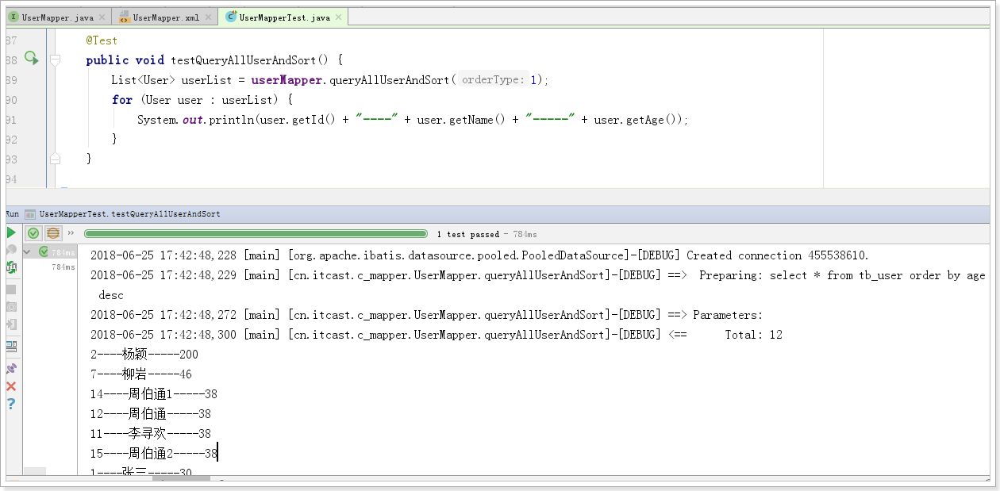
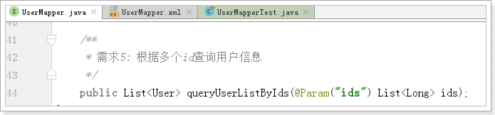

[TOC]


# 1 Mapper.xml映射文件详解

## 1.1 概述

	MyBatis 的真正强大在于它的映射语句，也是它的魔力所在。因为这个配置文件，几乎省略掉了90%的JDBC代码。这是我们学习的重点！


我们重点学习以下部分：
	☆☆☆☆☆**CRUD操作：insert\update\delete\select**
	sql片段：sql
	☆☆☆☆☆**结果集映射：resultMap**
	cache和cache-ref缓存部分，留在后面统一讲解

## 1.2 select

进行查询的statement,


常用的几个属性：

​		select元素：代表查询，类似的还有update、insert、delete

​		id：这个statement的唯一标示

​		parameterType: 输入参数类型，**可选参数**，mybatis可以自动推断数据类型

​		resultType：查询结果类型，**如果结果是集合，请写集合内元素类型！**

​		resultMap：结果集映射，这个和resultType 只能存在1个，应对复杂的结果集。后面详细讲！

| 属性            | 描述                                                         |
| --------------- | ------------------------------------------------------------ |
| `id`            | 在命名空间中唯一的标识符，可以被用来引用这条语句。           |
| `parameterType` | 将会传入这条语句的参数类的完全限定名或别名。这个属性是可选的，因为 MyBatis 可以通过 TypeHandler 推断出具体传入语句的参数，默认值为 unset。 |
| `resultType`    | 从这条语句中返回的期望类型的类的完全限定名或别名。注意如果是集合情形，那应该是集合可以包含的类型，而不能是集合本身。使用 resultType 或 resultMap，但不能同时使用。 |
| `resultMap`     | 外部 resultMap 的命名引用。结果集的映射是 MyBatis 最强大的特性，对其有一个很好的理解的话，许多复杂映射的情形都能迎刃而解。使用 resultMap 或 resultType，但不能同时使用。 |

## 1.3 insert update delete 

insert update delete基本类似


比较常用的几个属性：

	id：这个statement的唯一标识
	
	parameterType:输入参数类型，可选参数，mybatis可以自动推断数据类型

```xml
    <insert id="inserUser">
        insert into tb_user(
			id,
			user_name,
			password,
			name,
			age,
			sex,
			birthday,
			created,
			updated
		)
		values(
			null,
			#{userName},
			#{password},
			#{name},
			#{age},
			#{sex},
			#{birthday},
			now(),
			now()
		)
    </insert>

	<update id="updateUser">
		update tb_user
		set
			user_name = #{userName},
			password = #{password},
			name = #{name},
			age = #{age},
			sex = #{sex},
			birthday = #{birthday},
			updated = now()
		where id = #{id}
	</update>

	<delete id="deleteById">
		delete from tb_user where id=#{id}
	</delete>
```


### 1.3.1 insert语句实现ID回填

```xml
	<!--
		useGeneratedKeys : 是否开启自增主键的回显功能
		keyProperty: 对应javabean的属性名
		keyColumn : 对应数据库的列名
	-->
    <insert id="inserUser" useGeneratedKeys="true" keyProperty="id" keyColumn="id">
        insert into tb_user(
			id,
			user_name,
			password,
			name,
			age,
			sex,
			birthday,
			created,
			updated
		)
		values(
			null,
			#{userName},
			#{password},
			#{name},
			#{age},
			#{sex},
			#{birthday},
			now(),
			now()
		)
    </insert>
```


```java
    @Test
    public void inserUser() throws Exception {
        User user = new User();
        user.setuserName("zhuobotong2");
        user.setPassword("123456");
        user.setName("周伯通2");
        user.setAge(38);
        user.setSex(1);
        Date birthday = new SimpleDateFormat("yyyy-MM-dd").parse("2000-9-9");
        user.setBirthday(birthday);

        userMapper.inserUser(user);

        System.out.println(user.getId());
    }
```


## 1.4 #{}的用法

我们发现，在Mapper.xml映射文件中，经常使用#{属性名} 来作为SQL语句的占位符，来映射Sql需要的实际参数

 

也就是说：#{}就是一个预编译的占位符作用

### 1.4.1 如果方法中只有一个参数

只有一个参数时，入参可以是以下情况：

1）Java的基本类型、基本类型包装类、String类型等


	这种情况下，因为只有一个参数，所以#{}中写什么都无所谓，MyBatis会把实际参数直接传入这个位置，不管参数名称和类型

2）Java中的POJO，类似User这样的对象


这种情况下，MyBatis会把User对象中的属性名和属性值以键值对形式保存到一个类似Map的结构中。

因此，当我们用#{属性名} 来取值时，其实就相当于根据键查找值。可以直接获取到User的属性值！


3）HashMap类型（很少用）

 

如果参数是一个HashMap，mybatis无序做处理，已经是map结构了。我们可以直接用 #{键的名称} 来获取到对应的值。这种方式与上面的方式2类似，因此很少使用


结论：如果是一个参数，

简单数据类型：#{}不管写什么都可以获取值，建议用参数名称

对象类型：#{}可以根据参数对象中的属性名获取属性值

Map类型：#{}可以根据Map的键来取到对应的值


### 1.4.2 如果接口中方法有多个参数


控制台


分析:

原因：

	当有多个参数的情况下，MyBatis就会尝试把这多个参数放入一个Map中，这样才能方便我们通过#{}来取出这些值。
	
	那么问题来了：MyBatis封装这些参数为Map时，键应该是什么？？


	有同学说：为什么直接用参数的名称做键呢？

 


	大家一起思考一下，MyBatis底层肯定是用反射来进行的这些操作，那么反射可以获取到方法，但是是否能获取的方法的参数名称呢？

 


	答案是不行，方法的参数名称是形参，是可变的。反射类Method中，并没有提供获取方法名称的功能。所以MyBatis并不知道我们传递的参数名称，只知道这些参数的值！

 


	再次回到上面的问题，只有值，那么MyBatis封装Map的时候，应该以什么做键呢？

 


	答案是这样的：默认情况下MyBatis会设置两种键：
	
		A：以从0开始的递增数字作为键，第一个参数是0，第2个参数就是1，以此类推
	
		B：以”param” + i 作为键，i是从1递增的数字，第一个参数键就是param1,第2个就是param2，以此类推

 


	所以我们可以通过#{0} 或 #{param1} 来取到第一个参数，以此类推

#### 1.4.2.1 解决方案1


#### 1.4.2.2 解决方案2


#### 1.4.2.3 解决方案3


结论：如果有多个参数，请使用@Param注解来指定参数名称，代码可读性好！

## 1.5 ${}的用法

### 1.5.1 只有一个参数时


	如果是一个POJO或Map，处理方式与#{}一样。

### 1.5.2 如果是多个参数


最后的结论：无论是1个参数，还是多个参数，都使用@Param注解，然后通过注解的中指定的名称取值

### 1.5.3 注意1

${}在取值时，并不会进行预编译，而是直接拼接SQL语句:


这样无法防止SQL注入问题

### 1.5.4 注意2

\${}取值的时候，需要自己判断参数数据类型，如果是字符串，还得自己加引号：'${}'


因此，一般在SQL语句中，如果要获取参数，一般我们都会使用#{}，而不是${}"

## 1.6 面试题 #{} 和 ${}的区别

区别:

 	1. \#是占位符, 会对SQL进行预编译,相当于?; $是做sql拼接, 有SQL注入的隐患
		2. \#不需要关注数据类型, MyBatis自动实现数据类型转换; ${} 必须自己判断数据类型

联系:

	两者都支持@param注解, 指定参数名称, 获取参数值. 推荐这种方式


一般做参数传递,都会使用#{}

如果不是做预编译,而是做拼接sql, 会使用${}, 例如表名称的变化

## 1.7 ResultMap的高级映射(重点重点重点)

### 1.7.1 概述

ResultMap用来定义SQL查询的结果与Java对象的映射关系。非常重要！


### 1.7.2 解决属性名和列名不一致的问题

mybatis-config.xml: 关闭 驼峰标识

```xml
    <settings>
        <!--是否开启驼峰标识-->
        <setting name="mapUnderscoreToCamelCase" value="false"/>
    </settings>
```


UserMapper.xml

```xml
	<resultMap id="userResultMap" type="User">
		<!--
			property: javabean对应的属性
			column : 数据库对应的列名
		-->
		<id property="id" column="id"></id>
		<result property="userName" column="user_name"/>
	</resultMap>
	<!--
		select元素：代表查询，类似的还有update、insert、delete
		id：这个statement的唯一标示
		parameterType:输入参数类型，可选参数，mybatis可以自动推断数据类型
		resultType：查询结果类型，如果结果是集合，请写集合内元素类型！
		resultMap：结果集映射，这个和resultType 只能存在1个，应对复杂的结果集。后面详细讲！
	-->
    <select id="queryUserById" resultMap="userResultMap">
        select * from tb_user where id=${id}
    </select>
```

这就是解决列名与字段名不一致问题的解决方案3，如果名称不符合驼峰规则，就必须使用这种方案。

### 1.7.2 autoMapping自动映射

细心的同学可能发现，我们刚才的配置中，只配置了id和userName字段，其它字段没有配置，映射也没有问题，为什么呢？

 

这是因为，在resultMap中，有一个属性叫做：autoMapping，如果值为true，并且列名称和字段名一致，是可以完成自动映射的。

默认情况下，这个autoMapping的值就是为true的。

 

那么，如果名称不一致，但是符合驼峰规则，能否自动映射呢？

 

也是可以的，但是要开启驼峰匹配：

```xml
    <settings>
        <!--是否开启驼峰标识-->
        <setting name="mapUnderscoreToCamelCase" value="false"/>
    </settings>
```


因此，一般我们配置resultMap，只要字段符合规则，我们只需要把ID配置出来就OK了。其它字段可以自动映射！


## 1.8 sql片段


我们经常会把SQL中比较通用的部分，提前出来，变成一个SQL片段，然后在各个SQL中都可以调用，简化书写：

	例如，查询语句中，一般不会使用：Select * ,而是把列名一一列出，但是表的列名往往比较多，这时就可以提取出来：

```xml
	<!--
		定义sql片段
			id: sql片段的唯一标识
	-->
	<sql id="userColumns">
		id, user_name, password, name, age, sex, birthday, created, updated
	</sql>

	<!--
		select元素：代表查询，类似的还有update、insert、delete
		id：这个statement的唯一标示
		parameterType:输入参数类型，可选参数，mybatis可以自动推断数据类型
		resultType：查询结果类型，如果结果是集合，请写集合内元素类型！
		resultMap：结果集映射，这个和resultType 只能存在1个，应对复杂的结果集。后面详细讲！
	-->
    <select id="queryUserById" resultMap="userResultMap">
        select <include refid="userColumns"/>
        from tb_user where id=${id}
    </select>

    <select id="queryUserList" resultType="User">
        select <include refid="userColumns"/>
        from tb_user
    </select>
```

## 1.9 动态sql


我们接下来使用动态SQL实现以下功能：

```
需求1：查询所有男性用户，如果输入了姓名，则按照姓名模糊查找；如果没有输入则不管姓名

需求2：查询所有用户，传递参数orderType，如果值为0，按照年龄升序排序，如果为1则按照年龄降序排序，否则按照ID排序

需求3：查询所有用户，如果有姓名不为空，则按照姓名模糊查找；如果年龄也不为空，则还要满足年龄条件。

需求4：修改用户信息，如果某字段为null，则不修改这个字段

需求5：根据多个ID查询用户
```

### 1.9.1 if 判断

```
需求1：查询所有男性用户，如果输入了姓名，则按照姓名模糊查找；如果没有输入则不管姓名
```

接口:


mapper文件:


测试1: 如果姓名不为null


测试2: 如果姓名为null


```
注意：
	在写SQL时，我们使用了”%${name}%”来拼接SQL，这样在传参数时，可以只写姓名
	这里也可以写#{name}来进行预编译，那么传参数时，就必须在参数中写上”%李%”了
```

### 1.9.2 choose,when,otherwise

动态标签中有if，但是没有else，如果我们有多条件，就需要用choose标签
choose中可以定义多个when和1个otherwise，所有状态中只能有一个成立：
	多个when类似与if 和 else if
	otherwise类似于最后的else

```
需求2：查询所有用户，传递参数orderType，如果值为0，按照年龄升序排序，如果为1则按照年龄降序排序，否则按照ID排序
```




### 1.9.3 where

```
需求3：查询所有用户，如果有姓名不为空，则按照姓名模糊查找；如果年龄也不为空，则还要满足年龄小于指定年龄。
```


### 1.9.4 set

```
需求4：修改用户信息，如果某字段为null，则不修改这个字段
```

在修改用户时，有一些不需要修改的字段我们可能不愿意填写，这时，修改时的非空判断就非常有必要
而且在多个不确定有哪些字段或者有没有字段需要修改时，我们就需要set标签


UserMapper.xml

```xml
	<update id="updateUser">
		update tb_user
		<set>
			<if test="userName!=null and userName.trim()!=''">
				user_name = #{userName},
			</if>
			<if test="password!=null and password.trim()!=''">
				password = #{password},
			</if>
			<if test="name!=null and name.trim()!=''">
				name = #{name},
			</if>
			<if test="age!=null">
				age = #{age},
			</if>
			<if test="sex!=null">
				sex = #{sex},
			</if>
			<if test="birthday!=null and birthday.trim()!=''">
				birthday = #{birthday},
			</if>
			updated = now()
		</set>
		where id = #{id}
	</update>
```


### 1.9.5 foreach

```
需求5：根据多个ID查询用户
```





# 2 缓存(扩展)

为数据库的查询进行缓存，是减少数据库压力的主要途径。分为一级缓存和二级缓存

一级缓存：session级别缓存，作用于当前会话。

二级缓存：SessionFactory级别缓存，作用于整个SessionFactory，多个会话之间可以共享缓存

## 2.1 一级缓存

* 特点：
  * mybatis的一级缓存默认就是开启的，并且无法关闭。
  * mybatis的一级缓存作用域是当前session，一次openSession()后，如果相同的statement和相同参数，则不进行查询而是从缓存命中并且返回，如果没有命中则查询数据库。
  * 任何的增删改操作都会导致缓存被清空
  * 缓存会使用 Least Recently Used(LRU,最近最少使用的)算法来收回

### 2.1.1 测试一级缓存

```java
    @Test
    public void test1LevelCache() {
        // 一次会话中
        // 第1次查询
        User user = userMapper.queryUserById(1L);
        System.out.println(user);

        System.out.println("------------------------------------------");

        // 第2次查询
        User user2 = userMapper.queryUserById(1L);
        System.out.println(user2);
    }
```


事实: 两次查询只执行了一条sql语句

### 2.1.2 测试增删改 清空一级缓存

```java
    @Test
    public void test1LevelCache() {
        // 一次会话中
        // 第1次查询
        User user = userMapper.queryUserById(1L);
        System.out.println(user);

        // 测试增删改清空缓存
        userMapper.deleteById(15L);
        System.out.println("------------------------------------------");

        // 第2次查询
        User user2 = userMapper.queryUserById(1L);
        System.out.println(user2);
    }
```


两次查询,执行两次select语句, 间接证明 增删改会清空二级缓存!

### 2.1.3 测试手动清空缓存

```java
   @Test
    public void test1LevelCache() {
        // 一次会话中
        // 1 第1次查询
        User user = userMapper.queryUserById(1L);
        System.out.println(user);

        // 3 测试增删改清空缓存
        // userMapper.deleteById(15L);

        // 4 测试手动清空缓存
        sqlSession.clearCache();
        
        System.out.println("------------------------------------------");

        // 2 第2次查询
        User user2 = userMapper.queryUserById(1L);
        System.out.println(user2);
    }
```


## 2.2 二级缓存(了解)

### 2.2.1 基本使用

* 特点：
  * 二级缓存需要手动开启，开启的方式是在Mapper.xml中添加标签：<cache/>
  * 二级缓存的作用域是整个SessionFactory，并且是同一个Mapper中，如果namespace、statement和SQL参数一致，则缓存命中

#### 2.2.1.1 开启二级缓存


#### 2.2.1.2 测试

```java
   @Test
    public void test2LevelCache() {
        // 一次会话中
        // 1 第1次查询
        User user = userMapper.queryUserById(1L);
        System.out.println(user);

        // 关闭session
        sqlSession.close();
        // 重新开启session
        sqlSession = sqlSessionFactory.openSession(true);
        // 重新获取mapper
        userMapper = sqlSession.getMapper(UserMapper.class);
        System.out.println("------------------------------------------");

        // 2 第2次查询
        User user2 = userMapper.queryUserById(1L);
        System.out.println(user2);
    }
```

#### 2.2.1.3 报错


原因: 开启二级缓存后, 查询的对象需要实现序列化接口.


重新测试, 两次查询,但是只有一条sql语句


### 2.2.2 二级缓存全局开关


我们昨天讲解的mybatis-config.xml全局配置文件中，有一个配置，是二级缓存的全局开关，如果关闭，所有Mapper的二级缓存都会失效，默认是打开的。

### 2.2.3 二级缓存的其他配置

所有的这些属性都可以通过缓存元素的属性来修改。比如:

```
<cache
  eviction="FIFO"
  flushInterval="60000"
  size="512"
  readOnly="true"/>
```

这个更高级的配置创建了一个 FIFO 缓存,并每隔 60 秒刷新,存数结果对象或列表的 512 个引用,而且返回的对象被认为是只读的,因此在不同线程中的调用者之间修改它们会 导致冲突。

可用的收回策略有:

- `LRU` – 最近最少使用的:移除最长时间不被使用的对象。
- `FIFO` – 先进先出:按对象进入缓存的顺序来移除它们。
- `SOFT` – 软引用:移除基于垃圾回收器状态和软引用规则的对象。
- `WEAK` – 弱引用:更积极地移除基于垃圾收集器状态和弱引用规则的对象。

默认的是 LRU。

flushInterval(刷新间隔)可以被设置为任意的正整数,而且它们代表一个合理的毫秒 形式的时间段。默认情况是不设置,也就是没有刷新间隔,缓存仅仅调用语句时刷新。

size(引用数目)可以被设置为任意正整数,要记住你缓存的对象数目和你运行环境的 可用内存资源数目。默认值是 1024。

readOnly(只读)属性可以被设置为 true 或 false。只读的缓存会给所有调用者返回缓 存对象的相同实例。因此这些对象不能被修改。这提供了很重要的性能优势。可读写的缓存 会返回缓存对象的拷贝(通过序列化) 。这会慢一些,但是安全,因此默认是 false。

# 3 高级查询(表关联查询) 重点重点重点

## 3.1 准备工作

### 3.1.1 表关系


上图有4张表: 用户表、订单表、商品表、订单详情表

分别有4个javabean对应:

### 3.1.2 用户表

```java
package cn.itcast.domain;

import java.io.Serializable;
import java.util.Date;

public class User implements Serializable {

    private Long id;

    // 用户名
    private String userName;

    // 密码
    private String password;

    // 姓名
    private String name;

    // 年龄
    private Integer age;

    // 性别，1男性，2女性
    private Integer sex;

    // 出生日期
    private Date birthday;

    // 创建时间
    private Date created;

    // 更新时间
    private Date updated;

    public Long getId() {
        return id;
    }

    public void setId(Long id) {
        this.id = id;
    }

    public String getuserName() {
        return userName;
    }

    public void setuserName(String userName) {
        this.userName = userName;
    }

    public String getPassword() {
        return password;
    }

    public void setPassword(String password) {
        this.password = password;
    }

    public String getName() {
        return name;
    }

    public void setName(String name) {
        this.name = name;
    }

    public Integer getAge() {
        return age;
    }

    public void setAge(Integer age) {
        this.age = age;
    }

    public Integer getSex() {
        return sex;
    }

    public void setSex(Integer sex) {
        this.sex = sex;
    }

    public Date getBirthday() {
        return birthday;
    }

    public void setBirthday(Date birthday) {
        this.birthday = birthday;
    }

    public Date getCreated() {
        return created;
    }

    public void setCreated(Date created) {
        this.created = created;
    }

    public Date getUpdated() {
        return updated;
    }

    public void setUpdated(Date updated) {
        this.updated = updated;
    }

    @Override
    public String toString() {
        return "User [id=" + id + ", userName=" + userName + ", password=" + password + ", name=" + name
                + ", age=" + age + ", sex=" + sex + ", birthday=" + birthday + ", created=" + created
                + ", updated=" + updated + "]";
    }

}

```

### 3.1.3 订单表

```java
package cn.itcast.domain;

import java.util.List;

/**
 * 订单表
 * 
 */
public class Order {

    private Integer oid;

    private Long userId;

    private String orderNumber;
    
    private User user;
    
    private List<Orderitem> orderitemList;
    
	public List<Orderitem> getOrderitemList() {
		return orderitemList;
	}

	public void setOrderitemList(List<Orderitem> orderitemList) {
		this.orderitemList = orderitemList;
	}

	public User getUser() {
		return user;
	}

	public void setUser(User user) {
		this.user = user;
	}

	public Integer getOid() {
		return oid;
	}

	public void setOid(Integer oid) {
		this.oid = oid;
	}

	public Long getUserId() {
		return userId;
	}

	public void setUserId(Long userId) {
		this.userId = userId;
	}

	public String getOrderNumber() {
		return orderNumber;
	}

	public void setOrderNumber(String orderNumber) {
		this.orderNumber = orderNumber;
	}

	@Override
	public String toString() {
		return "Order [oid=" + oid + ", userId=" + userId + ", orderNumber=" + orderNumber + ", user=" + user
				+ ", orderitemList=" + orderitemList + "]";
	}

}

```

### 3.1.4 订单详情：OrderItem

```java
package cn.itcast.domain;

public class Orderitem {

	private Integer itemId;

	private Double totalPrice;

	private Integer status;

	private Product product;

	public Double getTotalPrice() {
		return totalPrice;
	}

	public void setTotalPrice(Double totalPrice) {
		this.totalPrice = totalPrice;
	}

	public Integer getStatus() {
		return status;
	}

	public void setStatus(Integer status) {
		this.status = status;
	}

	public Product getProduct() {
		return product;
	}

	public void setProduct(Product product) {
		this.product = product;
	}

	public Integer getItemId() {
		return itemId;
	}

	public void setItemId(Integer itemId) {
		this.itemId = itemId;
	}

	@Override
	public String toString() {
		return "Orderitem [itemId=" + itemId + ", totalPrice=" + totalPrice + ", status=" + status + ", product="
				+ product + "]";
	}

}

```


### 3.1.5 商品表

```java
package cn.itcast.domain;

/**
 * 商品表
 */
public class Product {

    private Integer pid;

    private String pname;

    private Float price;

    private String description;

	public Integer getPid() {
		return pid;
	}

	public void setPid(Integer pid) {
		this.pid = pid;
	}

	public String getPname() {
		return pname;
	}

	public void setPname(String pname) {
		this.pname = pname;
	}

	public Float getPrice() {
		return price;
	}

	public void setPrice(Float price) {
		this.price = price;
	}

	public String getDescription() {
		return description;
	}

	public void setDescription(String description) {
		this.description = description;
	}

	@Override
	public String toString() {
		return "Product [pid=" + pid + ", pname=" + pname + ", price=" + price + ", description=" + description + "]";
	}
	
}
```


```
MySQL作为一个ORM框架，也支持各种的高级查询，在本例中，我们来演示以下几个需求：

一对一查询：一个订单只属于一个用户

	需求1：根据订单号 查询订单的同时，查询出订单所属用户

一对多查询：一个订单可以有多个订单详情

	需求2：根据订单号 查询订单，并且查询出所有订单详情及所属用户

多对多查询：订单中可以有多个商品，商品也可以属于多个订单

	需求3：根据订单号 查询订单，查询出所属用户，并且查询出订单的详情，及订单详情中的对应的商品信息

```

## 3.2 一对一查询

```
需求1：根据订单号 查询订单的同时，查询出订单所属用户
```

分析

```
这里需要 用户表和订单表进行关联查询，查询结果中，除了订单的信息，还有用户的信息，用Order类无法封装所有信息！

思路1：扩展Order类，把用户字段也添加进去。
思路2：在Order类中，定义一个User类型的成员。

思路2更符合面向对象的思想，因此这里我们采用思路2：
```

### 3.2.1 订单类


### 3.2.2 订单接口


```java
package cn.itcast.c_mapper;

import cn.itcast.domain.Order;
import org.apache.ibatis.annotations.Param;

public interface OrderMapper {
    /**
     * 需求1：查询订单的同时，查询出订单所属用户
     */
    public Order queryOrderAndUserByOrdernumber(@Param("ordernumber") String ordernumber);
}
```

### 3.2.3 订单mapper.xml文件


```xml
<?xml version="1.0" encoding="UTF-8" ?>
<!DOCTYPE mapper
        PUBLIC "-//mybatis.org//DTD Mapper 3.0//EN"
        "http://mybatis.org/dtd/mybatis-3-mapper.dtd">
<mapper namespace="cn.itcast.c_mapper.OrderMapper">
	
	<resultMap id="orderResultMapper" type="Order" autoMapping="true">
		<id property="oid" column="oid"/>
		<association property="user" javaType="User" autoMapping="true">
			<id property="id" column="user_id"></id>
		</association>
	</resultMap>

	<!--需求1：根据订单号 查询订单的同时，查询出订单所属用户-->
	<select id="queryOrderAndUserByOrdernumber" resultMap="orderResultMapper">
		select o.*,u.* from tb_order o
		left join tb_user u on o.user_id=u.id
		where o.order_number=#{ordernumber}
	</select>
</mapper>
```

### 3.2.4 将OrderMapper.xml文件 配置到 mybatis-config.xml文件中


### 3.2.5 测试


```java
package cn.itcast.c_mapper;

import cn.itcast.domain.Order;
import org.apache.ibatis.io.Resources;
import org.apache.ibatis.session.SqlSession;
import org.apache.ibatis.session.SqlSessionFactory;
import org.apache.ibatis.session.SqlSessionFactoryBuilder;
import org.junit.Before;
import org.junit.Test;

import java.io.InputStream;

public class OrderMapperTest {
    private OrderMapper orderMapper;

    @Before
    public void setUp() throws Exception {
        String resource = "mybatis-config.xml";
        InputStream in = Resources.getResourceAsStream(resource);
        SqlSessionFactory sqlSessionFactory = new SqlSessionFactoryBuilder().build(in);
        SqlSession sqlSession = sqlSessionFactory.openSession(true);
        orderMapper = sqlSession.getMapper(OrderMapper.class);
    }

    @Test
    public void queryOrderAndUserByOrdernumber() throws Exception {
        Order order = orderMapper.queryOrderAndUserByOrdernumber("20140921001");
        System.out.println(order);
    }

}
```

测试结果


```
2018-06-25 19:55:50,702 [main] [cn.itcast.c_mapper.OrderMapper.queryOrderAndUserByOrdernumber]-[DEBUG] ==>  Preparing: select o.*,u.* from tb_order o left join tb_user u on o.user_id=u.id where o.order_number=? 
2018-06-25 19:55:50,740 [main] [cn.itcast.c_mapper.OrderMapper.queryOrderAndUserByOrdernumber]-[DEBUG] ==> Parameters: 20140921001(String)
2018-06-25 19:55:50,754 [main] [cn.itcast.c_mapper.OrderMapper.queryOrderAndUserByOrdernumber]-[DEBUG] <==      Total: 1
Order [oid=1, userId=1, orderNumber=20140921001, user=User [id=1, userName=zhangsan, password=123456, name=张三, age=30, sex=1, birthday=Wed Aug 08 00:00:00 GMT+08:00 1984, created=Fri Sep 19 16:56:04 GMT+08:00 2014, updated=Sun Sep 21 11:24:59 GMT+08:00 2014], orderitemList=null]
```

## 3.3 一对多查询

```
需求2：根据订单号 查询订单，并且查询出所有订单详情及所属用户
```

### 3.3.1 订单类


### 3.3.2 订单接口


```java
    /**
     * 需求2：根据订单号 查询订单，并且查询出所有订单详情及所属用户
     */
    public Order queryOrderAndUserAndOrderitemsByOrdernumber(@Param("ordernumber") String ordernumber);
```

### 3.3.3 订单Mapper文件


```xml
    <resultMap id="orderResultMapper" type="Order" autoMapping="true">
        <id property="oid" column="oid"/>
        <!--关联用户-->
        <association property="user" javaType="User" autoMapping="true">
            <id property="id" column="user_id"></id>
        </association>
    </resultMap>

    <resultMap id="orderUserOrderitemResultMapper" type="Order" autoMapping="true"
               extends="orderResultMapper">
        <!--配置订单项集合-->
        <collection property="orderitemList" javaType="List" ofType="Orderitem" autoMapping="true">
            <id property="itemId" column="item_id"/>
        </collection>
    </resultMap>

    <!--需求2：根据订单号 查询订单，并且查询出所有订单详情及所属用户-->
    <select id="queryOrderAndUserAndOrderitemsByOrdernumber"
            resultMap="orderUserOrderitemResultMapper">
        select o.*,u.*,oi.* from tb_order o
        left join tb_user u on o.user_id=u.id
        left join tb_orderitem oi on oi.order_id=o.oid
        where o.order_number=#{ordernumber};
    </select>
```

### 3.3.4 测试


```java
    @Test
    public void testQueryOrderAndUserAndOrderitemsByOrdernumber() throws Exception {
        Order order = orderMapper.queryOrderAndUserAndOrderitemsByOrdernumber("20140921001");
        System.out.println(order);
    }
```

测试结果


## 3.4 多对多查询(扩展)

```
需求3：根据订单号 查询订单，查询出所属用户，并且查询出订单的详情，及订单详情中的对应的商品信息
```

### 3.4.1 订单项表


### 3.4.2 接口


```java
    /**
     * 需求3：根据订单号 查询订单，查询出所属用户，并且查询出订单的详情，及订单详情中的对应的商品信息
     */
    public Order queryOrderAndUserAndOrderitemsAndProductByOrdernumber(@Param("ordernumber") String ordernumber);
```

### 3.4.3 mapper配置文件


```xml
    <resultMap id="orderUserOrderitemProductResultMapper" type="Order" autoMapping="true">
        <!--订单主键-->
        <id property="oid" column="oid"></id>
        <!--关联用户-->
        <association property="user" javaType="User" autoMapping="true">
            <id property="id" column="user_id"></id>
        </association>
        <!--关联订单集合-->
        <collection property="orderitemList" javaType="List" ofType="Orderitem" autoMapping="true">
            <!--主键-->
            <id property="itemId" column="item_id"></id>
            <!--关联商品-->
            <association property="product" javaType="Product" autoMapping="true">
                <id property="pid" column="product_id"></id>
            </association>
        </collection>
    </resultMap>

    <!--需求3：查询订单，查询出所属用户，并且查询出订单的详情，及订单详情中的对应的商品信息-->
    <select id="queryOrderAndUserAndOrderitemsAndProductByOrdernumber" resultMap="orderUserOrderitemProductResultMapper">
        select o.*,u.*,oi.*,p.* from tb_order o
        left join tb_user u on o.user_id=u.id
        left join tb_orderitem oi on oi.order_id=o.oid
        left join tb_product p on oi.product_id=p.pid
        where o.order_number=#{ordernumber}
    </select>
```

### 3.4.4 测试


```java
    @Test
    public void testQueryOrderAndUserAndOrderitemsAndProductByOrdernumber() throws Exception {
        Order order = orderMapper.queryOrderAndUserAndOrderitemsAndProductByOrdernumber("20140921001");
        System.out.println(order);
    }
```

测试结果


# 4 特殊字符

查询w3cschool的XML文档，发现有两种解决方案：   

## 4.1 特殊字符


## 4.2 使用CDATA


