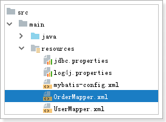
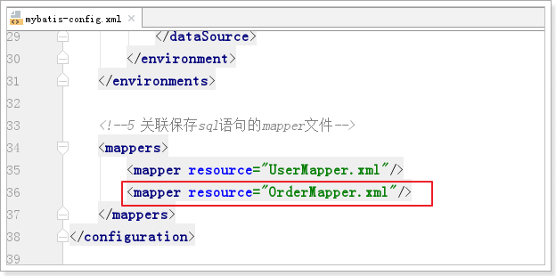
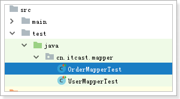

# 1 根据多个参数查询

## 1.1 接口

```java
    /**
     * 根据用户名和密码查询用户信息
     */
    public User queryUserByUsernameAndPassword(@Param("username01") String username,
                                               @Param("password01") String password);
```

## 1.2 mapper.xml

```xml
    <!--6 根据用户名和密码查询用户信息
        方式一: 根据下标获取参数值
            select * from tb_user
            where user_name=#{0} and password=#{1}

        方式二:
            select * from tb_user
            where user_name=#{param1} and password=#{param2}
            缺点: 不好维护

        方式三: #{xxx} 翻译成?, 占位符
            select * from tb_user
            where user_name=#{username01} and password=#{password01}

            ==>  Preparing: select * from tb_user where user_name=? and password=?

        方式四: ${xxx} 原样显示在sql语句中
            select * from tb_user
            where user_name='${username01}' and password='${password01}'

            ==>  Preparing: select * from tb_user where user_name='zhangsan' and password='123456'
    -->
    <select id="queryUserByUsernameAndPassword" resultType="User">
        select * from tb_user
        where user_name='${username01}' and password='${password01}'
    </select>
```


## 1.3 测试

```java
    @Test
    public void queryUserByUsernameAndPassword() throws Exception {
        User user = userMapper.queryUserByUsernameAndPassword("zhangsan", "123456");
        System.out.println(user);
    }
```

# 2 问题: 解决属性名和列名不一致的问题?

## 2.1 接口

```java
    /**
     * 根据编号查询用户信息
     */
    public User queryUserById(Long id);
```


## 2.2 mapper.xml

```xml
    <!--执行 resultMap-->
    <resultMap id="userResultMap" type="User" autoMapping="true">
        <!--1 指定主键,必须的
            property : javabean的属性名
            column : 表的列名
        -->
        <id property="id" column="id" javaType="long"/>
        <!--2 解决 列名和属性名不一致的问题-->
        <result property="userName" column="user_name" javaType="string"/>
    </resultMap>

    <!--1 根据编号查询用户信息
        参数类型: 是可选的
        resultType 返回结果类型: 必须指定

        resultType 和 resultMap 只能使用一个,不能同时使用
    -->
    <select id="queryUserById" resultMap="userResultMap">
        select * from tb_user where id=#{sldkfjsldfkj}
    </select>
```


## 2.3 测试

```java
    @Test
    public void queryUserById() throws Exception {
        User user = userMapper.queryUserById(1L);
        System.out.println(user);
    }
```

# 3 sql片段

优化:

​	避免书写 select * from 表名;

​	解决方案: select 列名1,列名2,列名3 ... ...  from 表名;


sql1:  select 列名1,列名2,列名3 ... ...  from 表名 where id=?

sql2:  select 列名1,列名2,列名3 ... ...  from;

sql3:  select 列名1,列名2,列名3 ... ...  from 表名 where user_name=? and password=?


问题:  列名1,列名2,列名3 ... ... 太长, 重复

解决: 将重复的代码 提取出来, sql片段, 当需要用时, 引入即可


## 3.1 接口

```java
package cn.itcast.mapper;

import cn.itcast.domain.User;
import org.apache.ibatis.annotations.Param;

import java.util.List;

public interface UserMapper {
    /**
     * 根据编号查询用户信息
     */
    public User queryUserById(Long id);

    /**
     * 查询所有用户信息
     */
    public List<User> queryAll();

    /**
     * 根据用户名和密码查询用户信息
     */
    public User queryUserByUsernameAndPassword(@Param("username01") String username,
                                               @Param("password01") String password);
}
```

## 3.2 mapper.xml

```xml
<?xml version="1.0" encoding="UTF-8" ?>
<!DOCTYPE mapper
        PUBLIC "-//mybatis.org//DTD Mapper 3.0//EN"
        "http://mybatis.org/dtd/mybatis-3-mapper.dtd">
<mapper namespace="cn.itcast.mapper.UserMapper">

    <!--提取sql片段-->
    <sql id="userColumns">
         id, user_name, password, name, age, sex, birthday, created, updated
    </sql>

    <!--执行 resultMap-->
    <resultMap id="userResultMap" type="User" autoMapping="true">
        <!--1 指定主键,必须的
            property : javabean的属性名
            column : 表的列名
        -->
        <id property="id" column="id" javaType="long"/>
        <!--2 解决 列名和属性名不一致的问题-->
        <result property="userName" column="user_name" javaType="string"/>
    </resultMap>

    <!--1 根据编号查询用户信息
        参数类型: 是可选的
        resultType 返回结果类型: 必须指定

        resultType 和 resultMap 只能使用一个,不能同时使用
    -->
    <select id="queryUserById" resultMap="userResultMap">
        select <include refid="userColumns"/>
        from tb_user where id=#{sldkfjsldfkj}
    </select>

    <!--2 查询所有用户信息-->
    <select id="queryAll" resultMap="userResultMap">
        select  <include refid="userColumns"/>
        from tb_user
    </select>

    <!--6 根据用户名和密码查询用户信息-->
    <select id="queryUserByUsernameAndPassword" resultMap="userResultMap">
        select  <include refid="userColumns"/>
        from tb_user
        where user_name='${username01}' and password='${password01}'
    </select>
</mapper>
```

## 3.3 测试

```java
package cn.itcast.mapper;

import cn.itcast.domain.User;
import org.apache.ibatis.io.Resources;
import org.apache.ibatis.session.SqlSession;
import org.apache.ibatis.session.SqlSessionFactory;
import org.apache.ibatis.session.SqlSessionFactoryBuilder;
import org.junit.Before;
import org.junit.Test;

import java.io.InputStream;
import java.text.SimpleDateFormat;
import java.util.Date;
import java.util.List;

public class UserMapperTest {

    private UserMapper userMapper;

    @Before
    public void setUp() throws Exception {
        // 2 关联外部的配置文件
        InputStream in = Resources.getResourceAsStream("mybatis-config.xml");
        // 1 创建sqlSessionFactory
        SqlSessionFactory sqlSessionFactory = new SqlSessionFactoryBuilder().build(in);
        // 3 创建sqlSession
        SqlSession sqlSession = sqlSessionFactory.openSession(true);
        // 4 mybatis通过动态代理生成mapper接口的实现类
        userMapper = sqlSession.getMapper(UserMapper.class);
    }

    @Test
    public void queryUserById() throws Exception {
        User user = userMapper.queryUserById(1L);
        System.out.println(user);
    }

    @Test
    public void queryAll() throws Exception {
        List<User> userList = userMapper.queryAll();
        for (User user : userList) {
            System.out.println(user);
        }
    }

    @Test
    public void queryUserByUsernameAndPassword() throws Exception {
        User user = userMapper.queryUserByUsernameAndPassword("zhangsan", "123456");
        System.out.println(user);
    }


}
```

# 4 条件查询

select * from product

where 1=1

-- 如果用选择了类别

and cid=?

-- 如果用户填写商品名称

and name like ?


# 5 一对一查询

## 5.1 接口


```java
package cn.itcast.mapper;

import cn.itcast.domain.Order;
import org.apache.ibatis.annotations.Param;

public interface OrderMapper {
    /**
     * 需求1：根据订单号 查询订单的同时，查询出订单所属用户
     */
    public Order queryOrderWithUserByOrderNumber(@Param("orderNumber") String orderNumber);

}
```

## 5.2 mapper.xml



```xml
<?xml version="1.0" encoding="UTF-8" ?>
<!DOCTYPE mapper
        PUBLIC "-//mybatis.org//DTD Mapper 3.0//EN"
        "http://mybatis.org/dtd/mybatis-3-mapper.dtd">
<mapper namespace="cn.itcast.mapper.OrderMapper">

    <resultMap id="orderWithUserResultMap" type="Order" autoMapping="true">
        <!--1 订单表 主键-->
        <id property="oid" column="oid" javaType="int"/>
        <!--2 关联用户信息, javabean-->
        <association property="user" javaType="User" autoMapping="true">
            <!--2.2 用户表的主键-->
            <id property="id" column="user_id" javaType="long"/>
        </association>
    </resultMap>

    <!--需求1：根据订单号 查询订单的同时，查询出订单所属用户-->
    <select id="queryOrderWithUserByOrderNumber" resultMap="orderWithUserResultMap">
        select * from tb_order o
        left join tb_user u on o.user_id=u.id
        where o.order_number=#{orderNumber}
    </select>
</mapper>
```


## 5.3 关联mabatis-config.xml



## 5.4 测试



```java
package cn.itcast.mapper;

import cn.itcast.domain.Order;
import org.apache.ibatis.io.Resources;
import org.apache.ibatis.session.SqlSession;
import org.apache.ibatis.session.SqlSessionFactory;
import org.apache.ibatis.session.SqlSessionFactoryBuilder;
import org.junit.Before;
import org.junit.Test;

import java.io.InputStream;

public class OrderMapperTest {
    private OrderMapper orderMapper;

    @Before
    public void setUp() throws Exception {
        InputStream in = Resources.getResourceAsStream("mybatis-config.xml");
        SqlSessionFactory sqlSessionFactory = new SqlSessionFactoryBuilder().build(in);
        SqlSession sqlSession = sqlSessionFactory.openSession(true);
        orderMapper = sqlSession.getMapper(OrderMapper.class);
    }

    @Test
    public void queryOrderWithUserByOrderNumber() throws Exception {
        Order order = orderMapper.queryOrderWithUserByOrderNumber("20140921001");
        System.out.println(order);
    }

}
```


# 6 一对多

## 6.1 接口

```java
    /**
     * 需求2：根据订单号 查询订单，并且查询出所有订单详情及所属用户
     */
    public Order queryOrderWithUserAndOrderItemsByOrderNumber(@Param("orderNumber") String orderNumber);
```


## 6.2 mapper.xml

```xml
<?xml version="1.0" encoding="UTF-8" ?>
<!DOCTYPE mapper
        PUBLIC "-//mybatis.org//DTD Mapper 3.0//EN"
        "http://mybatis.org/dtd/mybatis-3-mapper.dtd">
<mapper namespace="cn.itcast.mapper.OrderMapper">

    <!--携带用户的订单 结果映射-->
    <resultMap id="orderWithUserResultMap" type="Order" autoMapping="true">
        <!--1 订单表 主键-->
        <id property="oid" column="oid" javaType="int"/>
        <!--2 关联用户信息, javabean-->
        <association property="user" javaType="User" autoMapping="true">
            <!--2.2 用户表的主键-->
            <id property="id" column="user_id" javaType="long"/>
        </association>
    </resultMap>

    <!--既携带用户也携带订单项集合的 订单 结果映射-->
    <resultMap id="orderWithUserAndOrderItemsResultMap" type="Order" autoMapping="true" extends="orderWithUserResultMap">
        <!--3 关联订单详情集合
            property : order内的属性名
            javaType : java类型
            ofType : 集合中元素的类型

        -->
        <collection property="orderitemList" javaType="list" ofType="Orderitem" autoMapping="true">
            <!--3.1 订单项表的主键-->
            <id property="itemId" column="item_id" javaType="int"/>
        </collection>
    </resultMap>

    <!--需求2：根据订单号 查询订单，并且查询出所有订单详情及所属用户-->
    <select id="queryOrderWithUserAndOrderItemsByOrderNumber" resultMap="orderWithUserAndOrderItemsResultMap">
        select * from tb_order o
        left join tb_user u on o.user_id=u.id
        left join tb_orderitem oi on oi.order_id=o.oid
        where o.order_number=#{orderNumber}
    </select>
</mapper>
```

## 6.3 测试

```java
@Test
public void queryOrderWithUserAndOrderItemsByOrderNumber() throws Exception {
    Order order = orderMapper.queryOrderWithUserAndOrderItemsByOrderNumber("20140921001");
    System.out.println(order);
}
```

# 7 多对多

## 7.1 接口

```java
/**
 * 需求3：根据订单号 查询订单，查询出所属用户，并且查询出订单的详情，及订单详情中的对应的商品信息
 */
public Order queryOrderWithUserAndOrderItemsAndProductByOrderNumber(@Param("orderNumber") String orderNumber);
```

## 7.2 mapper.xml

```xml
<resultMap id="orderWithUserAndOrderItemsAndProductResultMap" type="Order" autoMapping="true">
    <!--1 配置订单表的主键-->
    <id property="oid" column="oid" javaType="int"/>
    <!--2 关联用户信息-->
    <association property="user" javaType="User" autoMapping="true">
        <!--2.1 配置用户表的主键-->
        <id property="id" column="user_id" javaType="long"/>
    </association>

    <!--3 关联订单项集合信息-->
    <collection property="orderitemList" javaType="list" ofType="Orderitem" autoMapping="true">
        <!--3.1 配置订单项表的主键-->
        <id property="itemId" column="item_id" javaType="int"/>
        <!--3.2 配置关联商品表信息-->
        <association property="product" javaType="Product" autoMapping="true">
            <!--3.2.1 配置商品表的主键-->
            <id property="pid" column="product_id" javaType="int"/>
        </association>
    </collection>
</resultMap>

<!--需求3：根据订单号 查询订单，查询出所属用户，并且查询出订单的详情，及订单详情中的对应的商品信息-->
<select id="queryOrderWithUserAndOrderItemsAndProductByOrderNumber" resultMap="orderWithUserAndOrderItemsAndProductResultMap">
    select * from tb_order o
    left join tb_user u on o.user_id=u.id
    left join tb_orderitem oi on oi.order_id=o.oid
    left join tb_product p on p.pid=oi.product_id
    where o.order_number=#{orderNumber}
</select>
```

## 7.3 测试

```java
@Test
public void queryOrderWithUserAndOrderItemsAndProductByOrderNumber() throws Exception {
    Order order = orderMapper.queryOrderWithUserAndOrderItemsAndProductByOrderNumber("20140921001");
    System.out.println(order);
}
```

